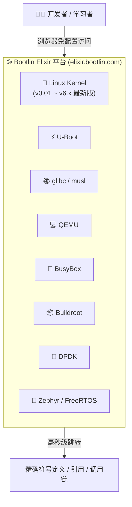
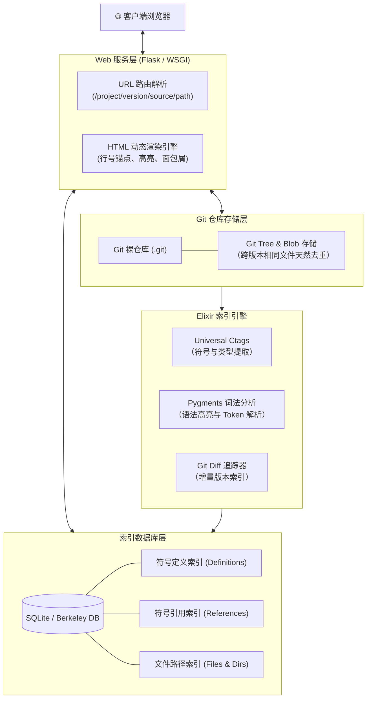
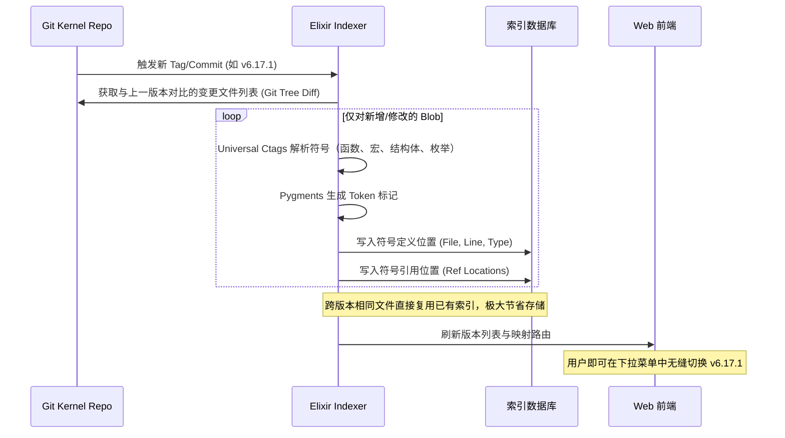
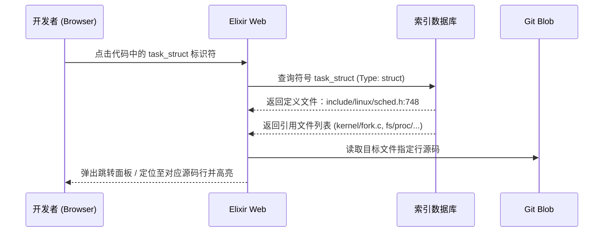
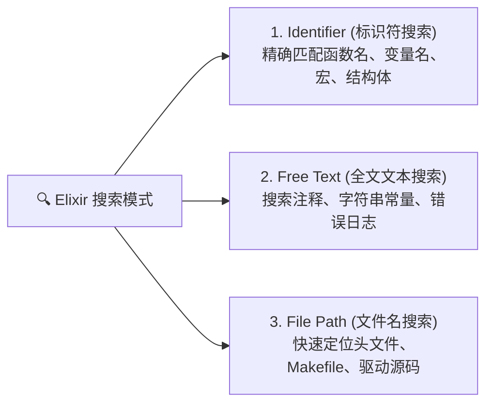
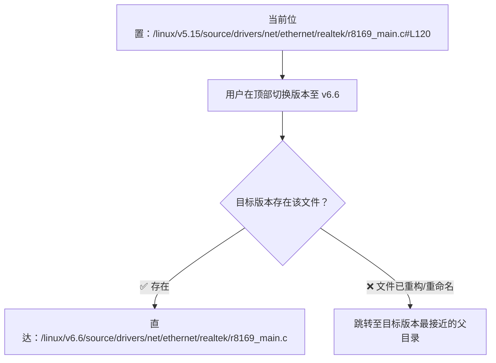

+++
title = 'Bootlin Elixir：阅读与检索 Linux 内核及开源项目源码的神器'
date = '2026-08-28T08:35:00+08:00'
slug = 'bootlin-elixir-cross-referencer'
draft = false
tags = ['linux', 'kernel', '开源工具', 'c', '嵌入式', '源码分析']
+++

## 引言

对于从事 Linux 系统开发、驱动编写、嵌入式底层研发以及内核架构学习的工程师来说，阅读庞大的 C 语言开源工程源码是日常必修课。

以 **Linux Kernel** 为例：代码量已超过 3000 万行，包含海量的宏定义、条件编译分支、结构体指针与跨架构实现。如果直接在本地用普通文本编辑器或 `grep` 搜索，不仅效率极其低下，而且往往会被巨量的同名变量和宏展开干扰。而在本地配置完整的 LSP（如 clangd）或大型索引工具（如 OpenGrok），不仅极其消耗磁盘与内存，而且在跨版本对比时极其繁琐。

由知名嵌入式 Linux 顾问咨询机构 **Bootlin**（原 Free Electrons）开发并公开托管的 **[Bootlin Elixir Cross Referencer](https://elixir.bootlin.com/)**，正是解决这一痛点的终极利器。

<!-- more -->

---

## 一、Bootlin Elixir 是什么？

**[Elixir Cross Referencer](https://elixir.bootlin.com/)** 是一个专为大规模开源 C/C++ 项目设计的高性能在线代码交叉引用与检索系统。



### 1.1 诞生背景

在早期，开源社区主要使用 **LXR (Linux Cross Referencer)** 来在线阅读内核源码。但随着内核代码膨胀以及 Git 时代的到来，LXR 逐渐暴露出索引速度慢、更新维护停滞、多版本处理笨重等问题。

为此，Bootlin 团队使用 Python + C 重写了新一代源码索引引擎并开源——**Elixir**。它直接与 Git 仓库深度集成，利用 Git 的 Blob 寻址机制实现跨版本高效去重存储与极速索引。

### 1.2 支持的主流项目

除了 Linux Kernel 的每个 Release/RC 版本外，Bootlin Elixir 还托管了嵌入式与系统级开发中几乎所有核心开源软件：

- **内核与固件**：Linux Kernel、Zephyr OS、FreeRTOS、OP-TEE
- **引导加载程序**：U-Boot、Barebox、TF-A (Trusted Firmware-A)
- **C 标准库与运行时**：glibc、musl-libc、uClibc-ng、newlib
- **系统基础套件**：BusyBox、Systemd、Coreutils
- **虚拟化与网络栈**：QEMU、KVM、DPDK、libvirt
- **构建系统**：Buildroot、Yocto / BitBake

---

## 二、底层架构与工作机制

为什么 Elixir 能够在涵盖几十个大版本、几千万行代码的场景下，做到**符号毫秒级精准检索与跳转**？

### 2.1 系统架构图



### 2.2 索引与数据处理流程

当内核发布新版本（例如 `v6.17.1`）时，Elixir 后台的增量索引时序如下：



---

## 三、核心功能与深度交互

### 3.1 毫秒级符号精准跳转

在阅读内核代码（如 `struct task_struct` 或 `schedule()` 函数）时，点击任意标识符：

- **Defined in**：列出该符号在当前版本所有架构下的**具体定义位置**；
- **Referenced in**：列出该符号在整个项目中被**引用的所有文件与行号**。



### 3.2 区分不同维度的复合搜索

Elixir 顶部搜索栏提供了三种针对性极强的检索模式：



| 搜索类型 | 快捷前缀/入口 | 适用场景 | 示例 |
| :--- | :--- | :--- | :--- |
| **Identifier** | 默认模式 | 查找函数原型、宏定义、结构体声明 | `task_struct`, `spin_lock` |
| **Text search** | 勾选 `Text` | 查找 `printk` 报错信息、特定注释 | `"Out of memory"` |
| **File search** | 顶部文件路径过滤 | 查找某个子系统的驱动或 DTS 设备树 | `imx6q-sabresd.dts` |

### 3.3 任意版本的无缝切换

在左上角版本下拉列表中，可以从 Linux 最早的 **v0.01** 一直切换到最新的 **v6.x**。

切换版本时，Elixir 会**自动保持当前文件路径和行号**（如果文件在新旧版本中依然存在），这使得对比不同内核版本间的 API 演进变得异常轻松！



---

## 四、高效使用技巧与 URL 规则

掌握 Elixir 的 URL 结构与快捷操作，可以成倍提升查阅代码的效率：

### 4.1 URL 构造规则（支持代码直达与分享）

Elixir 的 URL 设计极为整洁 RESTful，在撰写技术文档、Bug 报告或团队分享时非常方便：

```text
https://elixir.bootlin.com/{项目}/{版本}/source/{文件路径}#L{行号}
```

**常见实用 URL 示例：**

- **查看指定版本文件与高亮行**：  
  `https://elixir.bootlin.com/linux/v6.17.1/source/include/linux/sched.h#L748`
- **直接搜索某个标识符的定义**：  
  `https://elixir.bootlin.com/linux/v6.17.1/A/ident/task_struct`
- **直接全文搜索特定字符串**：  
  `https://elixir.bootlin.com/linux/v6.17.1/C/text/GFP_KERNEL`

### 4.2 查看 Git 提交历史与 Blame

在任意源码文件页面右上角，Elixir 提供了快捷工具链：

- **Commit history**：一键跳转至 Linux 内核官方 cgit/git.kernel.org 查看该文件的提交日志；
- **Blame 视图**：追溯当前文件每一行代码是由谁在哪个 Commit 中提交的，方便定位引入 Bug 的源头。

---

## 五、主流源码阅读工具横向对比

在实际开发中，我们应该如何在本地 IDE 与在线工具之间做选择？

| 工具 / 方案 | 部署成本 | 磁盘占用 | 检索速度 | 多版本对比 | 适用场景 |
| :--- | :--- | :--- | :--- | :--- | :--- |
| **Bootlin Elixir** | **零成本（开箱即用）** | **0 MB（云端）** | **极快（毫秒级）** | **极其方便（秒切）** | 随时随地查阅、技术讨论分享、跨版本追踪、设备树与驱动参考 |
| **VS Code + clangd** | 需配置 `compile_commands.json` | 需完整本地代码 + 索引（数 GB） | 快（依赖本地计算） | 需切换本地分支并重构索引 | 本地日常代码编写、驱动调试、断点调试 |
| **OpenGrok** | 需搭建 Java/Tomcat 服务器 | 庞大（源码 + Lucene 索引） | 极快 | 需耗费大量服务器存储 | 团队私有大型代码仓库内部托管与全文搜索 |
| **Source Insight** | 本地软件，仅限 Windows/Wine | 中等 | 快 | 需为每个版本单独建工程 | 传统工控/车载/嵌入式本地闭源项目分析 |
| **grep / ripgrep** | 零配置（命令行） | 仅源码自身 | 随代码量增大变慢 | 需自行 checkout 分支 | 临时快速找局部字符串 |

---

## 六、总结

对于 Linux 与嵌入式底层工程师而言，**[elixir.bootlin.com](https://elixir.bootlin.com/)** 就像是内核开发者随身携带的“维基百科”和“高精度雷达”：

1. **免去环境配置**：无需在本地下载几十 GB 的历史分支或编译庞大的索引数据库；
2. **符号精准无干扰**：清晰区分定义与引用，避开宏展开造成的虚假匹配；
3. **版本库极度齐全**：从远古版本到最新 RC 应有尽有，是研究 Linux 内核架构演进的不二之选。

建议将 `https://elixir.bootlin.com/` 加入浏览器书签栏，在遇到内核 API 不明、结构体字段变更或驱动移植时，随时打开检索！

---

## 参考与相关链接

- [Bootlin Elixir 官方服务](https://elixir.bootlin.com/)
- [Elixir 源码索引引擎开源仓库 (GitHub)](https://github.com/bootlin/elixir)
- [Bootlin 官方网站与培训资源](https://bootlin.com/)
- [Linux 官方 Git 镜像仓库](https://git.kernel.org/)
