+++
title = 'Nginx 深度解析：从原理到生产实战'
date = '2026-08-28T08:30:00+08:00'
slug = 'nginx-deep-dive'
draft = false
tags = ['nginx', 'web-server', '运维', '反向代理', '负载均衡', '网络']
+++

## 引言

Nginx（发音为"Engine X"）是由 Igor Sysoev 于 2004 年首次公开发布的高性能 HTTP 服务器和反向代理服务器，最初是为了解决 C10K 问题（即如何让单台服务器同时处理 10,000 个并发连接）而生。

如今，Nginx 已经成为互联网基础设施中最重要的组件之一：据 Netcraft 统计，全球超过 **34%** 的活跃网站使用 Nginx，包括 Netflix、Dropbox、GitHub 等顶尖互联网公司。

本文将从架构原理出发，结合时序图、配置示例和实战场景，带你全面理解 Nginx 的运作机制。

<!-- more -->

---

## 一、Nginx 的核心架构：Master-Worker 模型

### 1.1 进程模型

Nginx 采用 **Master-Worker 多进程架构**，而非传统的多线程模型。

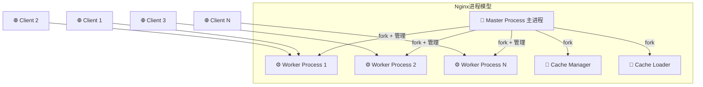

**Master Process 职责：**
- 读取并验证配置文件
- 创建、监控和管理 Worker 进程
- 接收并处理信号（reload、stop、upgrade 等）
- 平滑升级（热更新）

**Worker Process 职责：**
- 实际处理客户端连接（HTTP 请求、TCP/UDP 流量）
- 每个 Worker 单线程运行，基于事件驱动 I/O 多路复用
- Worker 数量通常设置为与 CPU 核数相等

### 1.2 事件驱动模型：为何如此高效？

传统 Apache（prefork 模式）是 **one thread/process per connection**——每个连接独占一个线程，线程上下文切换开销大，内存消耗高。

Nginx 的 Worker 进程使用 **非阻塞 I/O + 事件驱动** 架构，通过操作系统提供的多路复用接口（Linux 下为 `epoll`，BSD 下为 `kqueue`），单个 Worker 可同时管理数万个连接。

**关键区别：**

| 特性 | Apache（prefork） | Nginx |
| :--- | :--- | :--- |
| 并发模型 | 每连接一进程/线程 | 事件驱动，非阻塞 I/O |
| 内存消耗 | 高（每线程 ~8MB 栈） | 低（每连接 ~10KB） |
| C10K 场景 | 容易崩溃或性能骤降 | 轻松应对，性能线性扩展 |
| 静态文件 | 一般 | 极快（sendfile 系统调用） |
| 动态内容 | 模块内置处理（mod_php） | 依赖外部 FastCGI/uwsgi |

---

## 二、HTTP 请求处理时序

### 2.1 完整请求生命周期

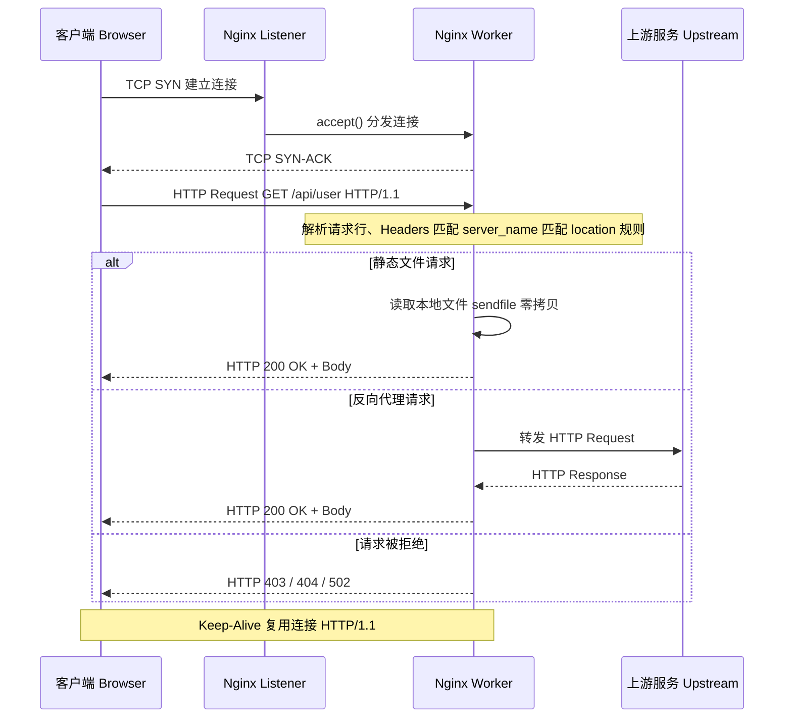

### 2.2 Nginx 11 个处理阶段（Phase）

Nginx 将每个 HTTP 请求的处理分为 11 个严格顺序执行的阶段，模块可以挂载到对应阶段注入逻辑：

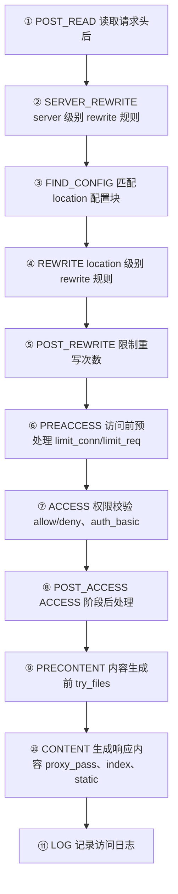

---

## 三、核心功能详解

### 3.1 静态文件服务

Nginx 提供极高效的静态文件服务，结合 `sendfile`、`tcp_nopush`、`gzip` 等特性，可以实现接近理论带宽上限的传输速度。

```nginx
server {
    listen 80;
    server_name static.example.com;

    root /var/www/html;
    index index.html index.htm;

    # 启用 sendfile 零拷贝传输
    sendfile on;
    tcp_nopush on;
    tcp_nodelay on;

    # 静态资源长期缓存
    location ~* \.(jpg|jpeg|png|gif|ico|css|js|woff2)$ {
        expires 1y;
        add_header Cache-Control "public, immutable";
        access_log off;
    }

    # Gzip 压缩
    gzip on;
    gzip_types text/plain text/css application/json application/javascript;
    gzip_min_length 1024;
    gzip_comp_level 6;
}
```

**sendfile 零拷贝 vs 传统拷贝原理：**

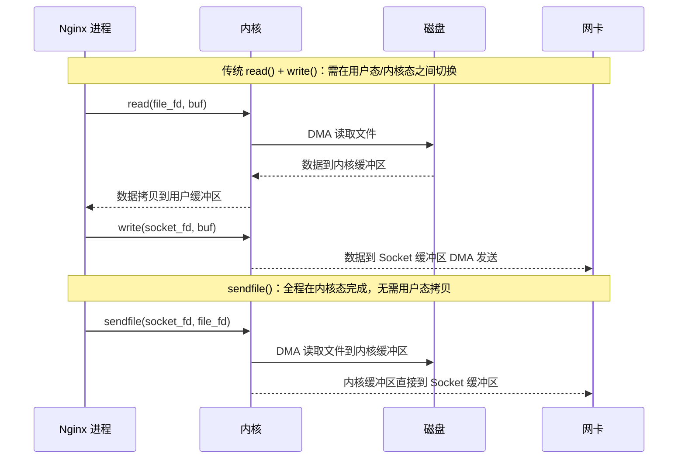

### 3.2 反向代理与负载均衡

反向代理是 Nginx 最常见的使用场景之一——将外部请求转发到内部服务集群。

```nginx
upstream backend_pool {
    least_conn;
    server 192.168.1.10:8080 weight=3;
    server 192.168.1.11:8080 weight=1;
    server 192.168.1.12:8080 backup;
    keepalive 32;
}

server {
    listen 80;
    server_name api.example.com;

    location /api/ {
        proxy_pass http://backend_pool;

        proxy_set_header Host              $host;
        proxy_set_header X-Real-IP         $remote_addr;
        proxy_set_header X-Forwarded-For   $proxy_add_x_forwarded_for;
        proxy_set_header X-Forwarded-Proto $scheme;

        proxy_connect_timeout 5s;
        proxy_send_timeout    60s;
        proxy_read_timeout    60s;

        proxy_http_version 1.1;
        proxy_set_header Connection "";
    }
}
```

#### 负载均衡策略对比

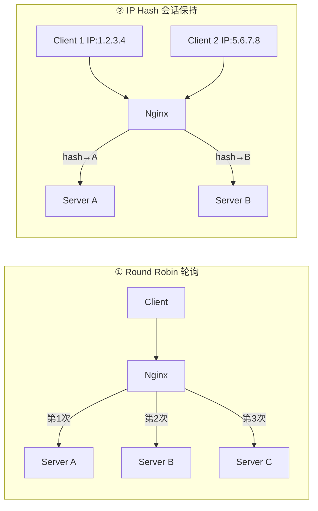

| 策略 | 配置指令 | 适用场景 |
| :--- | :--- | :--- |
| 轮询 Round Robin | 默认，无需指令 | 无状态服务，通用场景 |
| 加权轮询 | `weight=N` | 服务器性能不均等 |
| IP Hash | `ip_hash;` | 需要会话保持 Session Sticky |
| 最少连接 | `least_conn;` | 长连接、耗时不均匀的请求 |
| 随机 | `random;` | 大规模集群 |
| 一致性哈希 | `hash $key consistent;` | 缓存友好型服务 |

### 3.3 HTTPS / TLS 终止

Nginx 充当 TLS 终止点（TLS Termination），将 HTTPS 流量解密后以 HTTP 转发给内部服务。

```nginx
server {
    listen 443 ssl http2;
    server_name www.example.com;

    ssl_certificate     /etc/nginx/ssl/fullchain.pem;
    ssl_certificate_key /etc/nginx/ssl/privkey.pem;

    ssl_protocols TLSv1.2 TLSv1.3;
    ssl_ciphers ECDHE-ECDSA-AES128-GCM-SHA256:ECDHE-RSA-AES128-GCM-SHA256;
    ssl_prefer_server_ciphers off;

    add_header Strict-Transport-Security "max-age=63072000" always;

    ssl_stapling on;
    ssl_stapling_verify on;
    resolver 8.8.8.8 1.1.1.1 valid=300s;

    ssl_session_cache   shared:SSL:10m;
    ssl_session_timeout 1d;

    location / {
        proxy_pass http://backend_pool;
    }
}

server {
    listen 80;
    server_name www.example.com;
    return 301 https://$host$request_uri;
}
```

**TLS 握手时序：**

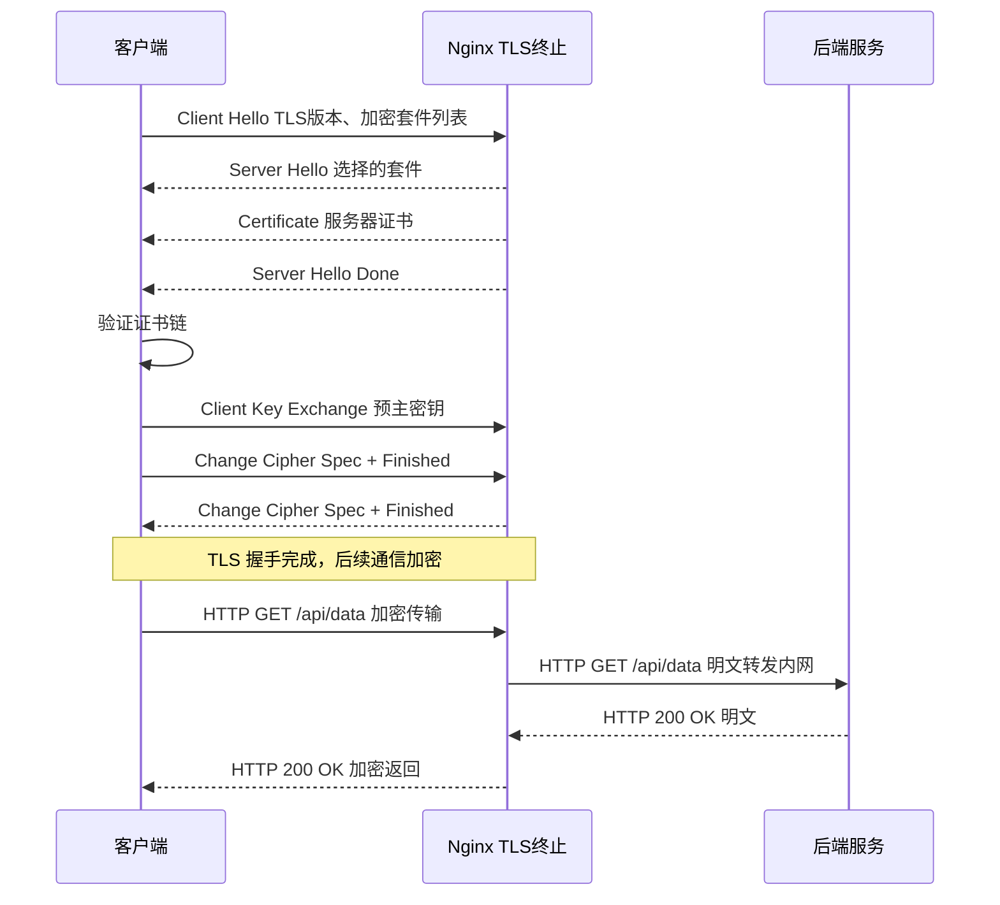

### 3.4 location 匹配规则与优先级

`location` 是 Nginx 配置的核心，掌握其优先级规则至关重要：

```nginx
server {
    # 优先级 1：精确匹配（=）
    location = /favicon.ico {
        log_not_found off;
        access_log off;
    }

    # 优先级 2：前缀匹配加 ^~ 修饰符（匹配后不再检查正则）
    location ^~ /static/ {
        root /var/www;
    }

    # 优先级 3：正则匹配区分大小写（~）
    location ~ \.php$ {
        fastcgi_pass 127.0.0.1:9000;
        include fastcgi_params;
    }

    # 优先级 4：正则匹配不区分大小写（~*）
    location ~* \.(jpg|png|gif)$ {
        expires 30d;
    }

    # 优先级 5：普通前缀匹配（最低）
    location / {
        try_files $uri $uri/ /index.html;
    }
}
```

**匹配优先级决策流程：**

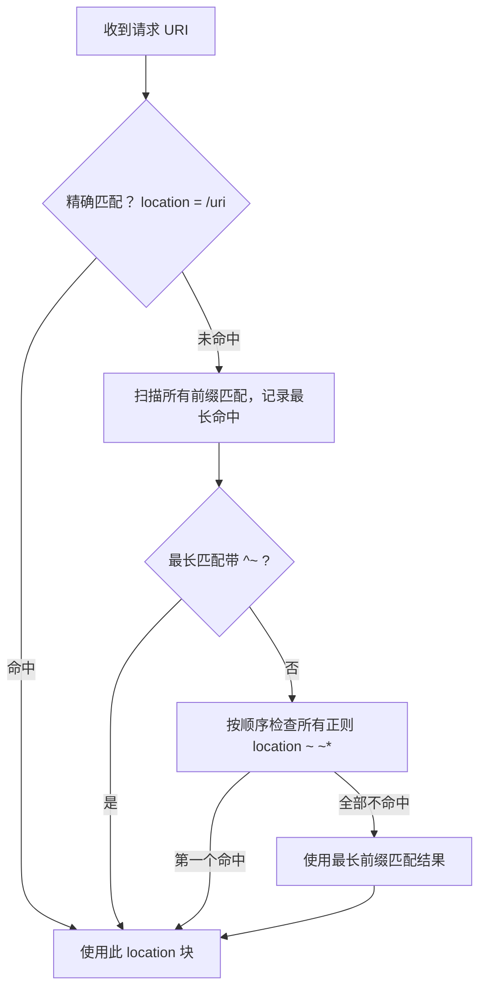

---

## 四、高级功能

### 4.1 限流与熔断

防止恶意流量或突发请求压垮服务：

```nginx
limit_req_zone $binary_remote_addr zone=api_limit:10m rate=10r/s;
limit_conn_zone $binary_remote_addr zone=conn_limit:10m;

server {
    location /api/ {
        limit_req zone=api_limit burst=20 nodelay;
        limit_conn conn_limit 10;
        limit_req_status 429;
        limit_conn_status 429;

        proxy_pass http://backend_pool;
    }
}
```

**令牌桶限流状态机：**

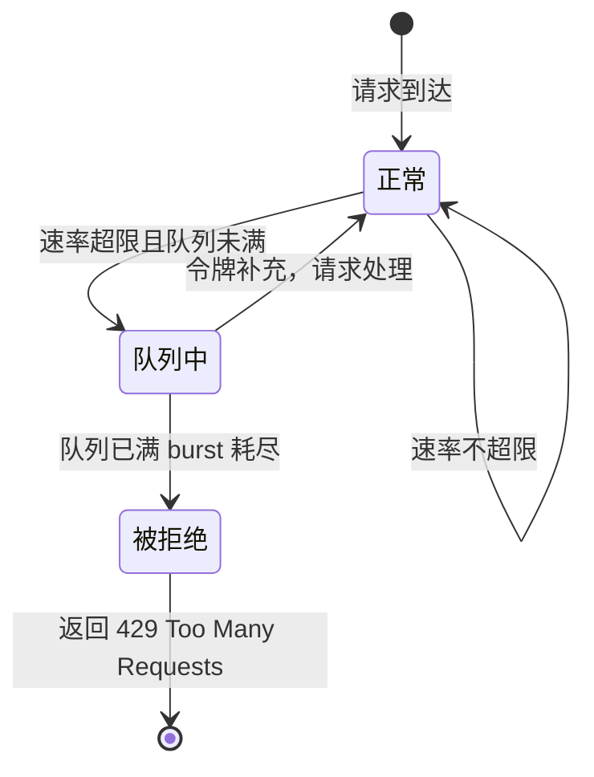

### 4.2 缓存（Proxy Cache）

Nginx 可对上游响应进行缓存，大幅减少后端压力：

```nginx
proxy_cache_path /var/cache/nginx levels=1:2 keys_zone=my_cache:10m max_size=10g inactive=60m use_temp_path=off;

server {
    location /api/products {
        proxy_cache my_cache;
        proxy_cache_key "$scheme$host$request_uri";
        proxy_cache_valid 200 301 10m;
        proxy_cache_valid 404 1m;
        proxy_cache_lock on;
        proxy_cache_use_stale error timeout updating;
        add_header X-Cache-Status $upstream_cache_status;

        proxy_pass http://backend_pool;
    }
}
```

**缓存命中/未命中/过期处理流程：**

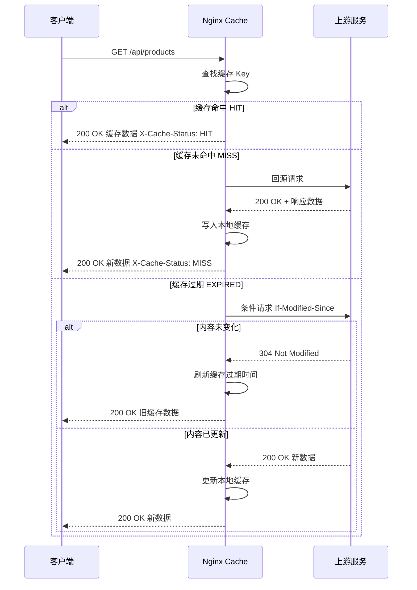

### 4.3 WebSocket 代理

WebSocket 需要从 HTTP 升级协议，Nginx 需要特殊配置：

```nginx
map $http_upgrade $connection_upgrade {
    default upgrade;
    ''      close;
}

server {
    location /ws/ {
        proxy_pass http://websocket_backend;
        proxy_http_version 1.1;
        proxy_set_header Upgrade $http_upgrade;
        proxy_set_header Connection $connection_upgrade;
        proxy_read_timeout 3600s;
        proxy_send_timeout 3600s;
    }
}
```

**WebSocket 升级握手时序：**

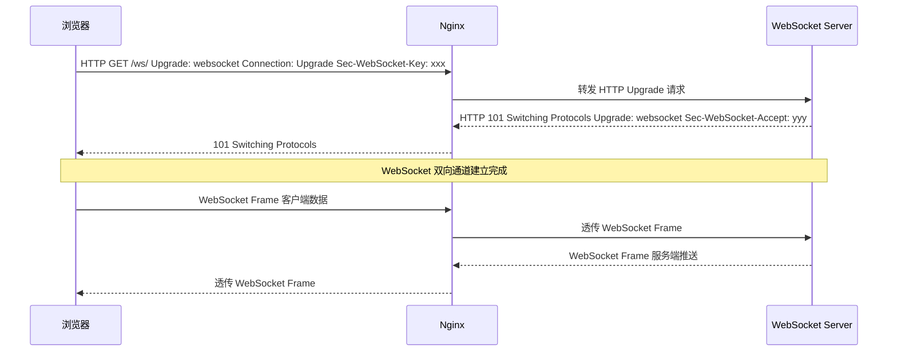

---

## 五、生产环境最佳配置实践

### 5.1 主配置文件结构

```nginx
user  nginx;
worker_processes auto;
worker_rlimit_nofile 65535;

error_log /var/log/nginx/error.log warn;
pid       /var/run/nginx.pid;

events {
    worker_connections 4096;
    use epoll;
    multi_accept on;
}

http {
    include       mime.types;
    default_type  application/octet-stream;

    log_format main '$remote_addr - $remote_user [$time_local] "$request" '
                    '$status $body_bytes_sent "$http_referer" '
                    '"$http_user_agent" rt=$request_time '
                    'urt=$upstream_response_time';

    access_log /var/log/nginx/access.log main buffer=32k flush=5s;

    sendfile    on;
    tcp_nopush  on;
    tcp_nodelay on;

    keepalive_timeout  65;
    keepalive_requests 1000;

    client_max_body_size   10m;
    client_body_buffer_size 128k;

    server_tokens off;

    include /etc/nginx/conf.d/*.conf;
}
```

### 5.2 完整的生产级反向代理配置

```nginx
upstream api_servers {
    least_conn;
    server 10.0.0.1:8080 max_fails=3 fail_timeout=30s;
    server 10.0.0.2:8080 max_fails=3 fail_timeout=30s;
    server 10.0.0.3:8080 max_fails=3 fail_timeout=30s;
    keepalive 64;
}

server {
    listen 443 ssl http2;
    server_name api.example.com;

    ssl_certificate     /etc/nginx/ssl/api.example.com.pem;
    ssl_certificate_key /etc/nginx/ssl/api.example.com.key;
    ssl_protocols       TLSv1.2 TLSv1.3;
    ssl_session_cache   shared:SSL:10m;

    add_header X-Frame-Options "SAMEORIGIN" always;
    add_header X-Content-Type-Options "nosniff" always;
    add_header X-XSS-Protection "1; mode=block" always;
    add_header Referrer-Policy "strict-origin-when-cross-origin" always;

    location = /health {
        access_log off;
        return 200 "OK\n";
        add_header Content-Type text/plain;
    }

    location /api/ {
        limit_req zone=api_limit burst=50 nodelay;
        limit_conn conn_limit 20;

        proxy_pass http://api_servers;
        proxy_http_version 1.1;
        proxy_set_header Connection "";
        proxy_set_header Host $host;
        proxy_set_header X-Real-IP $remote_addr;
        proxy_set_header X-Forwarded-For $proxy_add_x_forwarded_for;
        proxy_set_header X-Forwarded-Proto $scheme;

        proxy_connect_timeout 3s;
        proxy_send_timeout    30s;
        proxy_read_timeout    30s;

        proxy_next_upstream error timeout http_500 http_502 http_503;
        proxy_next_upstream_tries 2;
    }

    location /static/ {
        root /var/www/api.example.com;
        expires 30d;
        add_header Cache-Control "public, immutable";
    }

    error_page 404 /404.html;
    error_page 500 502 503 504 /50x.html;
}
```

---

## 六、常用运维命令

```bash
# 检查配置文件语法
nginx -t

# 平滑重载配置（不中断现有连接）
nginx -s reload
systemctl reload nginx

# 停止服务
nginx -s stop    # 立即停止
nginx -s quit    # 优雅退出

# 查看版本与编译模块
nginx -V

# 实时查看日志
tail -f /var/log/nginx/access.log
tail -f /var/log/nginx/error.log

# 查看实时连接状态（需 stub_status 模块）
curl http://localhost/nginx_status
# 输出示例：
# Active connections: 291
# server accepts handled requests
#  16630948 16630948 31070465
# Reading: 6 Writing: 179 Waiting: 106
```

### 热升级流程（不停服升级 Nginx 二进制）

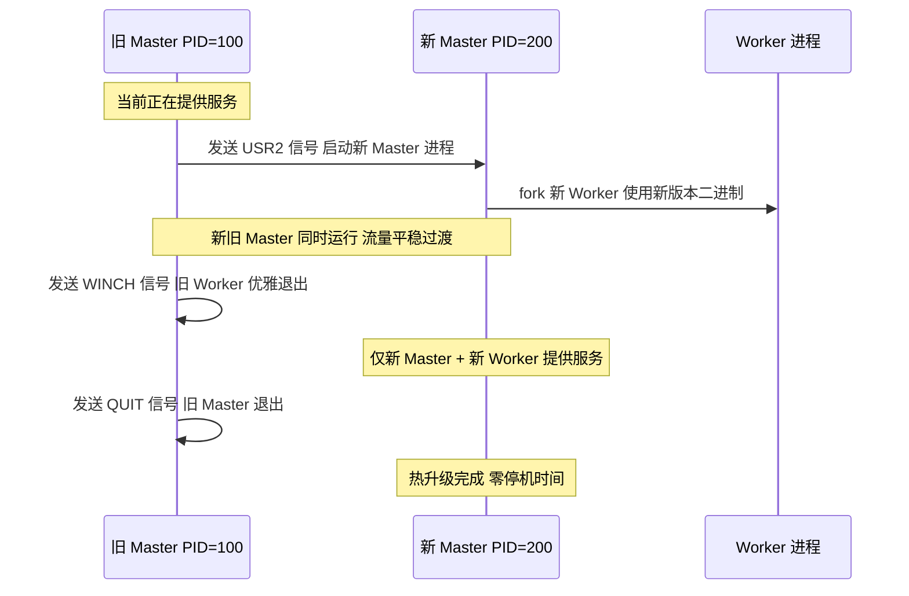

---

## 七、性能调优一览

| 调优维度 | 配置项 | 推荐值 | 说明 |
| :--- | :--- | :--- | :--- |
| 进程 | `worker_processes` | `auto` | 等于 CPU 核数 |
| 进程 | `worker_rlimit_nofile` | `65535` | 文件描述符上限 |
| 事件 | `worker_connections` | `4096~10240` | 单 Worker 最大连接 |
| 事件 | `use` | `epoll` | Linux 最高效事件模型 |
| 事件 | `multi_accept` | `on` | 一次接受多个连接 |
| 传输 | `sendfile` | `on` | 零拷贝文件传输 |
| 传输 | `tcp_nopush` | `on` | 合并数据包减少 RTT |
| 压缩 | `gzip_comp_level` | `6` | 压缩比与 CPU 开销平衡 |
| 缓冲 | `client_body_buffer_size` | `128k` | 减少磁盘临时文件 I/O |
| 连接 | `keepalive_timeout` | `65s` | 连接复用时间 |
| 上游 | `keepalive` | `32~64` | 上游连接池大小 |
| 安全 | `server_tokens` | `off` | 隐藏版本信息 |

---

## 八、总结

Nginx 之所以能在如此广泛的场景中被采用，核心在于其精妙的设计哲学：

- **Master-Worker 进程隔离**：Worker 崩溃不影响 Master，可被自动重启；支持平滑升级，无需停机
- **事件驱动非阻塞 I/O**：单线程轻松管理数万并发连接，内存效率极高
- **模块化架构**：SSL、gzip、缓存、限流等功能均为模块，可按需编译
- **高度可配置**：从简单的静态文件服务到复杂的多层反向代理，一份配置文件搞定

无论你是运维工程师、后端开发者，还是全栈工程师，深入理解 Nginx 都将大幅提升你在网络架构、性能优化和系统稳定性方面的能力。

---

## 参考资料

- [Nginx 官方文档](https://nginx.org/en/docs/)
- [Nginx 模块参考](https://nginx.org/en/docs/dirindex.html)
- [Mozilla SSL Configuration Generator](https://ssl-config.mozilla.org/)
- [Nginx 性能调优指南（官方博客）](https://www.nginx.com/blog/tuning-nginx/)
- [《深入理解 Nginx》- 陶辉著](https://book.douban.com/subject/22793675/)
