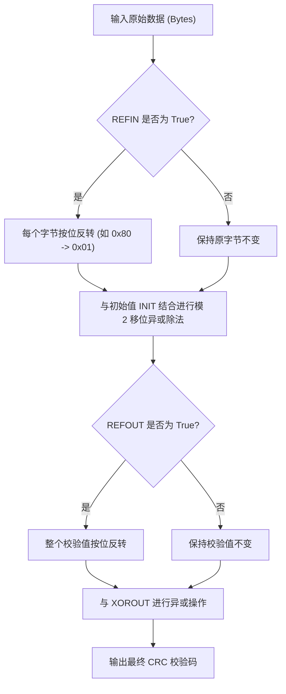

+++
title = 'CRC（循环冗余校验）算法原理与参数模型详解'
date = '2026-08-31T11:18:07+08:00'
slug = 'crc-calculation-and-models'
draft = false
tags = ['crc', '算法', '网络通信', '嵌入式']
+++

在嵌入式开发、工业通信（如 Modbus、CAN 总线）以及网络协议（如 Ethernet、USB、ZIP 文件）中，**CRC（Cyclic Redundancy Check，循环冗余校验）** 是最常用的检错算法之一。

然而，在实际对接协议时，很多人经常遇到“两边算的 CRC 值对不上”的问题。这主要是因为 CRC 并不是单一固定的算法，而是一组由多个参数共同定义的模型。本文将系统讲解 CRC 的数学原理、参数模型构成、计算流程以及常见预设模型速查。

<!-- more -->

## 什么是 CRC？

CRC 是一种根据网络数据包或计算机文件等数据产生简短固定位数校验码的散列函数，主要用于检测数据传输或存储后是否发生错误。

其基本数学思想是：
- 将待发送的二进制数据序列看作是一个多项式的系数向量 $M(x)$。
- 选定一个固定的**生成多项式 $G(x)$**。
- 将 $M(x)$ 左移校验码的位数（乘以 $x^n$），然后以模 2 除法（即异或运算）除以 $G(x)$。
- 得到的余数多项式 $R(x)$ 即为 CRC 校验码。
- 接收方以同样的生成多项式对接收到的数据进行校验，若余数为 0，则表明传输大概率无误。

---

## 核心概念：CRC 算法的 6 大参数模型

在工业与通信界，一个完整的 CRC 计算模型由以下 6 个核心参数唯一确定：

| 参数 | 全称 | 说明 |
| :--- | :--- | :--- |
| **WIDTH** | 位宽 | CRC 校验码的二进制位数（如 8、16、32 位）。 |
| **POLY** | 生成多项式 | 模 2 除法的除数（十六进制表示）。通常省略最高位的 `1`（例如 CRC-32 的 $x^{32}$ 位被省略，记为 `0x04C11DB7`）。 |
| **INIT** | 初始值 | 计算开始前，CRC 寄存器的初始预置值（如 `0x0000` 或 `0xFFFF`）。 |
| **REFIN** | 输入反转 | 待测数据的**每个字节**在送入计算前是否进行按位倒序（True/False，即 LSB 优先还是 MSB 优先）。 |
| **REFOUT** | 输出反转 | 在计算完成后、与 XOROUT 异或之前，**整个寄存器的数据**是否进行按位倒序。 |
| **XOROUT** | 结果异或值 | 最终计算结果与该数值进行异或操作，得到最终的 CRC 结果。 |

### 为什么两端算的 CRC 对不上？

许多开发者在对接不同设备时，仅确认了“多项式 POLY 相同”，却忽略了 **INIT**、**REFIN/REFOUT** 或 **XOROUT** 的差异，这也是导致通信校验失败的最常见原因。

---

## CRC 计算流程



---

## 常见 CRC 参数模型速查表

下表汇总了工业与网络中最常用的标准 CRC 模型参数：

| CRC 算法名称 | 多项式公式 | 宽度 (WIDTH) | 多项式 (POLY) | 初始值 (INIT) | 结果异或值 (XOROUT) | 输入反转 (REFIN) | 输出反转 (REFOUT) |
| :--- | :--- | :---: | :---: | :---: | :---: | :---: | :---: |
| **CRC-4/ITU** | $x^4 + x + 1$ | 4 | `03` | `00` | `00` | true | true |
| **CRC-5/EPC** | $x^5 + x^3 + 1$ | 5 | `09` | `09` | `00` | false | false |
| **CRC-5/USB** | $x^5 + x^2 + 1$ | 5 | `05` | `1F` | `1F` | true | true |
| **CRC-6/ITU** | $x^6 + x + 1$ | 6 | `03` | `00` | `00` | true | true |
| **CRC-7/MMC** | $x^7 + x^3 + 1$ | 7 | `09` | `00` | `00` | false | false |
| **CRC-8** | $x^8 + x^2 + x + 1$ | 8 | `07` | `00` | `00` | false | false |
| **CRC-8/ROHC** | $x^8 + x^2 + x + 1$ | 8 | `07` | `FF` | `00` | true | true |
| **CRC-8/MAXIM** | $x^8 + x^5 + x^4 + 1$ | 8 | `31` | `00` | `00` | true | true |
| **CRC-16/IBM** | $x^{16} + x^{15} + x^2 + 1$ | 16 | `8005` | `0000` | `0000` | true | true |
| **CRC-16/MAXIM** | $x^{16} + x^{15} + x^2 + 1$ | 16 | `8005` | `0000` | `FFFF` | true | true |
| **CRC-16/USB** | $x^{16} + x^{15} + x^2 + 1$ | 16 | `8005` | `FFFF` | `FFFF` | true | true |
| **CRC-16/MODBUS** | $x^{16} + x^{15} + x^2 + 1$ | 16 | `8005` | `FFFF` | `0000` | true | true |
| **CRC-16/CCITT** | $x^{16} + x^{12} + x^5 + 1$ | 16 | `1021` | `0000` | `0000` | true | true |
| **CRC-16/CCITT-FALSE** | $x^{16} + x^{12} + x^5 + 1$ | 16 | `1021` | `FFFF` | `0000` | false | false |
| **CRC-16/XMODEM** | $x^{16} + x^{12} + x^5 + 1$ | 16 | `1021` | `0000` | `0000` | false | false |
| **CRC-16/X25** | $x^{16} + x^{12} + x^5 + 1$ | 16 | `1021` | `FFFF` | `FFFF` | true | true |
| **CRC-16/DNP** | $x^{16} + x^{13} + x^{12} + x^{11} + x^{10} + x^8 + x^6 + x^5 + x^2 + 1$ | 16 | `3D65` | `0000` | `FFFF` | true | true |
| **CRC-32** (以太网/ZIP) | $x^{32} + x^{26} + x^{23} + ... + 1$ | 32 | `04C11DB7` | `FFFFFFFF` | `FFFFFFFF` | true | true |
| **CRC-32/MPEG-2** | $x^{32} + x^{26} + x^{23} + ... + 1$ | 32 | `04C11DB7` | `FFFFFFFF` | `00000000` | false | false |

---

## 示例：通用 Python 实现

以下是一个支持自定义 6 参数模型的通用 CRC 计算函数：

```python
def reflect(data: int, width: int) -> int:
    """按位反转数据"""
    res = 0
    for i in range(width):
        if (data >> i) & 1:
            res |= 1 << (width - 1 - i)
    return res


def calculate_crc(data: bytes, width: int, poly: int, init: int, refin: bool, refout: bool, xorout: int) -> int:
    """通用 CRC 计算引擎"""
    mask = (1 << width) - 1
    crc = init & mask

    for byte in data:
        cur_byte = reflect(byte, 8) if refin else byte
        crc ^= (cur_byte << (width - 8))
        for _ in range(8):
            if crc & (1 << (width - 1)):
                crc = ((crc << 1) ^ poly) & mask
            else:
                crc = (crc << 1) & mask

    if refout:
        crc = reflect(crc, width)

    return (crc ^ xorout) & mask


# 示例：以 Modbus-RTU 校验 "123456789" (ASCII) 为例
test_data = b"123456789"
result = calculate_crc(
    data=test_data,
    width=16,
    poly=0x8005,
    init=0xFFFF,
    refin=True,
    refout=True,
    xorout=0x0000
)
print(f"CRC-16/MODBUS: 0x{result:04X}")  # 输出 0x4B37
```

---

## 避坑与调试建议

1. **注意字节序（Endianness）**：
   - CRC 计算结果本身是一个整型数值。在写入通信数据包时，需要明确协议要求是**高位在前（大端 Big-Endian）** 还是 **低位在前（小端 Little-Endian）**。例如 Modbus 协议在发送 CRC16 时通常规定**低字节在前，高字节在后**。
2. **区分输入格式**：
   - 调试时确认输入的是 **十六进制字节流（Hex）** 还是 **ASCII 字符串**。例如 Hex `0x31 0x32` 对应 ASCII `"12"`。
3. **善用在线工具比对**：
   - 在开发调试时，可以借助在线 CRC 工具（如 [ip33.com CRC 在线计算](https://www.ip33.com/crc.html)）输入相同参数进行交叉验证。
