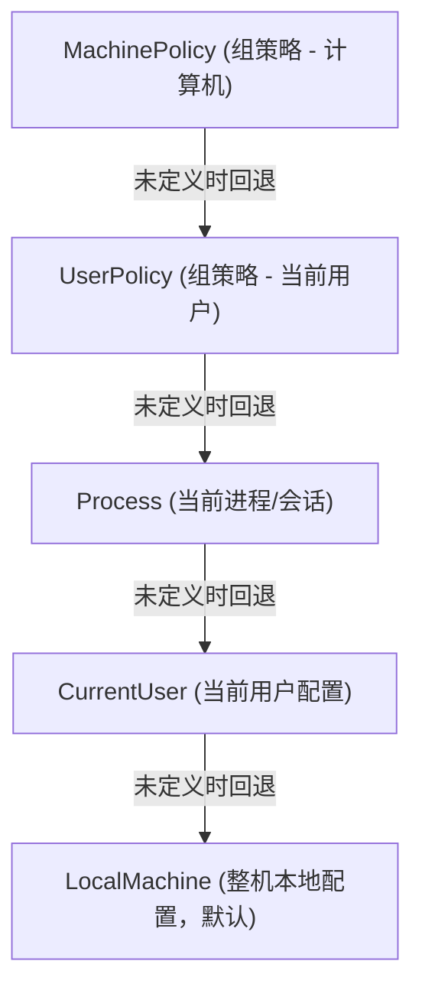

+++
title = 'PowerShell 提示“在此系统上禁止运行脚本”的解决方法'
date = '2026-08-31T11:10:43+08:00'
slug = 'powershell-script-execution-disabled'
draft = false
tags = ['windows', 'powershell', '安全']
+++

在 Windows 终端中尝试执行 PowerShell 脚本（`.ps1` 文件）或者运行某些依赖脚本的工具（如 `npm`、`yarn`、`nvm`、`venv/activate` 等）时，经常会遇到脚本被阻止运行的错误。本文将详细分析该问题的原因、提供多种解决方案以及深入讲解 PowerShell 的执行策略机制。

<!-- more -->

## 问题现象

在 PowerShell 中直接运行脚本时，可能会收到如下报错信息：

```powershell
.\script.ps1 : 无法加载文件 C:\Users\xxx\script.ps1，因为在此系统上禁止运行脚本。
有关详细信息，请参阅 https:/go.microsoft.com/fwlink/?LinkID=135170 中的 about_Execution_Policies。
所在位置 行:1 字符: 1
+ .\script.ps1
+ ~~~~~~~~~~~~
    + CategoryInfo          : SecurityError: (:) [], PSSecurityException
    + FullyQualifiedErrorId : UnauthorizedAccess
```

> **英文环境报错**：
> `File C:\Users\xxx\script.ps1 cannot be loaded because running scripts is disabled on this system. For more information, see about_Execution_Policies at https:/go.microsoft.com/fwlink/?LinkID=135170.`

---

## 问题原因

这**并不是系统故障或 bug**，而是 Windows PowerShell 自带的一项**安全保护机制**（Execution Policy，执行策略）。

在 Windows 客户端系统中，默认的执行策略通常是 `Restricted`（受限状态）。该策略只允许运行单个交互式命令，禁止加载或执行任何脚本文件（`.ps1`），从而防止恶意脚本在未经用户许可的情况下静默执行。

---

## 快速解决方法

根据不同使用场景，可以选择以下几种解决策略：

### 方法一：修改当前用户的执行策略（推荐，无需管理员权限）

如果你没有管理员权限，或者只想对自己当前登录的 Windows 账户放开权限，可以设置 `CurrentUser` 范围：

```powershell
Set-ExecutionPolicy -ExecutionPolicy RemoteSigned -Scope CurrentUser
```

> **说明**：`RemoteSigned` 表示本地自己编写的脚本可直接运行；从互联网下载的脚本则必须附带受信任的数字签名才能运行。这是兼顾安全性与实用性的推荐配置。

### 方法二：全局修改执行策略（需管理员权限）

如果你拥有管理员权限并希望对整台设备生效：

1. 右键开始菜单或搜索“PowerShell”，选择 **以管理员身份运行**。
2. 执行以下命令：

```powershell
Set-ExecutionPolicy RemoteSigned
```

系统会弹出确认提示，输入 `Y` 或 `A`（全是）回车即可生效。

### 方法三：临时绕过策略（仅当前会话或单次运行有效）

如果只是临时运行某个脚本，不想改变系统的持久安全配置，可以使用以下临时方式：

#### 1. 仅针对当前打开的 PowerShell 窗口生效
```powershell
Set-ExecutionPolicy Bypass -Scope Process
```
关闭该窗口后，设置自动失效，恢复原本的安全策略。

#### 2. 单次启动带 Bypass 参数的会话
在 CMD 或运行窗口中启动 PowerShell：
```cmd
powershell -ExecutionPolicy Bypass
# 或者简写
powershell -ep bypass
```

#### 3. 单次运行指定的脚本文件
```cmd
powershell -ExecutionPolicy Bypass -File .\script.ps1
```

---

## 深入了解 PowerShell 执行策略

### 1. 执行策略（Execution Policies）类型

PowerShell 官方支持的执行策略共有 7 种：

| 策略名称 | 说明 | 适用场景 |
| :--- | :--- | :--- |
| `Restricted` | 默认策略。阻止所有脚本运行，仅允许交互式命令。 | 高安全性环境 |
| `RemoteSigned` | 本地脚本可直接运行；下载的脚本需数字签名。 | **日常开发推荐** |
| `AllSigned` | 无论是本地还是下载的脚本，都必须经过受信任发布者的数字签名。 | 企业合规环境 |
| `Unrestricted` | 允许运行所有脚本。运行未签名的外来脚本时会弹出警告提示。 | 调试与测试 |
| `Bypass` | 不阻止任何脚本，不提示任何警告。 | 自动化脚本、CI/CD |
| `Undefined` | 当前作用域未定义策略（将继承下一优先级的策略）。 | 默认未显式配置时 |
| `Default` | 恢复为默认策略（Windows 客户端为 Restricted，Windows Server 为 RemoteSigned）。 | 恢复初始状态 |

### 2. 执行策略的作用域与优先级

PowerShell 执行策略支持多级作用域（Scope）。当存在多个作用域的配置时，优先级从高到低依次为：



查看当前所有作用域的执行策略列表：

```powershell
Get-ExecutionPolicy -List
```

输出示例：

```text
        Scope ExecutionPolicy
        ----- ---------------
MachinePolicy       Undefined
   UserPolicy       Undefined
      Process       Undefined
  CurrentUser    RemoteSigned
 LocalMachine      Restricted
```

此时生效的将是优先级更高的 `CurrentUser`（`RemoteSigned`）。

---

## 总结与安全建议

1. **不要盲目设为 `Unrestricted` 或 `Bypass`**：全局开放策略会降低系统的安全防护能力。
2. **日常开发首选 `RemoteSigned`**：推荐结合 `-Scope CurrentUser`，既不需要频繁使用管理员权限，又能满足日常开发（如 Node/Python 虚拟环境工具）的脚本执行需求。
3. **临时脚本使用 `-Scope Process` 或命令行参数 `-ep bypass`**：用完即走，不留安全隐患。
