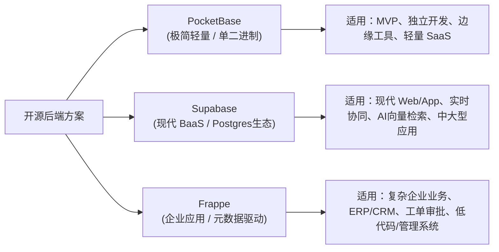
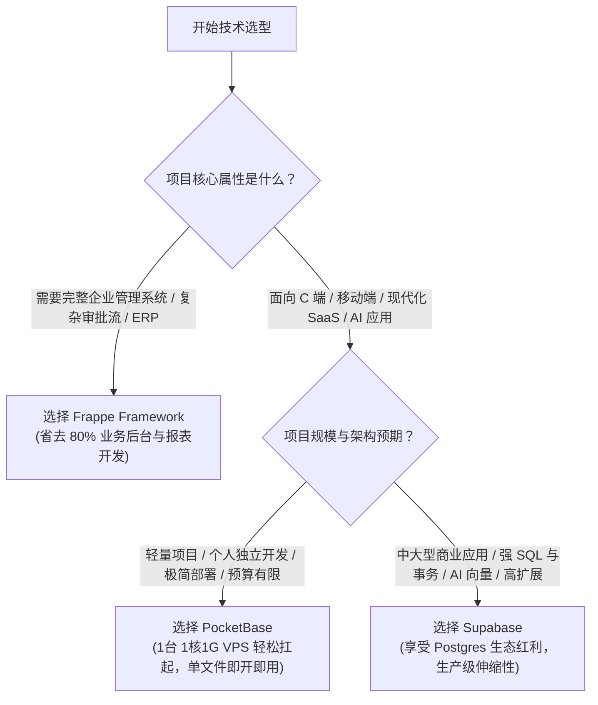

+++
title = '开源后端选型指南：PocketBase vs Supabase vs Frappe 深度对比与实践选型'
date = '2026-09-04T09:40:00+08:00'
slug = 'pocketbase-supabase-frappe-comparison'
draft = false
tags = ['pocketbase', 'supabase', 'frappe', '后端架构', '开源工具', '技术选型']
+++

在如今全栈开发、独立开发（Indie Hacker）和敏捷业务交付的浪潮下，很少有人愿意再从零手写一套重复的基础设施：用户认证（Auth）、权限控制（RBAC/RLS）、文件上传存储、CRUD REST/GraphQL 接口、管理后台（Admin UI）以及实时订阅（Realtime）。

开源社区为此诞生了众多优秀的“开箱即用”后端框架与 BaaS（Backend-as-a-Service）方案。其中，**PocketBase**、**Supabase** 和 **Frappe** 是三种截然不同理念下的典型代表：

- **PocketBase**：极致极简，单文件部署的 Go + SQLite 嵌入式瑞士军刀。
- **Supabase**：强大灵活，以 PostgreSQL 为核心的开源 Firebase 替代方案。
- **Frappe**：业务驱动，以 DocType 元数据与工作流为核心的 Python 全栈企业级应用引擎。

本文将从架构设计、核心特性、适用场景、部署运维及局限性等维度进行深度对比，帮助你在面对不同项目需求时做出最适合的技术选型。

<!-- more -->

---

## 快速概览：三者核心定位



---

## 1. PocketBase：极简主义的单文件后端

[PocketBase](https://pocketbase.io/) 是由 Gani Georgiev 开发的开源 Go 后端。它的核心理念只有四个字：**极简易用**。

```
+-------------------------------------------------------------+
|                      PocketBase (单二进制)                   |
|  +----------------+  +----------------+  +----------------+ |
|  |  Admin UI 控制台 |  |  REST / SSE API |  | 用户认证/OAuth2 | |
|  +----------------+  +----------------+  +----------------+ |
|  +----------------+  +----------------+  +----------------+ |
|  | 本地/S3 文件存储 |  | JS / Go 扩展钩子 |  | 内嵌 SQLite 引擎 | |
|  +----------------+  +----------------+  +----------------+ |
+-------------------------------------------------------------+
```

### 核心亮点
1. **真正的零依赖与单二进制**：只需下载一个十几 MB 的执行文件，运行 `./pocketbase serve` 即可在几秒内启动包含 REST API、认证系统和管理后台的完整后端。
2. **内嵌 SQLite + WAL 模式**：内置 SQLite 数据库，单机读写性能极高，支持 WAL 模式，备份只需复制单个 `.db` 文件。
3. **极佳的管理后台（Admin UI）**：自带现代化的 Web 管理后台，可在界面中可视化创建集合（Collection）、设置字段校验、配置规则级权限（API Rules）。
4. **灵活的扩展方式**：
   - 支持使用 **JavaScript / TypeScript**（基于内嵌的 goja 引擎）编写服务端脚本、钩子与定时任务。
   - 也可以直接作为 **Go 框架库** 导入（`pocketbase.New()`），将其嵌入到自定义 Go 程序中。
5. **实时订阅（Realtime）**：基于 Server-Sent Events (SSE)，客户端可以轻松监听任意 Collection 的实时变更。

### 适用场景
- 个人独立项目、副业项目（Side Projects）及快速验证的原型（MVP）。
- 移动端 App / 桌面端应用（Electron/Tauri/Flutter）的轻量后端。
- 边缘计算节点或树莓派等资源受限环境。
- 团队内部敏捷小工具、CMS 内容管理。

---

## 2. Supabase：以 PostgreSQL 为核心的现代 BaaS 旗舰

[Supabase](https://supabase.com/) 被誉为“开源 Firebase 替代者”，但它最聪明的设计在于：**完全没有重新发明数据库，而是把 PostgreSQL 的强大能力发挥到了极致**。

```
+-------------------------------------------------------------+
|                         Supabase 架构                        |
|  +----------------+  +----------------+  +----------------+ |
|  |  Studio (Web)  |  | PostgREST(API) |  | GoTrue (Auth)  | |
|  +----------------+  +----------------+  +----------------+ |
|  +----------------+  +----------------+  +----------------+ |
|  | Realtime (WS)  |  | Storage 引擎   |  | Deno Edge Func | |
|  +----------------+  +----------------+  +----------------+ |
|  +--------------------------------------------------------+ |
|  |             PostgreSQL 数据库 + RLS + pgvector          | |
|  +--------------------------------------------------------+ |
+-------------------------------------------------------------+
```

### 核心亮点
1. **100% 原生 PostgreSQL**：没有专有锁死，你得到的就是一个纯正的 Postgres。你可以使用全部 SQL 特性、存储过程、触发器、全文索引以及丰富扩展插件（如 `pgvector` 向量数据库、`PostGIS` 地理信息等）。
2. **基于 RLS（Row-Level Security）的细粒度安全模型**：安全权限直接下沉到数据库层。前端可以通过 SDK 直连数据库执行查询，安全策略由 SQL 行级安全策略严格保证。
3. **自动生成 PostgREST API & GraphQL**：数据库建表即自动生成高性能的 RESTful 与 GraphQL 接口。
4. **完备的企业级能力**：
   - 内置强大的 Auth 系统（支持数十种 OAuth 供应商、Magic Link、SAML SSO、MFA）。
   - 实时推送（WebSocket Realtime，支持 Broadcast、Presence、Postgres CDC 监听）。
   - S3 兼容的文件存储（Storage）及图片实时处理。
   - 基于 Deno 的 Edge Functions 无服务器函数。

### 适用场景
- 现代 Web 应用（Next.js、Nuxt、SvelteKit、Remix）与跨平台 App（React Native、Flutter）。
- 需要复杂关系查询、事务保证与大数据量分析的 SaaS 产品。
- 生成式 AI（LLM / RAG）应用，利用 `pgvector` 存储并检索向量数据。
- 替代 Firebase，规避海外云厂商绑定与高昂账单。

---

## 3. Frappe：以元数据驱动的全栈企业级低代码框架

[Frappe Framework](https://frappeframework.com/) 是由知名开源 ERP 软件 [ERPNext](https://erpnext.com/) 孵化并抽离出的全栈 Web 框架，基于 **Python + MariaDB/PostgreSQL + Vue/JS** 构建。

与 PocketBase 和 Supabase 这类“通用 API BaaS”不同，Frappe 的核心理念是 **DocType（元数据驱动模型）** 与 **全功能业务应用交付**。

```
+-------------------------------------------------------------+
|                       Frappe Framework                      |
|  +----------------+  +----------------+  +----------------+ |
|  | Desk 管理后台  |  | 工作流/审批引擎|  | 打印格式/PDF报表| |
|  +----------------+  +----------------+  +----------------+ |
|  +----------------+  +----------------+  +----------------+ |
|  | DocType 元引擎 |  | RBAC/字段级权限|  | 队列/定时任务  | |
|  +----------------+  +----------------+  +----------------+ |
|  +--------------------------------------------------------+ |
|  |              MariaDB / PostgreSQL 数据库               | |
|  +--------------------------------------------------------+ |
+-------------------------------------------------------------+
```

### 核心亮点
1. **一切皆 DocType（元数据驱动）**：在 Frappe 中，数据表、表单布局、字段校验、关联关系乃至权限配置都定义为 DocType（保存在 JSON 文件中并随 Git 版本受控）。修改 DocType 即可自动迁移数据库结构并渲染前端页面。
2. **内置开箱即用的 Desk 桌面管理系统**：无需前端开发即可拥有完备的企业后台：包含列表视图、表单视图、看板（Kanban）、甘特图、日历视图、报表统计与审计日志。
3. **深度集成企业级业务组件**：
   - 复杂审批流（Workflow & State Transitions）。
   - 字段级/角色级/用户级权限控制（Role-Based Permission Manager）。
   - 邮件收发、模板通知、PDF 打印格式引擎（Jinja2）。
   - 基于 Redis 的后台队列任务（RQ）、多租户（Multi-tenant）站点管理。
4. **丰富的应用生态**：基于 Frappe 可以一键挂载 ERPNext（进销存/财务/生产）、Frappe HR（人事考勤）、Frappe CRM、Frappe Books 等开源企业级子系统。

### 适用场景
- 制造业、贸易、服务业的企业内部管理系统（ERP、MES、CRM、OA、工单系统）。
- 具有复杂审批流程、状态流转、多角色权限和定制报表需求的 B 端业务系统。
- 软件外包团队需要快速交付具备高度定制化后台的重型商业管理项目。

---

## 全方位对比矩阵

下表对 PocketBase、Supabase 和 Frappe 在技术架构、功能维度与工程运维方面的差异进行了系统汇总：

| 维度 | PocketBase | Supabase | Frappe Framework |
| :--- | :--- | :--- | :--- |
| **主要编程语言** | Go | Elixir, TypeScript, Go, Rust | Python, JavaScript (Vue) |
| **底层数据库** | SQLite（内嵌） | PostgreSQL | MariaDB（主流）/ PostgreSQL |
| **核心设计哲学** | 极简、单文件、零依赖 | Postgres 优先、现代 BaaS、Firebase 替代 | 元数据驱动（DocType）、企业业务全栈 |
| **架构复杂度** | 极低（1 个可执行文件） | 中高（含 10+ 微服务容器） | 中（Python WSGI + Redis + DB + Node） |
| **自托管部署成本** | 5 分钟上手，单个二进制直接运行 | 需 Docker Compose 或 K8s 编排 | 需 Bench CLI 工具链管理环境 |
| **数据规模与并发** | 适合中小规模（单机 SQLite 写入限制） | 极强（支持海量数据与水平只读扩展） | 强（支持中大型企业级并发） |
| **数据安全性 / 权限** | API Rules 表达式过滤 | PostgreSQL RLS（行级安全策略） | 角色/用户/条件/字段级权限系统 |
| **实时通讯 (Realtime)** | 内置 SSE（轻量易用） | WebSocket（广播、Presence、CDC） | Socket.io 实时推送通知 |
| **AI / 向量支持** | 需第三方插件/自定义逻辑 | 原生 `pgvector` 扩展支持，极佳 | 需通过 Python 代码自定义集成 |
| **业务逻辑编写** | JS 脚本钩子 或 Go 源码嵌入 | SQL 存储过程 / Deno Edge Functions | Python 控制器方法 + 客户端 JS 脚本 |
| **后台 Admin UI** | 开箱即用（现代化轻量级） | Supabase Studio（偏向数据库管理） | Frappe Desk（极度成熟的企业操作台） |
| **内置工作流 / 打印** | 无（需自行实现） | 无（专注底层 BaaS 能力） | 原生内置工作流引擎与 Jinja2 PDF 模板 |
| **多租户能力** | 单实例单库，多租户需多进程 | 支持多 Schema / 多项目隔离 | 原生内置 Multi-tenant 架构（Bench） |

---

## 选型决策树

面对新项目该如何选择？你可以参考以下决策路径：



---

## 各方案避坑与实用建议

### 1. 使用 PocketBase 时需要注意
- **单写限制**：由于基于 SQLite，即便有 WAL 模式，高并发写入仍可能遭遇锁竞争，不适合每秒成千上万次并发写入的场景。
- **单机扩展**：PocketBase 专为单机架构设计，无法做到传统意义上的分布式多节点集群写入。
- **建议**：善用 Read 缓存与 SQLite 读性能优势，常规日活几万的中小型应用完全可以稳定运行在 $5/月的 VPS 上。

### 2. 使用 Supabase 时需要注意
- **自托管门槛**：Supabase 官方云服务体验极佳，但如果要在内网或自有服务器完整自托管部署，Docker 包含 Kong、GoTrue、PostgREST、Realtime、Storage、Imgproxy 等众多容器组件，资源消耗和维护成本明显高于 PocketBase。
- **RLS 性能陷阱**：在 Postgres 中编写复杂的 Row Level Security 规则时，如果不注意对关联字段建立索引，可能导致大表查询性能骤降。

### 3. 使用 Frappe 时需要注意
- **学习曲线（Frappe 规则）**：Frappe 具有很强的约束性（Opinionated），从目录结构、DocType 命名、Bench 命令行到部署脚本都有自己的专属体系，初学者需要一定时间适应。
- **环境依赖较多**：依赖 Python、Node.js、Redis、MariaDB 等一整套环境，推荐使用官方 Docker 镜像或专用云服务器配合 Bench 工具维护。

---

## 总结

- **选 PocketBase**：当你想要**最快的速度、最小的运维负担、最清爽的架构**来上线一个 MVP、个人工具或轻量级 SaaS。
- **选 Supabase**：当你构建**现代化 Web/Mobile 应用、AI 驱动的产品、需要深度利用 PostgreSQL 高级特性与生态**。
- **选 Frappe**：当你构建**复杂的企业级内部管理系统、审批工作流平台、ERP/CRM 类项目**，希望开箱即得完整的 Desk 操作台与权限流转引擎。

三者各有所长，找准业务场景与团队技术栈，才能发挥工具的最大价值。
