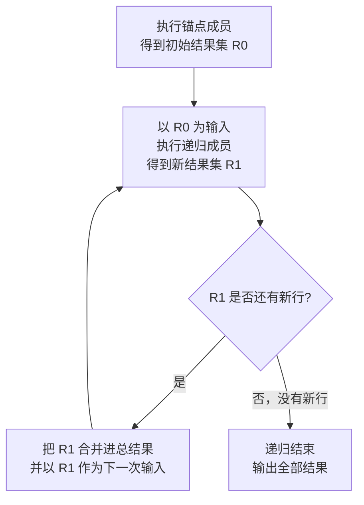

+++
title = 'SQL 中的 CTE（公用表表达式）详解：从基础语法到递归实战'
date = '2026-09-08T10:00:00+08:00'
slug = 'sql-cte-syntax'
draft = false
tags = ['sql', 'cte', '数据库', 'mysql', 'postgresql']
+++

写复杂查询的时候，你有没有经历过这些瞬间：一个查询里套了三层子查询，括号一层套一层，改一个条件要数半天括号；同一个中间结果在一条 SQL 里要用两次，只能复制粘贴两遍；想表达"先取 A，再基于 A 算 B，最后基于 B 出结果"，却不得不把它们全部硬挤进一个 SELECT 里。

CTE（Common Table Expression，公用表表达式）就是为解决这些问题而生的语法。它让你的 SQL 像写代码一样**分层、命名、复用**，甚至能做到子查询永远做不到的事——递归。

<!-- more -->

---

## 什么是 CTE

CTE 本质上是在**单条语句内**定义一个带名字的临时结果集，这条语句中的任何地方都可以引用它。它和子查询做的事情很像，但体验完全不同：

```sql
-- 使用 CTE
WITH recent_orders AS (
    SELECT * FROM orders WHERE order_date >= '2026-09-01'
)
SELECT * FROM recent_orders;

-- 等价的子查询写法
SELECT *
FROM (SELECT * FROM orders WHERE order_date >= '2026-09-01') AS recent_orders;
```

CTE 有四个关键特征：

1. **命名**：给中间结果起一个有意义的名字，SQL 读起来像读伪代码；
2. **作用域只限于当前语句**：语句执行完就消失，不落盘、不占持久空间；
3. **可被引用多次**：同一个 CTE 在语句中可以出现多处，不必复制粘贴；
4. **支持递归**：CTE 可以引用自身，这是普通子查询做不到的。

---

## 基本语法

### 单个 CTE

语法结构就是一个 `WITH` 关键字加上 `AS` 包裹的查询：

```sql
WITH cte_name AS (
    SELECT ...
)
SELECT ... FROM cte_name ...;
```

### 多个 CTE：逗号分隔，允许向前引用

这是 CTE 最实用的能力——把一条巨复杂的查询拆成几个有名字的步骤，后面的 CTE 可以引用前面的：

```sql
WITH
    monthly_sales AS (
        SELECT DATE_TRUNC('month', order_date) AS ym, SUM(amount) AS total
        FROM orders
        GROUP BY DATE_TRUNC('month', order_date)
    ),
    top_months AS (
        SELECT * FROM monthly_sales ORDER BY total DESC LIMIT 3
    )
SELECT * FROM top_months;
```

这里 `monthly_sales` 先算每月的销售额，`top_months` 再基于它取前三。注意：CTE 之间**只能向前引用**，不能循环引用（递归除外）。

### 显式声明列名

默认情况下 CTE 的列名来自内部查询，你也可以在名字后面显式声明，用于重命名或隐藏内部列：

```sql
WITH cte (customer_id, order_count) AS (
    SELECT customer_id, COUNT(*)
    FROM orders
    GROUP BY customer_id
)
SELECT * FROM cte WHERE order_count > 5;
```

### CTE 不只能用在 SELECT 前面

`WITH` 子句可以放在 `SELECT`、`INSERT`、`UPDATE`、`DELETE` 语句之前。比如把历史数据搬进归档表：

```sql
-- PostgreSQL：筛选 + 插入一条语句完成
WITH to_archive AS (
    SELECT * FROM orders WHERE order_date < '2020-01-01'
)
INSERT INTO orders_archive SELECT * FROM to_archive;
```

再比如利用 `RETURNING`，在删除的同时统计删掉了多少行：

```sql
-- PostgreSQL
WITH removed AS (
    DELETE FROM orders WHERE status = 'cancelled' RETURNING *
)
SELECT COUNT(*) FROM removed;
```

---

## 为什么要用 CTE

### 1. 可读性：把查询变成步骤

复杂查询最大的敌人是"一坨"。CTE 允许你把它拆成"先做什么、再做什么"，从上往下读就是整个计算流程，维护成本直线下降。

### 2. 复用：同一结果引用多次

```sql
WITH active_users AS (
    SELECT * FROM users WHERE status = 'active'
)
SELECT
    (SELECT COUNT(*) FROM active_users) AS total,
    (SELECT COUNT(*) FROM active_users WHERE created_at >= '2026-01-01') AS new_this_year;
```

### 3. 递归：子查询做不到的事

组织架构树、目录树、账单分解、日期序列……这类"层级数据"问题，递归 CTE 几乎是标准答案，下面单独讲。

### 4. 临时替代视图

只想临时用一次的中间结果，没必要建视图（视图会持久存在、需要管理权限）。CTE 用完即走，零负担。

### 与子查询、临时表、视图的对比

| 特性 | 子查询 | CTE | 临时表 | 视图 |
| :--- | :--- | :--- | :--- | :--- |
| 是否命名 | 匿名 | 命名 | 命名 | 命名 |
| 生命周期 | 当前语句 | 当前语句 | 当前会话 | 持久存在 |
| 可被引用多次 | 需复制粘贴 | 可以 | 可以 | 可以 |
| 支持递归 | 否 | 是 | 否 | 有限制 |
| 存储开销 | 无 | 视引擎而定 | 有（落盘） | 无（存定义） |
| 权限管理 | 不需要 | 不需要 | 需要 | 需要 |

---

## 递归 CTE：真正的杀手锏

### 语法结构

递归 CTE 由两部分组成：**锚点成员（anchor member）**和**递归成员（recursive member）**，中间用 `UNION ALL` 或 `UNION` 连接：

```sql
WITH RECURSIVE cte_name AS (
    -- ① 锚点成员：先执行，得到初始结果集
    SELECT ... FROM 表 WHERE 起点条件

    UNION ALL

    -- ② 递归成员：引用 CTE 自身，把上一轮的结果作为输入继续算
    SELECT ... FROM 表 JOIN cte_name ON ... WHERE 终止条件
)
SELECT * FROM cte_name;
```

### 执行过程



整个流程像一个循环：跑一轮 → 有新结果就继续 → 没有新结果就停止。最终输出是**所有轮次结果的并集**。

### 例 1：生成 1 到 10 的数字序列

最经典的入门例子，相当于一个循环生成器：

```sql
WITH RECURSIVE seq (n) AS (
    SELECT 1                       -- 锚点：从 1 开始
    UNION ALL
    SELECT n + 1 FROM seq WHERE n < 10   -- 递归：每次 +1，直到 10
)
SELECT * FROM seq;
```

输出 `1, 2, 3, ..., 10`。`WHERE n < 10` 就是终止条件，去掉它就会无限循环（MySQL 会在 1001 层时报错，SQL Server 在 100 层时报错）。

### 例 2：生成连续的日期序列

报表里经常要把"缺的天补上"，用递归 CTE 生成连续日期非常方便：

```sql
-- PostgreSQL
WITH RECURSIVE dates (d) AS (
    SELECT CURRENT_DATE                      -- 锚点：今天
    UNION ALL
    SELECT d - 1 FROM dates WHERE d > CURRENT_DATE - 6   -- 往前推 6 天
)
SELECT * FROM dates ORDER BY d;
```

### 例 3：组织架构树（层级查询）

递归 CTE 最典型的实战场景——查出一棵完整的组织树，并带上层级深度：

```sql
WITH RECURSIVE emp_tree AS (
    -- 锚点：从根节点开始（CEO，没有上级）
    SELECT id, name, manager_id, 1 AS level
    FROM employees
    WHERE manager_id IS NULL

    UNION ALL

    -- 递归：找到每个节点的下级，层级 +1
    SELECT e.id, e.name, e.manager_id, t.level + 1
    FROM employees e
    JOIN emp_tree t ON e.manager_id = t.id
)
SELECT * FROM emp_tree ORDER BY level, id;
```

商品分类树、评论回复链、菜单权限树……只要表里有"父节点 ID"这种自引用结构，都可以套这个模板。

### UNION ALL 还是 UNION？

- **UNION ALL**：不去重，必须靠 `WHERE` 条件显式终止，否则无限循环；
- **UNION**（去重）：当某轮不再产生**新的不重复行**时自动终止，理论上更安全，但每轮都要去重，开销更大。

实战中绝大多数情况用 `UNION ALL` + 显式终止条件，性能更好、行为更可控。

---

## 主流数据库的支持情况与差异

| 数据库 | 最低版本 | 递归关键字 | 递归深度限制 |
| :--- | :--- | :--- | :--- |
| MySQL | 8.0 | `WITH RECURSIVE` | `cte_max_recursion_depth`，默认 1000 |
| PostgreSQL | 8.4 | `WITH RECURSIVE` | 无内置上限（受资源约束） |
| SQLite | 3.8.3 | `WITH RECURSIVE` | `SQLITE_MAX_RECURSION_DEPTH`，默认 1000 |
| SQL Server | 2005 | `WITH`（不需要 RECURSIVE） | `MAXRECURSION` 默认 100，上限 32767 |
| Oracle | 11gR2 | `WITH`（不需要 RECURSIVE） | 无内置上限 |

几个容易踩的差异点：

**MySQL 8.0.19 是个分水岭**。8.0.19 之前，递归成员的 `UNION` 只能写 `UNION ALL`；8.0.19 起才允许 `UNION [DISTINCT]`。另外 MySQL 对递归成员有硬性限制：**不能包含聚合函数、窗口函数、`GROUP BY`、`ORDER BY`、`DISTINCT`、`LIMIT`**；对 CTE 自身的引用只能出现一次，且必须直接写在 `FROM` 子句里，不能藏在子查询中。

**PostgreSQL 12 改变了 CTE 的执行方式**。12 之前 CTE 总是先物化（materialize）成一个临时结果，再参与外层查询——这被称为"CTE 屏障"（CTE fence），可以防止外层条件下推，有时是刻意的性能技巧。12 之后，只要 CTE **无副作用、非递归、且只被引用一次**，就会被优化器自动内联进外层查询。想强制物化用 `WITH cte AS MATERIALIZED (...)`，想强制内联用 `NOT MATERIALIZED`。如果你的旧查询靠 CTE 屏障保证"只执行一次"，升级到 PG 12+ 后行为可能悄悄变化。

**SQL Server** 不需要 `RECURSIVE` 关键字——只要 CTE 在定义中引用了自身，就自动按递归处理。注意 `WITH` 前面不要漏掉分号（`;WITH cte AS ...`），否则容易报语法错误。

---

## 常见坑与性能注意

1. **递归忘写终止条件 = 死循环**。用 `UNION ALL` 时尤其危险，每一轮都会无限产生新行。排查思路：先在递归成员里加一个"轮次计数"列（`level + 1`），一眼就能看出循环有没有在推进、往哪个方向推进。

2. **递归层级过深直接报错**。MySQL 超过 `cte_max_recursion_depth`（默认 1000）报 `ERROR 3636`；SQL Server 超过 `MAXRECURSION`（默认 100）报 "The maximum recursion 100 has been exhausted"。需要更深时：MySQL 执行 `SET SESSION cte_max_recursion_depth = 5000;`，SQL Server 在语句末尾加 `OPTION (MAXRECURSION 32767)`。

3. **CTE 不等于性能优化**。CTE 只是语法糖，优化器完全可以重排执行顺序，甚至把多个 CTE 合并成一个执行计划。**"拆成步骤"影响的是可读性，不是执行顺序**——不要以为 CTE 写了就一定会先算。

4. **"只被引用一次"和"被引用多次"执行方式不同**（PG 12+）：被引用多次的 CTE 可能被物化以避免重复计算，也可能被内联导致重复计算，具体看优化器估算。对性能敏感的场景，用 `EXPLAIN` 看清楚再决定要不要手动加 `MATERIALIZED` / `NOT MATERIALIZED`。

5. **MySQL 递归成员的限制记得住**：聚合、窗口函数、`GROUP BY`、`ORDER BY`、`DISTINCT`、`LIMIT` 都不能出现在递归成员里。想要排序/去重/分页，在**递归结束后**的最外层查询里做。

---

## 总结

一句话记住 CTE：

> **CTE = 单条语句内的"命名中间结果"，外加一个递归开关。**

- 查询复杂了 → 用 CTE 拆步骤，提升可读性；
- 中间结果要用多次 → 用 CTE 避免复制粘贴；
- 遇到层级/树形/序列数据 → 用 `WITH RECURSIVE`，这是子查询给不了的超能力；
- 想验证 CTE 的结果 → 单独把 `WITH ... SELECT` 拎出来跑一下就能调试，比扒子查询括号舒服得多。

SQL 写得让人能看懂，和写得能跑，同样重要。CTE 是这两者之间性价比最高的一步。
