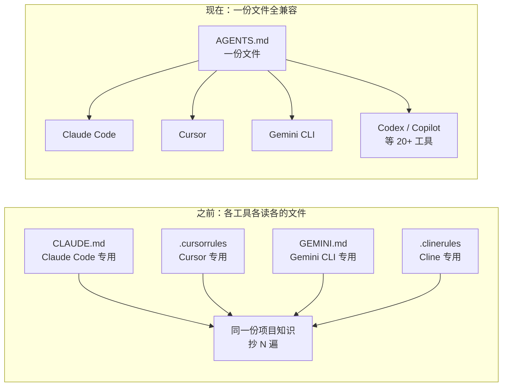
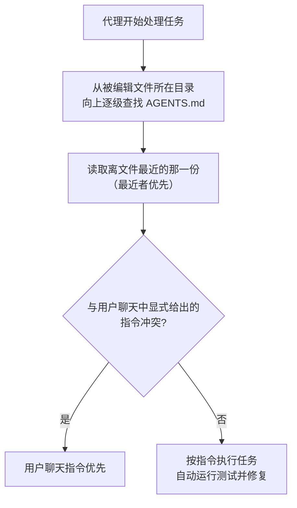

+++
title = 'AGENTS.md：给 AI 编码代理的"README"'
date = '2026-09-09T11:00:00+08:00'
slug = 'agents-md'
draft = false
tags = ['agents', 'ai', 'coding-agent', 'claude-code', 'openai', '开源']
+++

你可能已经注意到了，本仓库的根目录里躺着一个 `CLAUDE.md`——就是 Claude Code（Anthropic 的 AI 编码代理）在这个项目里工作时读的"操作手册"。它告诉代理：这是一个 Hugo 博客、文章命名有什么规矩、frontmatter 怎么写、有哪些自定义布局。

类似的文件正在软件世界里遍地开花：Cursor 读 `.cursorrules`，Gemini CLI 读 `GEMINI.md`，Cline 读 `.clinerules`……每个 AI 编码工具都发明了自己的私有格式，都要求你把项目知识"再抄一遍"。

AGENTS.md 就是为终结这种碎片化而生的：**一个简单、开放、供应商中立的格式**——一份文件，所有代理都读得懂。它由 OpenAI 于 2025 年 8 月发起，已被超过 6 万个开源项目采用，并在 2025 年底正式移交 Linux 基金会旗下的 Agentic AI Foundation（AAIF）托管。这篇文章就来完整介绍它：是什么、为什么需要、怎么写、有哪些规则。

<!-- more -->

---

## 一、AGENTS.md 是什么

官网 [agents.md](https://agents.md/) 的第一句话就是它的定位：

> Think of AGENTS.md as a **README for agents**——给代理的 README：一个专门的、可预测的位置，提供上下文和指令，帮助 AI 编码代理在你的项目上工作。

再具体一点：

- **固定名字**：`AGENTS.md`，大小写固定；
- **固定位置**：仓库根目录（或子项目的根目录）；
- **纯 Markdown**：没有任何专有语法、必填字段、schema，用你喜欢的任何标题组织即可；
- **开放格式**：不归属于任何一家公司，任何代理、任何工具都可以读。

一份典型的 AGENTS.md 长这样（来自官网示例）：

```markdown
# AGENTS.md

## Setup commands

- Install deps: `pnpm install`
- Start dev server: `pnpm dev`
- Run tests: `pnpm test`

## Code style

- TypeScript strict mode
- Single quotes, no semicolons
- Use functional patterns where possible
```

就这么朴素。它不需要 YAML frontmatter，不需要注册，不需要配置文件——你写好，代理就会读。

---

## 二、为什么需要它：README 是给人看的

项目里不是已经有 README.md 了吗？为什么还要再开一个文件？

关键区别在于**读者**：

| 维度 | README.md | AGENTS.md |
| :--- | :--- | :--- |
| 读者 | 人类：新成员、用户、贡献者 | AI 编码代理 |
| 内容 | 项目简介、快速上手、使用说明 | 构建命令、测试命令、代码约定 |
| 语气 | 讲"项目是什么、怎么用" | 讲"在这个仓库里怎么干活" |

README 的目标是"简洁、聚焦人类读者"。而代理真正需要的那些东西——`pnpm install`、测试怎么跑、PR 标题格式、哪块代码不许动——塞进 README 只会让它变得臃肿，而且对人类贡献者毫无价值。

官网明确列出了把它分开的三个理由：

1. **给代理一个清晰、可预测的指令位置**——代理不用在几十个文档里猜"我的指令在哪"；
2. **保持 README 简洁**——README 继续服务人类读者；
3. **提供精确、面向代理的指导**——作为现有 README 和文档的补充，而不是替代。

另外一个现实背景是**碎片化**。在 AGENTS.md 出现之前，同一份项目知识要被复制到每个工具的私有文件里：

| 工具 | 私有指令文件 |
| :--- | :--- |
| Claude Code | `CLAUDE.md` |
| Cursor | `.cursorrules` |
| Gemini CLI | `GEMINI.md` |
| Cline | `.clinerules` |
| Aider | 自定义配置 |

换一个工具，就要把项目知识重新抄一遍；项目规则改一处，N 个文件要跟着改。AGENTS.md 用"一个名字、一个位置"统一了这件事：



---

## 三、一份文件，通吃所有代理

这是 AGENTS.md 最核心的承诺：**你的代理指令只写一份，跨工具生效**。官网列出的兼容生态包括：

Windsurf、Kilo Code、RooCode、VS Code、Amp、Devin、Factory、Aider、Augment Code、Gemini CLI、UiPath Autopilot、GitHub Copilot、Codex（OpenAI）、Warp、opencode、Junie（JetBrains）、goose、Zed、Cursor、Semgrep、Jules（Google）、Phoenix……

（完整列表见 [agents.md](https://agents.md/)，持续更新中。）

也就是说：你在 Claude Code 里写好的指令，换到 Cursor、Codex 或 GitHub Copilot 里依然有效。对于团队里"一人用 Cursor、一人用 Claude Code、CI 里跑 Codex"的常见局面，这几乎就是解药。

---

## 四、它长什么样：样例与真实案例

官网的 Examples 栏目提供了从简单到复杂的样例，并链接到真实开源项目的 AGENTS.md：

- [openai/codex](https://github.com/openai/codex/blob/-/AGENTS.md)：AI 编码代理的通用 CLI 工具（Rust）
- [apache/airflow](https://github.com/apache/airflow/blob/-/AGENTS.md)：工作流编排平台（Python）
- [temporalio/sdk-java](https://github.com/temporalio/sdk-java/blob/-/AGENTS.md)：Temporal 的 Java SDK
- [PlutoLang/Pluto](https://github.com/PlutoLang/Pluto/blob/-/AGENTS.md)：Lua 5.4 超集（C++）

官网首页还展示了一个较完整的样例，覆盖"开发环境提示 / 测试说明 / PR 规范"三块：

```markdown
# Sample AGENTS.md file

## Dev environment tips

- Use `pnpm dlx turbo run where <project_name>` to jump to a package instead of scanning with `ls`.
- Run `pnpm install --filter <project_name>` to add the package to your workspace.

## Testing instructions

- Run `pnpm turbo run test --filter <project_name>` to run every check defined for that package.
- Fix any test or type errors until the whole suite is green.
- Add or update tests for the code you change, even if nobody asked.

## PR instructions

- Title format: [<project_name>] <Title>
- Always run `pnpm lint` and `pnpm test` before committing.
```

注意一个细节："Add or update tests for the code you change, even if nobody asked."——这种话只有写给代理才有意义，写进 README 会显得很奇怪。这正是 AGENTS.md 存在的理由。

GitHub 上可以搜到 6 万多个例子，官网提供 "View 60k+ examples on GitHub" 的入口。

---

## 五、怎么用：四步上手

官网给出了四个步骤，实际操作起来非常轻。

### 1. 在仓库根目录创建 AGENTS.md

```bash
touch AGENTS.md
```

大多数编码代理甚至可以帮你生成初稿——直接对它说"帮我写一份 AGENTS.md"即可（本仓库的 CLAUDE.md 就是这么来的）。

### 2. 覆盖"对干活有用"的内容

官网推荐的热门板块：

- **Project overview**：项目是什么、技术栈是什么；
- **Build and test commands**：构建、测试、lint 的准确命令；
- **Code style guidelines**：代码风格约定；
- **Testing instructions**：测试怎么跑、什么算通过；
- **Security considerations**：安全注意事项。

### 3. 追加只有代理需要知道的细节

提交信息或 PR 规范、安全陷阱、大文件/大数据集说明、部署步骤——**任何你会在入职第一天告诉新同事的事**，都可以写进去。

### 4. 大型 monorepo：用嵌套 AGENTS.md 分层

一个仓库塞了十几个子项目时，可以在每个子项目目录里再放一份 AGENTS.md。代理会自动读取**目录树中离被编辑文件最近的那一份**，所以：

- 每个子项目都可以有自己的专属指令；
- 父目录的通用规则依然生效；
- 越具体的位置，优先级越高。

官网举了个很有冲击力的例子：编写该文时，OpenAI 主仓库里共有 **88 个** AGENTS.md 文件。

代理选择指令文件的过程可以概括为：



---

## 六、规则要点：FAQ 精华

官网 FAQ 回答了几个关键问题，摘录如下：

**有必填字段吗？**

没有。AGENTS.md 就是标准 Markdown，用你喜欢的任何标题；代理只是解析你写的文本。

**指令冲突时听谁的？**

离被编辑文件**最近**的 AGENTS.md 优先；用户聊天中显式给出的提示**覆盖一切**。

**代理会自动跑测试吗？**

会。只要你把命令列出来，代理会尝试执行相关的程序化检查，并在完成任务前修复失败。

**以后还能改吗？**

当然。把它当作活文档（living documentation）——规则变了就改，代理下次就会读到新版本。

**怎么从现有文件迁移？**

直接把旧文件改名为 AGENTS.md，并为旧名字创建符号链接以保持向后兼容：

```bash
mv AGENT.md AGENTS.md && ln -s AGENTS.md AGENT.md
```

**怎么给特定工具配置？**

- Aider：在 `.aider.conf.yml` 里加一行 `read: AGENTS.md`；
- Gemini CLI：在 `.gemini/settings.json` 里写 `{ "context": { "fileName": "AGENTS.md" } }`。

---

## 七、谁在维护：Linux 基金会接手

AGENTS.md 不是某个公司的私有格式，它的治理是"行业级"的：

- **2025 年 8 月**：由 OpenAI Codex、Amp、Google Jules、Cursor、Factory 等联合发起，作为开放格式发布；
- **2025 年 12 月 9 日**：Linux 基金会宣布成立 **Agentic AI Foundation（AAIF）**，AGENTS.md 与 Anthropic 的 Model Context Protocol（MCP）、Block 的 goose 一起成为创始项目；AAIF 由 Anthropic、Block、OpenAI 联合创立，并获得 Google、Microsoft、AWS、Bloomberg、Cloudflare 等支持。

这意味着 AGENTS.md 有了中立的治理主体，不会因为某家公司的商业决策而变质——对一个被 6 万+ 项目依赖的格式来说，这是很重要的保障。

---

## 八、回到本仓库：CLAUDE.md 与 AGENTS.md

看到这里你应该明白了：本仓库根目录的 `CLAUDE.md`，就是 AGENTS.md 理念的 **Claude Code 专属实现**——它做的正是 AGENTS.md 该做的事：告诉代理构建命令（`hugo server -D`）、命名规范（文件名小写、`-` 分隔、显式写 `slug`）、布局约定（Page Bundle、Mermaid 代码块）。

如果你想"一份文件通吃所有代理"，迁移非常简单：

```bash
# 方案 A：直接改名（需确认你的 Claude Code 版本原生兼容 AGENTS.md）
mv CLAUDE.md AGENTS.md

# 方案 B：复制一份，两边都留着
cp CLAUDE.md AGENTS.md

# 方案 C：改名 + 符号链接向后兼容（官网推荐的迁移姿势）
mv CLAUDE.md AGENTS.md && ln -s AGENTS.md CLAUDE.md
```

不过要注意：Claude Code 对 `CLAUDE.md` 的识别目前仍是最成熟的，改名前先确认你用的工具版本对 AGENTS.md 的原生支持情况。

---

## 总结

一句话记住 AGENTS.md：

> **AGENTS.md = 一份放在仓库根目录的纯 Markdown 文件，告诉任何 AI 编码代理"这个项目怎么干活"。**

- README 是给人看的，AGENTS.md 是给代理看的，两者互补、不冲突；
- 一份文件通吃 Cursor、Claude Code、Codex、Copilot 等 20+ 工具，终结私有格式碎片化；
- 四步上手：创建 → 写构建/测试/风格 → 补充踩坑细节 → monorepo 里嵌套分层；
- 规则极简：无必填字段、最近者优先、用户聊天指令最大；
- 治理中立：已由 Linux 基金会旗下 AAIF 托管。

下次新开仓库时，别急着只写 README——花十分钟写一份 AGENTS.md，你的 AI 编码代理会干得更靠谱。

---

**参考来源：**

- [AGENTS.md 官网](https://agents.md/)
- [Linux Foundation：Agentic AI Foundation 成立公告](https://www.linuxfoundation.org/press/linux-foundation-announces-the-formation-of-the-agentic-ai-foundation?categoryid=2826700)
