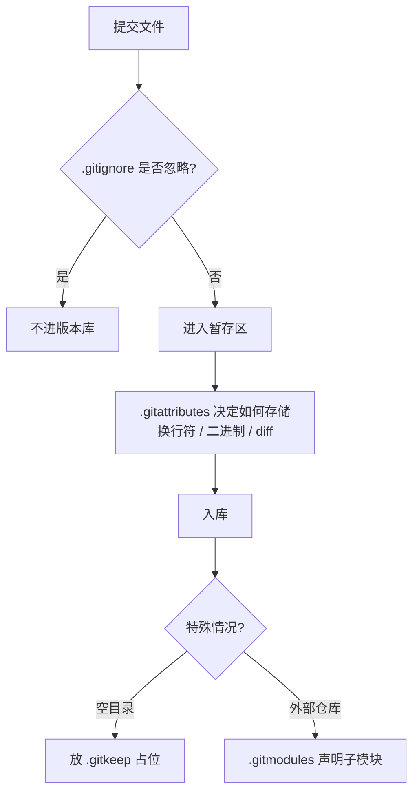

+++
title = 'Git 的四个特殊文件：.gitignore、.gitattributes、.gitkeep、.gitmodules'
date = '2026-09-09T10:00:00+08:00'
slug = 'git-dotfiles'
draft = false
tags = ['git', 'gitignore', 'gitattributes', 'gitkeep', 'gitmodules', '版本控制']
+++

随便打开一个像样的项目仓库，根目录里几乎都有几个以点开头的文件：`.gitignore`、`.gitattributes`、`.gitmodules`……它们不起眼，却各自管着一件大事。很多人用 Git 好几年，也就对 `.gitignore` 略知一二，剩下几个要么没见过，要么见过也没深究过。

这篇文章把四个文件一次性讲清楚：**谁负责什么、怎么用、有哪些坑**。就拿本博客仓库（`leafcxy.github.io`）当例子——这四个文件刚好一个不缺，全是真实配置。

<!-- more -->

---

## 总览：四个文件各管一段

| 文件 | 一句话职责 | 管的是"进 Git"的哪一环 | 本身是否入库 |
| :--- | :--- | :--- | :--- |
| `.gitignore` | 让 Git 无视某些路径 | 决定**哪些文件不被跟踪** | ✅ 入库 |
| `.gitattributes` | 按路径给文件附加属性 | 决定文件**如何被存储、diff、合并** | ✅ 入库 |
| `.gitkeep` | 占位，让空目录能被跟踪 | 决定**空目录**能否入库 | ✅ 入库（占位） |
| `.gitmodules` | 声明子模块 | 决定**外部仓库**如何被关联 | ✅ 入库 |

它们的分工可以用一张图概括：



下面逐个拆解。

---

## 一、.gitignore：把"不该进版本库的"挡在门外

### 它是干什么的

仓库里应该只有**源码 + 配置 + 文档**，而不是每个开发者本地的一堆生成物。构建输出、依赖目录、密钥、IDE 配置、日志、系统文件……这些东西进了版本库会带来三个恶果：

- clone 下来的仓库全是垃圾文件，`git status` 永远吵吵闹闹；
- diff 里混入大量无关改动，真正的代码变更被淹没；
- 密钥、token 一旦提交，就成了**永久泄露**（即使删掉，历史里还在）。

`.gitignore` 就是为这件事而生的：按路径规则告诉 Git"这些路径，忽略"。

### 语法速记

```gitignore
# 注释：以 # 开头

# 匹配任意文件或目录（* 不跨 /，? 匹配单个字符，** 跨层级）
*.log
logs/
build/output-?.txt
a/**/b          # 匹配 a/x/b、a/x/y/b 等

# 以 / 开头 = 相对 .gitignore 所在目录锚定（根 .gitignore 即仓库根）
/build/         # 只忽略根目录下的 build/

# 以 / 结尾 = 只匹配目录
logs/           # 目录 logs 及其内容

# ! 取反，重新包含
*.log
!important.log  # important.log 例外，仍然跟踪

# 转义特殊字符
\#notes.md
\!important.md
```

三个容易踩的细节：

1. **`*` 不跨 `/`**：`*.log` 只匹配当前层，不匹配 `sub/xxx.log`；要跨层级用 `**/*.log` 或直接 `*.log` + 子目录自己的规则。
2. **`!` 无法"复活"被排除目录里的文件**：如果 `dir/` 整个被排除，Git 根本不会走进这个目录，写 `!dir/file.txt` 是无效的。正确姿势是**先放行目录再放行文件**：
   ```gitignore
   dir/*
   !dir/file.txt
   ```
3. **规则不是全局唯一**：多个来源按优先级叠加，后写的不一定覆盖先写的（见下）。

### 生效优先级

从高到低：

| 优先级 | 来源 |
| :--- | :--- |
| 1 | 命令行参数（`git add -f` 强制添加、`-e` 追加规则） |
| 2 | 文件所在目录的 `.gitignore`（离文件最近的最优先） |
| 3 | 父目录逐级往上的 `.gitignore` |
| 4 | `.git/info/exclude`（只对本仓库、不入库） |
| 5 | 全局 `core.excludesFile`（常配成 `~/.gitignore_global`） |

同一个优先级内，**最后匹配的规则生效**（所以 `!` 取反要写在对应规则之后）。

### 最大的坑：它管不了"已经被跟踪"的文件

`.gitignore` 只影响**尚未被跟踪**的路径。如果你之前 `git add` 过某个文件，之后再把它写进 `.gitignore`，它依然会被提交——`gitignore` 不是"撤侨"。

```bash
# 先停止跟踪，但保留本地文件
git rm --cached config.local.json

# 再把 config.local.json 写进 .gitignore
```

### 本仓库的真实例子

```gitignore
# Hugo 构建输出
/public/
/resources/

# 依赖
/node_modules/

# 系统文件
.DS_Store
Thumbs.db

# IDE
.idea/
.vscode/
*.swp
*~

# 临时文件
*.tmp
*.log

# ref 参考文件：内容不入库，但目录要保留
/ref/*
!/ref/.gitkeep
```

注意最后两行：`/ref/*` 把参考文件全排除，再用 `!/ref/.gitkeep` 把占位文件加回来——这就是下面要讲的 `.gitkeep` 的经典用法。

**调试小工具**：想知道某条规则是谁匹配的，用 `git check-ignore -v <path>`，会打印出命中的规则和所在文件。

---

## 二、.gitattributes：决定文件"怎么存、怎么比"

如果说 `.gitignore` 管"进不进"，`.gitattributes` 管的就是"**进了之后怎么处理**"——换行符、二进制识别、diff 方式、合并策略、LFS 大文件，全是它说了算。

### 语法

```
pattern  属性1  属性2 ...
```

按路径模式匹配，给匹配到的文件附加属性；`!属性` 表示取消该属性。

### 最常见的三件事

**1. 换行符归一化（最核心的用途）**

Windows 用 `CRLF`（`\r\n`），macOS/Linux 用 `LF`（`\n`）。团队混合作战时，如果没有统一规则，会出现"我改了一行，diff 里整文件全红"的惨案。

```gitattributes
# 万能起点：自动检测文本文件，入库统一存 LF，checkout 时按平台转换
*       text=auto

# 显式指定：无论什么平台，checkout 一律 LF（最推荐，一劳永逸）
*.md    text eol=lf
*.py    text eol=lf
*.json  text eol=lf

# 某些文件强制 CRLF（比如必须给 Windows 用的 .bat）
*.bat   text eol=crlf

# 二进制：不按文本处理（等价于 -text -diff）
*.png   binary
```

几个要点：

- **`text=auto` 是推荐起点**：Git 自动判断"看起来像文本"的文件，入库时统一转成 LF，checkout 时按当前平台转换。比让每个开发者各自配 `core.autocrlf` 靠谱得多——`.gitattributes` 随仓库分发，`autocrlf` 只存在个人配置里，根本约束不了别人。
- **`eol=lf` 更严格**：checkout 也固定 LF，杜绝"有人在 Windows 上改出 CRLF"。
- **改完 `.gitattributes` 不会自动生效**：已经入库的文件索引里还是旧换行符，需要重写一遍索引：
  ```bash
  git add --renormalize .
  ```
  注意这会让索引里的文件全部"变红"一次，提交后历史里的换行符差异就统一了。已有大量提交的老仓库要谨慎，最好选个低峰期做。

**2. 二进制与 diff 驱动**

```gitattributes
# 明确告诉 Git 这些是二进制，别做文本 diff
*.pdf   binary
*.docx  binary
*.zip   binary

# 自定义 diff 驱动（比如让 Git 用外部工具 diff Word 文档）
*.docx  diff=word

# Jupyter notebook 用专门驱动，diff 出来是结构化的 cell 对比
*.ipynb diff=jupyternotebook
```

**3. 语言统计与其他属性**

```gitattributes
# 强制 GitHub 把某些文件计入特定语言（linguist）
*.cs    linguist-language=C#
docs/*  linguist-documentation=true

# 打包导出时排除
*.log   export-ignore
```

### 本仓库的真实例子（节选）

```gitattributes
# 自动检测文本文件并归一化换行符
*       text=auto

# 配置文件、文档、前端资源：统一 LF
*.toml  text eol=lf
*.yaml  text eol=lf
*.md    text eol=lf
*.css   text eol=lf
*.js    text eol=lf
*.html  text eol=lf

# 图片与字体 — 二进制
*.png   binary
*.jpg   binary
*.woff  binary
*.ttf   binary
```

**调试小工具**：`git check-attr text eol binary -- <path>` 查看某路径实际生效的属性。

---

## 三、.gitkeep：让"空目录"也能入库

### 先澄清：它不是 Git 官方的功能

Git 官方文档里**根本没有 `.gitkeep` 这个名字**。它只是社区约定俗成的一个占位文件。

为什么需要它？因为 **Git 跟踪的是文件，不是目录**。一个空目录在提交时会被静默忽略——目录在 Git 的对象模型里根本不存在（没有文件就没有目录项）。

但项目里经常需要"目录必须存在"：

- 运行时才写文件的 `logs/`、`uploads/`、`uploads/avatars/`；
- 框架约定必须存在的目录（比如很多框架的 `data/`、`cache/`）；
- 想让队友 clone 下来就有一条完整的目录骨架。

### 做法

在空目录里放一个空的 `.gitkeep` 文件，目录就被跟踪了：

```bash
mkdir -p uploads/avatars
touch uploads/avatars/.gitkeep
git add uploads/avatars/.gitkeep
```

### 几个要点

- **名字其实无所谓**：放 `.keep`、放一个空的 `.gitignore`（顺手还能配规则）都能占位。但 `.gitkeep` 是社区共识，别人一看就懂："这里本来是空的，将来要放东西"。
- **要放在目标空目录里**，不是放在父目录——放哪，哪才入库。
- 它本身也是一个普通文件：clone 之后目录还在，但依然是空的。

### 本仓库的真实例子

`ref/` 目录专门放参考文档，内容不想入库，但目录结构要保留。于是 `.gitignore` 里是这样组合的：

```gitignore
/ref/*
!/ref/.gitkeep
```

"目录内容全部忽略，但目录本身用占位文件留着"——`.gitignore` 和 `.gitkeep` 配合的标准组合拳。

---

## 四、.gitmodules：声明"仓库里的仓库"

### 它是干什么的

子模块（submodule）允许你**把一个外部 Git 仓库固定版本地嵌进自己的仓库**。最常见的使用场景：项目依赖某个第三方库的特定版本，或者像本博客一样——主题是独立的仓库，直接嵌进来方便跟随上游更新。

### 文件格式

`.gitmodules` 是一个 INI 风格的小文件，本仓库的真实内容只有这几行：

```ini
[submodule "themes/PaperMod"]
	path = themes/PaperMod
	url = https://github.com/adityatelange/hugo-PaperMod.git
```

- `[submodule "名字"]`：名字习惯上和路径一致；
- `path`：子模块在父仓库里的存放路径；
- `url`：子模块的远程地址；
- 可选字段：`branch = main`（配合 `git submodule update --remote` 跟踪远端分支）、`ignore = dirty`（忽略子模块的本地脏状态）。

### 核心命令

```bash
# 添加一个子模块
git submodule add https://github.com/xxx/repo.git libs/repo

# clone 时连同子模块一起拉取
git clone --recursive <父仓库地址>

# 已 clone 但子模块目录是空的：初始化并拉取
git submodule update --init --recursive

# 查看子模块状态
git submodule status
```

### 机制要点：父仓库只记录"指针"

子模块和普通目录最大的区别是：**父仓库里记录的并不是子模块的文件内容，而是它当前 HEAD 的一个提交指针**（gitlink）。所以：

- 父仓库的 diff 里子模块显示为"`Subproject commit 0abcd12...`"或"新提交 1 个"这样的摘要；
- 子模块目录里有自己独立的 `.git`，可以单独切换分支、单独提交；
- **clone 父仓库默认不会拉取子模块内容**——所以你会看到子模块目录是空的，必须 `--recursive` 或 `update --init`；
- 子模块升级是两步操作：先进子模块目录 `git pull`，再回到父仓库把指针变化提交掉。忘了第二步，别人 clone 后还是旧版本。

### 本仓库的真实例子

`themes/PaperMod` 就是通过子模块管理的（`hugo.toml` 里也写了"主题由 git submodule 管理"）。升级主题时的操作：

```bash
git -C themes/PaperMod pull        # 拉取主题更新
git add themes/PaperMod            # 记录新的指针
git commit -m "upgrade PaperMod theme"
```

---

## 五、常见误区清单

| 误区 | 真相 |
| :--- | :--- |
| `.gitignore` 加了路径，文件还是被提交 | 该文件**已被跟踪**，先 `git rm --cached` 解除跟踪 |
| 空目录放了 `.gitkeep` 还是没入库 | `.gitkeep` 必须**放在那个空目录里面** |
| 以为 `.gitkeep` 是 Git 官方功能 | 只是社区约定，名字可以换成 `.keep` 等 |
| 改完 `.gitattributes` 换行符，一堆文件全变红 | 索引没刷新，执行 `git add --renormalize .` |
| clone 后子模块目录是空的 | 正常！执行 `git submodule update --init --recursive` |
| `!dir/file` 想复活被排除目录里的文件 | Git 不会进入被排除的目录，先 `!dir/` 放行目录（或用 `dir/*` + `!dir/file`） |
| 以为 `.gitattributes` 只管换行符 | 还管二进制识别、diff/merge 驱动、LFS、export-ignore |
| 以为 `.gitignore` 能防止密钥泄露 | 密钥**没提交前**它管用；一旦提交过，历史里永久存在，只能轮换密钥 |

---

## 总结

一句话记住四个文件：

> **`.gitignore` 决定"什么不进版本库"；`.gitattributes` 决定"进了怎么存、怎么比"；`.gitkeep` 决定"空目录也算数"；`.gitmodules` 决定"仓库里嵌着的仓库怎么关联"。**

- 新项目起步：先写 `.gitignore`（生成物、依赖、密钥一个别漏），再加一行 `* text=auto` 到 `.gitattributes`；
- 目录骨架要完整：空目录里放 `.gitkeep`；
- 要依赖外部仓库的固定版本：`git submodule add`，并把 `--recursive` 写进团队文档。

这四个点文件加起来不到几十行，却是仓库卫生和团队协作的基石。下次新开仓库时，记得把它们配齐。
