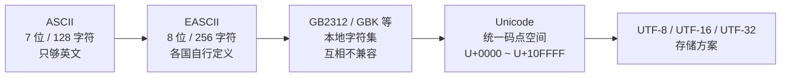
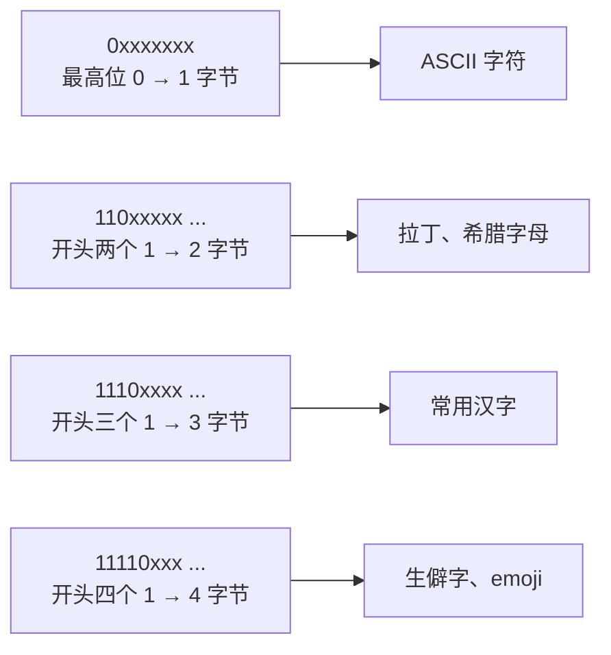

+++
title = '字符编码详解：从乱码到 Unicode 与 UTF-8'
date = '2026-09-10T08:00:00+08:00'
slug = 'character-encoding'
draft = false
tags = ['字符编码', 'unicode', 'utf-8', 'ascii', 'gbk']
+++

你有没有在终端或旧系统里见过这样的"天书"：`中文`、`汉字`，或者更魔性的 `锟斤拷`？这不是加密，也不是乱敲，而是**字符编码错位**的产物——同一段字节，用不同的编码规则去解读，就得出完全不同的文字。

字符编码是计算机最基础也最容易被忽略的知识之一。这篇文章从 ASCII 讲起，一路走到 Unicode 与 UTF-8，把"字符集"和"编码"这两个概念彻底理清楚，最后用代码验证各个编程语言里字符串的真实存储方式。内容参考了 [hello-algo 第 3.4 节《字符编码》](https://www.hello-algo.com/chapter_data_structure/character_encoding/)。

<!-- more -->

---

## 字符集 vs 编码：先分清这两个概念

两个概念必须分开：

- **字符集（Character Set）**：给每个字符发一个"身份证号"。比如"中"的编号是 `U+4E2D`。
- **字符编码（Character Encoding）**：规定这个编号在计算机里怎么存——几个字节、什么位模式。

有的字符集本身就是编码方案（如 ASCII，编号等于存储值），有的则不是：**Unicode 只发编号，不规定存储**，存储方式由 UTF-8 / UTF-16 / UTF-32 决定。乱码问题的根源，往往就是这两层被混为一谈。

---

## 字符集的演进：从 128 个字符到大一统



### ASCII：一切的起点

ASCII（American Standard Code for Information Interchange，美国标准信息交换代码）是最早的字符集，1960 年代诞生。它用 **7 位二进制**表示一个字符，共 128 个：

- `0 ~ 31`：控制字符（换行 `\n`、回车 `\r`、制表符 `\t` 等）
- `32 ~ 126`：可打印字符（英文大小写、数字、标点）
- `127`：DEL

关键点：**ASCII 只够表示英文**。128 个位置里根本没有汉字、假名、希腊字母的位置。

### EASCII：从 7 位到 8 位

计算机全球化后，各国发现 128 个字符不够用。EASCII（Extended ASCII）把编码扩展到 **8 位、256 个字符**：前 128 个与 ASCII 完全一致，后 128 个由各地自行定义——拉丁扩展字符、希腊字母、西里尔字母各占一块。

问题随之而来：**同一个字节（如 `0xE4`），在法国是 é，在俄罗斯是 д，在希腊是 δ**。EASCII 不是一套标准，而是一堆互不兼容的标准。

### GB2312 与 GBK：中文的本地方案

汉字有几万个，EASCII 的 128 个空位杯水车薪。中国的方案是**用两个字节表示一个汉字**：

- **GB2312**（1980 年发布）：收录 6763 个常用汉字，基本覆盖日常使用；
- **GBK**：在 GB2312 基础上扩展，收录 21886 个汉字，能处理罕见字和繁体字。

GBK 的编码规则：ASCII 字符用 1 字节（向下兼容 ASCII），汉字用 2 字节。

此时的局面是"百花齐放"：中文有 GBK，日文有 Shift-JIS，韩文有 EUC-KR……同一个文本文件，换台电脑打开就是乱码。**乱码的根源不是某个编码错了，而是缺少统一标准。**

---

## Unicode：给全世界的字符发唯一编号

1991 年，Unicode（统一码）发布，目标是把全世界所有语言和符号纳入同一个字符集。它**只做一件事：给每个字符分配唯一的码点（Code Point）**，编号范围 `U+0000 ~ U+10FFFF`，理论容量 100 多万。截至 2022 年 9 月已收录 149186 个字符，包括各种语言的文字、符号，甚至 emoji。

常见码点举例：

| 字符 | 码点 | 说明 |
| :--- | :--- | :--- |
| A | `U+0041` | 与 ASCII 编码一致 |
| 中 | `U+4E2D` | 常用汉字 |
| 😀 | `U+1F600` | emoji，超出基本多语言平面 |

**Unicode 只解决了"编号"问题，没有解决"存储"问题。** 码点可能落在 `U+0000`，也可能落在 `U+10FFFF`——如果全部按 4 字节定长存储，英文文本体积会膨胀到 ASCII 的 4 倍；如果按不等长存储，系统又怎么知道"两个字节是一个字符，还是两个字符"？

这就是编码方案（UTF-8、UTF-16、UTF-32）要回答的问题。

---

## UTF-8：最流行的变长编码

UTF-8 目前是国际上使用最广泛的 Unicode 编码，特点是**变长**：用 1 ~ 4 字节表示一个字符，按码点所在区间决定。

### 编码规则

| Unicode 码点范围 | 字节数 | 字节位模式 |
| :--- | :--- | :--- |
| U+0000 ~ U+007F | 1 | `0xxxxxxx` |
| U+0080 ~ U+07FF | 2 | `110xxxxx 10xxxxxx` |
| U+0800 ~ U+FFFF | 3 | `1110xxxx 10xxxxxx 10xxxxxx` |
| U+10000 ~ U+10FFFF | 4 | `11110xxx 10xxxxxx 10xxxxxx 10xxxxxx` |

规则只有两条：

1. **首字节**：开头连续 `1` 的个数 = 字符总字节数，第一个 `0` 之后承载码点的高位数据；
2. **后续字节**：一律以 `10` 开头，每字节只承载 6 位数据。

### 实例：'中' 怎么编

'中' 的码点是 `U+4E2D` = 二进制 `0100 1110 0010 1101`（16 位）。它落在 3 字节区间，把 16 位码点拆进 4 + 6 + 6 位：

| 层次 | 内容 |
| :--- | :--- |
| 码点 | U+4E2D = `0100 1110 0010 1101` |
| 拆位 | `0100` / `111000` / `101101` |
| UTF-8 位模式 | `1110 0100` / `10 111000` / `10 101101` |
| 十六进制 | `E4` / `B8` / `AD` |

结果：`中` 的 UTF-8 编码是 `E4 B8 AD`。与 Python 实测一致：

```python
>>> "中".encode('utf-8')
b'\xe4\xb8\xad'
```

系统读字节流时，就是按首字节开头的 `1` 的个数来对齐字符边界的：



### 三个巧妙设计

**1. 向下兼容 ASCII。** ASCII 字符（U+0000 ~ U+007F）在 UTF-8 里就是 1 字节、最高位为 0，字节值与 ASCII 完全一致。任何 UTF-8 文本都能被 ASCII 时代的工具正确读取（反之不行），这是 UTF-8 兼容性最好的根本原因。

**2. 自同步。** 读首字节就能确定字符长度，从文件中间任意位置开始读，也能立刻对齐到正确的字符边界，不需要回溯。

**3. `10` 前缀是校验符。** 为什么后续字节必须以 `10` 开头？因为 UTF-8 规则下没有任何字符的首字节会以 `10` 开头——ASCII 首字节最高位是 0，多字节字符首字节开头是 `11...`。如果解析到 `10` 开头的字节，说明文本损坏或读错了起点，可以快速发现。

---

## UTF-16 与 UTF-32：另外两种方案

- **UTF-16**：用 2 或 4 字节。基本多语言平面（BMP，U+0000 ~ U+FFFF）内的字符直接用 2 字节存码点；超出 BMP 的字符（如 emoji）用**代理对（Surrogate Pair）**表示——两个 2 字节单元拼成一个字符。😀（U+1F600）在 UTF-16 里就是 `D83D DE00`。
- **UTF-32**：每个字符固定 4 字节。简单直接、支持 O(1) 随机访问，但空间浪费严重——一段英文的体积是 UTF-8 的 4 倍。

### BOM（字节序标记）

UTF-16 / UTF-32 存在"大小端"问题：`0x4E2D` 是先存 `4E` 还是先存 `2D`？文件开头常带一个 BOM（Byte Order Mark）来声明：

| 编码 | BOM 字节 | 含义 |
| :--- | :--- | :--- |
| UTF-8 | `EF BB BF` | 无大小端概念（可选，Windows 记事本默认加） |
| UTF-16 LE | `FF FE` | 小端 |
| UTF-16 BE | `FE FF` | 大端 |

UTF-8 理论上不需要 BOM，但 `EF BB BF` 用 GBK 或 Latin-1 解读会变成 ``——这正是经常出现在文件头部的乱码。

### 三种编码怎么选

| 场景 | 推荐 | 原因 |
| :--- | :--- | :--- |
| 文件存储 / 网络传输 | UTF-8 | 通用性最佳，英文仅 1 字节 |
| 中文为主的文本 | UTF-8（3 字节）或 UTF-16（2 字节） | UTF-16 省一点空间，但兼容性差 |
| 需要频繁随机访问 | UTF-32 / UTF-16 | 定长，O(1) 定位第 i 个字符 |

---

## 编程语言里的字符串：一段历史包袱

等长编码有个巨大优势：字符串可以当数组处理，随机访问、计数都是 O(1)。因此早期主流语言普遍选了 UTF-16：

| 语言 | 内部编码 | 特点 |
| :--- | :--- | :--- |
| Java | UTF-16 | `length()` 数的是 16 位单元，emoji 算 2 |
| JavaScript / TypeScript | UTF-16 | 同上，`"😀".length === 2` |
| C# | UTF-16 | .NET 与 Windows 生态 |
| Python | 灵活（PEP 393） | 全 ASCII 1 字节/字符，BMP 内 2 字节，否则 4 字节 |
| Go | UTF-8 | `string` 是字节序列，`rune` 表示码点 |
| Rust | UTF-8 | `String` 是 UTF-8 字节，`char` 表示码点 |

当年的设计者以为 16 位足够装下所有字符，后来 Unicode 扩充超过 16 位，Java / JS / C# 只能靠代理对补救——一个字符可能占 2 字节也可能占 4 字节，等长编码的优势荡然无存，还要为处理代理对写额外代码。这是典型的"早期低估"留下的技术债。

用代码验证一下各语言的差异：

```java
// Java：length() 按 UTF-16 代码单元计数
"中".length();   // 1
"😀".length();   // 2 —— emoji 是代理对
```

```python
# Python：len() 数的是"字符"（码点），encode 后才是字节数
len("中")                 # 1
len("中".encode('utf-8')) # 3
len("😀")                 # 1（Python 3 正确处理代理对）
```

```go
// Go：string 是字节序列，len() 是字节数
len("中")                     // 3
utf8.RuneCountInString("中")  // 1
```

```rust
// Rust：String 是 UTF-8 字节，chars() 遍历码点
"中".len();           // 3
"中".chars().count(); // 1
```

注意区分两个问题：**编程语言内部的存储**和**文件 / 网络传输的编码**是两回事。Java 内部用 UTF-16，但写文件、发 HTTP 时几乎总是转成 UTF-8 字节——为了兼容性和空间效率。

---

## 实战：常见乱码是怎么来的

### 案例 1：文件头的 ``

Windows 记事本默认用带 BOM 的 UTF-8 保存，文件开头是 `EF BB BF`。用 GBK 或 Latin-1 打开，这 3 个字节被解读成 3 个字符 ``。解决：改用 UTF-8 打开；或在保存时选择"无 BOM 的 UTF-8"。

### 案例 2：`锟斤拷`

GBK 编码的文本被当作 UTF-8 解读，大部分汉字组合不是合法的 UTF-8 序列，被替换成 U+FFFD（显示为 �），而 U+FFFD 的 UTF-8 编码是 `EF BF BD`。这段字节再被 GBK 解读：`EFBF` → 锟，`BDEF` → 斤，`BFBD` → 拷——于是满屏"锟斤拷"。

这是乱码的"二阶效应"：乱码 → 替换符 → 替换符的编码再次被错误解读 → 变成看似"有含义"的乱码。

### 排查乱码的三个问题

1. **文件本来是什么编码？**（源编码）
2. **现在用什么编码在读？**（目标编码）
3. **中间有没有发生过编码转换？**（最坑的一环，比如编辑器"自动识别"、终端默认代码页）

乱码的本质永远是这三者的组合。

---

## 总结

一句话记住字符编码：

> **字符集发身份证号（码点），编码方案决定怎么存（字节序列）。**

- 英文为主的文本 → UTF-8，1 字节/字符，最省；
- 中文 / emoji 混排 → UTF-8，兼容性第一，3 字节/常用汉字可接受；
- 遇到乱码 → 先问"源编码 / 目标编码 / 是否转过码"；
- 新项目一律 UTF-8（无 BOM），从源头消灭 90% 的乱码问题。

参考资料：[hello-algo《3.4 字符编码》](https://www.hello-algo.com/chapter_data_structure/character_encoding/)
