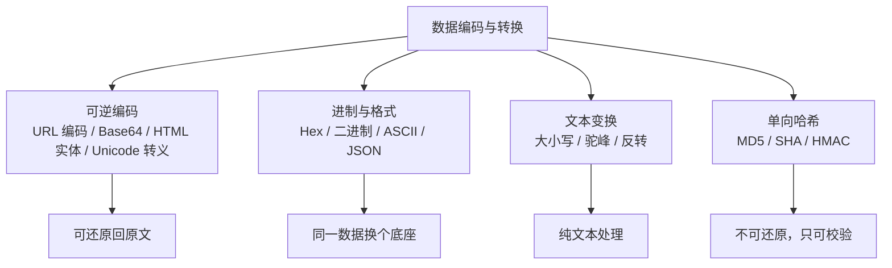
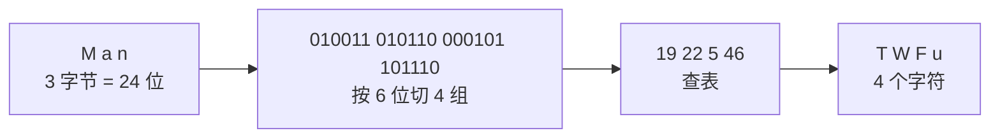

+++
title = '编码与转换手段大全：URL、Base64、Hex、哈希一网打尽'
date = '2026-09-10T10:00:00+08:00'
slug = 'encoding-and-conversion'
draft = false
tags = ['编码', 'base64', 'url编码', 'hex', '哈希', 'md5', 'sha256']
+++

浏览器地址栏里的 `%E4%B8%AD`、JWT 里那段 `eyJhbGciOiJIUzI1NiJ9...`、邮件里偶尔见到的 `=E4=B8=AD`、网页源码里的 `&amp;`……这些看似乱码的字符串，其实都出自同一类东西：**数据编码与转换**。

上一篇[《字符编码详解》]()讲的是"字符怎么存"（字符集与 UTF-8），这篇讲的是另一层——**数据怎么传、怎么展示**：URL 里不能裸奔的字符、二进制怎么变成可见文本、数据完整性怎么校验。两者名字都带"编码"，但解决的问题完全不同，别混在一起。

<!-- more -->

---

## 先分清四个概念

动手之前，先把四个经常被搞混的词划清界限：

| 概念 | 可逆吗 | 有密钥吗 | 干什么用 |
| :--- | :---: | :---: | :--- |
| **编码（Encoding）** | 可逆 | 无 | 数据换一种表示形式（URL 编码、Base64） |
| **转义（Escaping）** | 可逆 | 无 | 让特殊字符在特定上下文里"变普通"（HTML 实体） |
| **加密（Encryption）** | 可逆 | 有 | 保密，没密钥解不开（AES、RSA） |
| **哈希（Hashing）** | 不可逆 | 无 | 校验完整性、存密码指纹（MD5、SHA-256） |

关键结论先说：**Base64 是编码，不是加密**——任何人都能轻松解出原文，它只是让二进制"变成文本"。哈希则是单向的，理论上无法还原。下面按"可逆编码 → 进制与格式 → 文本变换 → 单向哈希"四类逐个过。



---

## 可逆编码：换个形式，还能还原

### URL 编码（Percent-Encoding）

URL 里只有一小部分字符是"安全"的：`A-Z a-z 0-9 - _ . ~`，外加少数保留字符（`/ ? & = #` 等）有特殊语义。其他字符——空格、中文、`%` 本身——直接放进 URL 会出错或被误解，所以要编码。

规则很简单：**先把字符按 UTF-8 转成字节，每个字节写成 `%` + 两位十六进制**。

| 原文 | URL 编码 | 说明 |
| :--- | :--- | :--- |
| 空格 | `%20` | 表单里也可以写成 `+`（见下） |
| 中 | `%E4%B8%AD` | 汉字 → 3 个字节，逐个 `%XX` |
| `%` | `%25` | 百分号自己也要转义 |
| `/` | `%2F` | 在路径里是分隔符，作为数据时需转义 |

**`encodeURI` vs `encodeURIComponent`**（JS）是最常踩的坑：前者用于编码整个 URL，保留 `:/?#&=@` 等结构字符；后者用于编码"URL 里的某一段数据"，连 `/ ? &` 全部转义。拼接 query 时用错了，参数值里的 `&` 会把 query 切碎。

```javascript
encodeURI("https://a.com/中?q=1&x=2");   // 结构字符保留
// "https://a.com/%E4%B8%AD?q=1&x=2"
encodeURIComponent("a/b&c");              // 全部转义
// "a%2Fb%26c"
```

另外一个细节：HTML 表单（`application/x-www-form-urlencoded`）把空格编码成 `+` 而不是 `%20`，解析时别搞混。Python 里对应 `urllib.parse.quote`（空格→`%20`）和 `quote_plus`（空格→`+`）。

### Base64：二进制穿上文本的外衣

Base64 的目标：**任何字节序列都能用 64 个可打印字符表示**，这样二进制数据就能安全地塞进文本协议（邮件、JSON、URL）。

原理三步：

1. 每 **3 个字节 = 24 位**，按 **6 位一组**切成 4 组；
2. 每组 6 位 = 0~63，去查 64 字符表；
3. 字节数不是 3 的倍数时，末尾补 `=`（1 个 `=` 表示缺 1 字节，2 个表示缺 2 字节）。

$$3 \times 8 \text{ bit} = 4 \times 6 \text{ bit}$$



经典例子：`"Man"` → `TWFu`，`"中"`（UTF-8 字节 `E4 B8 AD`）→ `5Lit`。

| 原文 | Base64 | 长度 |
| :--- | :--- | :--- |
| `M`（1 字节） | `TQ==` | 4（补 2 个 `=`） |
| `Ma`（2 字节） | `TWE=` | 4（补 1 个 `=`） |
| `Man`（3 字节） | `TWFu` | 4（无填充） |

常见变体：

- **URL-safe Base64**：标准字符表里的 `+` `/` 在 URL 中有特殊含义，变体用 `-` `_` 替代，并常去掉 `=` 填充；
- **MIME Base64**：每 76 个字符插入换行，用于邮件附件。

用途随处可见：JWT 的三段 payload、图片的 `data:image/png;base64,...`、邮件附件、二进制日志的文本化。注意：**Base64 只是编码，体积膨胀约 4/3，不提供任何保密性**。

### HTML 实体编码（转义）

HTML 里 `<` `>` `&` `"` `'` 有特殊含义。把用户输入直接塞进网页，等于给了注入攻击入口（XSS）。HTML 实体把特殊字符替换成"实体名"或"数字引用"：

| 字符 | 实体名 | 十进制 | 十六进制 |
| :--- | :--- | :--- | :--- |
| `&` | `&amp;` | `&#38;` | `&#x26;` |
| `<` | `&lt;` | `&#60;` | `&#x3C;` |
| `>` | `&gt;` | `&#62;` | `&#x3E;` |
| `"` | `&quot;` | `&#34;` | `&#x22;` |
| `'` | `&apos;` | `&#39;` | `&#x27;` |
| 中 | 无实体名 | `&#20013;` | `&#x4E2D;` |

十进制 `&#20013;` 和十六进制 `&#x4E2D;` 都能表示"中"——网页源码里看到这种形式，其实是字符的数字引用。所有主流框架（React、Vue、模板引擎）默认都会对插值做 HTML 转义，这正是防 XSS 的第一道防线。

### Unicode 转义（`\uXXXX`）

在源码或 JSON 字符串里用 `\u` 开头写码点，常见于各语言字符串字面量：

| 字符 | 码点 | 转义写法 |
| :--- | :--- | :--- |
| 中 | U+4E2D | `\u4e2d` |
| 😀 | U+1F600 | `\U0001f600`（Python/Rust）、`\u{1F600}`（JS 新语法） |

注意 JS/Java 传统上只认 4 位十六进制的 `\uXXXX`，超出 BMP 的 emoji 需要两个 `\u` 代理对或新语法；Python、Go、Rust 则直接写 8 位。

### Quoted-Printable：邮件的温柔编码

MIME 邮件里，非 ASCII 字节写成 `=` + 两位十六进制，行尾加软换行（`=` 结尾）表示续行。`"中"` 的 UTF-8 字节是 `E4 B8 AD`，编码后就是 `=E4=B8=AD`。它的特点是：**ASCII 字符原样保留**，只有非 ASCII 才编码，所以英文为主的邮件体积几乎不膨胀——和 Base64"全部编码"正好相反。

### 其他：Base32、Base16、UUencode、ASCII85

- **Base32**：32 个字符（`A-Z 2-7`），字符集更安全（无 `0/O/1/I` 混淆），用于 TOTP 两步验证的密钥展示（如 `MFRGG===`）；体积膨胀约 8/5，比 Base64 大。
- **Base16**：就是 Hex（见下节），每个字节 2 个十六进制字符。
- **UUencode**：1970 年代的 Unix 编码，把二进制变文本以便通过邮件传输，现已基本淘汰。
- **ASCII85（Base85）**：PDF 文件内部使用，压缩率比 Base64 略好（4 字节 → 5 字符）。

---

## 进制与格式转换：同一数据换个底座

### 进制互转

数字可以用不同的"进制"书写，本质都是同一个值：

| 进制 | 前缀 | 十进制 20013 的写法 | 用途举例 |
| :--- | :--- | :--- | :--- |
| 二进制 | `0b` | `0b100111000101101` | 位运算、掩码 |
| 八进制 | `0o` | `0o47055` | 文件权限（`chmod 755`） |
| 十进制 | 无 | `20013` | 日常 |
| 十六进制 | `0x` | `0x4E2D` | 内存地址、颜色值、字节流 |

十六进制（Hex）是字节流最常用的文本形式：一个字节正好两个十六进制字符，比如 UTF-8 的"中"写作 `E4 B8 AD`。二进制日志、固件 dump、`xxd` 输出都是它。

### ASCII ↔ 字符

`'A' = 65`，`'a' = 97`，`'0' = 48`——这套映射是 ASCII 表的基础，很多经典算法（大小写转换、数字字符判断）就是靠这几条偏移量做的。

### JSON 转义与格式化

JSON 字符串里 `"` 必须写成 `\"`，`\` 写成 `\\`，控制字符写成 `\n` `\t` 等。严格说这是转义而非编码，但它和本话题常一起出现。另外 JSON 本身只支持 UTF-8/16/32 文本，二进制字段要么转 Base64 要么放弃。

### URL 参数序列化

`{a: "1 2", b: "x&y"}` → `a=1+2&b=x%26y`，这是"对象 ↔ query string"的双向转换，几乎每种语言都有现成函数（`URLSearchParams`、`urllib.parse.urlencode`）。

---

## 文本变换：纯文本处理

这部分不算严格意义的"编码"，但开发工具里常和上面排在一起：

- **大小写转换**、**字符串反转**、**去空白**；
- **驼峰 ↔ 下划线 / 短横线**：`userName` ↔ `user_name` ↔ `user-name`，跨语言命名规范转换；
- **汉字转拼音**：给中文文件名、URL slug 生成拼音。

---

## 单向哈希：只能校验，不能还原

哈希函数把任意长度的输入映射成**固定长度**的摘要，且设计上**不可逆**——给摘要反推原文在计算上不可行。用途是"指纹"而非"表示"。

| 算法 | 摘要长度 | 安全性 | 用途 |
| :--- | :--- | :--- | :--- |
| MD5 | 128 位（32 个 hex） | ❌ 已破解（碰撞） | 仅校验文件完整性等非安全场景 |
| SHA-1 | 160 位（40 个 hex） | ❌ 已破解（SHAttered 碰撞） | 弃用，Git 对象仍内部使用 |
| SHA-256 | 256 位（64 个 hex） | ✅ 目前安全 | TLS、数字签名、Git、密码存储 |
| HMAC-SHA256 | 256 位 | ✅ 带密钥 | JWT 签名、API 签名 |

```bash
$ echo -n hello | sha256sum
2cf24dba5fb0a30e26e83b2ac5b9e29e1b161e5c1fa7425e73043362938b9824
```

和编码的关键区别：**编码可逆、哈希不可逆**。另外两个常见陷阱：

1. **哈希不是加密**——没有密钥一说；
2. **存密码不能只做一次哈希**——同样的密码哈希相同，攻击者可用**彩虹表**（预计算的"常见密码 → 哈希"表）反查。正确做法是加随机**盐（salt）**后用慢哈希（bcrypt、scrypt、argon2），或至少 HMAC。

---

## 工具速查

### 命令行

```bash
# Base64
echo -n "hello" | base64            # 编码 → aGVsbG8=
echo "aGVsbG8=" | base64 -d         # 解码
# Hex
echo -n "中" | xxd -p               # e4b8ad
# 哈希
echo -n hello | md5sum
echo -n hello | sha256sum
echo -n hello | openssl dgst -sha256 -hmac "key"   # HMAC
```

### Python

```python
import base64, hashlib, hmac, html, urllib.parse

base64.b64encode(b"hello").decode()          # 'aGVsbG8='
urllib.parse.quote("中")                     # '%E4%B8%AD'
html.escape('<a href="x">')                  # '&lt;a href=&quot;x&quot;&gt;'
hashlib.sha256(b"hello").hexdigest()         # 2cf24dba...
hmac.new(b"key", b"hello", hashlib.sha256).hexdigest()
```

### JavaScript

```javascript
btoa("hello");                 // "aGVsbG8="（仅支持 Latin-1，中文要先转字节）
encodeURIComponent("a/b&c");   // "a%2Fb%26c"
atob("aGVsbG8=");              // "hello"
```

注意 `btoa/atob` 只处理 Latin-1 字符，中文会直接报错——正确姿势是先 `TextEncoder` 转 UTF-8 字节，或走 `encodeURIComponent` 的经典 hack。

---

## 总结

| 类别 | 代表 | 可逆 | 一句话 |
| :--- | :--- | :---: | :--- |
| 可逆编码 | URL 编码、Base64、HTML 实体、Unicode 转义、QP | ✅ | 让数据在特定上下文里"安全地表示" |
| 进制/格式 | Hex、二进制、ASCII、JSON 转义 | ✅ | 同一数据换个书写底座 |
| 文本变换 | 大小写、驼峰/下划线、拼音 | ✅ | 纯文本处理 |
| 单向哈希 | MD5、SHA-256、HMAC | ❌ | 只做指纹校验，不能还原 |

一句话记忆：

> **编码是把数据"换个写法"（可还原），哈希是给数据"盖个章"（不可还原），加密是给数据"上把锁"（有钥匙才能开）。**

选型建议：URL 参数用 `encodeURIComponent` 级别；二进制进文本用 Base64；网页插值交给框架的 HTML 转义；完整性校验用 SHA-256；存密码用 bcrypt/scrypt/argon2（带盐），别用裸 MD5。

参考：[hello-algo《字符编码》](https://www.hello-algo.com/chapter_data_structure/character_encoding/)、[MDN：Base64](https://developer.mozilla.org/zh-CN/docs/Glossary/Base64)、[MDN：encodeURIComponent](https://developer.mozilla.org/zh-CN/docs/Web/JavaScript/Reference/Global_Objects/encodeURIComponent)
