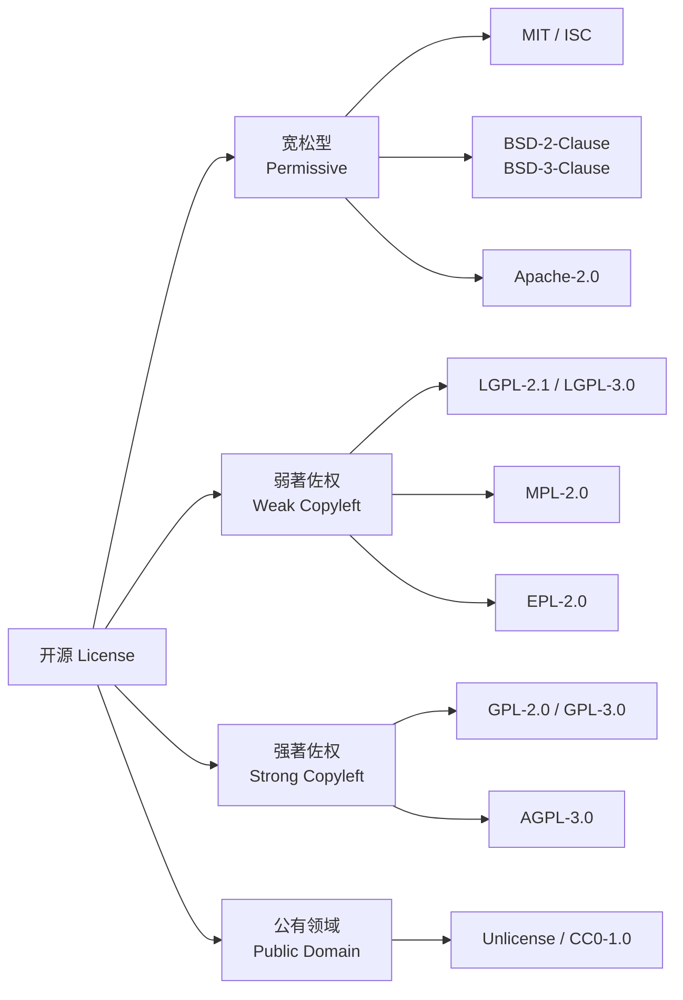
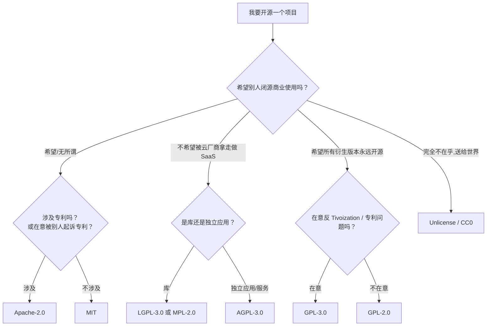

+++
title = 'GitHub 上的 License：从右上角那行小字说起'
date = '2026-09-10T14:00:00+08:00'
slug = 'github-license'
draft = false
tags = ['github', 'license', '开源', 'mit', 'gpl', 'apache', 'legal']
+++

打开任何一个 GitHub 仓库，大约在右侧栏「About」下方，都会看到一行小字：`License: MIT`、`License: Apache-2.0`、`License: GPL-3.0`……有的仓库干脆什么都不显示。这行小字看起来不起眼，却决定了别人能不能用你的代码、能不能改、能不能闭源卖钱，甚至决定了你自己将来能不能反过来告抄袭。

这篇文章把它彻底讲清楚：GitHub 是怎么识别 License 的、常见 License 有哪几类、各条款差在哪、新项目该怎么挑、没有 License 又意味着什么。

<!-- more -->

---

## 一、先澄清一个常见误解：放上来 ≠ 开源

很多人以为："我把代码 push 到 GitHub 了，不就是开源了吗？"

**不是。**

按照世界上绝大多数国家（包括中国、美国）的著作权法，源代码一旦写出来，作者就自动拥有完整著作权。这意味着——在你没有明确授予他人使用权之前，默认状态是**"保留所有权利"（All Rights Reserved）**。换句话说：

- 别人不能合法地复制你的代码；
- 不能合法地修改、分发；
- 哪怕是朋友"参考一下"，严格说也侵权；
- 你仓库虽然公开可见，但**看 ≠ 有权使用**。

这听起来有点反直觉——我都公开了还不让人用？但法律就是这么规定的。**License（许可证）才是作者主动出具的、把使用权授予公众的那份法律文件**。没有 License 文件的开源仓库，等于"橱窗里摆着商品但不标价、不出售"，路人只能看不能拿。

GitHub 官方帮助文档里说得很直白：

> You're under no obligation to choose a license. However, without a license, the default copyright laws apply, meaning that you retain all rights to your source code and no one may reproduce, distribute, or create derivative works from your work.

所以，**公开 ≠ 开源，有 License 才叫开源**。这也是为什么 CLAUDE.md、AGENTS.md 这类项目都会在仓库根目录老老实实放一份 LICENSE 文件。

---

## 二、GitHub 是怎么识别 License 的

注意一个细节：GitHub 不会去解析你写的 README，也不会问你"请选一个 License"。它靠的是**自动识别**——仓库根目录里如果存在名为 `LICENSE`、`LICENCE`、`LICENSE.md`、`LICENCE.md` 之类的文件，GitHub 就会把它的内容抓去跟一个内置的 License 库比对，匹配上之后，才在右上角打上那行标签。

这个识别引擎叫 [licensee](https://github.com/licensee/licensee)（Ruby 写的），背后维护着一个 [oss-review-toolkit/ort 风格](https://github.com/oss-review-toolkit/ort) 的 SPDX License List 子集。它的工作流程大致是：

1. 在仓库根目录找 `LICENSE*`、`COPYING*` 之类的文件；
2. 把文本规范化（去掉空白、换行、版权年份、作者名这些"噪音"）；
3. 和已知 License 的模板做相似度比对；
4. 相似度超过阈值（通常 95% 以上），就认定是那种 License；
5. 匹配失败则显示 `LICENSE` 而不显示具体名字，或者干脆不显示。

这带来几个实操上的坑：

- **文件名必须叫 `LICENSE`（或同义词）**，放在根目录。你放 `license.txt` 在 `docs/` 下面，GitHub 认不出来；
- **不能大改 License 原文**。你把 MIT License 里的"The above copyright notice"改成"This awesome notice"，相似度一掉，右上角就变成 `LICENSE`；
- **多 License 混合**（比如一个仓库里同时有 MIT 和 GPL 的文件），GitHub 通常只显示它识别到的那一个，不能完全反映真实情况；
- **SPDX ID 必须准确**。写 `MIT license`、`MIT License` 它都能认，但写 `MIT-like`、`BSD-style` 就认不出。

> 顺带一提，GitHub 自家还提供了一个网站 [choosealicense.com](https://choosealicense.com/)，用大白话解释了主流 License 的条款，并附带一键复制原文的功能。选 License 之前先逛一圈，比在 Stack Overflow 上问"我该用 MIT 还是 Apache"靠谱得多。

---

## 三、主流 License 的四大阵营

开源 License 上百种，但日常在 GitHub 上能见到的，按对"后续使用者"的约束强度，基本就四类：



下面逐个拆开看。

### 3.1 宽松型（Permissive License）：几乎"拿去用"

这一类是 GitHub 上最常见的，核心特征：**允许任何形式的使用、修改、再分发（包括闭源商业使用），唯一的硬要求是"保留原版权声明和 License 文本"**。

| License | 一句话特点 |
| :--- | :--- |
| **MIT** | 最短、最宽容、最流行。只要求保留版权声明，无任何附加条款。 |
| **ISC** | ISC（互联网软件协会）写的，和 MIT 几乎等价，措辞更现代。OpenBSD 系偏爱。 |
| **BSD-2-Clause** | "简化 BSD"，和 MIT 基本等价，只要求保留声明 + 免责。 |
| **BSD-3-Clause** | 在 BSD-2 基础上加了一条"不得用原作者名字给衍生产品背书"。 |
| **Apache-2.0** | 和 MIT/BSD 一样宽松，但额外多了两件事：① 明确的专利授权条款；② 修改过的文件要标注。 |

**Apache-2.0 为什么单独拎出来？** 它比 MIT 多了一个关键保护——**专利反诉条款**（patent retaliation）：如果你把 Apache 代码用到自己产品里，又反过来起诉作者侵犯专利，作者授权给你的专利许可自动终止。这是 MIT、BSD 都没有的。所以当你的项目可能涉及专利（比如做芯片、加密、通信协议），Apache-2.0 比 MIT 更稳妥。Google 系项目（Android、Kubernetes、TensorFlow）几乎清一色用 Apache-2.0，就是这个原因。

宽松型 License 适合什么场景？
- 库、框架、工具——希望被尽可能多的人用，不在乎别人闭源拿走；
- 个人项目、玩具项目、希望降低他人使用门槛；
- 企业开源的基础设施（如 React 用 MIT，Spring 用 Apache-2.0）。

### 3.2 弱著佐权（Weak Copyleft）：改我的文件要开源，调用没事

"著佐权"（Copyleft）是个造出来的词，意思是"版权的反向操作"——版权是保留权利，Copyleft 是**保留"后续使用者必须继续开放"的权利**。弱著佐权的"弱"在于：它只要求**修改了它本身的那些文件**继续开源，**跟它链接、组合、调用的代码不用开源**。

| License | 适用对象 | 关键要求 |
| :--- | :--- | :--- |
| **LGPL-2.1 / LGPL-3.0** | 动态链接库 | 你可以在闭源商业软件里动态链接它，但如果你**改了 LGPL 库本身**，那部分改动必须以 LGPL 公开。 |
| **MPL-2.0** | 单文件级别 | 修改过的 MPL 文件必须继续以 MPL 公开，但跟其他文件组合成的更大作品可以用别的 License（甚至闭源）。Mozilla 系（Firefox 早期）用它。 |
| **EPL-2.0** | IBM 系（Eclipse） | 类似 MPL，文件级著佐权，加专利授权。 |

LGPL 的典型用户是 **GNU C 库（glibc）**——你写闭源程序 `#include <stdio.h>` 链接 glibc 完全合法；但如果你 patch 了 glibc 本身再分发，就得公开你的 patch。

### 3.3 强著佐权（Strong Copyleft）：用了就得全部开源

强著佐权是最"霸道"的一类。核心规则：**只要你的作品里包含了 GPL 代码，整个作品在分发时（给别人、卖给别人、部署到服务器给别人用）都必须以 GPL 开源，并公开全部源代码**。

| License | 适用场景 | 关键差别 |
| :--- | :--- | :--- |
| **GPL-2.0** | 老牌强 Copyleft | 1991 年版本，没有"远程网络使用"触发条款。Linux 内核用的就是 GPL-2.0。 |
| **GPL-3.0** | 现代强 Copyleft | 加了反 Tivoization条款（禁止用 DRM 锁住软件，不让用户改）、明确专利授权。 |
| **AGPL-3.0** | 网络服务 | **GPL 的网络版**：即使你不分发二进制，只是把它跑成一个 Web/SaaS 服务给用户用，也得公开全部源代码。MongoDB 曾经用它，后来改道 SSPL。 |

强 Copyleft 适合什么？
- 你希望"这个项目及其所有衍生版本永远保持自由"——GNU 全家桶（gcc、bash、emacs）的理念；
- 你想防止云厂商拿走你的代码、包装成闭源 SaaS 卖钱（这正是 AGPL 的设计目的）；
- 个人/学术项目，不在意被企业采用，在意"自由"本身。

不适合什么？
- 你希望自己的库被商业产品广泛集成；
- 你所在公司有合规部门，法务一看到 GPL 就头痛；
- 你在做一个 SDK，希望 Android/iOS 开发者闭源 App 里放心用。

> **GPL 的"传染性"边界一直是争议重灾区**。动态链接算不算"组成一个整体作品"？FSF（自由软件基金会）认为算，很多公司法务认为不算。这个问题在法庭上至今没有全球统一答案。如果你做商业产品，**GPL 代码进不进你的 binary，最好让法务看一眼**，不要自己拍脑袋。

### 3.4 公有领域（Public Domain）：连署名都不用

这一类连"保留版权声明"的要求都没有：

- **Unlicense**：把代码贡献给公有领域，任何人可以为所欲为，包括版权层面的"放弃权利"声明；
- **CC0-1.0**：知识共享组织的公有领域贡献工具，原意是给图片/文字用的，但代码圈也常拿来用；
- **WTFPL**（Do What The Fuck You Want To Public License）：一个玩笑 License，措辞粗俗但法律有效性在某些法域有争议，正式项目不建议用。

公有领域适合**样品、教程、示例代码**——你压根不关心别人怎么用，只希望别被人追着要署名。但要注意：**在德国、法国等"作者人格权"不可放弃的法域，真正的公有领域贡献在法律上可能无效**，所以严谨的国际项目更倾向于写一份 MIT 而不是 CC0。

---

## 四、一张表看清楚：条款对比

把上面四类放到同一张表里，核心条款一目了然：

| License | 类型 | 商业使用 | 修改/分发 | 闭源再分发 | 保留原声明 | 专利授权 | 网络服务须开源 |
| :--- | :--- | :---: | :---: | :---: | :---: | :---: | :---: |
| MIT | 宽松 | ✅ | ✅ | ✅ | ✅ | ❌ | ❌ |
| ISC | 宽松 | ✅ | ✅ | ✅ | ✅ | ❌ | ❌ |
| BSD-2-Clause | 宽松 | ✅ | ✅ | ✅ | ✅ | ❌ | ❌ |
| BSD-3-Clause | 宽松 | ✅ | ✅ | ✅ | ✅ | ❌ | ❌ |
| Apache-2.0 | 宽松 | ✅ | ✅ | ✅ | ✅ | ✅ | ❌ |
| LGPL-3.0 | 弱著佐权 | ✅ | ✅ | ⚠️ 仅修改部分须开源 | ✅ | ✅ | ❌ |
| MPL-2.0 | 弱著佐权 | ✅ | ✅ | ⚠️ 修改的 MPL 文件须开源 | ✅ | ✅ | ❌ |
| GPL-2.0 | 强著佐权 | ✅ | ✅ | ❌ 整个作品须 GPL | ✅ | ❌ | ❌ |
| GPL-3.0 | 强著佐权 | ✅ | ✅ | ❌ 整个作品须 GPL | ✅ | ✅ | ❌ |
| AGPL-3.0 | 网络强著佐权 | ✅ | ✅ | ❌ 整个作品须 AGPL | ✅ | ✅ | ✅ |
| Unlicense / CC0 | 公有领域 | ✅ | ✅ | ✅ | ❌ | ❌ | ❌ |

读这张表的诀窍：**从左往右看，越靠右"限制"越多，越靠左"自由"越大**。但要注意——"自由"在这里有两层意思：

- **用户的自由**（可以随便用、随便改、随便卖）→ 宽松型；
- **代码本身的自由**（代码及其衍生品永远不被某人独占）→ Copyleft。

Richard Stallman（GNU 创始人）坚持 Copyleft 才是真"自由软件"，而 MIT/Apache 派认为"让用户自由选择闭源才是真自由"。这是开源世界吵了三十年的意识形态分歧，没有标准答案。

---

## 五、新项目怎么选 License：一个决策流程

面对十几张 License，个人开发者最常见的问题是："我就想随便写点东西放上来，到底选哪个？"

按下面这个流程走，90% 的情况能在 30 秒内决定：



几条经验法则：

1. **拿不准就用 MIT**。GitHub 上 80% 的新项目选 MIT，它是事实上的"默认开源许可证"，简洁、宽容、法律上久经考验；
2. **做库给别人调用 → 优先 MIT/Apache-2.0**。GPL 会让商业用户望而却步，库的 adoption 直接腰斩；
3. **做网络服务（SaaS）又怕被白嫖 → AGPL-3.0**。MongoDB、Grafana 早期、Nextcloud 都是这条路；
4. **做操作系统/内核/工具链 → GPL-2.0**。Linux、Busybox 都用 GPL-2.0，生态成熟；
5. **企业开源 → 优先 Apache-2.0**。专利条款对企业友好，法务接受度高；
6. **示例代码、教程片段 → CC0 或 Unlicense**。别让学习者背着"必须保留版权声明"的负担。

还有一个**常见组合**：代码用 MIT/Apache，文档用 CC-BY-4.0。这样代码随便用，文档署名即可。很多技术博客站（包括本仓库这种 Hugo 博客）就是这么干的。

---

## 六、在 GitHub 上怎么操作

### 6.1 给现有仓库加 License

最简单的办法：

1. 打开仓库主页，点击 `Add file` → `Create new file`；
2. 文件名输入 `LICENSE`（注意全大写，没扩展名）；
3. GitHub 会在文件编辑框右上角弹出一个蓝色提示：`Choose a license template`，点它；
4. 左侧选 License 类型（MIT、Apache 2.0、GPL v3 等），右侧填你的名字和年份；
5. 点 `Review and submit` → `Commit changes`。

提交后过几十秒，刷新仓库主页，右侧栏就会出现 `License: MIT` 之类的标签。

### 6.2 新建仓库时

新建仓库页面（`https://github.com/new`）在最下方有一个 `Add a license` 下拉框，选好之后 GitHub 会自动在首次提交里带上 LICENSE 文件。

### 6.3 命令行 / 本地创建

如果你喜欢在本地写：

```bash
# 用 GitHub CLI 直接生成（推荐）
gh repo edit --add-license=MIT

# 或者手动从 choosealicense.com 复制原文，存为 LICENSE
# https://choosealicense.com/licenses/mit/
```

LICENSE 文件里通常要填的占位符是：

```plain
Copyright (c) 2026 leafcxy

Permission is hereby granted, free of charge, to any person obtaining a copy
...
```

年份一般写**首次发布年份**（不是每年都改），作者名可以写真名、网名或组织名。

### 6.4 多语言 / 多文件 License

有些项目根目录是 `LICENSE`（代码用 Apache-2.0），`docs/` 下另放一份 `LICENSE-docs`（文档用 CC-BY-4.0）。这种"多 License 叠加"在大型开源项目里很常见，只要每个子目录明确说明就行——但 GitHub 右上角只会显示它识别到的那一份。

---

## 七、几个容易踩的坑

**坑 1：在 README 里写了"开源"，但没放 LICENSE 文件。**
README 不是法律文件。你在 README 里写"本项目开源"，在法律上不构成 License 授予。必须有独立的 LICENSE 文件。

**坑 2：fork 了别人的 GPL 项目，改了改就想闭源发布。**
不行。GPL 是传染性的，你基于 GPL 项目做的衍生作品，分发时必须继续 GPL，并公开源代码。fork → 修改 → 私下发给公司客户，是最常见的 GPL 违规。

**坑 3：把别人的 MIT 代码 copy 进自己的项目，删掉了版权声明。**
MIT 唯一的要求就是保留版权声明。你删了，就违反 MIT，原作者可以起诉。哪怕只是一两个函数，也得保留那段 `Copyright (c) 2023 Someone`。

**坑 4：用了 GPL 库但只是"通过网络 API 调用"，不算"组成整体"。**
这个边界很模糊。GPL-2.0 不覆盖网络服务（所以有了 AGPL），但如果你只是 `curl https://gpl-service/api`，那个服务本身跑 GPL 没问题，你的客户端不需要 GPL。**但只要把 GPL 代码链接进你的 binary，争议就来了**——商业产品请咨询法务。

**坑 5：用了 `GPL-3.0-or-later` 但不知道自己授权了什么。**
`or-later` 意味着"你可以选 GPL-3.0 或任何后续版本"。这是 FSF 的向前兼容策略，普通项目一般用 `GPL-3.0-only` 就够了。SPDX 表达式里要写清楚，别偷懒。

**坑 6：觉得 License 是"给别人看的形式主义"。**
等你公司真的被一家公司发律师函说"你用了我们的 GPL 代码却没开源"，你就知道 License 不是形式。开源合规已经是企业法务的常规工作，Google、Microsoft、华为都有专门的开源合规团队。个人项目哪怕图省事，也至少放个 MIT。

---

## 八、结语

License 这件事，本质上是作者在"我希望这个代码被怎么使用"和"法律如何保障这种期望"之间签的一份契约。GitHub 右上角那行 `License: MIT` 不是装饰，它是你给全世界的一句"我同意你在这些条件下使用我的代码"的正式声明。

- **不写 License**：法律上保留所有权利，别人其实不能用；
- **写 MIT / Apache-2.0**：欢迎大家随便用，只要保留署名；
- **写 GPL / AGPL**：欢迎大家用，但衍生品必须继续开源；
- **写 CC0 / Unlicense**：送给全世界，连署名都不要。

选 License 不需要变成法律专家，但至少要知道自己选的那个"大概是什么意思"。下次新开仓库，别直接点 `Create repository`——花 30 秒选个 License，是对自己劳动成果最起码的保护，也是对未来使用者最大的善意。

> 参考链接：[choosealicense.com](https://choosealicense.com/) · [GitHub Licensing a repository](https://docs.github.com/en/repositories/managing-your-repositorys-settings-and-features/customizing-your-repository/licensing-a-repository) · [SPDX License List](https://spdx.org/licenses/) · [licensee/licensee](https://github.com/licensee/licensee)
