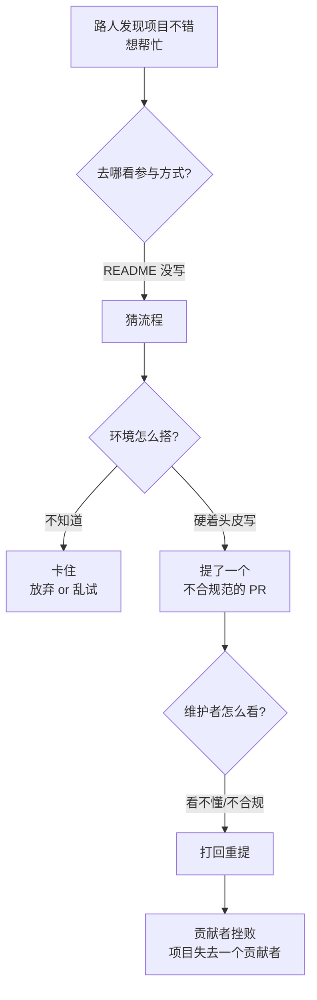
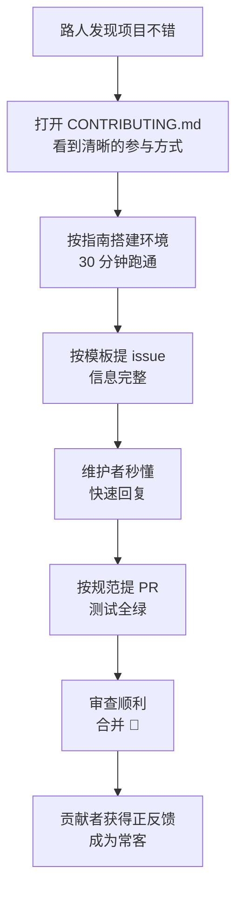
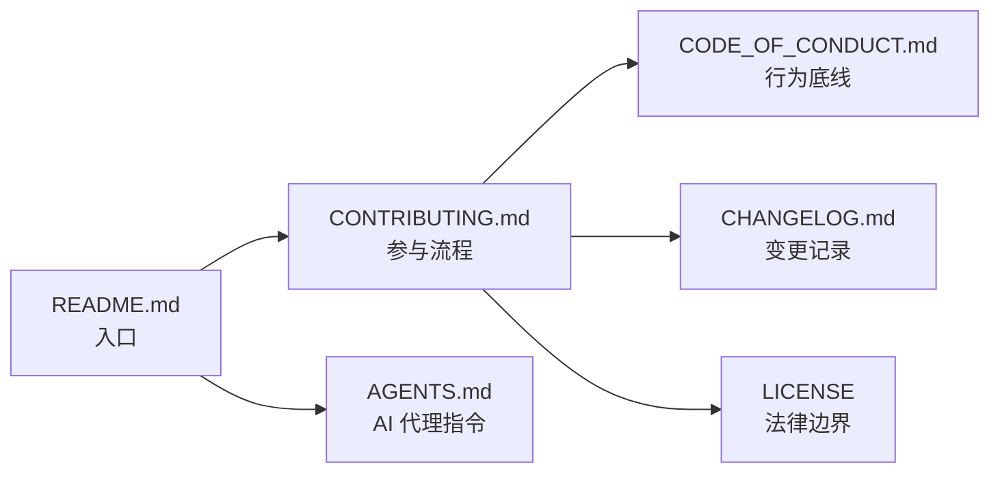

+++
title = 'CONTRIBUTING.md：给潜在贡献者的"入伙指南"'
date = '2026-09-11T14:30:00+08:00'
slug = 'contributing-md'
draft = false
tags = ['github', 'contributing', '开源', 'community', 'docs']
+++

上一篇写了 `CHANGELOG.md`，这次轮到仓库根目录里另一位常驻成员：`CONTRIBUTING.md`。

如果你观察过那些"活得很好"的开源项目——Ruby on Rails、Kubernetes、VS Code——会发现它们都有一份 CONTRIBUTING.md。它回答一个问题：**一个素不相识的陌生人，要怎么才能帮你写代码？**

很多项目代码写得不错，却始终"火不起来"，原因往往不是代码质量，而是**没有人知道该怎么贡献**。这篇文章参考 GitHub 官方文档（[Setting guidelines for repository contributors](https://docs.github.com/en/communities/setting-up-your-project-for-healthy-contributions/setting-guidelines-for-repository-contributors)）和开源社区的通行做法，把 CONTRIBUTING.md 讲透：它是什么、为什么需要、GitHub 怎么展示它、一份优秀的该写什么。

<!-- more -->

---

## 一、CONTRIBUTING.md 是什么

一句话定义：**CONTRIBUTING.md 是写给"潜在贡献者"的指南，说明如何参与这个项目**——包括怎么提 issue、怎么提 Pull Request、怎么搭建开发环境、遵循什么代码规范、社区的期望是什么。

它和 README.md 的关系，就像"用户手册"和"入职培训"的关系：

| 文件 | 回答的问题 | 读者 |
| :--- | :--- | :--- |
| `README.md` | 这个项目是什么？怎么安装？怎么用？ | 用户 |
| `CONTRIBUTING.md` | 我该怎么参与进来？怎么提 issue？怎么提 PR？ | 潜在贡献者 |

README 讲"这是什么、怎么用"，CONTRIBUTING 讲"**怎么进来干活**"。一个没有 README 的项目让人"不会用"，一个没有 CONTRIBUTING 的项目让人"不敢动"——想帮忙，却不知道从哪下手，最后默默关掉页面。

GitHub 官方对它的定位说得很清楚：

> For the repository owner, contribution guidelines are a way to communicate how people should contribute. For contributors, the guidelines help them verify that they're submitting well-formed pull requests and opening useful issues. For both owners and contributors, contribution guidelines save time and hassle caused by improperly created pull requests or issues that have to be rejected and re-submitted.

翻译过来就是：**对维护者，它是"怎么参与"的声明；对贡献者，它是"我这样提交对不对"的校验清单；对双方，它省下了"不合格 PR 被拒 → 重提"的时间浪费。**

---

## 二、为什么需要它：没有 CONTRIBUTING 的代价

想象一下没有 CONTRIBUTING.md 的项目，一个热心路人的"贡献之旅"是这样的：



没有 CONTRIBUTING 时，沟通成本全部转嫁给"猜"和"试错"：

- **贡献者**不知道提 bug 要附什么信息，issue 写得像"我的程序崩了，帮我看看"；
- **贡献者**不知道分支怎么命名、commit message 怎么写、测试跑不跑，PR 被拒后一脸懵；
- **维护者**每天要处理大量垃圾 issue 和不合格 PR，回复"请补充复现步骤"这种话能写到手软。

有了 CONTRIBUTING.md，这个旅程变成：



**一份好指南，是把"路人"变成"贡献者"的转化率工具。** 这也是为什么 GitHub 官方把贡献指南归类在 "Building communities / Healthy contributions"（建设社区 / 健康贡献）之下。

---

## 三、GitHub 是怎么"发现"和展示它的

上一篇文章讲了 GitHub 如何自动识别 LICENSE，CONTRIBUTING.md 也有类似的机制——而且展示位更多。

### 3.1 存放位置

CONTRIBUTING.md 可以放在三个位置之一：

- 仓库根目录（最常用）；
- `docs/` 目录下；
- `.github/` 目录下。

如果仓库里同时存在多个 CONTRIBUTING 文件，GitHub 在展示链接时按以下顺序选取：

| 优先级 | 位置 |
| :---: | :--- |
| 1 | `.github/` 目录 |
| 2 | 仓库根目录 |
| 3 | `docs/` 目录 |

另外注意：**贡献指南的文件名不区分大小写**（`CONTRIBUTING.md`、`contributing.md` 都行），但全大写是社区惯例。

### 3.2 它会在哪出现

只要仓库里存在 CONTRIBUTING.md，GitHub 就会在**四个地方**自动展示它：

1. **创建 issue / 打开 Pull Request 时**——页面顶部会出现一个指向该文件的链接（这是最重要的入口，因为用户正好在"准备提东西"的瞬间）；
2. **仓库的 Contribute 页面**——比如 [github/docs/contribute](https://github.com/github/docs/contribute)，汇总了"怎么参与"的所有入口；
3. **仓库首页的 "Contributing" 标签页**——和 README、Code of conduct 标签页并排；
4. **仓库侧边栏的 "Contributing" 链接**。

也就是说，你只需要写好这一份文件，GitHub 会在所有"贡献者该出现的地方"帮你挂上入口。这和 LICENSE 的"被动识别"不一样，CONTRIBUTING 是"主动分发"。

---

## 四、一份优秀的 CONTRIBUTING.md 该写什么

GitHub 官方建议的内容只有三条底线：

- **创建好的 issue 或 PR 的步骤**；
- **外部文档、邮件列表或行为准则的链接**；
- **社区和行为期望**。

但社区实践证明，一份"够用"的指南通常包含以下板块（按读者阅读顺序排列）：

| 板块 | 内容 | 为什么重要 |
| :--- | :--- | :--- |
| 1. 项目简介 + 参与方式总览 | 哪些贡献形式（代码、文档、翻译、测试、回答 issue） | 让"非程序员"也知道能帮上忙 |
| 2. 开发环境搭建 | fork、clone、安装依赖、构建、跑测试的命令 | 贡献者最容易卡死在这里 |
| 3. 怎么提一个好 issue | bug 报告模板：复现步骤、期望行为、环境信息 | 减少无效往返 |
| 4. 怎么提一个好 PR | 分支命名、commit message 规范、测试要求 | 减少打回重提 |
| 5. 代码规范 | 风格指南、lint 规则、Conventional Commits | 保证代码一致性 |
| 6. 审查与合并流程 | 谁审、多久、怎么沟通 | 管理预期 |
| 7. 行为准则 | 链接到 CODE_OF_CONDUCT.md | 划定底线 |

写的时候记住一条原则：**CONTRIBUTING.md 要回答的不是"你的项目多伟大"，而是"贡献者下一步具体做什么"。** 每一条都应该是可执行的指令，而不是愿景宣言。

---

## 五、从零写一份：可直接改的模板

下面是一个中文模板，覆盖了大部分项目需要的内容。新建项目时复制过去，把占位符换成自己的即可：

````markdown
# 贡献指南

感谢你对本项目感兴趣！无论是修 bug、加功能、写文档还是提建议，
都欢迎参与。参与前请先阅读本文，并遵守 [行为准则](CODE_OF_CONDUCT.md)。

## 如何开始

1. Fork 本仓库，并克隆到本地：
   git clone https://github.com/你的用户名/项目名.git
2. 创建功能分支：
   git checkout -b feature/你的功能名
3. 按下方「开发环境」搭建并跑通测试。

## 报告 Bug

提 issue 时请包含：

- 环境信息（操作系统、版本号、浏览器/运行时版本）
- 复现步骤（尽量精简）
- 期望行为与实际行为
- 报错日志或截图

## 提交功能建议

先开一个 issue 描述你的想法，讨论确认后再动手写代码，
避免做出没人要的功能。

## 开发环境

- 安装依赖：pnpm install
- 启动开发服务：pnpm dev
- 运行测试：pnpm test
- 代码检查：pnpm lint

## 提交 PR 的步骤

1. 确认所有测试通过、lint 无报错；
2. commit message 遵循 Conventional Commits 格式：
   feat(模块): 添加 xxx 功能
   fix(模块): 修复 xxx 问题
3. 推送分支并创建 Pull Request，描述：
   - 改了什么、为什么改
   - 测试情况
   - 相关 issue 编号（如 Closes #12）

## 代码规范

- 保持现有代码风格，提交前先跑 pnpm lint；
- 新增功能必须附带测试；
- 修改公开 API 时必须同步更新文档和 CHANGELOG.md。

## 行为准则

参与本项目即表示你同意遵守 [行为准则](CODE_OF_CONDUCT.md)。
有不当行为请联系 [维护者邮箱]。
````

注意模板里特意出现了 `CHANGELOG.md`——和上一篇呼应：**改公开 API 必须更新 changelog，这条规则写在 CONTRIBUTING 里最合适**，因为贡献者提 PR 时正好在看这份文件。

---

## 六、和"仓库根目录全家桶"的分工

一个成熟开源项目的根目录，往往是一整套"说明书家族"，各司其职：

| 文件 | 职责 | 读者 | 上一篇/后续文章 |
| :--- | :--- | :--- | :--- |
| `README.md` | 是什么、怎么用 | 用户 | — |
| `CONTRIBUTING.md` | 怎么参与 | 潜在贡献者 | 本文 |
| `CHANGELOG.md` | 每个版本改了什么 | 用户 / 开发者 | [已写过](https://leafcxy.github.io/posts/2026/09/keep-a-changelog/) |
| `LICENSE` | 允不允许用、怎么用 | 所有人 | [已写过](https://leafcxy.github.io/posts/2026/09/github-license/) |
| `CODE_OF_CONDUCT.md` | 社区行为底线 | 参与者 | — |
| `AGENTS.md` | 告诉 AI 代理怎么干活 | AI 编码代理 | [已写过](https://leafcxy.github.io/posts/2026/09/agents-md/) |

它们的关系可以画成这样：



其中 **CODE_OF_CONDUCT（行为准则）是 CONTRIBUTING 的"配套文件"**：GitHub 官方明确建议在 CONTRIBUTING 里链接行为准则，很多项目（如 Rust、Kubernetes）把两者放在一起管理。行为准则定义"什么是不可接受的行为"，CONTRIBUTING 定义"什么是好的贡献"，一阴一阳。

---

## 七、进阶技巧

### 7.1 组织级默认：default community health file

GitHub 支持在**个人或组织账号的 `.github` 仓库**里定义"默认社区健康文件"。比如你在 `github.com/你的账号/.github` 仓库中放一份 `CONTRIBUTING.md`，那么你名下**所有没有自己 CONTRIBUTING 的仓库**都会自动使用这份默认指南。

这对维护多个仓库的人（或组织）极其有用：一份指南，全组织生效，子仓库可以覆盖，也可以继承。

### 7.2 与 issue / PR 模板配合

CONTRIBUTING.md 讲"怎么做"，而 `.github/ISSUE_TEMPLATE/` 和 `.github/PULL_REQUEST_TEMPLATE/` 里的模板负责"直接给贡献者一个填好的表单"。

最佳实践是两者配合：指南里写"提 bug 请附复现步骤和环境信息"，模板里直接做成必填字段。贡献者想提错都难。

### 7.3 降低准入门槛

- 给新手 issue 打上 `good first issue` 标签，并在 CONTRIBUTING 里告诉新人"从这里开始"；
- 用 [all-contributors](https://allcontributors.org/) 自动表彰文档、翻译、设计等非代码贡献；
- 用 `CODEOWNERS` 指定代码审查负责人，让 PR 自动分派给对口维护者。

### 7.4 保持简短

CONTRIBUTING.md 最大的敌人是**太长**。一份 5000 字的指南没人会读完。好的指南应该让读者在 **5 分钟内**知道"我下一步该做什么"，细节可以链接到外部文档。

### 7.5 值得借鉴的范例

GitHub 官方推荐的几个范例：

- [GitHub Docs 的贡献指南](https://github.com/github/docs/blob/main/.github/CONTRIBUTING.md)——最贴近 GitHub 官方风格；
- [Ruby on Rails 的贡献指南](https://github.com/rails/rails/blob/main/CONTRIBUTING.md)——老牌大项目，流程成熟；
- [Open Government 的贡献指南](https://github.com/github/opensource.guide/blob/main/CONTRIBUTING.md)——简洁、面向非程序员也友好；
- Node.js、Kubernetes 的 CONTRIBUTING 也是行业标杆，规模大但结构清晰。

---

## 八、回到本仓库

和上一篇一样，照例自省一下：**本仓库（`leafcxy.github.io`）没有 CONTRIBUTING.md，合理吗？**

合理。判断标准就一条：**有没有"外部贡献者"这个群体存在。**

- 个人博客、私人工具、内部项目——没有外部协作者，写 CONTRIBUTING 是自娱自乐；
- 开源库、社区项目、有陌生人会来提 issue/PR 的项目——**没有 CONTRIBUTING，就是让贡献者靠猜，让维护者靠吼**。

另外注意一个细节：如果你在 GitHub 上发现某个项目想提 PR 但没找到 CONTRIBUTING，可以看一眼它的 README——很多项目把贡献说明放在 README 的 "Contributing" 章节里（GitHub 官方也认可这种简化做法）。找不到时，提一个礼貌的 issue 问"需要我注意什么"永远比直接甩 PR 强。

## 总结

用三句话记住 CONTRIBUTING.md：

- **CONTRIBUTING.md 是写给潜在贡献者的"入伙指南"，回答"我该怎么参与这个项目"**；
- **核心内容：开发环境搭建 + 怎么提 issue + 怎么提 PR + 代码规范 + 行为准则**；
- **GitHub 会在提 issue、开 PR、仓库首页等四个地方自动展示它——你只写一次，它到处分发**。

写完 README 和 LICENSE 之后，如果你希望这个项目有朝一日是"别人也愿意维护的"，再花一小时写一份 CONTRIBUTING.md——它是把"路人"变成"贡献者"的转化率工具，也是社区健康度的起点。

---

> 参考链接：[GitHub Docs: Setting guidelines for repository contributors](https://docs.github.com/en/communities/setting-up-your-project-for-healthy-contributions/setting-guidelines-for-repository-contributors) · [Open Source Guides](https://opensource.guide/) · [GitHub Docs 贡献指南](https://github.com/github/docs/blob/main/.github/CONTRIBUTING.md) · [Ruby on Rails 贡献指南](https://github.com/rails/rails/blob/main/CONTRIBUTING.md) · [all-contributors](https://allcontributors.org/)
