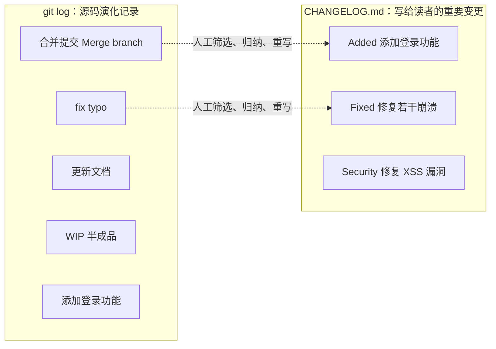
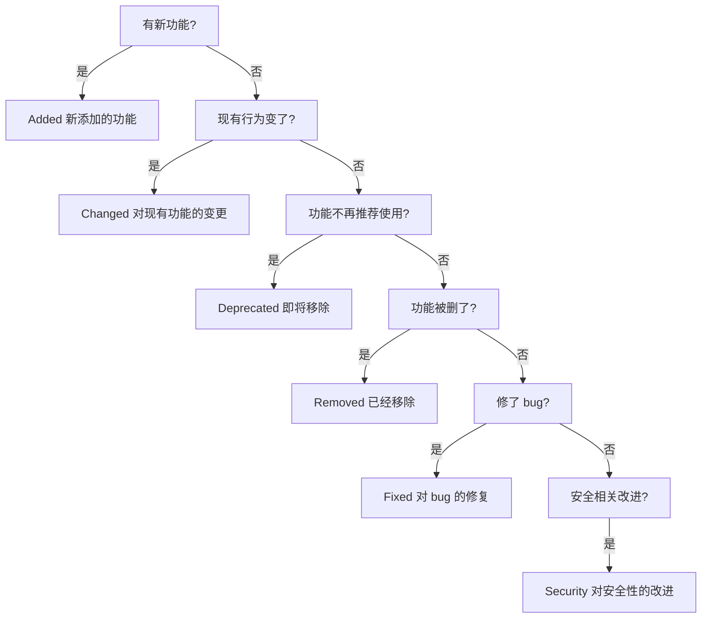
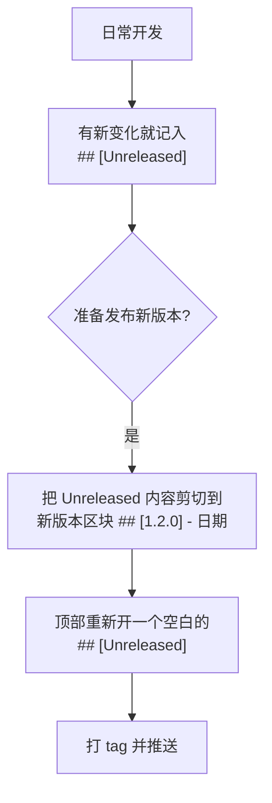

+++
title = 'CHANGELOG.md：一份写给人的版本变更日志'
date = '2026-09-11T10:00:00+08:00'
slug = 'keep-a-changelog'
draft = false
tags = ['changelog', 'semver', 'git', 'docs', '开源']
+++

打开任何一个有点年头的开源仓库，根目录里通常躺着这么几位：`README.md` 负责"这是什么、怎么用"，`LICENSE` 负责"允不允许你用"，`CONTRIBUTING.md` 负责"欢迎来贡献"，`AGENTS.md` 负责"告诉 AI 代理怎么干活"……而 `CHANGELOG.md` 负责最后一件事：**这个项目从出生到现在，每一次重要的变化**。

但现实是，很多项目根本没有 CHANGELOG，或者干脆把 `git log` 导出充数。这篇文章以 [Keep a Changelog](https://keepachangelog.com/zh-CN/1.1.0/)（一个专门教人写更新日志的开源项目）1.1.0 中文版为蓝本，把更新日志这件事讲透：它是什么、为什么需要、怎么写出高质量的、又有哪些糟糕的写法。

<!-- more -->

---

## 一、更新日志是什么

Keep a Changelog 首页第一句话就给出了定义：

> 更新日志（Change Log）是一个由人工编辑、以时间为倒序的列表，用于记录项目中每个版本的显著变动。

拆开看有三个关键词：

- **人工编辑**：不是自动生成的，是维护者亲手写下来的；
- **时间倒序**：最新的版本在最上面，越往下越古老；
- **显著变动**：只记录"值得读者知道"的变化，不是流水账。

为什么需要它？官网的答案非常朴素：

> 为了让用户和开发人员更简单清晰地知晓项目的不同版本之间有哪些显著变动。

谁需要它？**人人需要**。用户想知道"升级之后有什么新功能、坏东西修好了没"；开发者想知道"这个版本为什么改了这些、上一个版本干了什么"。软件有变动时，大家都希望知道改动是为何、以及如何进行的。

README 和 CHANGELOG 经常被搞混，其实分工很清楚：

| 文件 | 回答的问题 | 读者 |
| :--- | :--- | :--- |
| `README.md` | 项目是什么？怎么安装？怎么用？ | 新来的用户 / 贡献者 |
| `CHANGELOG.md` | 项目从过去到现在，每个版本发生了什么变化？ | 所有用户 / 开发者 |
| `git log` | 每一次提交改了什么？ | 开发者 / 机器 |

README 讲的是"现在"，CHANGELOG 讲的是"变化"。一个没有 README 的项目很难上手，一个没有 CHANGELOG 的项目则很难"跟进"。

---

## 二、CHANGELOG ≠ git log：最容易踩的坑

很多人觉得"我 commit 都写得很规范，直接拿 git log 当 changelog 不就行了？"

Keep a Changelog 把"使用 git 日志"列为**第一号糟糕做法**：

> 使用 git 日志作为更新日志是个非常糟糕的方式：git 日志充满各种无意义的信息，如合并提交、语焉不详的提交标题、文档更新等。

原因是两者目的根本不同：



- **提交的目的**是记录"源码的演化"，粒度是"每次提交"；
- **更新日志的目的**是记录"重要的变更供读者阅读"，粒度是"每个版本"。

一次发布可能包含几十次提交，其中一半是 `fix typo`、`update docs`、`merge branch`，这些对使用者毫无意义。更新日志的价值恰恰在于**人工筛选 + 归纳 + 用读者听得懂的话重写**。

---

## 三、指导原则：七条黄金法则

「怎样制作高质量的更新日志？」一节给出了七条指导原则：

1. **记住日志是写给"人"而非机器的**——受众是人类读者，措辞要像人话；
2. **每个版本都应该有独立的入口**——不要几个版本挤在一起；
3. **同类改动应该分组放置**——Added / Fixed 等分类；
4. **不同版本应分别设置链接**——每个版本标题链到对应的 tag 对比；
5. **新版本在前，旧版本在后**——时间倒序；
6. **应包括每个版本的发布日期**——用 ISO 8601 格式（`2026-09-11`）；
7. **注明是否遵守[语义化版本规范](https://semver.org)**——声明遵循 SemVer，让读者知道版本号的含义。

这七条里，第 4 条（版本链接）最容易被忽略。标准做法是在每个版本标题下放一个指向"该版本与前一版本 diff"的链接：

```markdown
## [1.1.2] - 2024-09-27

### Added

- 新增简体中文翻译。
- 新增繁体中文翻译。

[1.1.2]: https://github.com/olivierlacan/keep-a-changelog/compare/v1.1.1...v1.1.2
```

链接统一放在文末管理（类似论文的参考文献），正文里用 `[1.1.2]` 引用。读者点一下就能看到"这个版本到底改了什么代码"。

---

## 四、六种变动类型

Keep a Changelog 定义了**六种**变动类型，这是整个格式的核心：

| 类型 | 含义 | 示例 |
| :--- | :--- | :--- |
| **Added** | 新添加的功能 | 新增 `/api/users` 接口 |
| **Changed** | 对现有功能的变更 | 登录接口改为返回 JWT |
| **Deprecated** | 已经不建议使用，即将移除的功能 | 弃用 `old_api()` |
| **Removed** | 已经移除的功能 | 移除 Python 2 支持 |
| **Fixed** | 对 bug 的修复 | 修复内存泄漏 |
| **Security** | 对安全性的改进 | 修复 XSS 漏洞 |

把这六个词背下来，你的 changelog 就有了骨架。Keep a Changelog 自己的 CHANGELOG 就是一个活生生的范例——比如 1.1.0 版本：

```markdown
## [1.1.0] - 2019-02-15

### Added

- Danish translation.
- Changelog inconsistency section in Bad Practices.

### Fixed

- Italian translation.
- Indonesian translation.
```

注意细节：每个条目都是**动词开头、一句话说清**，只说"加了什么、修了什么"，不解释背景。详细背景留给 commit message 或 issue。

怎么判断一次改动属于哪一类？可以走这个决策流程：



---

## 五、一份标准的 CHANGELOG 长什么样

Keep a Changelog 首页提供了官方模板。新建项目时直接把下面这段复制进去改即可：

```markdown
# Changelog

All notable changes to this project will be documented in this file.

The format is based on [Keep a Changelog](https://keepachangelog.com/zh-CN/1.1.0/),
and this project adheres to [Semantic Versioning](https://semver.org/).

## [Unreleased]

## [1.0.0] - 2026-09-11

### Added

- 初始发布。

[unreleased]: https://github.com/leafcxy/project/compare/v1.0.0...HEAD
[1.0.0]: https://github.com/leafcxy/project/releases/tag/v1.0.0
```

几个要点：

- 开头声明"格式基于 Keep a Changelog、遵守语义化版本"——这就是指导原则第 7 条的落地；
- 顶部永远有一个 `## [Unreleased]` 区块（见下一节）；
- 版本号使用 `v1.0.0` 这样的语义化版本号，且与 git tag 保持一致；
- 文末维护链接列表，`[unreleased]` 指向 `compare/v1.0.0...HEAD`。

---

## 六、Unreleased 区块：减少维护成本的关键

「如何减少维护更新日志的精力？」官网给出的答案是：**在文档最上方提供 `Unreleased` 区块**。

好处有两个：

1. **大家可以知道未来版本中可能会有哪些变更**——对用户是预告，对贡献者是清单；
2. **发布新版本时，直接把 Unreleased 区块的内容移动到新版本区块**——零成本发布。

工作流是这样的：



也就是说，**发布不是"开始写 changelog"，而是"把已经写好的内容挪个位置"**。这比"发布后回忆这个版本改了啥"省力得多，也更准确。

---

## 七、Yanked：被撤下的版本怎么办

有些版本发布后发现有重大 bug 或安全问题，被从发布渠道撤下了。这种版本叫 **Yanked（撤回的）**。

Keep a Changelog 的建议是：**仍然记录它，但打上醒目的 `[YANKED]` 标记**：

```markdown
## [0.0.5] - 2014-12-13 [YANKED]
```

为什么撤下的版本还要记录？因为很多用户可能已经升级到了那个版本，如果 changelog 里完全消失，他们会困惑"我的版本去哪了"。`[YANKED]` 标记让他们一眼就知道"这个版本别用"。

用方括号包围还有一个好处：**更易被程序识别**——方括号是结构化标记，机器可以解析。

---

## 八、糟糕的实践：四个反面教材

「有很糟糕的更新日志吗？」一节点名了四种糟糕写法。

### 8.1 使用 git 日志

上文已经详细说过：git log 充满合并提交、无意义标题、文档更新，粒度是"提交"而非"版本"，而且不是写给用户看的。**永远不要**直接把 `git log` 的输出塞进 CHANGELOG。

### 8.2 无视即将弃用的功能

升级软件时，人们应该清楚地（尽管痛苦地）知道哪些部分将不再被支持。正确的节奏是：

1. 先升级到一个"列出弃用项"的版本（Deprecated）；
2. 等到不再需要那些部分后，再升级到"真正移除"的版本（Removed）。

如果维护者直接移除功能而不给任何预告，用户升级就是一次"盲盒开奖"。**即使其他什么都不做，也至少要在更新日志中列出 deprecations、removals 以及其他重大变动。**

### 8.3 易混淆的日期格式

`06/02/2012` 在美国是 6 月 2 日，在英国是 2 月 6 日。不同地区日期格式不同，很难找到让所有人都满意的格式。

解决方案：使用 **ISO 8601** 格式 `2012-06-02`（从大到小排列，符合逻辑、不易与其他格式混淆）：

```markdown
## [1.2.0] - 2026-09-11   # ✅ 推荐：ISO 8601
## [1.2.0] - 2026/09/11   # ❌ 非标准
## [1.2.0] - Sep 11, 2026 # ❌ 易混淆
```

### 8.4 不一致的变更

"只记录部分重要变更"的 changelog，可能和没有 changelog 一样危险。用户会把 changelog 当作事实的唯一来源——一旦你漏掉某个重大变更，用户就会开始怀疑整份文件的可靠性。

> 能力越大，责任越大——拥有一个好的更新日志意味着拥有一个**一致性更新**的更新日志。

不是所有变化都需要记录（删除一个空格当然不用），但**任何重要的变更都应该被提及**。

---

## 九、常见问题

### 9.1 有标准化的更新日志格式吗？

**没有。** 虽然有 GNU 更新日志指南等参考，但都远远不够。Keep a Changelog 的定位是"一个更好的更新日志范例"，它综合了开源社区优秀实例的做法，欢迎建设性的批评与建议——**它不是强制标准，而是一套被广泛认可的最佳实践**。

### 9.2 文件应该怎么命名？

通常使用 `CHANGELOG.md`。有些项目叫 `HISTORY`、`NEWS` 或 `RELEASES`。命名并不那么重要，但**为什么要为难那些只想看看重大变更的用户呢？**——用最通用的 `CHANGELOG.md`，省得用户找不到。

### 9.3 GitHub Releases 怎么样？

GitHub Releases 是个好功能，能把 git 标签（如 `v1.0.0`）转换成信息丰富的发布说明。但它有两个问题：

- 它创建的更新日志**仅在 GitHub 环境下显示**，不可移植——离开 GitHub 就没了；
- 现行版本不像 `README`、`CONTRIBUTING` 那样醒目，不利于用户探索，且**不提供不同版本间的 commit 日志链接**。

所以很多项目选择"**CHANGELOG.md 为主，GitHub Releases 为辅**"：仓库里维护标准文件，发版时同步一份到 Releases。

### 9.4 更新日志能被自动识别吗？

很难。因为有各种不同的文件格式和命名。不过社区有工具在尝试：

- [Vandamme](https://github.com/tech-angels/vandamme)——Ruby 写的解析器，由 Gemnasium 团队制作，能解析多种（但绝对不是全部）开源库的更新日志；
- 现在也有很多工具（如 [conventional-changelog](https://github.com/conventional-changelog/conventional-changelog)、[git-cliff](https://github.com/orhun/git-cliff) 等）能**从提交信息半自动生成** changelog 草稿，但最终仍需人工审校。

### 9.5 可以重写更新日志吗？

当然可以。总会有合适的原因去改进它——比如你发现自己忘记记录了一个重大功能更新。**这种情况下显然应该重写。** Keep a Changelog 的作者本人也常给那些未维护 changelog 的开源项目提交 PR，补上缺失的发布信息。

---

## 十、和语义化版本（SemVer）的关系

Keep a Changelog 和[语义化版本规范](https://semver.org)是一对搭档：changelog 记录"改了什么"，SemVer 声明"改动有多大"。

| 版本号变化 | SemVer 含义 | changelog 里通常对应 |
| :--- | :--- | :--- |
| `MAJOR`（1.x → 2.x） | 不兼容的 API 变更 | Removed / Changed（破坏性） |
| `MINOR`（1.1 → 1.2） | 向后兼容的新功能 | Added |
| `PATCH`（1.1.1 → 1.1.2） | 向后兼容的 bug 修复 | Fixed / Security |

反过来，changelog 也是一个**校验 SemVer 的工具**：如果你在 MINOR 版本里删了一个公开 API，changelog 的 Removed 条目会立刻提醒你"这应该算 MAJOR"。

---

## 十一、什么时候需要维护一份 CHANGELOG

判断标准其实很简单：**只要你的项目有"版本"概念、有使用者需要跟进变化，就值得维护一份 CHANGELOG.md。**

- 开源库 / SDK：用户依赖你的 API，必须知道每个版本改了什么、要不要跟着升级；
- 企业内部服务：多个团队共用一个中间件，changelog 是跨团队沟通的"变更公告栏"；
- 命令行工具 / 桌面应用：用户升级前想先看"这次更新值得吗"；
- 静态博客、个人玩具项目：没有外部使用者，可以不做——本博客仓库就没有，因为它的读者不需要跟进版本。

> 反过来也要说一句：**没有对外发布、没有版本概念的内部项目，硬写 changelog 反而是一种负担**。Changelog 是"给读者看的公共记录"，不是"给维护者自己看的 TODO"。

---

## 总结

用三句话记住更新日志：

- **CHANGELOG.md 是一份由人工编辑、时间倒序、按版本记录显著变更的文件，写给"人"看**；
- **核心是六种类型（Added / Changed / Deprecated / Removed / Fixed / Security）+ Unreleased 区块 + 版本链接 + ISO 日期**；
- **永远别用 git log 代替它，也不要漏记重大变更——一致性比完整性更难，也更珍贵**。

下次发布新版本时，别急着只写一条 git tag——花十分钟按照 Keep a Changelog 的格式维护一份 CHANGELOG.md，你的用户会感谢你。

---

> 参考链接：[Keep a Changelog（中文 1.1.0）](https://keepachangelog.com/zh-CN/1.1.0/) · [语义化版本规范 SemVer](https://semver.org/) · [keep-a-changelog 项目仓库](https://github.com/olivierlacan/keep-a-changelog)
