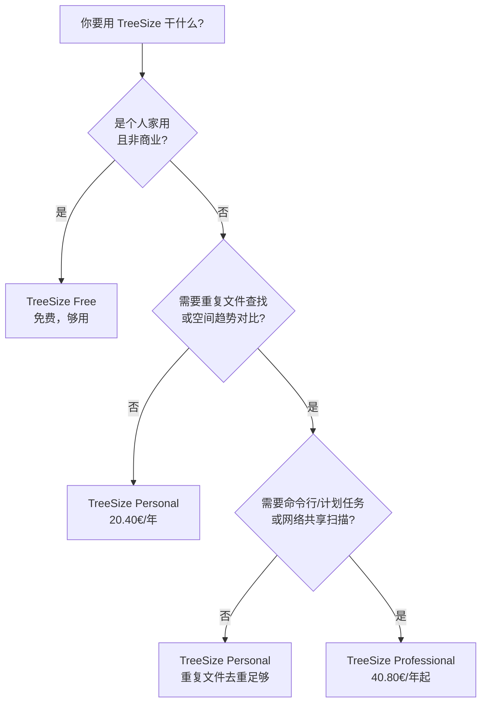
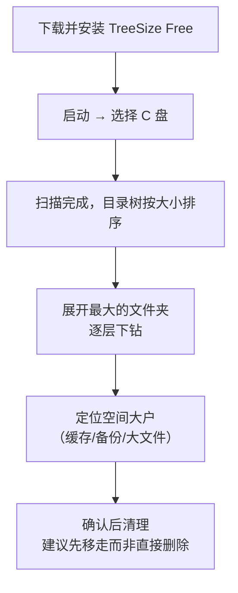

+++
title = 'TreeSize：C 盘又红了？让它告诉你空间去哪了'
date = '2026-09-11T16:30:00+08:00'
slug = 'treesize'
draft = false
tags = ['treesize', '磁盘', 'windows', '工具', '存储', 'jam-software']
+++

每个 Windows 用户都经历过这个时刻：C 盘变红，系统开始弹"磁盘空间不足"。然后你打开资源管理器，对着 `C:\` 下面的文件夹发呆——`Windows` 看起来不大，`Program Files` 也还行，那几十个 GB 到底去哪了？

资源管理器有个著名的"反人类"设计：**它不显示文件夹的总大小**。你想知道 `Users` 占多少，得一层层右键属性，等它算半天，最后可能还因为权限问题读不出来。

TreeSize 就是解决这个问题的工具：扫描你的磁盘，像资源管理器一样展示目录树，但每一层都标注占用空间，还提供饼图、柱状图、矩形树图（Treemap）让你一眼看出"谁是大户"。它来自德国公司 JAM Software，被全世界数百万用户使用了 25 年以上。这篇文章就把它讲透：是什么、能干什么、三个版本怎么选、和其他工具有什么区别。

<!-- more -->

---

## 一、为什么需要它：资源管理器看不到"真相"

先说一个反直觉的事实：**资源管理器默认不显示文件夹大小**，是因为显示它需要递归遍历目录树并统计每个文件，这在机械硬盘时代可能要算几十秒甚至几分钟，微软干脆就不做了。

所以当 C 盘告急时，你面对的是这样一个困局：

| 你想知道的问题 | 资源管理器 | TreeSize |
| :--- | :--- | :--- |
| 哪个文件夹占用最大？ | ❌ 只能一层层右键属性 | ✅ 一次扫描，按大小排序 |
| 有哪些超过 1GB 的大文件？ | ❌ 只能挨个翻 | ✅ 按大小/扩展名筛选 |
| 有没有重复文件？ | ❌ 无法发现 | ✅ Personal 及以上支持 |
| 文件按类型占了多少？ | ❌ 看不到 | ✅ 扩展名统计 |
| pagefile.sys、hiberfil.sys 为什么这么大？ | ⚠️ 能看到文件但不知道能不能动 | ✅ 明确标出系统文件 |

更麻烦的是，空间消耗往往藏在你想不到的地方：

- **用户缓存**：浏览器缓存、软件缓存、缩略图缓存，动辄几十 GB；
- **系统文件**：`pagefile.sys`（虚拟内存）、`hiberfil.sys`（休眠文件）、`swapfile.sys`，单个就能占好几个 GB；
- **重复文件**：安装包、备份、照片副本散落各处；
- **老版本残留**：升级软件后没删干净的旧目录。

没有分析工具的 C 盘清理，本质上是"盲人摸象"——你删掉觉得没用的，真正的空间大户还在那里稳如泰山。

---

## 二、TreeSize 是什么

TreeSize 由德国的 [JAM Software](https://www.jam-software.com/) 开发，官方定位是"最好的磁盘空间分析器"。几个关键数字：

- **25 年以上**历史，被全球数百万用户使用；
- 官网展示的客户包括 Intel、SAP、Siemens、IBM、Microsoft、HPE 等企业；
- 在 G2 上获得 "Users Love Us" 徽章（平均评分 4.0+）；
- 产品线覆盖从个人免费版到企业级存储管理（SpaceObServer）。

它的工作原理很朴素：扫描一个驱动器或目录，递归遍历整棵目录树，统计每个文件夹和文件的大小、文件数、占用空间（Allocated）等指标，然后实时排序展示：

和 Windows 内置的"存储设置"不同，TreeSize 是**文件级**的分析——小到单个文件、大到整个磁盘，每一层都看得清清楚楚。

---

## 三、核心能力：可视化与细节洞察

### 3.1 三种图表

TreeSize 提供三种可视化方式，各有适用场景：

| 图表 | 长什么样 | 最适合看什么 |
| :--- | :--- | :--- |
| **饼图（Pie）** | 圆盘按占比分块 | 一眼看出最大的几个目录 |
| **柱状图（Bar）** | 横向条形按大小排列 | 比较同级目录的大小关系 |
| **矩形树图（Treemap）** | 面积 = 大小的矩形嵌套 | 全盘视角，颜色区分文件类型 |

矩形树图是它的招牌功能：整个磁盘显示为一个被切分成无数矩形的平面，矩形面积正比于文件/文件夹大小，颜色代表文件类型（视频、文档、系统文件等）。**哪个矩形最大，空间大户就是谁**，不需要读任何数字。

### 3.2 丰富的细节列

除了基础的大小，TreeSize 每个目录都能展示一整套指标（官方界面里的典型列）：

- **Size（大小）**：文件逻辑大小
- **Allocated（占用空间）**：在磁盘上实际占用的物理空间（含簇对齐损耗）
- **Files / Folders**：文件数与文件夹数
- **% of Parent**：占父目录的百分比
- **Last Modified / Last Accessed**：最后修改/访问时间
- **Owner**：文件所有者（定位"谁的文件占空间"很有用）

借助这些列，你可以回答很多深层问题：某个目录是不是被访问极少的旧备份占着？谁的所有者文件最大？哪个文件夹文件数爆表（可能缓存碎片化）？

### 3.3 更高级的洞察

- **Top Files**：全盘最大的 N 个文件排行，可设阈值（如 >100MB）秒级筛选；
- **Extensions（扩展名统计）**：按后缀聚合，快速发现"视频占了 40%"这类结论；
- **Age of Files（文件年龄）**：按修改时间分桶，找出"三年没动过的老文件"；
- **重复文件查找**（Personal 及以上）：基于哈希校验定位重复内容，安全去重。

---

## 四、三个版本怎么选

TreeSize 分为三个桌面版本（另有企业级 SpaceObServer），定价如下（官网当前价格）：

| 版本 | 目标用户 | 价格 | 核心功能 |
| :--- | :--- | :--- | :--- |
| **TreeSize Free** | 家庭用户（非商业环境） | **免费** | 一键可视化到文件级、矩形树图、PDF 报告 |
| **TreeSize Personal** | 高级用户、小团队、自由职业者 | 20.40 €/用户/年（也可买断） | Free 全部 + 最大文件筛选、重复文件查找去重、空间随时间对比 |
| **TreeSize Professional** | IT 运维、企业 | 40.80 €/用户/年起 | Personal 全部 + 命令行参数、计划任务、自定义导出（PDF/Excel/HTML）、高级过滤 |

几个需要注意的点：

- 付费版均提供 **14 天免费试用**；
- **TreeSize Free 仅限个人非商业用途，且不支持 Windows Server**——公司里用免费版属于许可违规，小团队请上 Personal；
- 许可证是"用户 + 系统"制：**一个许可证 = 1 个用户 + 最多 3 台固定机器（非同时使用）**，不可多用户共享；
- Personal 提供**买断制（perpetual）**选项，不想年年续费可以选。

怎么选？一个简单的决策流程：

---

## 五、进阶玩法：运维级能力（Professional）

TreeSize Professional 之所以贵一倍，是因为它不只是"可视化工具"，而是一套**存储管理套件**：

### 5.1 命令行 + 计划任务

可以全自动运行扫描、生成报告、输出结果文件，然后由 Windows 任务计划程序定时触发。典型场景：每周一凌晨自动扫描文件服务器，生成报告发邮件，容量接近阈值时告警。

### 5.2 多格式报告导出

扫描结果可导出为 **PDF、Excel、CSV、XML、HTML、SQLite、纯文本**，甚至直接通过邮件发送。报告内容可定制：包含哪些图表、导出深度、导出列、页面设置等都能配置——这就是官方 FAQ 里说的"审计就绪"（audit-ready）。

### 5.3 跨平台/跨存储扫描

不只是本地磁盘，Professional 还能扫描：

| 类型 | 支持对象 |
| :--- | :--- |
| 网络 | Windows 服务器、NAS / 网络驱动器 / WebDAV、SharePoint |
| 云 | Google Drive、AWS S3、Azure Blob Storage |
| 远程 | Unix & Linux（通过 SSH） |
| 本地 | 本地盘、U盘/SD卡、数码相机、移动设备（MTP）、驱动器镜像、Outlook 本地邮箱 |

### 5.4 批量操作

删除、移动、**批量重命名**、归档文件——直接在扫描结果上执行，跨目录批量处理，不用开一堆资源管理器窗口。

### 5.5 便携版

部分版本支持制作 **portable（便携版）**，放到 U 盘里直接运行，免安装，适合在客户机器或装机场景中使用。

> 如果需求是"7×24 小时持续监控整个企业的存储增长"，官方推荐的是它的"老大哥" **SpaceObServer**——企业级存储管理器，支持连续监控和全自动报告。

---

## 六、隐私与合规：数据不出你的电脑

在"什么都上云"的时代，TreeSize 走的是相反的路线：

- **完全本地运行（on-premise）**：所有版本都在本地处理，**数据永不离开你的电脑**；
- **GDPR 合规**：开发过程不共享任何用户数据给第三方，公司服务器全部位于德国；
- 官网 FAQ 里明确承诺："你的数据永远由你掌控"。

这对企业用户尤其重要——磁盘分析报告往往包含目录结构、文件名、所有者等敏感信息，本地处理意味着没有泄露出云的风险。

---

## 七、同类工具横向对比

TreeSize 不是唯一的选择，磁盘分析工具圈还有几个知名选手：

| 工具 | 免费版 | 扫描方式 | 可视化 | 商业使用 |
| :--- | :---: | :--- | :--- | :---: |
| **TreeSize Free** | ✅ | 目录遍历（支持 NTFS/exFAT） | 饼图/柱状图/矩形树图 | ❌ |
| **WinDirStat** | ✅ | 目录遍历 | 矩形树图（老牌经典） | ✅ |
| **WizTree** | ✅ | 直接读取 NTFS MFT | 矩形树图 | ✅ |
| **SpaceSniffer** | ✅ | 目录遍历 | 矩形树图（动画缩放） | ⚠️ |
| **Windows 存储设置** | 系统内置 | 有限分类统计 | 简单条形 | ✅ |

几个关键差异：

- **速度**：WinDirStat 等基于目录遍历的工具，在磁盘很大时较慢；TreeSize 官方用户评价里甚至有人专门对比过——"与 WinDirStat 相比，速度差异是白天与黑夜"；WizTree 则通过直接读 NTFS MFT 实现极速扫描，但只支持 NTFS；
- **免费版的限制**：TreeSize Free 的"免费"附带非商业限制，而 WinDirStat、WizTree 对商业使用更宽松；
- **功能深度**：重复文件去重、计划任务、跨平台扫描这些运维功能，只有 TreeSize Personal/Professional 这类付费产品才具备。

如果你只是想"偶尔看一眼谁占了空间"，免费的 TreeSize 或 WizTree 都够用；如果要在公司环境里持续管理存储，TreeSize Professional 这类商业工具更省心。

---

## 八、五分钟上手

以 TreeSize Free 为例，完整流程：

1. 去[官网](https://www.jam-software.com/treesize)下载 Free 版（约几 MB，安装很快）；
2. 启动后选择要扫描的驱动器（本地盘、U 盘、SD 卡都能识别）；
3. 等待扫描（C 盘几十 GB 通常几秒到几十秒），左侧目录树按大小实时排序；
4. 找到最大的几个文件夹，逐个展开，直到定位到"空间大户"；
5. 对大文件/缓存文件夹执行清理（右键删除或打开所在位置确认）。

**两个重要提醒：**

- **系统文件别乱删**：`pagefile.sys`、`hiberfil.sys` 是虚拟内存和休眠文件，正确做法是在系统设置里调整（如缩小虚拟内存、关闭休眠），而不是直接删除；
- **先移后删**：对不熟悉的文件夹，先用"移动"而不是"删除"，确认没有影响后再彻底清理——这是磁盘清理最重要的安全习惯。

---

## 九、一个有意思的细节：它也有 CHANGELOG

最后呼应一下本系列的第一篇：TreeSize 官网有一个 [Changelog 页面](https://www.jam-software.com/treesize/changelog.shtml)，逐版本记录新增功能、修复的问题——这正是 [Keep a Changelog](https://leafcxy.github.io/posts/2026/09/keep-a-changelog/) 提倡的标准实践。

一个商业软件，25 年如一日地维护自己的变更日志，本身就是"更新日志值得写"的最好例证。用户升级前翻一眼 changelog，就知道这个版本值不值得升、升级要注意什么——**工具软件尚且如此，你的项目为什么不做呢？**

## 总结

用三句话记住 TreeSize：

- **它是 Windows 上最成熟的磁盘空间分析器**：25 年历史、数百万用户，把"空间去哪了"从猜测变成数据；
- **核心价值是可视化**：矩形树图、按大小排序的目录树、文件级细节，让空间大户无处遁形；
- **三个版本按需选择**：个人非商业用 Free 免费版，小团队用 Personal，企业运维用 Professional（命令行、计划任务、多格式报告）。

下次 C 盘再变红，别急着卸载游戏——先花两分钟让 TreeSize 告诉你真相，往往能多出几十个 GB 的惊喜。

---

> 参考链接：[TreeSize 官网](https://www.jam-software.com/treesize) · [版本与定价](https://www.jam-software.com/treesize/editions.shtml) · [TreeSize Changelog](https://www.jam-software.com/treesize/changelog.shtml) · [TreeSize 中文官网](https://treesize.cn/) · [SpaceObServer（企业版）](https://www.jam-software.com/spaceobserver)
