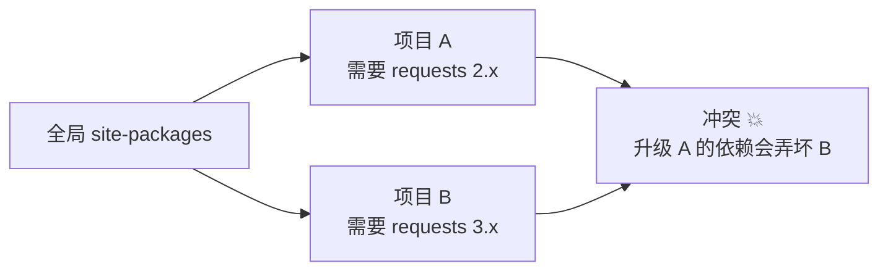
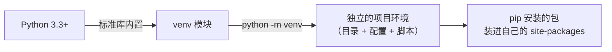
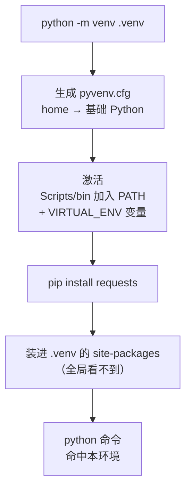
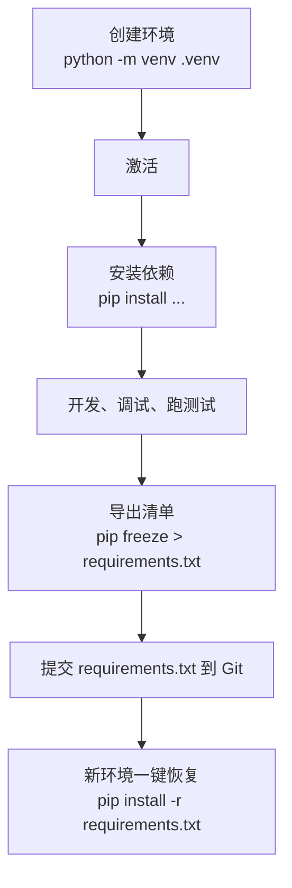

+++
title = 'Python venv 完全指南：虚拟环境一文讲透'
date = '2026-09-14T14:00:00+08:00'
slug = 'python-venv'
draft = false
tags = ['python', 'venv', '虚拟环境', 'pip', 'uv']
+++

"项目 A 要用 requests 2.x，项目 B 要 3.x，两个都装在同一个 Python 里"——这是每个 Python 新手迟早撞上的墙。更常见的是：`pip install` 装了一堆包之后，系统 Python 变得一团乱，重装系统前根本不敢动它。

venv（Virtual Environment，虚拟环境）就是 Python 官方给的答案：**每个项目一个独立的"小房间"，包各装各的，互不干扰**。它是 Python 3.3 起内置的标准库模块，不需要装任何额外工具，也是 2026 年每个 Python 项目的第一行命令。这篇文章把它从原理到实战讲透。

<!-- more -->

---

## 一、为什么要虚拟环境：先看"依赖地狱"

想象一下没有虚拟环境的日常。`pip install` 默认把包装进**全局**的 `site-packages` 目录，所有项目共享同一份：



问题远不止"版本打架"：

- **同一时刻只能存在一个版本**：`requests` 装了 2.x 就装不了 3.x，两个项目只能迁就其中一个；
- **装多了收不住**：几十个项目用过的包全堆在一起，谁也说不清哪个是哪个项目需要的；
- **升级即风险**：为项目 A 升级某个包，可能悄悄破坏了依赖旧版本的项目 B，而且往往几天后才被发现；
- **换机器 = 灾难**：没有依赖清单，新机器上只能"凭记忆"重新装，缺一个版本就对不上。

虚拟环境的思路很简单：**把每个项目的依赖隔离到各自的目录里**，Python 解释器还是同一个（或者由工具管理），但 `site-packages` 各用各的。

| 场景 | 全局安装 | 虚拟环境 |
| :--- | :---: | :---: |
| 两个项目需要不同版本 | ❌ 只能互相迁就 | ✅ 各装各的 |
| 升级一个项目的依赖 | ⚠️ 可能影响其他项目 | ✅ 完全隔离 |
| 知道项目装了什么 | ❌ 混在一起分不清 | ✅ `pip list` 一目了然 |
| 换新机器复现环境 | ❌ 靠记忆重装 | ✅ `requirements.txt` 一键恢复 |

---

## 二、venv 是什么

**venv 是 Python 标准库自带的虚拟环境模块**，从 Python 3.3 开始内置（对应 [PEP 405](https://peps.python.org/pep-0405/)）。它的前身是第三方工具 virtualenv，`python -m venv` 在 Python 3.3+ 之后成为官方推荐的替代方案。

几个关键点：

- **零安装**：Python 装好就有，不需要 `pip install` 任何东西；
- **轻量**：本质是一个目录 + 几个配置文件/脚本，不像 conda 那样带一整套包管理器；
- **纯标准库实现**：Linux、macOS、Windows 全平台可用；
- **虚拟环境≠全新 Python**：它不复制一份完整的解释器，而是通过配置文件"借用"系统里已有的 Python（见下一节）。



---

## 三、原理：venv 到底做了什么

执行 `python -m venv .venv` 后，会创建这样一个目录结构：

```text
.venv/
├── pyvenv.cfg          # 核心配置文件，指向基础 Python
├── Scripts/            # Windows 专属
│   ├── python.exe      # 解释器入口
│   ├── pip.exe
│   ├── activate.bat    # cmd 激活脚本
│   ├── Activate.ps1    # PowerShell 激活脚本
│   └── deactivate.bat
├── Lib/
│   └── site-packages/  # 本环境的包，初始为空
└── pyvenv.cfg          # （POSIX 布局不同：bin/ 而非 Scripts/）
```

真正起作用的机制是三件事：

**1. `pyvenv.cfg` 指路。** 文件里有个 `home` 键，指向创建时用的基础 Python 安装目录。解释器启动时会检测这个文件，一旦发现，就自动把 `sys.prefix` 改到 venv 目录，从而让 `site-packages` 搜索路径指向 venv 自己的那份。**venv 不复制解释器**（Windows 上是一个小的重定向 exe，POSIX 上是符号链接），省空间也省维护。

**2. 独立的 `site-packages`。** 初始为空，`pip install` 装的东西都进这里，和全局环境互不可见。

**3. 激活脚本改 PATH。** 激活的本质就是两条：把 venv 的 `Scripts/`（或 `bin/`）目录放到 PATH 最前面 + 设置 `VIRTUAL_ENV` 环境变量，这样你敲 `python`、`pip` 时命中的是本环境的版本。所以：

> **激活 = 改 PATH；不激活 = 用绝对路径也能调用 venv 里的解释器**（详见第六节）。



---

## 四、基础用法：创建、激活、退出、删除

### 4.1 创建

在**项目根目录**下执行：

```bash
# 通用（Windows / Linux / macOS 都一样）
python -m venv .venv

# Windows 上如果系统里有多个 Python，可以用 py 启动器指定版本
py -3.12 -m venv .venv
```

约定俗成用 `.venv`（隐藏目录）或 `venv` 作为名字，`python -m venv --help` 可以看到更多选项。

### 4.2 激活

激活命令**因 shell 而异**，这是新手最常踩的坑：

| 平台 | Shell | 激活命令 |
| :--- | :--- | :--- |
| Windows | cmd | `.venv\Scripts\activate.bat` |
| Windows | PowerShell | `.venv\Scripts\Activate.ps1` |
| Linux / macOS | bash / zsh | `source .venv/bin/activate` |

激活成功的标志：命令行提示符前面出现 `(.venv)` 前缀。再验证一下解释器路径：

```bash
# Windows
where python
# 应输出 ...\.venv\Scripts\python.exe

# Linux / macOS
which python
# 应输出 .../.venv/bin/python
```

### 4.3 使用与退出

```bash
# 查看已安装的包（刚创建时几乎为空）
pip list

# 安装依赖
pip install requests

# 退出虚拟环境，回到全局
deactivate
```

### 4.4 删除

虚拟环境就是一个普通目录，**删除 = 直接删目录**：

```bash
rm -rf .venv          # Linux / macOS
Remove-Item -Recurse -Force .venv   # Windows PowerShell
```

删了随时可以重建，项目代码不受影响——这正是虚拟环境最大的优点：**它是可抛弃的一次性东西**。

---

## 五、与 pip 配合：依赖清单的完整闭环

虚拟环境解决了"隔离"，还要配合 `requirements.txt` 解决"复现"：

```bash
# 1. 在虚拟环境里装好所有依赖
pip install requests flask

# 2. 导出当前环境的完整依赖清单
pip freeze > requirements.txt

# 3. 换机器 / 换人 / CI 里恢复环境
pip install -r requirements.txt
```

一个标准流程：



**两个建议：**

- **用 `python -m pip` 而不是裸 `pip`**：`python -m pip install requests` 能确保用的是当前解释器对应的 pip，避免 PATH 里混入别的 pip 装错地方；
- **`requirements.txt` 要进 Git**，`.venv/` 要进 `.gitignore`。

---

## 六、进阶技巧：让 venv 更好用

### 6.1 不激活也能用

激活只是"省事"，不是必须的。任何时候都可以直接调用 venv 里的解释器：

```bash
# Windows
.venv\Scripts\python.exe app.py
.venv\Scripts\python.exe -m pip install requests

# Linux / macOS
.venv/bin/python app.py
.venv/bin/pip install requests
```

在脚本、CI、Docker 里通常**故意不激活**，直接用绝对路径——更明确、更不容易出错。

### 6.2 VSCode 里选对解释器

VSCode 打开项目后：`Ctrl+Shift+P` → 输入 `Python: Select Interpreter` → 选择 `.venv` 那个。之后终端、调试器、代码补全都会自动用虚拟环境。也可以装 Python 扩展后在状态栏右下角直接切换。

### 6.3 想用全局的包？`--system-site-packages`

某些情况下（比如想复用全局已装的 numpy、torch 等大包），创建时加参数让 venv 能"看到"全局包：

```bash
python -m venv --system-site-packages .venv
```

代价是隔离不彻底——**默认不推荐**，多数项目不需要。

### 6.4 让默认行为更省心

- **`.gitignore` 加上 `.venv/`**：避免把环境目录提交进仓库（每个项目都要加）；
- **提示符区分环境**：激活后 bash 提示符自动带 `(.venv)`，配合 `deactivate` 使用，不会搞混当前在哪个环境；
- **一个项目一个环境**：不要图省事跨项目复用同一个 venv，那又回到全局安装的老路上了。

---

## 七、常见问题与误区

### 7.1 PowerShell 报"禁止运行脚本"

```text
无法加载文件 ...\Activate.ps1，因为在此系统上禁止运行脚本
```

这是 PowerShell 的执行策略（ExecutionPolicy）限制，不是 venv 的问题。两种解法：

```powershell
# 方法一：为当前用户放开脚本执行（推荐）
Set-ExecutionPolicy -Scope CurrentUser RemoteSigned

# 方法二：临时绕过，单次执行
powershell -ExecutionPolicy Bypass -Command ".venv\Scripts\Activate.ps1"

# 方法三：不想动策略就用 cmd 激活
# 直接打开 cmd 窗口，执行 .venv\Scripts\activate.bat
```

### 7.2 虚拟环境不能移动、不能重命名

venv 创建时把**绝对路径**写进了 `pyvenv.cfg` 和激活脚本。把 `.venv` 拷到别的目录、换台机器，环境基本就废了（Windows 上尤其如此）。正确姿势：**移动项目后删掉 `.venv` 重建**，反正 `requirements.txt` 在手，几分钟就能恢复。

### 7.3 升级 Python 后环境坏了

venv 绑定创建它时的那个解释器。系统 Python 升级、重装、或 `pyvenv.cfg` 里 `home` 指向的路径变了，环境里的解释器就找不到了。同样——**重建**。

### 7.4 忘了激活就 `pip install`

`pip` 装到了全局 `site-packages`，而激活后 `pip list` 里却看不到——这种"灵异现象"十有八九是环境没激活。先 `where python` / `which python` 确认命中路径，再动手。

### 7.5 "我删了 venv，项目代码不会没了吧？"

不会。venv 只包含解释器入口、pip 和安装的第三方包，**你的代码在项目目录里，两者是分开的**。这也是为什么 .venv 放项目根目录里也能放心删除。

---

## 八、2026 年的选择：venv、conda、poetry 还是 uv？

venv 解决"隔离"，但"依赖管理"（锁版本、解析依赖树、发布包）它不做。2026 年的工具生态已经分化得很清楚：

| 工具 | 定位 | 隔离 | 依赖锁定 | 速度 | 适合谁 |
| :--- | :--- | :---: | :---: | :--- | :--- |
| **venv** | Python 内置虚拟环境 | ✅ | ❌（配合 requirements.txt） | 基准 | 所有人，零安装，默认选择 |
| **virtualenv** | venv 的前身/增强 | ✅ | ❌ | 类似 | 需要老版本 Python 支持时 |
| **conda** | 跨语言环境 + 包管理 | ✅ | ✅（environment.yml） | 中 | 数据科学、要管非 Python 依赖 |
| **poetry** | 依赖 + 打包一体化 | ✅ | ✅（poetry.lock） | 中 | 发布库、已有 Poetry 的项目 |
| **uv** | 新一代工具（Rust 实现） | ✅ | ✅（uv.lock） | **极快**（号称比 pip 快 10–100 倍） | 2026 新项目的热门默认 |

一个越来越主流的判断（来自 2026 年的多篇技术对比）：

- **新项目无脑 uv**：单个 Rust 二进制，装 Python、建环境、装依赖、锁版本一把梭，`uv init` + `uv add` 几分钟跑通，内部用的仍然是 venv 那套隔离思路；
- **venv + pip 依然是"下限"**：任何环境、任何 Python 版本、甚至离线机器上都可用，官方文档至今仍以它为准；
- **已有 Poetry 项目不必急着迁移**：工具链成熟，等新功能开发时再规划；
- **数据科学场景 conda 仍有位置**：因为要处理 CUDA、R、C++ 等非 Python 依赖，venv/uv 管不了。

无论用哪个，**"项目依赖隔离"这个习惯是通用的**——uv 再快，也是在解决 venv 当年解决的问题。

---

## 总结

用三句话记住 venv：

- **它解决"依赖地狱"**：每个项目一个独立的 `site-packages`，包各装各的，互不干扰；
- **它零成本**：Python 3.3+ 内置，`python -m venv .venv` 一条命令创建，删目录即销毁，随时重建；
- **它是基础习惯，不是终点**：venv + pip + requirements.txt 覆盖 80% 场景；2026 年的新项目可以再进一步用 uv，但隔离的思路一脉相承。

> 记住这个动作：**拿到一个 Python 项目，第一件事就是 `python -m venv .venv`**。这比任何"环境配置教程"都更能保护你的系统 Python 和项目依赖。

---

> 参考链接：[Python 官方文档：venv](https://docs.python.org/zh-cn/3/library/venv.html) · [Python 官方教程：虚拟环境和包](https://docs.python.org/zh-cn/3/tutorial/venv.html) · [PEP 405：Python 虚拟环境](https://peps.python.org/pep-0405/) · [uv 官方文档](https://docs.astral.sh/uv/) · [virtualenv 文档](https://virtualenv.pypa.io/)
