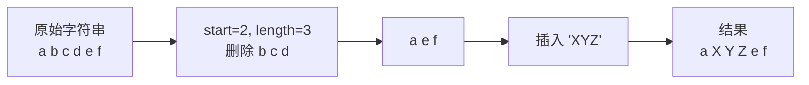
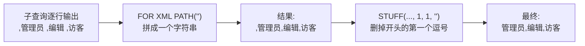
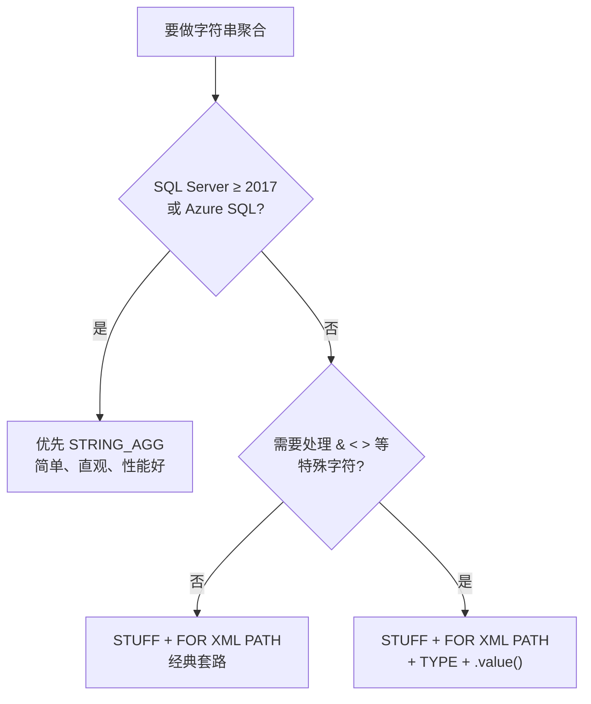

+++
title = 'SQL STUFF 函数详解：从"删了再插"到字符串聚合神器'
date = '2026-09-14T16:20:00+08:00'
slug = 'sql-stuff'
draft = false
tags = ['sql', 'sql-server', 'stuff', '字符串函数', 'for-xml-path', 'string-agg']
+++

SQL Server 里有个名字最容易被误会的函数：`STUFF`。初见它的人十有八九会愣一下——"stuff"不是"东西"吗？但就是这个名字古怪的函数，是无数 DBA 和开发者处理**多行拼成一行**（字符串聚合）的首选工具，也是面试里高频出现的"经典老题"。

这篇文章把 `STUFF` 讲透：它到底做了什么、参数边界怎么处理、经典的 `FOR XML PATH` 聚合套路怎么拆解、以及 2017 之后为什么有了更现代的替代品。

<!-- more -->

---

## 一、STUFF 是什么

`STUFF` 是 SQL Server 的字符串函数，官方定义：**删除字符串中指定长度的字符，然后在指定位置插入另一段字符串**。一句话：**先删一段，再插一段**。

语法（[官方文档](https://learn.microsoft.com/zh-cn/sql/t-sql/functions/stuff-transact-sql)）：

```sql
STUFF ( character_expression , start , length , replace_with_expression )
```

| 参数 | 含义 |
| :--- | :--- |
| `character_expression` | 要处理的字符串（常量、变量或列） |
| `start` | 开始处理的位置（从 1 数起） |
| `length` | 要删除的字符数 |
| `replace_with_expression` | 在删除位置插入的新字符串 |



---

## 二、基础用法与边界情况

### 2.1 几个例子看明白

```sql
SELECT STUFF('abcdef', 2, 3, 'XYZ');   -- 结果: aXYZef
SELECT STUFF('abcdef', 1, 1, 'X');     -- 结果: Xbcdef   （替换第一个字符）
SELECT STUFF('abcdef', 3, 0, 'XYZ');   -- 结果: abXYZcdef （length=0 = 纯插入）
SELECT STUFF('abcdef', 2, 3, '');      -- 结果: aef       （插入空串 = 纯删除）
```

对照着看更清楚：

| 调用 | 过程 | 结果 |
| :--- | :--- | :--- |
| `STUFF('abcdef', 2, 3, 'XYZ')` | 删 `bcd`，插入 `XYZ` | `aXYZef` |
| `STUFF('abcdef', 1, 1, 'X')` | 删 `a`，插入 `X` | `Xbcdef` |
| `STUFF('abcdef', 3, 0, 'XYZ')` | 删 0 个，插入 `XYZ` | `abXYZcdef` |
| `STUFF('abcdef', 2, 3, '')` | 只删不插 | `aef` |

### 2.2 边界情况（容易翻车的地方）

| 情况 | 结果 | 说明 |
| :--- | :--- | :--- |
| `start` 为负数或 0 | `NULL` | 位置从 1 开始，0 和负数非法 |
| `start` 大于字符串长度 | `NULL` | 起始位置越界 |
| `length` 大于剩余字符数 | 删到末尾 | 不报错，只删到最后一个字符 |

```sql
SELECT STUFF('abc', 0, 1, 'X');    -- NULL
SELECT STUFF('abc', 5, 1, 'X');    -- NULL
SELECT STUFF('abc', 2, 10, 'X');   -- 'aX'  （length 越界就删到末尾）
```

### 2.3 和 SUBSTRING、REPLACE 的区别

| 函数 | 干什么 | 典型场景 |
| :--- | :--- | :--- |
| `SUBSTRING` | 取一段子串 | 截取、解析 |
| `REPLACE` | 把所有匹配的**子串**替换掉 | 批量替换、清洗数据 |
| `STUFF` | **按位置**删一段 + 插一段 | 固定位置修改、字符串聚合去分隔符 |

`REPLACE` 按"内容"找，`STUFF` 按"位置"改——这是根本区别。比如"把手机号中间四位打码"，`REPLACE` 做不到（不知道内容），`STUFF` 按位置一刀切：

```sql
SELECT STUFF('13800138000', 4, 4, '****');   -- 138****8000
```

---

## 三、经典用法：FOR XML PATH 字符串聚合

`STUFF` 真正封神的地方，是配合 `FOR XML PATH('')` 实现 **"多行合并成一行"**（MySQL 的 `GROUP_CONCAT`、PostgreSQL 的 `string_agg` 在 SQL Server 里的传统替代）。

### 3.1 场景

两张表：用户、角色，一个用户多个角色。想把每个用户的角色拼成 `"管理员,编辑,访客"` 这样的一个字段：

```sql
-- Users: UserId, UserName
-- Roles:  RoleId, UserId, RoleName
SELECT
    u.UserName,
    STUFF((
        SELECT ',' + r.RoleName
        FROM Roles r
        WHERE r.UserId = u.UserId
        FOR XML PATH('')
    ), 1, 1, '') AS RoleList
FROM Users u;
```

结果：

| UserName | RoleList |
| :--- | :--- |
| Alice | 管理员,编辑 |
| Bob | 访客,编辑 |
| Carol | 管理员 |

### 3.2 拆解这串"咒语"



四个关键点：

1. **子查询**：对每个用户，查出他的所有角色；
2. **`',' + r.RoleName`**：每行前面拼一个逗号做分隔符（逗号在**前**，方便最后统一去掉）；
3. **`FOR XML PATH('')`**：把多行结果拼接成一个字符串——这是整个套路的核心，它本质是把行转成 XML，空路径参数让它"只输出文本不输出标签"；
4. **`STUFF(..., 1, 1, '')`**：拼接结果开头必然多一个逗号（第一行前面也有），用 STUFF 从位置 1 删 1 个字符、插入空串——**去掉开头的分隔符**。

### 3.3 进阶：去重、换分隔符

```sql
-- 去重 + 用 "、" 做分隔符
SELECT
    u.UserName,
    STUFF((
        SELECT DISTINCT '、' + r.RoleName
        FROM Roles r
        WHERE r.UserId = u.UserId
        FOR XML PATH('')
    ), 1, 1, '') AS RoleList
FROM Users u;
```

两个注意点：

- **去重**：在子查询里加 `DISTINCT`（`STRING_AGG` 也需要这样，后面会讲）；
- **排序**：老版本（2005–2012）在 `FOR XML` 子查询里直接 `ORDER BY` 会报错，需要配合 `TOP`；SQL Server 2014+ 才支持内联排序。要稳妥就在外层处理或升级到 `STRING_AGG`。

### 3.4 一个容易踩的坑：XML 转义

`FOR XML PATH` 会把 `&`、`<`、`>` 等字符转义成 `&amp;`、`&lt;`、`&gt;`。如果数据里正好有这些字符（比如公司名 `"AT&T"`），拼接结果会变成 `AT&amp;T`。解决方法是加 `.value()` 还原：

```sql
STUFF((
    SELECT ',' + r.RoleName
    FROM Roles r
    WHERE r.UserId = u.UserId
    FOR XML PATH(''), TYPE
).value('.', 'NVARCHAR(MAX)'), 1, 1, '')
```

---

## 四、现代替代：STRING_AGG（SQL Server 2017+）

2017 年之后，SQL Server 终于有了**原生字符串聚合函数** `STRING_AGG`，上面的套路可以写得直白得多：

```sql
SELECT
    u.UserName,
    STRING_AGG(r.RoleName, ',') AS RoleList
FROM Users u
JOIN Roles r ON r.UserId = u.UserId
GROUP BY u.UserName;
```

还支持原生排序：

```sql
STRING_AGG(r.RoleName, ',') WITHIN GROUP (ORDER BY r.RoleName)
```

### 两种写法对比

| 维度 | STUFF + FOR XML PATH | STRING_AGG |
| :--- | :--- | :--- |
| 最低版本 | SQL Server 2005+ | SQL Server 2017+ / Azure SQL |
| 语法 | 复杂（嵌套子查询） | 简单直观 |
| 排序 | 老版本要 TOP 配合，有限制 | `WITHIN GROUP (ORDER BY ...)` 原生支持 |
| 去重 | 子查询加 `DISTINCT` | 子查询加 `DISTINCT`（自身不去重） |
| 特殊字符 | 有 XML 转义坑（需 `.value()` 处理） | 无转义问题 |
| 大数据量性能 | XML 构造有开销 | 原生聚合，通常更佳 |

**怎么选？**



结论很明确：**新项目、新版 SQL Server 直接用 `STRING_AGG`**；维护老库（2005–2016）、或者需要把 `FOR XML` 的格式化能力（比如生成 XML/HTML 片段）一起用上时，`STUFF` 套路依然值得会。

---

## 五、其他实用场景

`STUFF` 不只会聚合，这几个场景也很常用：

**生成列清单**（拼动态 SQL 常用）：

```sql
SELECT STUFF((
    SELECT ',' + COLUMN_NAME
    FROM INFORMATION_SCHEMA.COLUMNS
    WHERE TABLE_NAME = 'Users'
    FOR XML PATH('')
), 1, 1, '');
-- UserId,UserName,Email,...
```

**固定位置打码 / 脱敏**：

```sql
SELECT STUFF('13800138000', 4, 4, '****');   -- 138****8000
SELECT STUFF('user@example.com', 1, 4, '****'); -- ****@example.com
```

**去掉字符串开头固定长度的前缀**：

```sql
SELECT STUFF('2026-09-14-report', 1, 11, '');   -- report
```

---

## 总结

用三句话记住 `STUFF`：

- **它按"位置"而不是按"内容"改字符串**：删一段、插一段，和 `REPLACE`/`SUBSTRING` 各管一摊；
- **它的成名绝技是配 `FOR XML PATH` 做多行拼接**：子查询逐行加分隔符 → 拼成一个字符串 → `STUFF(...,1,1,'')` 去掉开头分隔符；
- **2017 后有更现代的替代**：新库用 `STRING_AGG`，老库和复杂格式化场景才轮到 `STUFF` 套路。

> 面试被问"SQL Server 怎么把多行合并成一行"，能说出 `STUFF + FOR XML PATH` 的完整套路、再补一句"2017 之后优先 STRING_AGG"——这道题你就答满了。

---

> 参考链接：[Microsoft Learn：STUFF (Transact-SQL)](https://learn.microsoft.com/zh-cn/sql/t-sql/functions/stuff-transact-sql) · [Microsoft Learn：STRING_AGG (Transact-SQL)](https://learn.microsoft.com/zh-cn/sql/t-sql/functions/string-agg-transact-sql) · [Microsoft Learn：FOR XML PATH](https://learn.microsoft.com/zh-cn/sql/relational-databases/xml/for-xml-sql-server) · 站内相关：[SQL 中的 CTE（公用表表达式）详解]()
