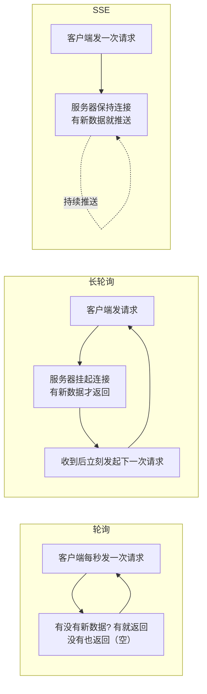
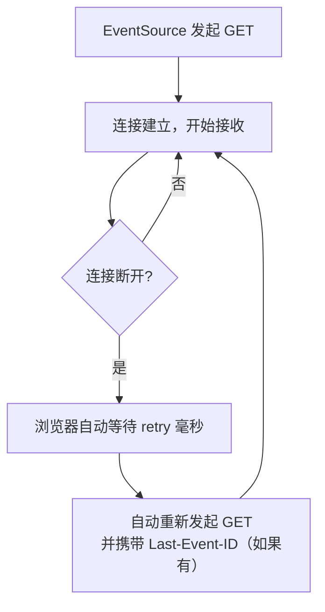
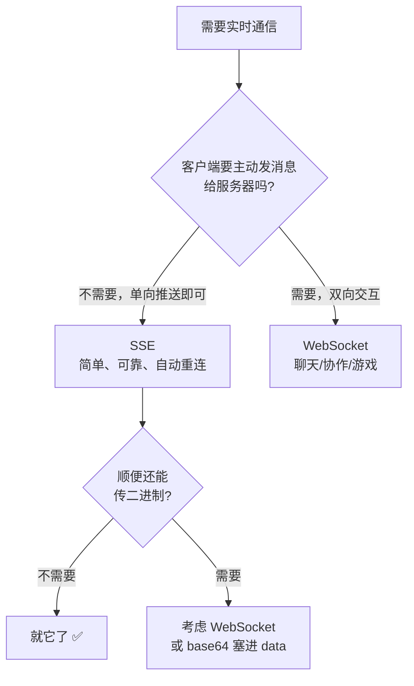

+++
title = 'SSE 详解：HTTP 上的单向实时推送（ChatGPT 打字机效果就是它）'
date = '2026-09-14T14:55:00+08:00'
slug = 'sse'
draft = false
tags = ['sse', 'server-sent-events', 'eventsource', 'http', '实时推送', 'web']
+++

你有没有想过，ChatGPT 那种"一个字一个字往外蹦"的打字机效果是怎么实现的？股票行情页的实时跳动、后台任务的进度条、弹窗里的新消息通知——这些"服务器主动找上门"的场景，背后十有八九是同一个技术：**SSE（Server-Sent Events，服务器发送事件）**。

它不需要 WebSocket，不需要额外协议，一条普通的 HTTP 连接就能把数据源源不断从服务器推到浏览器。本文把它讲透：是什么、协议长什么样、怎么用、有什么坑、和 WebSocket 怎么选。

<!-- more -->

---

## 一、从"拉"到"推"：实时数据的三种姿势

在 SSE 出现之前，让网页"实时"收到服务器数据，主流做法是轮询。我们站内写过一篇[《长轮询》]()，它和轮询、SSE 的关系正好是一条进化线：



三种方式本质都是 HTTP，区别只在于**连接保持多久、服务器怎么用这条连接**：

| 方式 | 连接时长 | 服务器行为 | 实时性 | 请求量 |
| :--- | :--- | :--- | :---: | :--- |
| 轮询 | 每次请求即断 | 有新没新都立即返回 | 取决于轮询间隔 | 高 |
| 长轮询 | 挂起直到有数据 | 有新数据才返回，客户端收到后立刻再连 | 较好 | 中 |
| **SSE** | **一条长连接** | **保持连接，持续推送** | **即时** | **低** |

SSE 的思路是：既然要持续推，干脆**别断**。一次 HTTP 请求建立连接后，服务器想推什么就推什么，推多久都行。

---

## 二、SSE 是什么

**SSE（Server-Sent Events）是 HTML5 规范中定义的一项技术**（由 [W3C](https://www.w3.org/TR/eventsource/) 标准化，现由 WHATWG 维护），让服务器通过 HTTP 连接向浏览器**单向**推送事件。

几个关键特征：

- **基于 HTTP**：不需要新协议、不需要专用服务器，任何能写 HTTP 响应的后端都能实现；
- **单向**：数据只能服务器 → 客户端，客户端要发消息得走普通 HTTP 请求；
- **内置断线重连**：连接断了浏览器自动重连，还能通过 `Last-Event-ID` 从断点续传——这是它和 WebSocket 最大的体验差异；
- **纯文本格式**：MIME 类型是 `text/event-stream`，浏览器原生解析；
- **浏览器原生 API**：一个 `EventSource` 对象搞定，不需要任何库。

一句话定位：**SSE = 一条不关闭的 HTTP 响应流 + 浏览器自动解析**。

---

## 三、协议格式：一张白纸上的"字段拼图"

SSE 的传输格式非常简单，本质是 **UTF-8 文本流**，每个事件由若干"字段行 + 空行"组成：

```text
field: value
field: value

```

一条事件流示例（这是服务器实际往连接上写的字节）：

```text
: 这是注释，客户端忽略

data: 你好，世界

data: {"msg": "第 1 条消息"}
id: 1

event: news
data: 服务器推送了一条新闻

retry: 5000
```

**字段一共四种，外加注释：**

| 字段 | 作用 | 说明 |
| :--- | :--- | :--- |
| `data:` | 消息数据 | 可多行，连续多行会自动用换行拼接成一条 |
| `event:` | 事件类型 | 客户端可用 `addEventListener` 分别监听；不写默认是 `message` |
| `id:` | 事件 ID | 断线重连时浏览器会带上 `Last-Event-ID` 告诉服务器"我收到哪了" |
| `retry:` | 重连间隔（毫秒） | 告诉浏览器断线后多久重连 |
| `:` 开头 | 注释 | 常用作心跳保活，客户端忽略 |

**两条硬规则：**

1. **空行 = 事件结束**——一个事件就是"若干字段行 + 一个空行"；
2. **多行 `data:` 自动拼接**——中间换行变成 `\n`：

```text
data: 第一行
data: 第二行

# 客户端收到的 data 是："第一行\n第二行"
```

服务器要做的，就是往 HTTP 响应里一段段写这种格式的文本，写一点 flush 一点。

---

## 四、客户端：一个 EventSource 就够了

### 4.1 基础用法

```javascript
// 建立连接（GET 请求）
const es = new EventSource('/api/stream');

// 连接建立
es.onopen = () => console.log('连接已建立');

// 接收默认事件（没有 event: 字段的消息）
es.onmessage = (e) => console.log(e.data);

// 连接出错（会自动重连，不用你管）
es.onerror = () => console.log('连接断开，正在重连...');

// 监听命名事件（对应服务端的 event: news）
es.addEventListener('news', (e) => console.log('新闻:', e.data));
```

### 4.2 内置的"免费午餐"：自动重连 + 断点续传

这是 SSE 最舒服的地方——**断线重连是浏览器内置行为**，不需要写任何重试逻辑：



只要服务器在事件里给了 `id:`，重连时浏览器自动带 `Last-Event-ID: <最后收到的id>`，服务器据此从断点继续推——**消息不丢**。

### 4.3 进阶：fetch + ReadableStream（AI 场景的主流）

`EventSource` 有两个限制：**只能用 GET、不能自定义请求头**。大模型流式对话要 POST 提示词、要带 Authorization 头，于是 2024 年以来，**fetch + ReadableStream 读取 SSE 流**成了 AI 应用的事实标准：

```javascript
const res = await fetch('/api/chat', {
  method: 'POST',
  headers: { 'Content-Type': 'application/json', 'Authorization': 'Bearer xxx' },
  body: JSON.stringify({ prompt: '讲个笑话' })
});

const reader = res.body.getReader();
const decoder = new TextDecoder();
let buf = '';

while (true) {
  const { done, value } = await reader.read();
  if (done) break;
  buf += decoder.decode(value, { stream: true });

  // 按空行切出完整事件，逐条处理（自己解析 data: 字段）
  let idx;
  while ((idx = buf.indexOf('\n\n')) >= 0) {
    const raw = buf.slice(0, idx);
    buf = buf.slice(idx + 2);
    for (const line of raw.split('\n')) {
      if (line.startsWith('data:')) {
        renderToken(line.slice(5).trim());   // 渲染一个字/一个 token
      }
    }
  }
}
```

> 服务端返回的仍是 `text/event-stream` 格式，只是客户端从"浏览器自动解析"换成了"自己解析"——这也是为什么现在几乎所有 LLM 网关（OpenAI、Anthropic 兼容接口等）都直接暴露 SSE 流。

---

## 五、服务端：往响应里"慢慢写"即可

SSE 服务端没有魔法，核心就三步：

1. 响应头声明 `Content-Type: text/event-stream`；
2. 告诉代理/浏览器别缓存、别缓冲：`Cache-Control: no-cache`；
3. 保持连接，用上面第三节的格式**边生成边写**（写一段 flush 一段）。

### Python（FastAPI）示例

```python
from fastapi import FastAPI
from fastapi.responses import StreamingResponse
import asyncio

app = FastAPI()

@app.get("/api/stream")
async def stream():
    async def gen():
        for i in range(10):
            # data: ... + 空行 = 一个事件
            yield f"data: 第 {i + 1} 条消息\n\n"
            await asyncio.sleep(1)   # 每秒推一条
    return StreamingResponse(
        gen(),
        media_type="text/event-stream",
        headers={
            "Cache-Control": "no-cache",
            "Connection": "keep-alive",
            "X-Accel-Buffering": "no",   # 关掉 Nginx 缓冲（见第七节）
        },
    )
```

### Node.js 原生示例

```javascript
const http = require('http');

http.createServer((req, res) => {
  res.writeHead(200, {
    'Content-Type': 'text/event-stream',
    'Cache-Control': 'no-cache',
    'Connection': 'keep-alive',
  });

  let n = 0;
  const timer = setInterval(() => {
    res.write(`data: 第 ${++n} 条消息\n\n`);   // 关键：write 而不是 end
    if (n >= 10) { clearInterval(timer); res.end(); }
  }, 1000);
}).listen(3000);
```

要点就一句话：**`write` 后立刻 flush，绝不 `end`，直到你想关流**。任何后端语言做 SSE 都是同一个套路。

---

## 六、典型应用场景

| 场景 | 为什么用 SSE | 具体表现 |
| :--- | :--- | :--- |
| **LLM 流式输出** | 结果按 token 生成，边生成边推 | ChatGPT 打字机效果、AI 对话流式响应 |
| **实时通知** | 低频、单向、无需客户端回话 | 新消息弹窗、告警推送 |
| **任务进度** | 耗时任务分阶段汇报 | 上传/导出/构建进度条 |
| **日志与监控流** | 持续产生、只读展示 | 实时日志、指标看板 |
| **行情/比分** | 高频单向数据 | 股票报价、体育赛事直播 |

这些场景有个共同点：**数据是单向的、量不大但频率高**。这恰好是 SSE 的主场——简单、可靠、浏览器原生支持。

---

## 七、注意的坑：连接数、缓冲、跨域

### 7.1 HTTP/1.1 的连接数上限

浏览器对**同一域名**的 HTTP/1.1 连接默认限制 **6 条**，每条 SSE 连接要占一条。开多个 EventSource、又挂多个下载时可能挤爆。解法：**用 HTTP/2 或 HTTP/3**（多路复用，同域一条连接承载所有流），现代站点部署 HTTPS 后基本默认就是 HTTP/2，这个坑自动消失。

### 7.2 代理缓冲：SSE 最经典的"假死"

Nginx 等反向代理默认会**缓冲后端响应**，攒够一定量才转发给客户端——SSE 会被卡住不动，看起来像假死。解决：关闭该 location 的缓冲：

```nginx
location /api/stream {
    proxy_buffering off;          # 关闭缓冲
    proxy_cache off;              # 关闭缓存
    proxy_read_timeout 3600s;     # 别让代理 60 秒就掐断连接
    add_header X-Accel-Buffering no;   # 或者用响应头通知（见第五节）
}
```

### 7.3 跨域（CORS）

`EventSource` 跨域时，服务端需要：

```http
Access-Control-Allow-Origin: https://你的域名
```

需要带 cookie 的话，客户端传 `new EventSource(url, { withCredentials: true })`，服务端再配 `Access-Control-Allow-Credentials: true`。

### 7.4 单向限制

SSE 不能从客户端发消息。**需要双向通信（聊天室、在线协作、游戏）就选 WebSocket**，别硬用 SSE 套 HTTP POST 去凑。

### 7.5 连接挂起与代理超时

SSE 连接长期空闲时，中间代理可能按空闲超时掐断。常用**注释行心跳**保活——服务器每隔 30 秒发一行 `: ping\n\n`，浏览器自动忽略，但连接"看起来活着"。

---

## 八、SSE vs WebSocket：到底怎么选

两者常被拿来对比，但其实是不同量级的工具：

| 维度 | SSE | WebSocket |
| :--- | :--- | :--- |
| 方向 | 单向（服务器 → 客户端） | 双向（任意时刻任意方向） |
| 协议 | 普通 HTTP 之上 | 独立协议（ws://，需握手升级） |
| 浏览器 API | `EventSource`，原生内置 | `WebSocket`，原生内置 |
| 自动重连 | ✅ 内置 | ❌ 自己实现 |
| 断点续传 | ✅ `Last-Event-ID` | ❌ 需自己设计 |
| 二进制数据 | ❌ 纯文本 | ✅ 支持 |
| 代理/防火墙穿透 | ✅ 友好（就是 HTTP） | ⚠️ 需要代理支持升级 |
| 服务端复杂度 | 低（写 HTTP 响应） | 高（管理连接状态、心跳、协议帧） |
| 典型场景 | LLM 流式、通知、进度、行情 | 聊天、协作、游戏 |

**一个简单的决策流程：**



2026 年的行业共识（也是 LLM 应用实践出来的结论）：**能 SSE 就 SSE**。它基于 HTTP、可穿透、自动重连、断点续传，后端实现成本极低；只有真正需要双向或二进制的场景才值得上 WebSocket。

---

## 总结

用三句话记住 SSE：

- **它是"挂在 HTTP 上的单向推送流"**：一次请求、长连接、服务器边生成边写 `text/event-stream` 文本，浏览器原生解析；
- **它把"断线"变成了小事**：自动重连 + `Last-Event-ID` 断点续传，是 WebSocket 给不了的体验；
- **它因大模型而翻红**：ChatGPT 的打字机效果、AI 接口的流式响应，底层几乎都是 SSE——`fetch + ReadableStream` 解析 SSE 已成了 AI 应用的标准姿势。

> 下次看到"一个字一个字蹦出来"的网页，可以自信地说：这不是 WebSocket，这是 **SSE**。

---

> 参考链接：[W3C：Server-Sent Events 规范](https://www.w3.org/TR/eventsource/) · [MDN：使用服务器发送事件](https://developer.mozilla.org/zh-CN/docs/Web/API/Server-sent_events/Using_server-sent_events) · [MDN：EventSource](https://developer.mozilla.org/zh-CN/docs/Web/API/EventSource) · [WHATWG HTML 规范：SSE](https://html.spec.whatwg.org/dev/server-sent-events.html) · [MDN：fetch API](https://developer.mozilla.org/zh-CN/docs/Web/API/Fetch_API) · [FastAPI：StreamingResponse](https://fastapi.tiangolo.com/advanced/custom-response/#streamingresponse)
