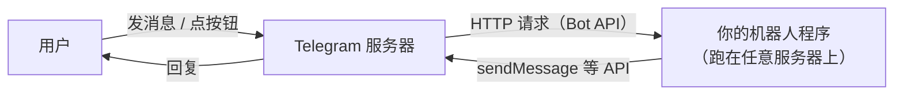
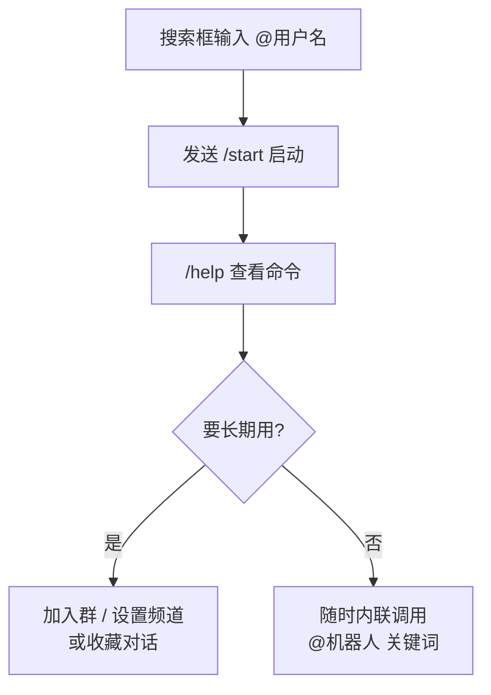
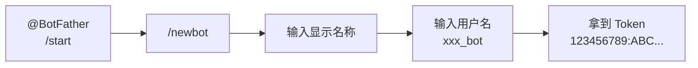

+++
title = 'Telegram 机器人入门与导览：从 BotFather 到自动化生活'
date = '2026-09-14T15:05:00+08:00'
slug = 'telegram-bots'
draft = false
tags = ['telegram', 'bot', '机器人', 'botfather', '自动化', 'rss']
+++

Telegram 有个别家即时通讯软件很难复制的东西：**机器人（Bot）**。不需要下载 App、不需要注册新账号，在聊天框里 @ 一下，一个能查天气、管群、推 RSS、甚至陪你聊天的程序就上线了——而且任何人都能自己造一个。

这篇文章参考仓库 `ref/` 目录里那份机器人分类清单，把它整理成一份更可靠、更实用的入门指南：机器人是什么、官方机器人有哪些、常用分类怎么选、怎么自己动手做一个。

<!-- more -->

---

## 一、机器人是什么

Telegram 机器人本质上是一个**通过 HTTP API 与 Telegram 服务器交互的程序**。它没有独立的客户端界面，看起来就是一个联系人，头像右下角带个机器人徽章，用户名以 `bot` 结尾：



几个基本概念：

- **用户名**：机器人的唯一标识，形如 `@MyBot`，必须以 `bot` 结尾；
- **Token**：创建时 BotFather 发给你的一串密钥（形如 `123456789:ABC...`），所有 API 调用都要带上它——**相当于机器人的密码，绝对不能泄露**；
- **交互方式**：斜杠命令（`/start`、`/help`）、内联键盘按钮、以及**内联模式**（在任何聊天框输入 `@bot 关键词` 直接调用）。

用户不需要装任何东西——手机、桌面、网页版都能用，这是机器人最大的便利。

---

## 二、先认识官方机器人

Telegram 官方自己维护了一批机器人，质量可靠、长期稳定，是新手最好的第一站：

| 机器人 | 干什么 |
| :--- | :--- |
| **@BotFather** | 创建、管理所有机器人的"机器人之父"（下文细讲） |
| **@StickerBot** | 把图片/视频做成贴纸包 |
| **@gif** | 搜索并发送 GIF 动图 |
| **@wiki** | 维基百科词条搜索 |
| **@imdb** | 电影/剧集信息查询 |
| **@music** | 搜索音乐 |
| **@youtube** | 搜索 YouTube 视频 |
| **@dice** / **@gamebot** | 掷骰子、内置小游戏 |
| **@vote** / **@like** | 群里发起投票/点赞 |

这些机器人在聊天框里输入 `@wiki python` 就能内联使用，不用专门开对话。**官方机器人都有蓝色认证勾**，认准这个标识，别被高仿号骗了。

---

## 三、机器人分类导览

社区里机器人数以十万计，`ref/` 目录那份清单按功能分了 10 类（聊天、管理、工具、通知、搜索、游戏、音乐、购物、翻译、新闻）。这个框架没问题，但要泼一盆冷水：**机器人生态更替极快**，今天搜得到的明天可能就下架，网上流传的清单（包括不少 AI 生成的内容）里混着大量已失效或从未存在的名字。下面按类别给出**真实存在、口碑稳定**的代表，找不到的以官方 @BotFather 搜索结果为准。

### 3.1 群组管理（最刚需的一类）

群里广告刷屏、新人捣乱、权限混乱——管理机器人就是为了解决这些：

- **@combot**：老牌群管，防广告、违规词过滤、成员统计、欢迎语，约 43 万月活；
- **@ManagioBot**：偏安全的群管，免费核心功能，主打禁言/封禁与反垃圾；
- **@GroupHelpBot**：经典群管助手，自动踢人、设置群规。

这类机器人通常要**设为群管理员**才能生效，常见功能：自动清理垃圾消息、欢迎新成员、管理权限、统计活跃度。

### 3.2 RSS / 通知 / 监控（信息流枢纽）

Telegram 机器人最值得称道的用法之一：**把 RSS 订阅变成一条条推送**，替代邮箱订阅：

- **@RSSWBot**（RSS屋）：中文界面，全文 RSS + 关键词过滤；
- **@rss2tg_bot**：老牌 RSS/Atom 推送机器人；
- **@NodeRSS_bot**：开源自部署方案，数据自己掌控；
- **@TheFeedReaderBot**：监控 RSS 与社交媒体账号变动；
- **@UptimeRobot**：网站可用性监控，挂了立刻推送告警。

> 进阶玩法：用开源的 [RSS-to-Telegram](https://github.com/Rongronggg9/RSS-to-Telegram-Bot)（Docker 一键部署）自建订阅服务，频道、群、私聊通吃，不怕第三方机器人跑路。

### 3.3 工具类

文件格式转换、图片处理、二维码、翻译、汇率……这类工具机器人种类最多、也最容易踩坑（很多已失效）。选择时记住两点：**认准认证勾、别传敏感文件给不明机器人**。

### 3.4 搜索 / 内容

- **@jiso**（极搜）：中文内容搜索，群、频道、视频、音乐、新闻一把抓，中文用户口碑很好；
- 官方系：**@wiki**、**@imdb**、**@youtube**，质量稳定。

### 3.5 音乐 / 娱乐 / 游戏

- **@music**（官方）：搜歌、分享；
- **@gamebot**、**@dice**：内置小游戏和骰子，群里活跃气氛必备；
- 大量"音乐下载"类机器人涉嫌版权风险，**经常被下线**，用之前想清楚。

### 3.6 AI 聊天：别信清单，认准官方

`ref/` 清单里列了 `@ChatGPTBot`、`@bing`、`@bard`、`@claude` 之类的"AI 机器人"——**这些大多不是官方账号，很多已失效或只是引流号**。真实情况：

- **Telegram 官方没有 ChatGPT/Claude 机器人**；
- 用 AI 机器人前务必确认开发者身份和付费说明，警惕"免费无限用"的骗局；
- 注意隐私：发给机器人的内容可能被第三方留存，别发敏感信息。

---

## 四、怎么用：从找到聊

1. **查找**：在 Telegram 搜索框输入机器人用户名（如 `@combot`），点进对话；
2. **启动**：发送 `/start`（或点 Start 按钮），机器人开始工作；
3. **看命令**：发送 `/help` 查看可用命令；很多机器人有 `/menu`、`/settings`；
4. **内联调用**：在任意聊天框输入 `@机器人名 关键词`，不用专门开对话——比如 `@wiki python`、`@gif 猫`；
5. **拉进群**：把机器人加进群聊并设为管理员，群管功能生效。



---

## 五、安全提醒：机器人世界的三条铁律

- **Token 是命根子**：创建机器人拿到的 token 一旦泄露，任何人都能控制你的机器人。写进代码后记得用环境变量，别提交进 Git；
- **认准认证勾**：Telegram 官方机器人和知名第三方都有蓝色/灰色认证标识，查不到认证的"官方 ChatGPT"之类的十有八九是钓鱼；
- **别乱点、别乱传**：不明机器人发来的链接可能是钓鱼/恶意软件；文件转换、图片类机器人会拿到你的文件，敏感内容别传。

---

## 六、自己动手：十分钟造一个机器人

看完别人家的机器人，不妨自己造一个——过程比想象中简单。

### 6.1 用 BotFather 创建

1. 搜索 **@BotFather**，发送 `/start`；
2. 发送 `/newbot`；
3. 按提示输入**显示名称**（随便起）和**用户名**（必须以 `bot` 结尾，全局唯一）；
4. 创建成功后 BotFather 会返回 **token**，保存好。



### 6.2 用 HTTP API 发第一条消息

不需要任何框架，一行 curl 就能验证 token 可用：

```bash
curl "https://api.telegram.org/bot<你的TOKEN>/getMe"
# 返回 {"ok":true,"result":{"username":"...","first_name":"..."}}

# 给自己发消息（chat_id 可以先通过 getUpdates 拿到）
curl "https://api.telegram.org/bot<你的TOKEN>/sendMessage" \
  -d "chat_id=<你的ID>" \
  -d "text=你好，这是我的第一个机器人！"
```

### 6.3 用 Python 写个真正的机器人

社区最主流的库是 `python-telegram-bot`（v20+，异步 API）：

```bash
pip install python-telegram-bot
```

```python
import os
from telegram import Update
from telegram.ext import Application, CommandHandler, ContextTypes

async def start(update: Update, context: ContextTypes.DEFAULT_TYPE):
    await update.message.reply_text("你好！我是你的机器人。")

# token 从环境变量读取，别硬编码进代码
app = Application.builder().token(os.environ["TG_TOKEN"]).build()
app.add_handler(CommandHandler("start", start))

# 长轮询：持续接收更新；正式部署可换 Webhook
app.run_polling()
```

跑起来后回到 Telegram，对你的机器人发送 `/start`，它就会回复。从"会用"到"会造"，门槛就是这么低——这也是 Telegram 机器人生态能如此繁荣的根本原因。

---

## 总结

用三句话记住 Telegram 机器人：

- **它是即开即用的自动化入口**：无需安装 App，一个 @ 用户名 + `/start` 就能用，从群管到 RSS 推送到内容搜索全覆盖；
- **生态很丰富、水也很深**：网上流传的机器人清单（包括 `ref/` 那份）都有大量过时或虚构条目，认准官方认证、以 @BotFather 实际搜索为准；
- **人人都能造**：BotFather 创建 + 一个 token + 几十行代码，你的第一个机器人十分钟就能上线。

> 下一回被群里的广告烦到、为错过某个网站更新焦虑时，记住：Telegram 里大概率已经有个机器人能帮你解决。

---

> 参考链接：[Telegram 官方：Bots 文档](https://core.telegram.org/bots) · [Bot API 手册](https://core.telegram.org/bots/api) · [python-telegram-bot](https://python-telegram-bot.org/) · [RSS-to-Telegram-Bot（开源）](https://github.com/Rongronggg9/RSS-to-Telegram-Bot) · [电报机器人大全（2026 精选）](https://codertesla.github.io/telegram-bots/)
