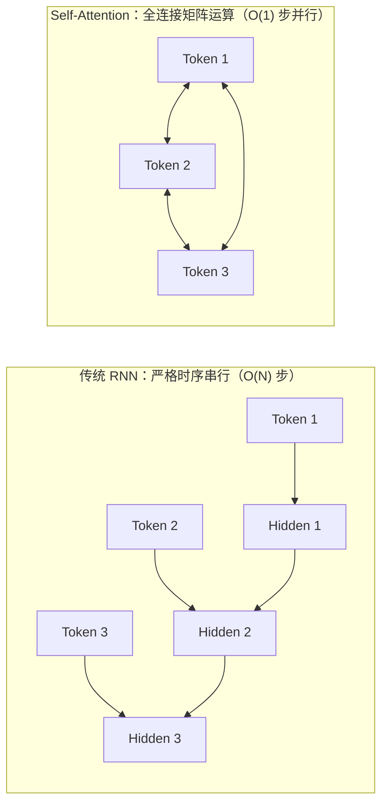
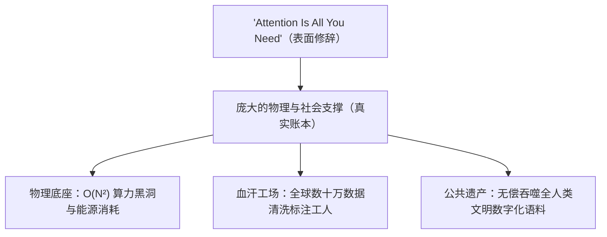

+++
title = 'Attention Is All You Need？重读经典与被隐匿的技术账本'
date = '2026-09-16T10:00:00+08:00'
slug = 'attention-is-all-you-need-review'
draft = false
tags = ['ai', 'transformer', 'deep-learning', '技术思考', '架构']
+++

二〇一七年，Google 的八位研究者发表了一篇题为《Attention Is All You Need》的论文。论文题目的口气极狂妄——“注意力就是你所需要的一切”。然而在随后的几年里，它不仅重塑了自然语言处理，更催生了今天席卷全球的大语言模型浪潮。

然而，当喧嚣的泡沫漫过地平线，当人们在赞叹与恐慌中不断交织，我们或许更应当重新坐下来，把这篇开山之作拆开看一看：它究竟在工程上做对了什么？而在那句轻巧的“All You Need”背后，又究竟隐匿了怎样庞大的现实代价？

<!-- more -->

---

## 一、 开山之斧：Transformer 到底革了什么命？

在 Transformer 问世之前，机器理解人类语言的主流方案是循环神经网络（RNN、LSTM 与 GRU）。

用 RNN 读句子，极像老秀才念书：摇头晃脑、逐字逐句地挨着过。计算第 $t$ 个词时，必须依赖第 $t-1$ 个词隐状态的计算结果。这种**严格的时间序依赖**（Sequential Dependency）带来了两个无法逾越的致命伤：

1. **计算无法大规模并行**：序列长度为 $N$，就必须老老实实串行计算 $N$ 步。硬件哪怕有上万个核心，也只能在一旁干等着。
2. **长程遗忘与梯度消散**：即使有门控机制（Gate），当上下文跨越上千个 Token 时，前文的信息依然会在漫长的迭代链条中被稀释殆尽。



《Attention Is All You Need》的狠辣之处，在于**彻底砸碎了这种“时间的枷锁”**。

它摒弃了所有的循环与卷积，将序列平铺在二维矩阵中，用**自注意力机制（Self-Attention）**让所有 Token 在一步之内彼此打照面。它的核心公式简洁得近乎优雅：

$$\text{Attention}(Q, K, V) = \text{softmax}\left(\frac{QK^T}{\sqrt{d_k}}\right)V$$

通过查询矩阵 $Q$ 与键矩阵 $K$ 的内积，机器在几纳秒内算出了整个上下文里所有词与词之间的关联权重，再对值矩阵 $V$ 进行加权汇聚。

从学术意义上讲，它提出了一种关联度建模的新范式；但从工业历史来看，**它真正的功绩在于彻底迎合了现代 GPU/TPU 的硬件胃口**。矩阵乘法可以在数千张加速卡上毫无阻碍地铺展开来，通信密集型转为了计算密集型，从而为后来的“大力出奇迹”（Scaling Law）修筑了唯一可行的铁轨。

没有 Transformer，后来的 GPT、Gemini、Claude 以及开源开源界的一众巨兽，连出生的产房都无从寻觅。

---

## 二、 修辞与代价：“Attention”真就是一切么？

论文的名字起得极具浪漫色彩，甚至带有一种禅宗式的绝对——“Attention Is All You Need”。

但这世上从来没有凭空出现的奇迹。当我们凝视如今的大模型产业时，便会发现：**为了支撑这句“只要注意力”，人类在底层支付了何其沉重的现实账单**。



### 1. 物理底座：算力黑洞与吞电巨兽
标准自注意力的时空复杂度是序列长度的平方：

$$\mathcal{O}(N^2)$$

当上下文窗口从 2K、8K 扩展到 128K 乃至 1M 时，注意力矩阵的显存与计算开销呈指数级爆发。所谓“注意力”，在物理现实中是一排排日夜轰鸣的液冷服务器机柜、消耗整座水库冷却水的数据中心，以及需要专用核电站或高压电网供电的超级集群。

**支撑“智能”幻象的，从来不是什么纯粹的数学灵光，而是纯粹的、粗暴的工业暴力（Brute Force）。**

### 2. 数字苦力：隐匿在屏幕背后的标注大军
大模型能够吐出符合文明规范、温和理性的言语，并不是它懂得了仁义道德，而是来自强化学习对齐（RLHF）。

在这张光鲜席面的后厨，是东非肯尼亚每小时两美元的外包工、东南亚的数据工厂，以及无数日夜审视暴力、血腥、仇恨言论并逐条贴标签的年轻劳力。机器光鲜的衣袍上，每一针每一线都浸透着数字泰勒主义下的廉价劳动。

### 3. 公共公地：对全人类智力成果的无偿收割
模型之所以博古通今，是因为它在没有支付任何实质成本的前提下，把人类数百年来沉淀的文学、科学、代码、历史记录统统刮地三尺，吞入腹中转化为概率分布参数。然后，几家科技巨头转身筑起围墙，以每月 20 美元的订阅费或按每百万 Token 收费的 API，向创造了这些内容的人类反向收取租金。

---

## 三、 现代技术围城：席面、看客与帮闲

如果把如今围绕 Transformer 建立的产业秩序拉远来看，几乎是一幅微缩的社会权力图景：

* **做东分肥者**：手握芯片垄断权与先进封装产能的硬件巨头，以及垄断数据中心、网络骨干与海量资本的云平台。他们掌控了“注意力”的批发权，高筑专利与资本壁垒，兜售着“AGI 降临即新纪元”的宏大叙事。
* **帮忙与帮闲者**：技术自媒体、布道师与课程贩子们如过江之鲫。今日宣称“某行业彻底消亡”，明日兜售“普通人最后一次逆袭船票”。他们依靠贩卖焦虑维生，把复杂的工程演进包装成神秘的神迹，再把解药以高价卖出。
* **焦虑的看客**：普通工程师与从业者被席卷在跑分图表与更新日志的洪流中。每隔几周便有“打败人类专家”的榜单出炉，看客们一面在社交平台上拍手惊叹，一面在深夜担忧自己的工作何时会被这一团参数矩阵替代。

然而，当技术狂欢散去，坐在桌边大快朵颐的，从来不是屏幕前那个日夜奔忙的普通劳动者。

---

## 四、“从来如此，便对么？”——Transformer 的黄昏与突围

哪怕单从纯粹的技术逻辑来看，Transformer 统治了近十年后，其固有的局限也已经暴露无遗：

```mermaid
mindmap
  root((Transformer 的固有天花板))
    自回归概率本质
      Next-Token Prediction 缺乏真实世界模型
      不可消除的随机幻觉 (Hallucination)
    计算复杂度瓶颈
      长文本 O(N²) 内存与带宽墙
      KV Cache 随并发与长度无限膨胀
    数据枯竭
      公网高质量人类语料见顶
      合成数据陷入模型崩溃 (Model Collapse)
```

1. **概率的鹦鹉，没有真正的常识与因果**  
   自回归语言模型的核心逻辑始终是“猜下一个词”（Next-Token Prediction）。它可以在语法和文采上以假乱真，但它并不理解“重力”、“死亡”或“承诺”在现实世界的物理与道德分量。它把谎言和真理同样处理为高置信度的条件概率。
2. **边际效益正在急剧衰减**  
   公网上高质量的人类文字已被挖掘殆尽。为了换取基准测试上两三个百分点的提升，需要的能源、参数量和芯片投入正在呈十倍、百倍地上升。

正因如此，近年来的学术与工业界早已在用脚投票：
* **结构层面的减负**：FlashAttention 压榨显存带宽；MoE（混合专家）在保持激活参数克制的同时扩大容量；Mamba、RWKV 等状态空间模型试图在长序列上找回线性的时间优势。
* **范式层面的转向**：从纯粹的预训练参数堆叠，转向推理时计算（Test-time Compute）、自我反思、Monte Carlo 树搜索等逻辑链强化。

**这一切探索都在事实层面上宣告：“Attention”从来不是你所需要的一切。它是一个极出色的发动机部件，但它绝不是智能的整车。**

---

## 五、 结语：首在立人，人立而后凡事举

我们该如何面对这个由《Attention Is All You Need》开启的庞大时代？

**第一，不必去神化它。**  
它不是神明，也不是拥有灵魂的新物种，而是一台规模空前、造价高昂的“现代语言统计织布机”。把神秘的光环从它身上剥去，它就只是工具箱里一把更锋利但也极沉重的铁凿。

**第二，不必退缩抗拒，当用“拿来主义”。**  
不论这技术来自大洋彼岸还是巨头之手，凡是能替我们写掉重复样板代码、能辅助处理冗杂资料、能加速分析推理的部分，只管拿来，为我所用。弱者才在工具面前下跪，清醒的实践者永远以工具为奴仆。

**第三，最紧要的，是守住人的主体性。**  
近现代思想转型中有一句至关重要的话：**“首在立人，人立而后凡事举。”**

技术的危险之处，往往不在于机器变得多么像人，而在于**人主动把自己矮化为机器**：
* 当程序员只懂得复制粘贴模型吐出的代码，不再深究底层原理；
* 当写作者将构思与批判完全交付给平滑的生成词句，放弃了痛苦而珍贵的思维蜕变；
* 当社会将成千上万鲜活的个体降级为喂养算法的提词员与标注文员——

那么，哪怕屏幕里的 Attention 能够计算尽宇宙间的一切关联，人类最终所得到的，也不过是一座由概率矩阵精巧编织的、更加难以打破的现代化铁屋子罢了。

走出门去，多看事实，保持审辨，做扎实具体的事。在这片由算法与硅片堆叠的森林里，**人自己的觉醒与筋骨，才是真正不可被替代的一切。**
