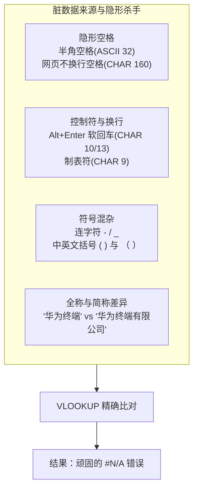
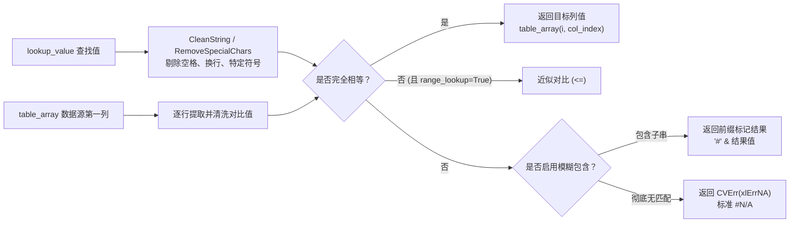
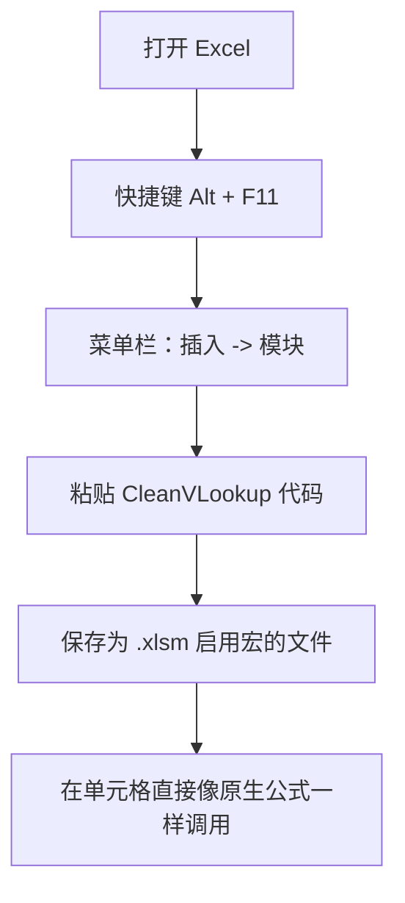

+++
title = '告别 #N/A：从原生 VLOOKUP 痛点到编写专属 VBA 自定义清洗查找宏'
date = '2026-09-17T13:30:00+08:00'
slug = 'excel-vlookup-and-vba-custom-macro'
draft = false
tags = ['Excel', 'VLOOKUP', 'VBA', '宏', '数据清洗', '办公自动化']
+++

在日常办公与数据处理中，`VLOOKUP` 无疑是普及度最高、使用频率最密集的 Excel 函数之一。然而，几乎每位表格打工人都有过被 `#N/A` 支配的绝望经历：明明两边的物料编码、员工姓名、订单号在肉眼看来一模一样，但 VLOOKUP 却固执地返回 `#N/A`。

追根究底，绝大多数查找失败并非公式逻辑有误，而是**数据源污染**——ERP/CRM 导出的隐形换行符、网页复制带来的非间断空格（`&nbsp;`）、中英文混杂的标点符号，甚至是员工录入时无意多按的一个空格。

本文将从 VLOOKUP 失效的底层根源讲起，带你一步步通过 Excel VBA 自定义函数（User-Defined Function, UDF）编写专属的「百毒不侵」查找宏，从**字符级白名单过滤**到**黑名单精准剥离**，再到**智能模糊匹配与前缀预警**，彻底终结查找匹配中的脏数据顽疾。

<!-- more -->

---

## 一、为什么原生 VLOOKUP 屡屡翻车？

标准的 `VLOOKUP(lookup_value, table_array, col_index_num, [range_lookup])` 在精确查找模式下（第四参数设为 `FALSE` 或 `0`），要求目标单元格与查找值的**每一个字节必须严格相等**。

但在现实业务场景中，数据往往来自多个异构系统，常见陷阱包括：



1. **不可见空格与特殊字符**：
   - 常见的 ASCII 32 普通空格；
   - 网页或系统导出经常夹带的 `CHAR(160)`（即 HTML 中的 `&nbsp;` 非换行空格），普通的 `TRIM()` 函数根本清不掉它；
   - 单元格内换行符（`CHAR(10)` 换行符 LF、`CHAR(13)` 回车符 CR）以及制表符 `CHAR(9)`。
2. **标点与分隔符不统一**：
   - 物料型号如 `ABC-1234` 与 `ABC_1234` 或 `ABC1234`，格式不一导致匹配失败；
   - 括号、斜杠、冒号的全半角混乱。
3. **嵌套函数救火的局限**：
   - 有人尝试在公式里套娃：`=VLOOKUP(TRIM(CLEAN(SUBSTITUTE(A2, CHAR(160), ""))), ...)`；
   - 这种写法不仅极其冗长、难以维护，而且**只能清理查找值，无法清洗整个数据源区域的每一行**。一旦数据源底表也有隐藏脏字符，公式依然抓瞎。

因此，最优雅、最高效的解法，就是封装一个**自带清洗能力的 VBA 自定义函数**。

---

## 二、架构设计：从底层思路构建 CleanVLookup

自定义函数（UDF）最大的优势在于：**保持原生公式的简易交互，将复杂的清洗和容错逻辑留在引擎内部**。



接下来，我们由浅入深，递进解析三种不同场景的实现方案。

---

## 三、方案一：CleanVLookup —— 纯净 ASCII 白名单过滤

如果你查找的内容主要是**产品型号、条形码、英文字符串、编号、纯数字**，最彻底的办法是只保留可见的常用 ASCII 字符（33 到 126），直接把空格、制表符、各种回车换行物理蒸发。

### 1. 代码实现

```vb
Function CleanVLookup(lookup_value As Variant, table_array As Range, col_index_num As Integer, Optional range_lookup As Boolean = False) As Variant
    Dim i As Long
    Dim clean_lookup As String
    Dim clean_cell_value As String
    Dim cell_value As Variant
    
    ' 清理查找值，去除空格、回车等特殊符号
    clean_lookup = CleanString(CStr(lookup_value))
    
    ' 如果range_lookup为False，则精确匹配
    If Not range_lookup Then
        For i = 1 To table_array.Rows.Count
            cell_value = table_array.Cells(i, 1).Value
            If Not IsEmpty(cell_value) And Not IsError(cell_value) Then
                clean_cell_value = CleanString(CStr(cell_value))
                If clean_lookup = clean_cell_value Then
                    CleanVLookup = table_array.Cells(i, col_index_num).Value
                    Exit Function
                End If
            End If
        Next i
    Else
        ' 如果range_lookup为True，则近似匹配（按排序顺序查找）
        For i = 1 To table_array.Rows.Count
            cell_value = table_array.Cells(i, 1).Value
            If Not IsEmpty(cell_value) And Not IsError(cell_value) Then
                clean_cell_value = CleanString(CStr(cell_value))
                If clean_lookup <= clean_cell_value Then
                    CleanVLookup = table_array.Cells(i, col_index_num).Value
                    Exit Function
                End If
            End If
        Next i
    End If
    
    ' 如果没有找到匹配项，返回错误值
    CleanVLookup = CVErr(xlErrNA)
End Function

Function CleanString(str As String) As String
    ' 去除字符串中的空格、回车、换行符等特殊符号
    Dim result As String
    Dim i As Integer
    Dim char As String
    
    result = ""
    For i = 1 To Len(str)
        char = Mid(str, i, 1)
        ' 只保留字母、数字和常见英文可见符号（ASCII 33~126），去除空格、回车、制表符等
        If Asc(char) >= 33 And Asc(char) <= 126 Then
            result = result & char
        End If
    Next i
    
    CleanString = result
End Function
```

### 2. 特点与注意要点

- **彻底净化**：无论是前端空格、尾随空格、中间空格、还是 `Alt+Enter` 换行，通通被抹平。
- **重要避坑**：`Asc(char)` 函数处理中文字符时，返回的往往是负数（双字节编码），因此该版本会**误删中文字符**！若查找字段包含中文姓名、公司名称，请直接使用下面的方案二或方案三。

---

## 四、方案二：CleanVLookup2 —— 黑名单符号替换（完美支持中文）

在日常业务中，查找值往往包含中文姓名或混合名称，我们希望保留中文字符，仅精准剔除**空白符与易造成混乱的连接标点**。

### 1. 代码实现

```vb
Function CleanVLookup2(lookup_value As Variant, table_array As Range, col_index_num As Integer, Optional range_lookup As Boolean = False) As Variant
    Dim i As Long
    Dim clean_lookup As String
    Dim clean_cell_value As String
    Dim cell_value As Variant
    
    ' 清理查找值
    clean_lookup = RemoveSpecialChars(CStr(lookup_value))
    
    ' 精确匹配
    If Not range_lookup Then
        For i = 1 To table_array.Rows.Count
            cell_value = table_array.Cells(i, 1).Value
            If Not IsEmpty(cell_value) And Not IsError(cell_value) Then
                clean_cell_value = RemoveSpecialChars(CStr(cell_value))
                If clean_lookup = clean_cell_value Then
                    CleanVLookup2 = table_array.Cells(i, col_index_num).Value
                    Exit Function
                End If
            End If
        Next i
    Else
        ' 近似匹配
        For i = 1 To table_array.Rows.Count
            cell_value = table_array.Cells(i, 1).Value
            If Not IsEmpty(cell_value) And Not IsError(cell_value) Then
                clean_cell_value = RemoveSpecialChars(CStr(cell_value))
                If clean_lookup <= clean_cell_value Then
                    CleanVLookup2 = table_array.Cells(i, col_index_num).Value
                    Exit Function
                End If
            End If
        Next i
    End If
    
    ' 未找到匹配项
    CleanVLookup2 = CVErr(xlErrNA)
End Function

Function RemoveSpecialChars(str As String) As String
    ' 使用 Replace 函数精准剔除常见的空白字符、回车换行与标点符号
    Dim result As String
    result = str
    
    ' 1. 空白与控制符
    result = Replace(result, " ", "")               ' 半角空格
    result = Replace(result, Chr(160), "")          ' 不换行空格 (网页复制常见 &nbsp;)
    result = Replace(result, vbTab, "")             ' 制表符
    result = Replace(result, vbCrLf, "")            ' Windows 回车+换行
    result = Replace(result, vbCr, "")              ' 回车
    result = Replace(result, vbLf, "")              ' 换行
    
    ' 2. 标点与分隔符（根据业务实际需要灵活增减）
    result = Replace(result, "-", "")               ' 连字符
    result = Replace(result, "_", "")               ' 下划线
    result = Replace(result, ".", "")               ' 点号
    result = Replace(result, "(", "")               ' 英文左括号
    result = Replace(result, ")", "")               ' 英文右括号
    result = Replace(result, "（", "")              ' 中文左括号
    result = Replace(result, "）", "")              ' 中文右括号
    result = Replace(result, "[", "")               ' 左方括号
    result = Replace(result, "]", "")               ' 右方括号
    result = Replace(result, "{", "")               ' 左花括号
    result = Replace(result, "}", "")               ' 右花括号
    result = Replace(result, "/", "")               ' 斜杠
    result = Replace(result, "\", "")               ' 反斜杠
    result = Replace(result, ":", "")               ' 冒号
    result = Replace(result, ";", "")               ' 分号
    result = Replace(result, ",", "")               ' 逗号
    
    RemoveSpecialChars = result
End Function
```

### 2. 优势分析

- **中文友好**：完全不会损害中文汉字。
- **解决连字符异构**：例如查找 `IPHONE-15-PRO` 与底表的 `iPhone 15 Pro`，清洗后两者均变为 `IPHONE15PRO`，能够直接命中！
- **可定制性极强**：如果在你的业务中斜杠 `/` 代表重要分类不能剔除，只需在 `RemoveSpecialChars` 中注释掉对应行即可。

---

## 五、方案三：CleanVLookup3 —— 融合模糊包含与「前缀预警」

在客户主数据、供应商名称对账等场景中，往往还会遇到**简称与全称**的问题。例如：
- 查找值输入的是：`字节跳动`；
- 数据源登记的是：`北京字节跳动科技有限公司`。

如果常规匹配失败，我们希望函数能够**自动降级尝试包含匹配**，但为了防止业务人员误将模糊猜测当作绝对精确结果，**必须给模糊匹配的结果打上醒目标记（如前缀 `#`）**，便于筛选和人工复核。

### 1. 代码实现

```vb
Function CleanVLookup3(lookup_value As Variant, table_array As Range, col_index_num As Integer, Optional range_lookup As Boolean = False) As Variant
    Dim i As Long
    Dim clean_lookup As String
    Dim clean_cell_value As String
    Dim cell_value As Variant
    
    ' 清理查找值
    clean_lookup = RemoveSpecialChars2(CStr(lookup_value))
    
    ' 阶段一：清洗后的精确匹配
    If Not range_lookup Then
        For i = 1 To table_array.Rows.Count
            cell_value = table_array.Cells(i, 1).Value
            If Not IsEmpty(cell_value) And Not IsError(cell_value) Then
                clean_cell_value = RemoveSpecialChars2(CStr(cell_value))
                If clean_lookup = clean_cell_value Then
                    CleanVLookup3 = table_array.Cells(i, col_index_num).Value
                    Exit Function
                End If
            End If
        Next i
    Else
        ' 近似匹配（有序数据）
        For i = 1 To table_array.Rows.Count
            cell_value = table_array.Cells(i, 1).Value
            If Not IsEmpty(cell_value) And Not IsError(cell_value) Then
                clean_cell_value = RemoveSpecialChars2(CStr(cell_value))
                If clean_lookup <= clean_cell_value Then
                    CleanVLookup3 = table_array.Cells(i, col_index_num).Value
                    Exit Function
                End If
            End If
        Next i
    End If

    ' 阶段二：降级模糊匹配（检查是否互相包含）
    If Len(clean_lookup) > 0 Then
        For i = 1 To table_array.Rows.Count
            cell_value = table_array.Cells(i, 1).Value
            If Not IsEmpty(cell_value) And Not IsError(cell_value) Then
                clean_cell_value = RemoveSpecialChars2(CStr(cell_value))
                
                ' 双向包含判定：A包含B 或 B包含A
                If InStr(clean_cell_value, clean_lookup) > 0 Or InStr(clean_lookup, clean_cell_value) > 0 Then
                    ' 前缀加上 # 作为警示标记，提醒使用者该条为模糊推断结果
                    CleanVLookup3 = "#" & table_array.Cells(i, col_index_num).Value
                    Exit Function
                End If
            End If
        Next i
    End If
    
    ' 最终未找到匹配项
    CleanVLookup3 = CVErr(xlErrNA)
End Function

Function RemoveSpecialChars2(str As String) As String
    Dim result As String
    result = str
    
    ' 过滤空白及常见符号
    result = Replace(result, " ", "")
    result = Replace(result, Chr(160), "")
    result = Replace(result, vbTab, "")
    result = Replace(result, vbCrLf, "")
    result = Replace(result, vbCr, "")
    result = Replace(result, vbLf, "")
    
    RemoveSpecialChars2 = result
End Function
```

### 2. 核心设计精髓

- **梯次匹配**：先走最严格的精确比对；只有在没有任何单元格完全相符时，才会落入 `InStr` 模糊包含扫描。
- **前缀警示（`#`）**：例如查询返回 `#13800138000` 或 `#北京市朝阳区...`，用户在 Excel 中只要通过筛选以 `#` 开头的单元格，就能立刻抽检所有模糊命中的记录，兼顾效率与严谨。

---

## 六、实战指南：如何在 Excel 中配置与使用宏

编写好 VBA 代码后，如何在自己的工作簿中使用？请按照以下步骤操作：

### 1. 粘贴代码到模块

1. 打开需要使用该功能的 Excel 文件。
2. 按快捷键 <kbd>Alt</kbd> + <kbd>F11</kbd>，进入 **Microsoft Visual Basic for Applications** 编辑器窗口。
3. 在顶部菜单点击 **插入 (Insert)** -> **模块 (Module)**。
4. 将上述代码完整复制并粘贴到弹出的右侧代码窗口中。
5. 按 <kbd>Ctrl</kbd> + <kbd>S</kbd> 保存并关闭 VBA 窗口。



### 2. 像原生公式一样调用

回到工作表，在任意单元格输入公式：

```excel
=CleanVLookup2(A2, E:F, 2, FALSE)
```

或使用带模糊标记的版本：

```excel
=CleanVLookup3(A2, E:F, 2, FALSE)
```

语法与参数完全对齐微软官方标准：
- 第 1 参数：查找值（如 `A2`）
- 第 2 参数：查找区域（如 `E:F` 或 `E2:F1000`）
- 第 3 参数：返回的列号序号（如第 2 列）
- 第 4 参数：`FALSE` 表示精确查找，`TRUE` 表示区间近似查找

### 3. 工作簿格式保存

> [!IMPORTANT]
> 包含 VBA 宏的工作簿**不能保存为传统的 `.xlsx` 格式**（Excel 会强制剥离所有宏代码）。
> 请务必在「另存为」时选择：**Excel 启用宏的工作簿 (*.xlsm)**。
> 
> 如果希望自己电脑上的所有 Excel 文件都能免配置直接使用这个函数，可以将该模块保存至个人宏工作簿 `PERSONAL.XLSB` 或导出保存为 Excel 加载项 `*.xlam` 并启用。

---

## 七、进阶优化：万级数据下的性能提速秘籍

上述代码在数据量为几百到几千行时运行平稳，但当 `table_array` 覆盖整列（如 `E:F` 涉及 104 万行）或数据量达到数万行时，每次读取 `table_array.Cells(i, 1).Value` 都会产生跨 COM 接口的性能损耗，导致计算卡顿。

### 性能杀手 vs 极速方案

| 对比维度 | 原版单元格逐行访问 (`Cells(i, 1)`) | 内存数组化 (`Range.Value2`) |
| :--- | :--- | :--- |
| **交互机制** | 每次循环触发一次 Excel COM 跨界调用 | 一次性将整个区域搬入 VBA 内存变量 |
| **万行耗时** | 约 3 ~ 8 秒（随公式数量线性暴增） | **0.02 ~ 0.05 秒（提升数十倍）** |
| **整列引用** | 循环上百万次极易造成未响应假死 | 可配合 `Intersect` 限制在已用区域 |

### 极速内存版代码推荐

```vb
Function FastCleanVLookup(lookup_value As Variant, table_array As Range, col_index_num As Integer) As Variant
    Dim clean_lookup As String
    Dim data_arr As Variant
    Dim i As Long
    Dim max_row As Long
    Dim cell_str As String
    
    If IsError(lookup_value) Or IsEmpty(lookup_value) Then
        FastCleanVLookup = CVErr(xlErrNA)
        Exit Function
    End If
    
    clean_lookup = QuickClean(CStr(lookup_value))
    
    ' 1. 仅截取实际有效的使用区域，避免整列引用导致 104 万行全量加载
    Dim act_range As Range
    Set act_range = Intersect(table_array, table_array.Worksheet.UsedRange)
    If act_range Is Nothing Then
        FastCleanVLookup = CVErr(xlErrNA)
        Exit Function
    End If
    
    ' 2. 一次性把区域装载到内存数组中，后续循环纯在内存执行
    data_arr = act_range.Value2
    max_row = UBound(data_arr, 1)
    
    ' 3. 内存极速遍历
    For i = 1 To max_row
        If Not IsEmpty(data_arr(i, 1)) Then
            cell_str = QuickClean(CStr(data_arr(i, 1)))
            If cell_str = clean_lookup Then
                FastCleanVLookup = data_arr(i, col_index_num)
                Exit Function
            End If
        End If
    Next i
    
    FastCleanVLookup = CVErr(xlErrNA)
End Function

Private Function QuickClean(str As String) As String
    Dim s As String
    s = str
    s = Replace(s, " ", "")
    s = Replace(s, Chr(160), "")
    s = Replace(s, vbTab, "")
    s = Replace(s, vbCrLf, "")
    s = Replace(s, vbCr, "")
    s = Replace(s, vbLf, "")
    QuickClean = s
End Function
```

---

## 八、总结与方案选型建议

在实际业务选型中，可以参考以下对照表：

| 方案版本 | 核心清洗策略 | 适用场景 | 局限性 / 注意点 |
| :--- | :--- | :--- | :--- |
| **CleanVLookup** | 纯 ASCII 白名单 (33~126) | 物料编码、纯字母/数字条码、SKU | **不可包含中文**，汉字会被过滤 |
| **CleanVLookup2** | 标点与空白字符黑名单替换 | 客户名、员工姓名、中英混合物料 | 仅做清洗后的精确匹配 |
| **CleanVLookup3** | 精确匹配 + 智能模糊降级 (`InStr`) | 企事业单位简称全称、地址匹配 | 模糊匹配返回带 `#` 前缀需注意接收 |
| **FastCleanVLookup** | 内存二维数组 + 已用区域截断 | 万级数据大表、批量填充场景 | 极佳的运算响应速度 |

通过 VBA 将「脏数据清洗」内嵌到「查询检索」过程中，不仅大幅降低了编写冗长复杂嵌套公式的心智负担，也彻底终结了因为一个看不见的空格而排查半小时的窘境。收藏好这套宏代码，让你的日常表格处理真正做到省心、稳健、百毒不侵！
