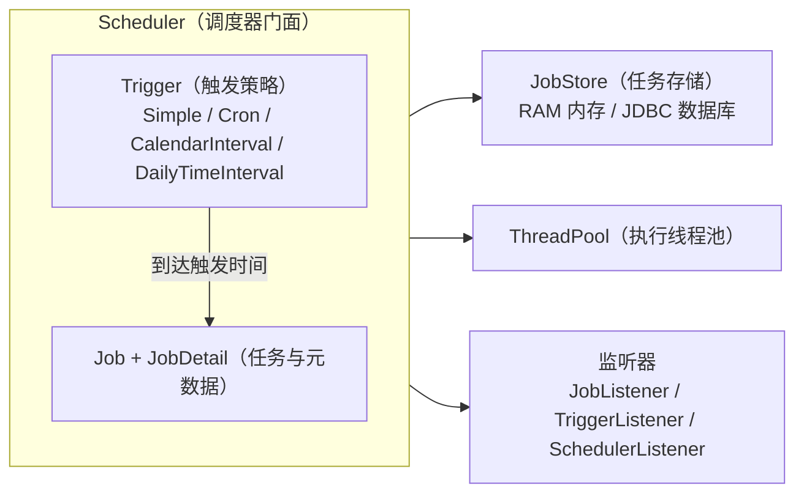
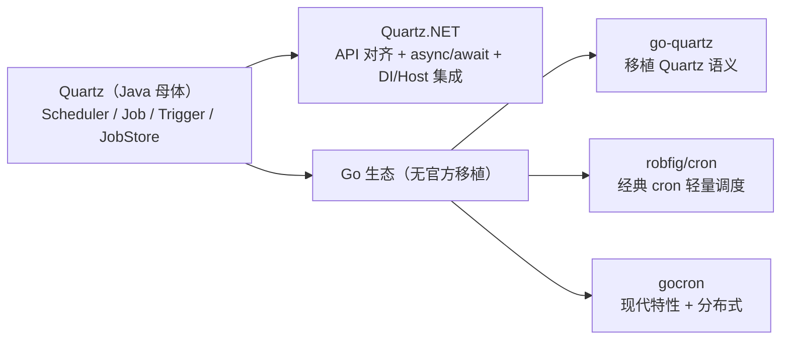

+++
title = 'Quartz 的跨语言之旅：从 Java 到 .NET 与 Go'
date = '2026-09-17T09:00:00+08:00'
slug = 'quartz-from-java-to-dotnet-and-go'
draft = false
tags = ['Quartz', '调度', '.NET', 'Go', '定时任务']
+++

定时任务是后端系统的「隐形基础设施」——凌晨两点的日报、每晚的数据清理、订单超时关单、消息补偿……几乎每个业务都离不开一个可靠的任务调度器。

在 Java 世界里，Quartz 几乎就是「调度器」的代名词，Spring Boot 甚至为它准备了开箱即用的 `spring-boot-starter-quartz`["https://docs.spring.io/spring-boot/docs/3.0.9/reference/html/io.html"]。但调度这件「小事」并不属于 Java：.NET 生态有血统纯正的移植版 Quartz.NET，而 Go 生态虽然没有官方移植，却长出了一批「精神续作」。

这篇文章先拆开 Quartz 的核心模型，再看它如何跨语言生根发芽。

<!-- more -->

---

## 一、先认识「母体」：Quartz 的核心模型

Quartz 是一个可以内嵌进 Java 应用的作业调度库，支持事务、持久化、集群与插件["https://mvnrepository.com/artifact/org.quartz-scheduler/quartz"]。它最了不起的地方，是把「调度」这件抽象的事拆成了几个清晰的角色：



- **Scheduler**：门面接口，负责 `scheduleJob`、`pause`、`resume`、`deleteJob`、`start`、`shutdown` 等全部操作。
- **Job / JobDetail**：Job 是业务实现（只含一个 `execute()` 方法），JobDetail 用 `JobKey`（name + group）唯一标识，并携带 `JobDataMap` 参数。
- **Trigger**：触发策略，是 Quartz 相对普通 cron 的杀手锏——`SimpleTrigger`（固定间隔/次数）、`CronTrigger`（cron 表达式）、`CalendarIntervalTrigger`、`DailyTimeIntervalTrigger`，外加一套 **Misfire**（错过触发）处理策略。
- **JobStore**：任务与触发器的「家」。`RAMJobStore` 存内存（重启即失），`JDBCJobStore` 落数据库（重启不丢、可做集群）。
- **集群**：官方文档明确指出，集群目前只在 JDBC JobStore 上工作——多个节点共享同一数据库，通过行锁与实例 ID 实现负载均衡与故障转移["https://www.quartz-scheduler.org/documentation/2.3.1-SNAPSHOT/configuration.html"]。
- **监听器**：JobListener、TriggerListener、SchedulerListener 三类钩子，用于监控与扩展调度生命周期。

Quartz 的 cron 表达式是它最具辨识度的语法：**6 位起（秒 分 时 日 月 周），可加第 7 位表示年**，且「日」与「周」用 `?` 互斥，支持 `L`（最后一天）、`W`（最近工作日）、`#`（第几个星期几）等特殊字符。比如每天凌晨两点整就是 `0 0 2 * * ?`——这是后面所有语言示例里都会出现的同一串表达式。

一个最简的 Java 使用示例：

```java
// Job：实现 execute 方法
public class ReportJob implements Job {
    public void execute(JobExecutionContext ctx) {
        System.out.println("生成日报");
    }
}

// 组装 Scheduler
Scheduler scheduler = StdSchedulerFactory.getDefaultScheduler();
scheduler.scheduleJob(
    JobBuilder.newJob(ReportJob.class).withIdentity("report-job").build(),
    CronScheduleBuilder.cronSchedule("0 0 2 * * ?").build());
scheduler.start();
```

### 版本简史

- 起源于 2001 年的 OpenSymphony 项目，后被 Terracotta 收购维护，如今以 **Apache-2.0** 协议在 GitHub 上开源。
- **2.3.2**（2019 年 10 月）是 2.x 时代最经典的版本，至今仍被大量存量项目使用。
- **2.4.x / 2.5.x**（2024 年起）转向 Java 11+ 与 `jakarta.*` 命名空间，最新稳定版 **2.5.2** 于 2025 年 12 月发布["https://mvnrepository.com/artifact/org.quartz-scheduler/quartz"]。
- **3.x**：官方文档已经放出 2.x → 3.x 迁移指南——没有重大数据库 schema 变更，主要是 API 清理、依赖与 JDK 升级；截至本文检索时，Maven Central 上最新稳定版仍为 2.5.2["https://www.quartz-scheduler.org/documentation/2.3.1-SNAPSHOT/migration-guide.html"]。

---

## 二、延伸一：.NET 的「官方移植」——Quartz.NET

.NET 世界选择了最朴素也最彻底的移植方式：**API 一一对应，连类名都几乎照搬**。

Quartz.NET 由 Marko Lahma 主导开发，2008 年 11 月发布 1.0（对应 Java Quartz 1.6.2）["https://cloud.tencent.com/developer/article/1031293"]；2.0 时代对应 Java Quartz 2.1["https://www.quartz-scheduler.net/old_news.html"]；**3.0（2019 年）用 async/await 全面重写**，并拆出了 `Quartz.Extensions.DependencyInjection`、`Quartz.Extensions.Hosting`、`Quartz.AspNetCore` 等扩展包["https://www.quartz-scheduler.net/"]。

Java 与 C# 的概念对照：

| 概念 | Java Quartz | Quartz.NET |
|------|-------------|------------|
| 任务接口 | `org.quartz.Job#execute(JobExecutionContext)` | `IJob#Execute(IJobExecutionContext)` |
| 任务详情 | `JobDetail` / `JobKey` | `IJobDetail` / `JobKey` |
| 触发器构建 | `TriggerBuilder` / `CronScheduleBuilder` | `TriggerBuilder`（Fluent API） |
| 调度器入口 | `StdSchedulerFactory#getDefaultScheduler` | `StdSchedulerFactory` / `QuartzSchedulerBuilder`（4.x） |
| 持久化 | `RAMJobStore` / `JDBCJobStore` | `RAMJobStore` / `AdoJobStore` |
| 集群 | JDBC + 行锁 | 同样基于 AdoJobStore |

一个 .NET 8 控制台/Worker 的典型用法（3.x 风格，当前兼容面最广）：

```csharp
// 1) 定义任务：实现 IJob
public sealed class ReportJob : IJob
{
    public Task Execute(IJobExecutionContext context)
    {
        Console.WriteLine($"[{DateTime.Now:HH:mm:ss}] 生成日报并发送邮件");
        return Task.CompletedTask;
    }
}

// 2) Program.cs —— 注册进 DI 容器
//    需要包：Quartz.Extensions.DependencyInjection + Quartz.Extensions.Hosting
builder.Services.AddQuartz(q =>
{
    var jobKey = new JobKey("report-job", "daily");

    q.AddJob<ReportJob>(opts => opts.WithIdentity(jobKey));
    q.AddTrigger(opts => opts
        .ForJob(jobKey)
        .WithCronSchedule("0 0 2 * * ?"));   // 每天 02:00:00 触发
});

builder.Services.AddQuartzHostedService(o => o.WaitForJobsToComplete = true);
```

### 2026 年 9 月：Quartz.NET 4.0 来了

就在本文写作前不久，Quartz.NET 发布了 4.0（2026-09-03），随后 4.1.0 于 9 月 13 日跟进["https://www.quartz-scheduler.net/posts/2026-09-03-quartznet-4.0-released.html","https://www.nuget.org/packages/Quartz"]。这次大版本变化相当激进：

- 目标框架直接来到 **net10.0**；
- **DI、托管服务、健康检查、System.Text.Json 序列化全部收进核心包**——3.x 时代散落的 `Quartz.Extensions.*` 包被合并；
- 对积累了十年的公开 API 做了一次大瘦身（大量 breaking changes），并要求 **数据库 schema 强制迁移**；
- 可选包重新分工：`Quartz.Jobs`（现成任务）、`Quartz.Plugins`、`Quartz.AspNetCore`（HTTP API）、`Quartz.Dashboard`（Web 仪表盘）、`Quartz.HttpClient`、`Quartz.Extensions.Redis`（Redis 分布式锁支撑集群）等["https://www.quartz-scheduler.net/documentation/quartz-4.x/quick-start.html"]；
- `IJob.Execute` 也从 `Task` 改成了 `ValueTask + CancellationToken` 风格["https://www.quartz-scheduler.net/documentation/quartz-4.x/quick-start.html"]。

3.x 仍在维护（最新 3.22.0），迁移到 4.x 前建议先读官方迁移指南。

---

## 三、延伸二：Go 的「精神续作」

Go 没有官方 Quartz 移植，而且**大概率永远不会有**。原因有三：

1. **社区文化**：Go 偏爱「小而专」的库，Quartz 那种全家桶式的 API 面不符合口味；
2. **并发模型不同**：goroutine 廉价到可以随便起，Quartz 引以为傲的 `SimpleThreadPool` 线程池管理在 Go 里毫无意义；
3. **生态早被圈地**：cron 语义已被 `robfig/cron` 牢牢占据，成为事实标准。

但 Quartz 的思想并没有缺席——它分裂成了三支，各取所长。

### 3.1 reugn/go-quartz：最接近 Quartz 语义的移植

这个库把 Quartz 的接口结构原样搬了过来["https://pkg.go.dev/github.com/reugn/go-quartz/quartz"]：

- `Job` 接口：`Execute(context.Context) error` + `Description() string`；
- `JobDetail` / `JobKey`（name + group，组内唯一）；
- `Trigger` 接口：`NextFireTime(prev int64) (int64, error)`，内置 `CronTrigger`、`SimpleTrigger`、`RunOnceTrigger` 三种实现；
- `Scheduler` 接口：`Start` / `ScheduleJob` / `DeleteJob` / `GetJobKeys` 等；
- `StdScheduler` 支持选项式配置：`WithLogger`、`WithQueue`（JobQueue 抽象，可对接文件系统等实现持久化）、`WithOutdatedThreshold`、`WithJobMetadata`（把运行元数据注入 Job 的 Context）。

```go
package main

import (
	"context"
	"fmt"
	"time"

	"github.com/reugn/go-quartz/quartz"
)

type ReportJob struct{}

func (ReportJob) Execute(ctx context.Context) error {
	fmt.Printf("[%s] 生成日报并发送邮件\n", time.Now().Format("15:04:05"))
	return nil
}

func (ReportJob) Description() string { return "report job" }

func main() {
	// 创建并启动调度器（内部由 goroutine 驱动）
	sched, err := quartz.NewStdScheduler()
	if err != nil {
		panic(err)
	}
	sched.Start(context.Background())

	// 每天 02:00:00 触发——Quartz 风格 6 段 cron 表达式
	trigger, err := quartz.NewCronTrigger("0 0 2 * * ?")
	if err != nil {
		panic(err)
	}

	detail := quartz.NewJobDetail(ReportJob{}, quartz.NewJobKey("report-job"))
	if err := sched.ScheduleJob(detail, trigger); err != nil {
		panic(err)
	}

	select {} // 阻塞主协程
}
```

需要说明：go-quartz 目前是**进程内调度器**，没有内置 JDBC 式数据库 JobStore 与集群，持久化靠 JobQueue 抽象自行扩展。

### 3.2 robfig/cron/v3：最流行的经典 cron 库

它才是 Go 世界里被引用最多的调度器。默认解析标准 5 段 cron，但可以通过选项切换到 **Quartz 的 6 段格式**["https://pkg.go.dev/github.com/robfig/cron/v3"]：

```go
package main

import (
	"fmt"

	"github.com/robfig/cron/v3"
)

func main() {
	// WithSeconds() 开启带「秒」字段的 Quartz 风格格式
	c := cron.New(cron.WithSeconds())

	// 与 Quartz 完全一致的 6 段表达式（? 与 * 等价）
	_, err := c.AddFunc("0 0 2 * * ?", func() {
		fmt.Println("生成日报并发送邮件")
	})
	if err != nil {
		panic(err)
	}

	c.Start()
	select {} // 阻塞
}
```

它还提供了 `Chain` 包装器体系（`Recover`、`DelayIfStillRunning`、`SkipIfStillRunning`、`Singleton`），弥补了「任务重叠执行」这一经典痛点——这其实正是 Quartz 的 `@DisallowConcurrentExecution` 注解在 Go 里的替代品。

### 3.3 go-co-op/gocron/v2：现代化的全能选手

如果说前两者是「古典派」，gocron 就是「现代派」：支持 `CronJob`、`DailyJob`、`DurationJob`、`DurationRandomJob` 等多种任务类型，提供 `BeforeJobRuns` / `AfterJobRuns` / `AfterJobRunsWithError` 等事件钩子，并且内置了**分布式能力**——`WithDistributedLock`（Redis 等实现分布式锁）与 `WithDistributedElector`（选主，只有 leader 执行任务）["https://pkg.go.dev/github.com/go-co-op/gocron/v2"]：

```go
s, _ := gocron.NewScheduler()

s.NewJob(
	gocron.CronJob("0 0 2 * * ?", false),       // Quartz 风格 6 段表达式
	gocron.NewTask(func() { fmt.Println("生成日报") }),
	gocron.WithSingletonMode(gocron.LimitModeReschedule), // 防重叠
	gocron.WithDistributedLock(locker, 30*time.Second),   // Redis 分布式锁
)

s.Start()
```

### 三支对比

| 维度 | reugn/go-quartz | robfig/cron/v3 | go-co-op/gocron/v2 |
|------|-----------------|----------------|--------------------|
| 定位 | Quartz 语义移植 | 经典 cron 调度器 | 现代多功能调度器 |
| 触发方式 | Cron / Simple / RunOnce | cron 表达式（默认 5 段，可开秒） | Cron / Daily / Duration / DurationRandom |
| 任务模型 | Job 接口 + JobDetail/JobKey | AddFunc / Job 接口 | 任意函数 Task |
| 持久化 | JobQueue 抽象（可扩展） | 无（进程内存） | 无（依赖外部组件） |
| 分布式 | 需自行扩展 | 无 | 分布式锁 / 选主 |
| 扩展钩子 | 日志 / JobMetadata | Chain 包装器 | 丰富的事件监听钩子 |
| 适用场景 | 想要 Quartz 式 API | 轻量 cron 调度 | 需要现代特性与分布式 |

---

## 四、三条路线怎么选



| 你的场景 | 推荐方案 |
|----------|----------|
| Java / Spring 技术栈 | Quartz + `spring-boot-starter-quartz` |
| .NET 技术栈（求稳） | Quartz.NET 3.x |
| .NET 技术栈（尝鲜） | Quartz.NET 4.x（注意 schema 迁移） |
| Go 轻量进程内调度 | robfig/cron/v3 |
| Go 想要 Quartz 式 API | reugn/go-quartz |
| Go 需要分布式 / 高级特性 | gocron/v2（分布式锁、选主） |
| 大规模分布式任务平台 | XXL-Job、ElasticJob、SchedulerX 等专用平台 |

---

## 结语

调度器的核心思想是**跨语言的**：任务定义与触发策略分离、可持久化、可集群、可观测。Quartz 把这套思想固化成了一套 API 约定，而不同语言的社区给出了不同答案——.NET 选择「直接移植」，连类名都一一对应；Go 选择「重新表达」，用更符合自身并发模型与社区品味的方式各取所需。

所以，无论你写的是 Java、C# 还是 Go，当你写下 `0 0 2 * * ?` 这串表达式时，你其实都在使用同一种被验证了二十多年的调度哲学。
