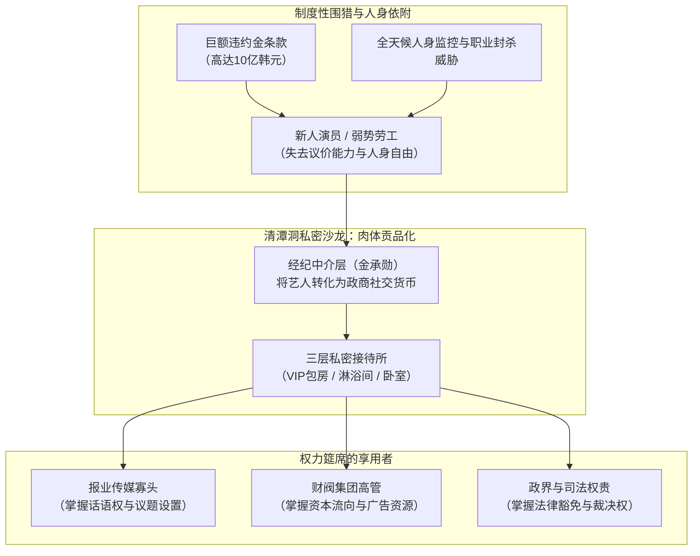
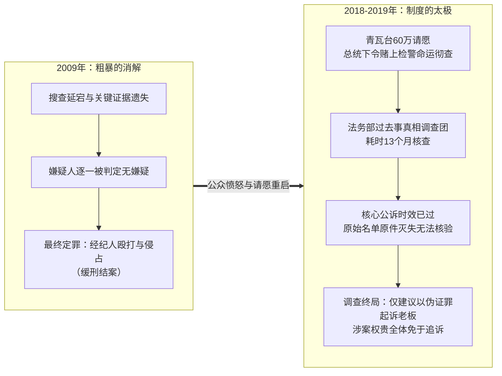

+++
title = '张紫妍案：权力筵席、制度铁屋与被合法消解的血迹'
date = '2026-09-21T11:15:00+08:00'
slug = 'jang-ja-yeon-incident'
draft = false
tags = ['社会观察', '深度剖析', '张紫妍案', '权力结构', '韩国']
+++

二〇〇九年三月七日，二十九岁的韩国女演员张紫妍在京畿道城南市的寓所内自缢身亡。

彼时，由她参演的电视剧《花样男子》正在东亚掀起收视狂潮。在聚光灯与荧幕构筑的华丽泡沫之外，张紫妍留下的并不是一封诉说绝望或哀叹命运的寻常遗书，而是一份长达数页、每一页都盖有猩红指印与身份证号码的控诉文件——与其说是遗言，不如说是一份受害者为自己写就的抗辩状与呈堂证供。

十七年过去了。每当这个名字被重新提及，舆论场中充斥的往往是猎奇的八卦碎屑、对残忍细节的窥探、抑或是影视剧式的惩恶复仇幻想。然而，如果仅仅将张紫妍视作娱乐圈内一个“不幸遇害”的孤立个体，我们便彻底落入了那套庞大机制预设的隐匿陷阱。

张紫妍案从来不是一桩偶发的刑事悲剧，它是一具被切开的标本，完整地暴露出东亚高度发达资本主义社会中，财阀特权、媒体垄断、父权共谋与司法机器如何无缝咬合，最终将一个具体的、鲜活的个体碾为齑粉。

<!-- more -->

---

## 一、 捕食网络：奴隶契约与“私人沙龙”的贡品机制

在张紫妍的自白中，最令人窒息的不是暴力本身的狰狞，而是暴力被赋予的“合法性”与“日常性”。

在韩国高度工业化的造星体系中，新人艺人与经纪公司之间的关系，从一开始就被设计为极度不对等的人身依附。经纪公司 The Contents Entertainment 的老板金承勋（金钟承），并非仅仅是一个管理演艺事务的商人，更像是一个拥有绝对生杀予夺之权的奴隶庄园主。

这种依附关系依靠两道冰冷的锁链铸就：

1. **资本的金融绳索（奴隶契约）**：长达数年乃至十余年的专属合同，附带着高达十亿韩元的违约金条款。对于一个父母早逝、缺乏深厚家族支撑的新人来说，拒绝公司的安排不仅意味着职业生涯的即时枯萎，更意味着一辈子无法偿清的灭顶债务。
2. **空间的物理囚禁（清潭洞三层沙龙）**：金承勋在首尔江南区清潭洞设立的并非普通的办公楼，而是一座专供权贵阶层享乐的私密行宫。一楼是葡萄酒吧，二楼是办公场所，而三楼则是配备了高档音响、淋浴间与卧榻的隐蔽会所。

在这里，年轻女性的身体不再属于自己，而是被物化为经纪公司向更高阶权力输送的“硬通货”与“社交润滑剂”。根据张紫妍留下的记录，在父母忌日被强迫陪酒、被迫接受高强度的身体侵害与精神羞辱，并不是意外，而是维持整个商业网络运转的日常仪轨。

经纪公司充当了残酷的“捕兽夹”与“人口贩卖站”；但倘若没有门外那些贪婪而体面的捕猎者，这具机器本不至于转动得如此肆无忌惮。

---

## 二、 权力的筵席：谁在分食？铁幕同盟的闭环

张紫妍案最触目惊心之处，在于名单上浮现的名字所拼凑出的那幅**韩国顶级统治阶层全景图**。

那不是街头无赖或边缘罪犯的聚会，而是一场由社会“声誉顶端”所共享的隐秘筵席：

- **媒体帝国掌舵者**：韩国发行量最大、政治影响力盘根错节的保守派主流报刊《朝鲜日报》方氏家族成员；
- **财阀财团掌门人**：横跨零售、食品、酒店等命脉行业的顶级财阀二代与核心高管；
- **行业生杀掌管者**：主流电视台的核心制作人（PD）、演艺企划界大佬；
- **金融与司法显贵**：掌握资本杠杆的金融高层，以及身居国家公权力核心要津的官员。

鲁迅先生在《灯下漫笔》中写道：*“所谓中国的文明者，其实不过是安排给阔人享用的人肉的筵宴。”* 将这句话置于首尔清潭洞的夜色下，竟毫无违和。

在这张隐秘的网络中，各方各取所需，形成了一个针插不入、水泼不进的利益共同体：

- **传媒巨头**提供了舆论的屏障与道德豁免权。在韩国，主流报业家族不仅是舆论的制造者，更是足以左右政权更迭的幕后重镇。
- **财阀资本**提供了无可匹敌的金钱流动与商业垄断。演艺工业必须依附于财阀的广告投放与资本注资，任何违逆游戏规则的个体都会瞬间被系统驱逐。
- **公权力体系**则充当了最后的防火墙。当罪恶即将溢出私密沙龙的围墙时，司法的“消音器”便开始无声运转。

张紫妍的绝望，不在于她面对的是某一个恶霸，而在于她发现自己面对的是由**资本、话语权与国家暴力机器**共同铸造的一堵无边无际的黑墙。她撞向哪一面，哪一面都会将她弹回深渊。

---

## 三、 司法的遁词：如何合法地让罪恶“不存在”

面对张紫妍以生命为代价交付的证词，国家机器交出了一份堪称人类司法史上最讽刺的答卷。

回顾该案跨越十年的两次调查，我们可以清晰地窥见权力是如何运用一套精致冷酷的“程序正义”，将淋漓的血迹漂洗得干干净净：

### 1. 2009 年的初次清场：选择性盲视

在最初的侦查中，警方的行动充满了令人咋舌的“技术性溃败”：
- 嫌疑人家中与办公室的搜查被推迟、缩水；
- 张紫妍生前通话记录离奇缺失；
- 涉案的多位高层人士在接受调查时享受着秘密通道、免予当面讯问的特殊优待。

最终，在涉及三十余名政商名流的名单中，**没有任何一人因性侵或强迫卖淫被起诉**。唯二被定罪的，是经纪公司老板金承勋与前经纪人刘长浩——两人的罪名仅仅是“轻微肢体暴力”与“名誉侵犯”，分别被判处一年缓刑与社会服务令。

一桩系统性的权钱色买卖与非人迫害，在司法的裁决文书里，被轻巧地缩编成了一场“黑心老板打骂下属”的劳资小纷争。

### 2. 2019 年的二次落幕：时间的“合法洗白”

二〇一八年，在韩国 “Me Too” 浪潮与首尔江南 Burning Sun 丑闻的交织爆发下，超过六十万民众在青瓦台官网请愿要求重查张紫妍案。时任总统文在寅公开表态：*“若无法查明社会特权阶层案件的真相，我们就不能称自己为一个正义的社会。哪怕是过去发生的事，若检警存有庇护与隐瞒，也必须赌上检警两方的命运彻底查清。”*

然而，当法务部“过去事真相调查团”历时十三个月交出最终调查报告时，现实再度给公众泼了一盆冰水：

- 调查团承认，二〇〇九年的调查确实存在严重渎职、消极侦办与证据隐匿；
- 但由于**关键原始名单没有被合法保全**、涉案相关罪名的**公诉时效（诉讼时效）早已届满**、客观物证因年代久远灭失，调查团无法认定性侵罪名成立，亦无法向检方提请刑事起诉；
- 最终的结论，仅仅是建议对金承勋涉嫌作伪证进行追加起诉。

国家机器并不需要撕下面具去宣布施暴者是无辜的。它只需依赖官僚主义的齿轮缓缓转动——拖延调查、遗失笔录、等待时效过期。**时间成为了庇护特权最合法的工具，而法律条文则变成了掩埋尸骨最体面的铁锹。**

---

## 四、 看客与流变：悲剧的二次收割与被转移的焦点

张紫妍死后的十余年里，围绕此案上演的另一重悲剧，是社会对死者创伤的“二次消费”。

在公共讨论中，公众的目光往往被推向两个极端：

一是**黄色小报式的病态狂欢**。部分媒体热衷于挖掘所谓“灌药”、“高尔夫球场陪侍”、“多人侵害”等充斥感官刺激的传闻细节。受害者生前的尊严被再度剥落，成了流量经济与算法推荐下的消费养料。原本应当聚焦于“权力寻租机制”与“司法庇护网络”的严肃追问，被悄然解构为公众茶余饭后的窥淫谈资。

二是**伪善投机者的流量闹剧**。以自称“唯一目击证人”的尹智吾为例，她在二〇一九年以“为姐姐鸣冤”的姿态高调返韩，出书、成立基金会、收受公众巨额捐款、频繁接受聚光灯采访，甚至将自己包装为“抗击财阀的悲壮女侠”。然而随之而来的，是其证言前后矛盾、夸大其词、涉嫌侵吞捐款并潜逃海外的丑闻。

这场荒诞的插曲，不仅严重透支了公众的善意与信任，更给既得利益集团递上了一柄绝佳的舆论反扑利刃——他们得以轻而易举地借此声称：“看吧，所谓的张紫妍名单，不过是别有用心者的虚构与炒作。”

真正的死者躺在冰冷的墓地中，她的声音早已在二〇〇九年戛然而止；而那些借着死者名义狂欢的人，却在人血馒头的余温中赚足了眼球与利益。

---

## 五、 终局与回响：在紧锁的铁屋前，拒绝遗忘的意义

张紫妍案结束了吗？

在司法的技术层面上，它已经盖棺定论——名单上的显贵们依旧在摩天大楼的顶层俯瞰汉江，享受着国家的供养与社会的敬仰；涉事的公司早已注销更名；那份满是指印的遗书，被锁进了尘封的档案库。

但如果问这个社会是否因此改变，答案却无比惨淡。

尽管韩国在惨案之后出台了所谓的《大众文化艺术产业发展法》（俗称“张紫妍法”），推行了标准演艺合同，规定了未成年艺人的保护时间。然而，只要演艺产业高度依赖寡头资本注入、只要阶层流动的狭窄通道依旧被权贵垄断、只要检警两界的特权豁免屏障依然巍峨，清潭洞的三楼就永远不会缺少新的客人与新的贡品。

从二〇一九年的李胜利夜店（Burning Sun）丑闻，到此后接二连三的演艺圈青年生命陨落，人们不断在新的废墟上辨认出熟悉的轮廓。那座铁屋从来没有被打破，它只是加装了更厚重的消音棉与更智能的面部识别门禁。

那么，今天我们为什么依然要执拗地写下张紫妍？

不是为了兜售无力的廉价眼泪，也不是为了向无法撼动的巨兽发出空洞的道德诅咒。

鲁迅在《呐喊·自序》中写过那个著名的铁屋譬喻：
> *“然而几个人既然起来，你不能说决没有毁坏这铁屋的希望。”*

张紫妍当年按在纸上的鲜红指印，是她在这座密不透风的铁屋里用骨血撞击出的微弱裂痕。权力的机制耗费了十七年时间，试图用时效、程序、绯闻与遗忘将这道裂痕抹平，让所有人相信“这世间从来如此”。

而记录、拆解与审视的意义，就在于**对抗这种系统性的遗忘**。

只要事实还被一字一句地刻在纸上与屏幕上，只要还有人清醒地指出那张筵席上“谁在吃，谁在被吃”，罪恶就永远无法完成它的合法化加冕。不作冷漠的看客，不被虚幻的狂欢绑架，保持锐利的目光直视深渊——这是生者面对逝者唯一的责任，也是那间铁屋终有一日能够透进光亮的唯一可能。
