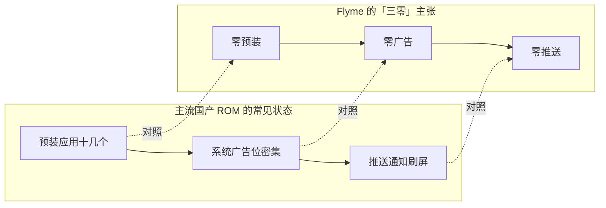

+++
title = '魅族 Flyme：当「流畅无广告」成为一套系统的执念'
date = '2026-09-22T10:00:00+08:00'
slug = 'meizu-flyme-clean-smooth'
draft = false
tags = ['魅族', 'flyme', 'android', '手机系统', '数码', '软件推荐']
+++

买安卓手机最让人心累的瞬间，往往不是纠结参数，而是开机之后那场旷日持久的"清理战"：预装的十几个 App 删了又自动装回来，通知栏里滚动着与你无关的"福利推送"，甚至连天气、负一屏这种本该清爽的角落，都塞满了广告位。

在这样的环境里，魅族的 Flyme 打出了一张略显"不合时宜"的牌——**把"无广告、不打扰、足够流畅"当成一套系统的底线，而不是可选的卖点**。它不是什么颠覆性的黑科技，更像是一种被多数厂商悄悄放弃的克制。

<!-- more -->

---

## Flyme 的前世：从 MP3 到系统的转身

魅族的故事起点并不是手机。2003 年，它靠 MP3 播放器起家，魅族 M6 一度是国产播放器的标杆。直到 2009 年的 M8，魅族才真正踏入手机赛道——那台机器跑的还是基于 Windows CE 深度定制的系统，而它的审美基因，从那一刻就定下了基调：**简洁、素净、讲究手感**。

2012 年前后，Flyme 作为魅族自研的 Android 深度定制系统正式登场。在国产 ROM 野蛮生长的年代，MIUI 靠"每周更新、功能大而全"圈粉，而 Flyme 走的是另一条路：**做减法**。

这套"做减法"的思路，最终在 Flyme 9 时代被凝练成一句响亮的口号——**「三零」：零广告、零推送、零预装**。

---

## 「三零」：一场对行业潜规则的正面较劲

"零预装、零广告、零推送"说起来简单，背后却是实打实的商业取舍。广告与预装，是国产安卓厂商重要的收入来源之一；把这部分砍掉，等于主动放弃了一笔躺着就能赚的钱。

Flyme 的选择是：**不跟用户玩"后台留一手"的游戏**。

- **零预装**：除了必要的系统应用，几乎没有第三方 App 塞在出厂列表里，不必再一个个手动卸载。
- **零广告**：天气、日历、负一屏、应用商店这些传统"广告重灾区"，Flyme 都做到了克制——不是把广告藏得更深，而是干脆不放。
- **零推送**：没有那些伪装成通知的营销信息轰炸，通知栏回归它本来的职责：提醒真正与你相关的事。

这件事最耐人寻味的地方，不在于技术有多难，而在于它**逆着行业的惯性往前走**。当绝大多数厂商都在研究"如何在系统里塞进更多变现入口"时，Flyme 反而在研究"如何让系统更安静"。在一个把用户注意力当资源的年代，愿意主动把清净还给用户的系统，本身就是一种立场。

---

## 流畅不是玄学：OneMind 与那些看不见的打磨

"流畅"两个字人人都在喊，但真正做起来，靠的不是单个功能的堆砌，而是一整套对资源调度、进程管理、动画渲染的长期打磨。Flyme 的答案是 **OneMind**——一套内嵌在系统底层的智能引擎。

它的工作方式，与其说是"加速"，不如说是"精打细算"：

1. **进程冻结与唤醒管控**：识别出真正在后台搞小动作、偷偷耗电自启的应用，把它们管起来，避免"一颗老鼠屎坏了一锅汤"。
2. **内存智能回收**：根据使用习惯预判哪些应用会再次被打开，优先保留，哪些该回收就果断回收，让前台始终有足够余量。
3. **流畅度守护**：在动画、触控响应这些"体感最敏感"的环节上做针对性优化，让滑动跟手、过渡自然。

配合 Flyme 一贯克制的动画设计——不追求花哨的转场，而是让每一次点击、滑动都干脆利落——最终呈现出来的，是一种"**不刷存在感**"的流畅：你几乎意识不到系统在做什么，只觉得顺手。

---

## 那些 Flyme 式的独特印记

除了干净与流畅，Flyme 还有几个让人用了就回不去的小设计，它们共同构成了这套系统的辨识度：

- **小窗模式**：侧滑呼出，把应用缩成悬浮小窗，看视频时回消息、等结果时切走干别的，切换顺滑得近乎自然。
- **mBack 与手势导航**：早期的"轻触返回、重按回桌面"曾经是魅族的招牌，如今则演进为一套更贴合全面屏的手势体系。
- **游戏模式**：来电、通知都被柔和地"降级"处理，既不打断操作，也不漏掉重要信息。

这些细节单独拎出来都不算惊天动地，但组合在一起，就成了一种手感上的"整体气质"——**让工具退回到工具的位置，不打扰人**。

---

## 今天，Flyme 的命题变了，底色没变

魅族的命运在近几年几经转折：2022 年被吉利系收入麾下，一度宣布"All in AI"甚至传出要放弃传统手机，随后又携魅族 21、22 系列重回赛道。Flyme 也随之演进为 **Flyme AIOS**，并衍生出面向车机的 **Flyme Auto**，把手机与汽车座舱的生态打通。

有意思的是，无论形态如何变化，那层底色始终没变。即便在加入 AI、拥抱多端互联之后，Flyme 依旧把"纯净、流畅、不打扰"挂在嘴上、落在产品里。

这大概就是 Flyme 最珍贵的地方：**在一个普遍把系统当"广告分发平台"的时代，它还记得系统最初应该是什么样子**——一个安静、顺手的工具，而不是一个追着你要注意力的推销员。

---

如果你正在寻找一台"开箱即用、不用先折腾清理"的安卓设备，或者你早已厌倦了通知栏里的营销轰炸，那么不妨给 Flyme 一个机会。它未必是功能最全的，但大概率是那个最能让你"省心"的选择。

毕竟，在当下这个什么都想塞进你手机里的年代，"什么都不塞"本身就是一种奢侈。
