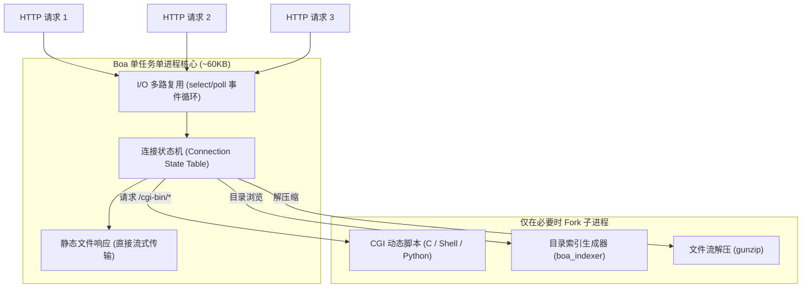

+++
title = '关于 http://www.boa.org/：经典嵌入式 Web 服务器 Boa 架构与安全解析'
date = '2026-09-23T09:55:40+08:00'
slug = 'boa-web-server'
draft = false
tags = ['嵌入式', 'Linux', 'Web服务器', 'Boa', '网络安全']
+++

在嵌入式 Linux、物联网（IoT）及家用网络设备的发展史上，[http://www.boa.org/](http://www.boa.org/) 是一个极具标志性的名字。它是经典开源轻量级 HTTP 服务器 **Boa** 的官方主页。

虽然该项目在 2005 年发布最终候选版本（0.94.14rc21）后便停止了维护，官方站点也逐渐淡出，但在过去二十年里，Boa 却被烧录进了全球数以亿计的路由器、ADSL 调制解调器（猫）、网络摄像头（IP Camera）、交换机和工控网关中，负责提供底层的 Web 管理控制台界面。

本文将从技术演进、核心架构设计、典型配置与 CGI 机制，到现代安全与替代方案，全方位剖析这位“嵌入式 Web 时代的元老”。

<!-- more -->



---

## 一、为什么会有 Boa？（诞生背景与设计哲学）

在 1990 年代初至 2000 年代初，当时主流的 Web 服务器是 Apache HTTP Server。Apache 采用的是经典的 **Pre-fork（多进程）** 或多线程模型，为每个进入的客户端连接分配一个独立的工作进程或线程。

在传统 PC 或机房服务器上，这种模型十分稳定，但在当时的嵌入式硬件环境下却是致命的：
- **CPU 算力极其孱弱**：早期的嵌入式 MIPS、ARM7/ARM9 芯片主频通常只有数十到两百兆赫兹（MHz）；
- **内存极端受限**：路由器和摄像头可能仅有 8MB 或 16MB 的 RAM，内核和业务进程瓜分后，留给 Web 服务的内存往往不足 1MB；
- 多进程的上下文切换和高内存开销会直接导致嵌入式设备雪崩崩溃。

为了解决这一痛点，开发者 Paul Phillips（后续由 Larry Doolittle 与 Jon Nelson 接手维护）创立了 Boa 项目，并在官方站点 `http://www.boa.org/` 上明确提出了其核心设计哲学：

> *"Boa is a single-tasking HTTP server. That means that unlike traditional web servers, it does not fork for each incoming connection, nor does it fork many processes to handle multiple connections. It internally multiplexes all of the ongoing HTTP connections, and only forks for CGI programs, automatic directory generation, and automatic file gunzipping."*

简而言之：**单任务、事件驱动多路复用、按需最小化 Fork、极小资源占用**。

---

## 二、Boa 的核心架构与性能优势

### 1. 单进程 I/O 多路复用（Single-tasking Multiplexing）
与传统 Web 服务器不同，Boa 运行期间主体**只有一个主进程**。它基于 Linux/Unix 的 `select()` 系统调用监听所有打开的套接字（Socket）。
- 所有活跃的 HTTP 连接由内部的**连接状态表（State Table）**维护，逐步推进接收请求行、解析头部、发送响应等状态；
- 对静态文件（HTML、CSS、JS、图片）的请求全部在单进程内部异步完成，完全避免了进程/线程创建销毁的系统开销；
- 官方基准测试显示，在处理静态文件时，其峰值吞吐速率达到了同等硬件下 Apache 的两倍以上。

### 2. 仅在必要时才 Fork 子进程
Boa 严格限制了进程创建的时机，仅在以下三种场景下会 `fork()`：
1. **CGI 脚本执行**：访问 `/cgi-bin/` 路径时，为了执行外部脚本或二进制程序；
2. **目录索引生成**：当访问目录且没有 `index.html` 时，调用 `boa_indexer` 自动生成文件列表；
3. **文件解压**：若请求的文件以 `.gz` 结尾且需要动态解压时。

### 3. 极致轻量的二进制体积
编译后的 Boa 核心可执行文件体积通常仅有 **60 KB 左右**，常驻运行时内存占用仅需数百 KB。这使得它能够轻松装进仅有 2MB 或 4MB Flash 的嵌入式固件中。

---

## 三、经典配置与 CGI 集成

在嵌入式固件中，Boa 的运行通常依赖于 `/etc/boa/boa.conf` 配置文件。

### 1. 典型 `boa.conf` 核心指令

```apache
# 监听端口
Port 80

# 运行用户与组
User nobody
Group nogroup

# 根目录与日志
ServerRoot /etc/boa
DocumentRoot /var/www

# 错误日志与访问日志
ErrorLog /var/log/boa/error_log
AccessLog /var/log/boa/access_log

# 目录索引生成器
DirectoryMaker /usr/lib/boa/boa_indexer

# 默认主页文件
DirectoryIndex index.html

# CGI 路径映射（关键！）
ScriptAlias /cgi-bin/ /var/www/cgi-bin/
```

### 2. 嵌入式设备的 CGI 交互逻辑
嵌入式路由器的“管理后台”绝大部分依赖 CGI 技术实现前后端交互：
1. 页面表单提交数据至 `/cgi-bin/set_lan.cgi`；
2. Boa 接收请求并 `fork()` 出子进程，设置 `QUERY_STRING`、`CONTENT_LENGTH`、`REQUEST_METHOD` 等环境变量；
3. 子进程（通常是用 C 语言编写的 ELF 二进制程序，或简单的 BusyBox Shell 脚本）读取标准输入并解析参数；
4. CGI 程序通过 `ioctl`、读写 `/proc`、修改 `nvram` / `uci` 配置或执行 `iptables` 规则修改系统设置；
5. CGI 程序将带有 `Content-Type: text/html` 的标准输出重定向回网络套接字，呈现保存结果。

---

## 四、安全隐患与供应链历史遗留问题

虽然 Boa 在二十年前凭借精巧的设计赢得了巨大的市场占有率，但作为**自 2005 年起便停止维护的停更软件（End-of-Life, EOL）**，它在现代互联网安全体系下暴露出大量致命缺陷。

### 1. 缺乏现代安全机制
- **无原生 HTTPS / TLS 支持**：Boa 本身不支持 SSL/TLS 加密，所有管理密码与配置数据均明文裸奔传输，若要使用 HTTPS 必须额外配合 `stunnel` 或反向代理；
- **缺乏输入消毒与内存防护机制**：早期的 C 代码缺乏现代编译器的栈保护（Stack Canary）与地址随机化支持，易受缓冲区溢出攻击。

### 2. 经典高危漏洞被广泛利用
- **目录遍历漏洞（CVE-2007-4915 / CVE-2021-33558 等）**：
  攻击者可以通过 `GET /cgi-bin/../../etc/passwd` 或双斜杠构造绕过路径检测，直接读取宿主设备上的敏感系统文件、配置密码文件。
- **信息泄漏与任意命令注入**：
  许多厂商在为 Boa 编写配套的私有 CGI 脚本时存在大量的 `system(cmd)` 拼接调用，导致设备被轻松取得 Root 权限。

### 3. 供应链安全警示
2022 年底，微软安全团队（Microsoft Defender for IoT）发布了专门的安全研究报告，指出全球依然有上百万台暴露在公网的网络设备和 IP 摄像头仍在使用废弃的 Boa Web 服务器。由于这些设备固件长期得不到升级，Boa 频繁成为 Mirai 等 IoT 僵尸网络病毒批量扫描并攻破的温床。

---

## 五、现代嵌入式 Web 替代方案

对于现代嵌入式设备和物联网项目，已不再推荐直接使用 Boa。目前主流的替代选型包括：

| 服务器 / 框架 | 架构特点 | 资源开销 | 现代特性支持 | 典型应用 |
| :--- | :--- | :--- | :--- | :--- |
| **uHTTPd** | 极简、单线程事件驱动 | 极小 (~50KB) | 原生支持 TLS (mbedtls)、Lua、ubus RPC | OpenWrt 路由器默认 Web 服务器 |
| **Lighttpd** | 高性能事件驱动 | 较小 (~500KB) | 全面支持 FastCGI、HTTP/2、TLS | 中高端嵌入式 Linux 网关 |
| **Nginx** | 多进程/事件驱动工业级标准 | 中等 (几 MB) | 极高的并发与反向代理能力、丰富生态 | 智能家居主控、高端工业边缘网关 |
| **CivetWeb / Mongoose** | 可内嵌的 C/C++ 库 | 极小 | 嵌入式单头文件集成、WebSocket、REST API | 嵌入式应用进程内自托管 HTTP 服务 |
| **Go / Rust 微服务** | 内存安全、单静态二进制包 | 较轻 (10MB~20MB) | 现代多线程、零外部系统动态库依赖 | 新一代边缘计算与物联网节点 |

---

## 结语

回望 `http://www.boa.org/`，Boa Web Server 见证了嵌入式 Linux 从早期的算力匮乏走向全面繁荣的黄金时期。其单进程结合 I/O 多路复用的架构设计，不仅是现代高并发服务器（如 Nginx、Node.js）思想的先驱雏形，也是一代嵌入式工程师深入理解 HTTP 协议与 CGI 机制的绝佳教本。

而今，面对日益复杂的网络安全环境，理解 Boa 的辉煌与落幕，更给所有软硬件开发者带来深刻的启示：**在物联网的世界里，轻量高效固然是基石，但长期的安全维护与供应链更新生命周期同样不可或缺。**
