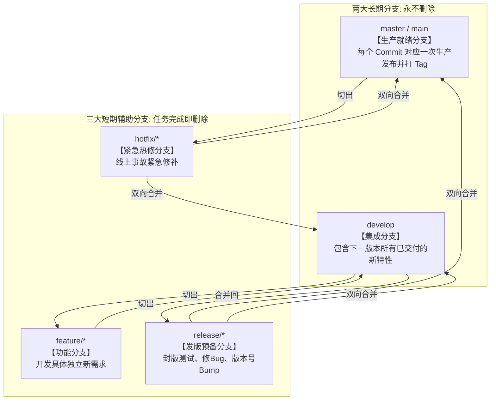
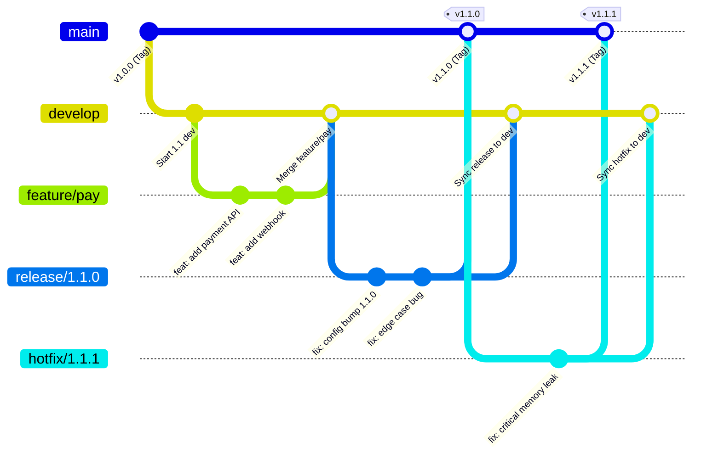
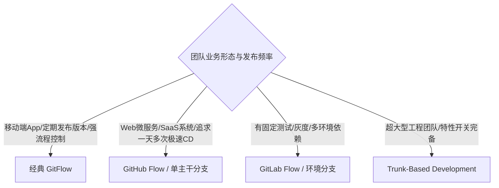

+++
title = 'Git 分支管理规范：深入拆解经典 GitFlow 工作流与团队协作实践'
date = '2026-09-23T09:17:00+08:00'
slug = 'git-branch-management-gitflow-guide'
draft = false
tags = ['Git', '版本控制', '团队协作', '工程规范', 'DevOps']
+++

在个人开发时代，我们习惯了在本地直接对 `main` 或 `master` 分支疯狂 commit，代码改完直接 `git push -f` 甚至一路绿灯。然而，当团队规模扩大到十人、百人，当多条业务线并行推进、线上频繁需要紧急修 Bug、版本需要定期切出封版测试时，缺乏规范的 Git 操作就会演变成一场场灾难：

- 正在开发中的半成品功能被意外带上了生产环境；
- 生产环境紧急修补的 Hotfix，在下一次常规发版时被无情覆盖；
- 分支历史错综交织成无法理顺的“毛线团”，发生问题时根本无法定位是谁在何时引入了致命提交。

2010 年，荷兰独立软件顾问 Vincent Driessen 发表了影响深远的经典博文《A successful Git branching model》，正式提出了 **GitFlow 工作流模型**。历经十余年检验，GitFlow 已成为软件工程中最经典、最稳健的分支管理范式之一。

本文将从角色分工、生命周期、全景流转、标准命令行操作到现代演进对比，全面深度拆解经典 GitFlow 分支规范。

<!-- more -->

---

## 一、 GitFlow 的核心分支架构

GitFlow 将分支划分为两大类：**长期分支（Long-lived Branches）** 与 **短期辅助分支（Supporting / Short-lived Branches）**。



---

## 二、 深度解析：五类分支的职责与生命周期

### 1. 两大长期分支（核心基石）

| 分支名称 | 源自哪里 | 最终合并至 | 职责定义与规范约束 |
| :--- | :--- | :--- | :--- |
| **`master`** (或 `main`) | 初始仓库创建 | 永不合并到其他分支，只接受合并 | **生产就绪分支（Production Ready）**。<br>• 严禁任何人直接向其提交代码！<br>• 该分支上的任何一个 Commit 都必须代表一次随时可部署的生产环境稳定版本。<br>• 每次合并进 `master` 必须打上带注释的版本标签（如 `v1.0.0`、`v1.1.2`）。 |
| **`develop`** | 从 `master` 切出 | 永不删除 | **日常集成分支（Integration Branch）**。<br>• 存放最新完成开发、等待进入下一轮发布周期的功能代码。<br>• 是自动构建环境（CI/Nightly Build）的主要监听目标。 |

---

### 2. 三大短期辅助分支（动态流转）

#### ① 功能分支（`feature/*`）
- **职责**：用于开发某个独立的新特性或业务需求。
- **分支来源**：必须来自最新的 `develop`。
- **合并终点**：只能合并回 `develop`。
- **命名规范**：`feature/<需求编号或简短功能名>`，如 `feature/user-auth`、`feature/JIRA-1024-cart`。
- **生命周期**：需求开发完毕并通过 Code Review 及本地测试后，合并至 `develop`，随后**立即删除该分支**。

#### ② 发布预备分支（`release/*`）
- **职责**：当 `develop` 分支上的功能积累到足以支撑一次既定版本发布时切出，进入**封版与预发布阶段**。
- **分支来源**：来自当前的 `develop`。
- **允许的操作**：
  - 只能进行 Bug 修复、文档完善、发版参数配置、版本号升级（Bump Version）；
  - **绝对禁止在此阶段追加新的业务功能！**（新功能必须留在 `develop` 等待下一个版本）。
- **合并终点（双向合并）**：
  - 合并到 `master`：用于正式发版，并打上对应版本的 Release Tag（如 `v1.2.0`）；
  - **同步合并回 `develop`**：确保发版测试期间修复的 Bug 也同步更新到了集成分支中。
- **生命周期**：双向合并完成后，删除该分支。

#### ③ 紧急修复分支（`hotfix/*`）
- **职责**：生产环境突然爆发严重线上 Bug（P0 故障），需要绕过漫长开发周期直接紧急修补。
- **分支来源**：**直接从生产 `master` 对应的故障版本 Tag 处切出**。
- **合并终点（双向合并）**：
  - 合并回 `master`：打上修订补丁 Tag（如 `v1.2.1`），直接触发生产环境部署；
  - **同步合并回 `develop`**：确保修复的线上 Bug 不会在未来的新版本中死灰复燃；
  - *(注：如果当前正有一个 `release/*` 分支在进行中，hotfix 则合并到该 `release/*` 分支，由其在发版时带回 develop)*。
- **生命周期**：双向合并完成后，删除该分支。

---

## 三、 GitFlow 全生命周期流转图

下图完整展示了一个包含功能开发、发版与紧急修补的 GitFlow 拓扑流转全景：



---

## 四、 实战：从零走通 GitFlow 标准命令行操作

在多人协作中，为了保留完整的分支演进脉络，合并时**强烈推荐添加 `--no-ff`（No Fast-Forward，禁止快进合并）** 参数，强制生成一个合并 Commit，使得分支的历史拓扑一目了然。

### 1. 开启与完成一个功能开发（Feature）
```bash
# 1. 确保本地 develop 为最新状态
git checkout develop
git pull origin develop

# 2. 从 develop 切出新功能分支
git checkout -b feature/order-cancel develop

# 3. 正常编码、提交
git commit -m "feat: 增加订单取消与库存回退逻辑"

# 4. 功能完成，拉取远端 develop 最新改动并合并测试
git checkout develop
git pull origin develop

# 5. 使用 --no-ff 合并功能分支并推送到远端
git merge --no-ff feature/order-cancel -m "Merge branch 'feature/order-cancel' into develop"
git push origin develop

# 6. 删除本地与远端已完成的功能分支
git branch -d feature/order-cancel
git push origin --delete feature/order-cancel
```

### 2. 开启与完成发版准备（Release）
```bash
# 1. 从 develop 切出发布预备分支
git checkout -b release/1.2.0 develop

# 2. 修改版本号、修复预发环境发现的回归缺陷
git commit -a -m "bump: 修改版本号为 1.2.0 并更新文档"

# 3. 验收通过，合并到 master
git checkout master
git pull origin master
git merge --no-ff release/1.2.0 -m "Merge branch 'release/1.2.0' into master"

# 4. 打上带注释的发布标签 Tag
git tag -a v1.2.0 -m "Release version 1.2.0"
git push origin master --tags

# 5. 【极其关键】将该发布分支中的改动同步合并回 develop
git checkout develop
git pull origin develop
git merge --no-ff release/1.2.0 -m "Merge branch 'release/1.2.0' into develop"
git push origin develop

# 6. 删除已经完成使命的 release 分支
git branch -d release/1.2.0
```

### 3. 处理线上紧急故障（Hotfix）
```bash
# 1. 线上出现 P0 严重 Bug，从 master 当前的发布点切出 hotfix 分支
git checkout -b hotfix/1.2.1 master

# 2. 紧急定位并修复 Bug
git commit -a -m "fix: 修复用户支付超时无响应的高危 Bug"

# 3. 合并回 master 并打上小版本补丁 Tag
git checkout master
git merge --no-ff hotfix/1.2.1 -m "Merge hotfix/1.2.1 into master"
git tag -a v1.2.1 -m "Hotfix patch 1.2.1"
git push origin master --tags

# 4. 【严防再次复现】同步合并回 develop 分支
git checkout develop
git merge --no-ff hotfix/1.2.1 -m "Merge hotfix/1.2.1 into develop"
git push origin develop

# 5. 删除 hotfix 分支
git branch -d hotfix/1.2.1
```

---

## 五、 GitFlow 的优缺点与现代演进

任何架构模型都不是银弹，GitFlow 亦有其适用的场景边界。

### 1. GitFlow 的显著优势
- **严格的安全隔离**：生产代码（`master`）与研发集成分支（`develop`）物理隔绝，杜绝半成品上线。
- **天然支持多版本共存与预发布**：非常契合传统的盒装软件、移动端 App Store 审核周期，以及企业内部按双周/月度规划的大版本发版模式。
- **追溯性极强**：每一个 Tag 对应一次完整版本发布，历史拓扑严谨规整。

### 2. GitFlow 在现代敏捷与 CD 体系下的痛点
- **流程冗长繁琐**：多分支反复双向合并（Merge back），极易在 `release` 和 `develop` 之间产生冲突。
- **违背持续交付（Continuous Delivery）直觉**：现代互联网 Web/SaaS 往往追求一天部署数十次，而 GitFlow 的多阶段流转模型显然过于厚重。

### 3. 主流现代分支策略对比选型



- **GitHub Flow（轻量极简）**：只有一个长期存在的 `main` 分支。要开发新功能就切出分支，提 Pull Request，代码审查并跑通自动化测试后直接合并到 `main` 并自动触发生产部署。
- **GitLab Flow（环境导向）**：在 GitHub Flow 基础上，引入针对不同物理环境的长期分支（如 `pre-production`、`production`），代码只能由下游环境向上游环境单向合并。
- **Trunk-Based Development（主干开发）**：所有开发者每天将小粒度提交直接 Merge 进主干，借助**特性开关（Feature Flags）**在运行时动态控制功能的开闭，彻底告别长分支合并冲突。

---

## 六、 团队落地规范防坑法则

在工程实践中推行 GitFlow，必须辅以严格的工程基建防护，否则很容易流于形式：

1. **配置分支保护（Branch Protection Rules）**：
   - 必须锁定 `master` 和 `develop` 分支；
   - 严禁任何人直接 `git push`（甚至禁止管理员强推）；
   - 所有合并必须通过 Pull Request / Merge Request 发起，并强制要求至少 1~2 位 Peer 进行 Code Review 审批（Approve）。
2. **自动化 CI 门禁检查（Automated Gates）**：
   - PR 发起后，CI 流水线必须自动触发静态代码检查（Lint）、单元测试与安全扫描；
   - 只有当所有自动化测试全部通过（Green）时，系统才允许点击 Merge 按钮。
3. **推行清晰的 Commit Message 规范**：
   - 推荐使用 [Conventional Commits](https://www.conventionalcommits.org/) 规范（如 `feat:`、`fix:`、`docs:`、`refactor:`、`chore:`），不仅使变更意图一目了然，还能通过工具自动生成标准的 CHANGELOG。
4. **清理僵尸分支**：
   - 开启平台设置中的 *“Automatically delete head branches”*（合并后自动删除分支），防止仓库中堆积上百个已废弃的历史短期分支。
