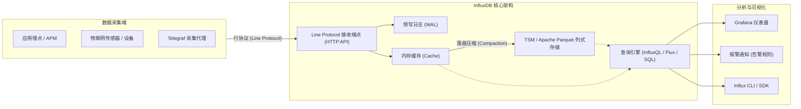

+++
title = 'InfluxDB：现代时序数据库核心架构与实战解析'
date = '2026-09-23T10:39:46+08:00'
slug = 'influxdb'
draft = false
tags = ['InfluxDB', '时序数据库', 'TSDB', '监控运维', 'IoT']
+++

在云原生监控、工业物联网（IoT）、智能运维（AIOps）以及金融量化分析等领域，系统每秒都会产生海量带有时间戳的指标数据。传统的通用关系型数据库（如 MySQL、PostgreSQL）在应对每秒数万甚至数百万次的高并发写入、PB 级时间范围聚合分析以及自动过期清理时，往往会面临 B+ 树索引分裂膨胀与性能断崖式下跌的困境。

为了解决时间序列数据的专属存储与检索挑战，**时序数据库（Time Series Database, TSDB）** 应运而生。而在开源 TSDB 领域，**[InfluxDB](https://www.influxdata.com/)** 无疑是最具代表性、应用最为广泛的旗舰产品之一。

本文将从时序数据的本质出发，深度解析 InfluxDB 的数据模型、底层存储引擎演进（TSM 到 IOx）、行协议（Line Protocol）、查询生态，以及实际工程中的避坑实践。

<!-- more -->



---

## 一、时序数据的特征与 InfluxDB 的数据模型

时间序列数据本质上是“**在连续时间点上记录的某种测定值**”。它具有明显的特征：
1. **写多读少，持续高并发追加**：数据按时间顺序持续写入，极少发生历史数据的随机 `UPDATE` 或 `DELETE`；
2. **近实时查询，大范围降采样**：最常被查询的是最近几小时的数据；对历史久远的数据，往往只需要分钟级、小时级甚至天级的汇总趋势；
3. **强时间生命周期管理**：历史数据具备时效性，超期后需要自动淘汰清除。

为了高效映射这类数据，InfluxDB 建立了一套清晰的核心概念：

| 概念 | 关系型数据库对照 | 说明 |
| :--- | :--- | :--- |
| **Measurement** | 表（Table） | 衡量指标的主题分类（如 `cpu_usage`、`disk_io`、`temperature`） |
| **Tag (Key-Value)** | 索引列（Indexed Columns） | 存放维度元数据（如 `host=server01`、`region=us-west`），**默认建立全局倒排索引**，用于快速过滤与分组（`GROUP BY`），仅支持字符串类型 |
| **Field (Key-Value)** | 非索引列（Data Columns） | 实际的测量数值指标（如 `idle=98.2`、`user=1.5`），**不建立索引**，支持浮点、整型、字符串和布尔型 |
| **Timestamp** | 主键（Primary Key） | 数据记录的精准时间点，支持纳秒（ns）、微秒（µs）、毫秒（ms）精度 |
| **Series（序列）** | 单独的数据流 | **`Measurement + Tag Set` 的唯一组合**。时间序列数据库的性能核心往往取决于序列基数（Series Cardinality）的大小 |
| **Bucket / RP** | 数据库/分区模式 | 包含数据存储的保留策略（Retention Policy，定义数据保存天数）及副本数 |

---

## 二、核心通信基石：行协议（Line Protocol）

InfluxDB 设计了一种极其紧凑、面向文本的流式写入协议 —— **Line Protocol（行协议）**。该协议使用单行文本承载一个数据点，去除了 JSON 或 XML 的嵌套开销，能够在极低的带宽与 CPU 解析成本下完成每秒数十万点的吞吐。

### 语法结构

```text
<measurement>[,<tag_key>=<tag_value>...] <field_key>=<field_value>[,<field_key>=<field_value>...] [timestamp]
```

### 格式规范与示例
- **Measurement 与 Tags** 之间用逗号 `,` 分隔；
- **Tags 与 Fields** 之间用空格 `' '` 分隔；
- **Fields 与可选的时间戳** 之间用空格 `' '` 分隔；
- 多个 Tag 或多个 Field 之间用逗号 `,` 连接。

```text
// 记录服务器 CPU 监控指标，带纳秒时间戳
cpu_load,host=serverA,region=cn-east-1 idle=88.5,system=3.2,user=8.3 1727088000000000000

// 记录环境温湿度，省略时间戳（默认由服务器接收时的时间自动填充）
sensor_env,device_id=d001,location=room_101 temperature=23.6,humidity=55.2
```

---

## 三、底层存储引擎的技术演进

InfluxDB 历经数代重大重构，其底层引擎的发展折射了整个分布式存储与时序架构的演化路径：

### 1. 早期探索与 TSM（Time-Structured Merge Tree）
在早期版本尝试过 LevelDB 和 RocksDB 之后，InfluxDB 发现传统通用的 LSM-Tree 无法完美匹配时序场景的极端写模式，于是自研了 **TSM 引擎**（类似 LSM，但专为时序定制）：
- **WAL（Write-Ahead Log）**：接收写入后首先追加写 WAL，保证断电不丢数据；
- **内存缓存（Memory Cache）**：内存中暂存近期点位，提供近实时快速查询；
- **TSM 文件**：后台异步将内存刷盘生成只读不可变的 TSM 文件，利用列式存储和针对时序量身定制的高效压缩算法（针对时间戳的 Delta-of-Delta 编码、针对浮点数的 Gorilla 压缩算法、针对整数的 Run-length 编码等），压缩率通常可达 **90% 以上**；
- **TSI（Time Series Index）**：为了加速海量 Tag 筛选，将索引从纯内存迁移至基于磁盘的内存映射（mmap）倒排索引，大幅缓解了内存爆炸问题。

### 2. InfluxDB 3.0 的架构革命：IOx 引擎
为了从根本上彻底消灭“**高基数陷阱（High Cardinality）**”，InfluxData 使用 **Rust** 语言重写了存储核心，推出了全新的开源引擎 **Apache Arrow IOx**：
- **列式全内存与分析**：深度集成 **Apache Arrow** 内存格式与 **DataFusion** 分布式 SQL 执行引擎；
- **对象存储原生（Cloud-Native Storage）**：历史冷数据直接切片持久化为标准的 **Apache Parquet** 列存文件，可以直接存放在 AWS S3、MinIO 或阿里云 OSS 等高可用廉价对象存储中；
- **计算存储分离**：彻底解决了老版本在处理大量唯一 Tag（如客户端 UUID、订单 ID）时索引无限膨胀的痛点，并原生回归支持标准的 **ANSI SQL**。

---

## 四、查询语言的进化：从 InfluxQL 到 Flux 与 SQL

在 InfluxDB 的生态中，用户可以使用不同的查询方式：

### 1. 经典 InfluxQL（类 SQL 语法）
对于熟悉传统 SQL 的开发者来说极为亲切，支持丰富的时间窗口聚合：

```sql
SELECT MEAN("idle") 
FROM "cpu_load" 
WHERE "host" = 'serverA' AND time >= now() - 1h 
GROUP BY time(5m) fill(0);
```

### 2. 管道式脚本语言 Flux（InfluxDB 2.x 引入）
Flux 是一门专门针对复杂时序分析的函数式管道语言，支持跨 Bucket 关联查询、数学变换及复杂预警算法：

```javascript
from(bucket: "telegraf")
  |> range(start: -1h)
  |> filter(fn: (r) => r._measurement == "cpu_load" and r._field == "idle")
  |> filter(fn: (r) => r.host == "serverA")
  |> aggregateWindow(every: 5m, fn: mean, createEmpty: false)
  |> yield(name: "mean_idle")
```

### 3. 标准 SQL（InfluxDB 3.0 / IOx）
在 3.0 体系中，得益于 DataFusion 引擎的支持，用户无需再学习专有的 Flux 脚本，直接书写标准的现代 SQL 即可完成高性能多维聚合。

---

## 五、时序建表与性能调优最佳实践

在生产环境使用 InfluxDB 时，务必遵循以下核心工程准则：

### 1. 警惕“基数爆炸（High Cardinality）”
在 InfluxDB 1.x / 2.x 中，**每一个不同的 Tag Key-Value 组合都会在底层生成一条独立的 Series**。
- ❌ **严重反模式**：切勿将用户 ID、微秒级时间戳、随机 UUID、订单号等高唯一性的字符串设置为 `Tag`！这会导致内存中的倒排索引无限膨胀，引发 OOM（内存溢出）。
- ✅ **正确做法**：将这类高基数、无需用来做 `GROUP BY` 分组聚合的字段存储在 **`Field`** 中。

### 2. 批量写入（Batch Writes）
每次通过 HTTP API 发送单独一行 Line Protocol 会造成严重的网络与 CPU 系统调用浪费。
- 建议将数据缓冲至客户端，以 **500 ~ 5000 个数据点为一批（Batch）** 进行单次 HTTP POST 提交；
- 合理配置 gzip 压缩，可减少 70% 的传输带宽占用。

### 3. 规划数据保留策略（Retention Policy）与降采样
- 不要永久保留原始高精度数据（如 1 秒一次的采样）；
- 利用持续查询（Continuous Queries）或定时任务（Tasks），将 30 天以前的原始数据按小时取均值后转存入低精度 Bucket，并设置原数据的自动过期删除（RP），兼顾历史趋势回溯与磁盘成本。

---

## 六、主流开源 TSDB 横向对比

| 维度 | InfluxDB | Prometheus | TimescaleDB | TDengine |
| :--- | :--- | :--- | :--- | :--- |
| **主要定位** | 通用多维时序平台（IoT、DevOps、日志事件） | 云原生 Kubernetes 基础监控与告警 | 关系型关系数据+时序一体化平台 | 物联网、车联网大数据引擎 |
| **数据采集模式** | 主动 Push（支持 Telegraf） | 被动 Pull（抓取 /metrics 接口） | 客户端直连 SQL 插入 | 支持 Push 写入与连接器 |
| **查询语法** | InfluxQL / Flux / SQL | PromQL | 标准完整 PostgreSQL SQL | 类 SQL |
| **底层实现** | TSM / Apache Arrow (Rust IOx) | 自研分段存储（Chuncks） | 基于 PG 的 Hypertable 分区扩展 | 自研超表（Super Table）与列存 |
| **最佳场景** | 多维度指标打标、IoT 传感器追踪、通用业务大盘 | K8s 容器集群状态指标监控与 Alertmanager 联动 | 原有系统重度依赖 PostgreSQL，需要强 ACID 事务 | 工业设备、车联网等海量独立设备端监控 |

---

## 结语

从经典的 TSM 压缩引擎，到结合 Apache Arrow 与 Rust 打造的云原生存储革命，InfluxDB 凭借其极简高效的行协议（Line Protocol）、丰富的生态适配（Telegraf + Grafana）以及开箱即用的时间序列处理能力，持续引领着时序数据库的技术前沿。

在系统架构设计中，深刻理解 Measurement、Tag、Field 的职责边界，规避基数爆炸陷阱，并合理运用降采样与生命周期策略，才能真正释放 InfluxDB 处理 PB 级时序大数据的澎湃动力。
