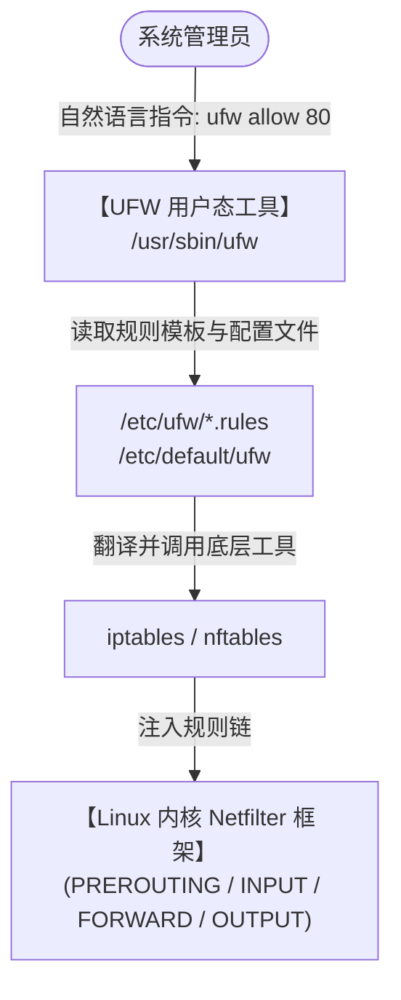
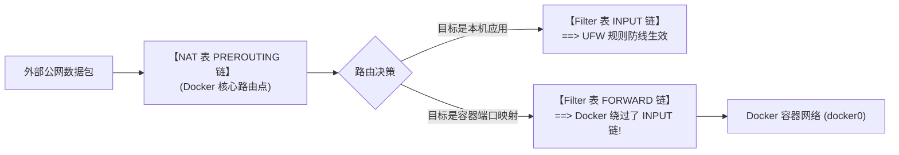

+++
title = 'Linux 防火墙 UFW 完全指南：从基础配置、防封秘诀到搞定 Docker 穿透冲突'
date = '2026-09-23T09:19:00+08:00'
slug = 'linux-firewall-ufw-complete-guide'
draft = false
tags = ['Linux', 'Ubuntu', '防火墙', 'UFW', '网络安全', '运维']
+++

在管理 Linux 服务器（尤其是 Ubuntu / Debian 系统）时，保障主机网络安全的第一道屏障就是**防火墙（Firewall）**。

提到 Linux 防火墙，很多人的第一反应是功能极为强大、但规则语法极其繁琐反人类的 `iptables`。为了降低网络安全配置的门槛，Ubuntu 官方团队推出了 **UFW（Uncomplicated Firewall，极简防火墙）**。

UFW 并非一套新的内核网络驱动，而是为 `iptables`（以及现代系统的 `nftables`）量身打造的**极简用户态管理前端**。它将晦涩的表、链、跳转逻辑封装成了像自然语言一样清晰直观的命令。

然而，UFW 看似简单，在生产实际使用中却潜藏着不少暗礁：稍有不慎就可能把自己的 SSH 连接踢下线并关在门外；更危险的是，**Docker 容器默认会绕过 UFW 的规则防御，在公网上“裸奔”**！

本文将从 UFW 的工作原理、保命法则、生产速查命令，深入讲到 Docker 穿透漏洞的根治方案与 NAT 端口转发，助你构筑起坚不可摧的服务器防护网。

<!-- more -->

---

## 一、 UFW 的底层定位与工作原理

在 Linux 内核中，真正负责数据包过滤与网络地址转换（NAT）的是位于内核空间的 **Netfilter** 框架。



UFW 的价值在于：
1. **隐藏复杂度**：不需要手写复杂的 `iptables -A INPUT -p tcp --dport 22 -j ACCEPT`。
2. **规则分层管理**：UFW 将规则有序切分为系统内置链（如 `ufw-before-input`、`ufw-user-input`、`ufw-after-input`），确保用户规则与系统级策略井然有序。

---

## 二、 核心铁律：防把自己“关在门外”（Lockout Prevention）

> [!CAUTION]
> **在任何一台远程云服务器上启用 UFW 之前，必须执行的第一条命令永远是放行 SSH 端口！**

如果你刚买好一台 VPS，直接兴冲冲地敲下了：
```bash
sudo ufw default deny incoming
sudo ufw enable
```
由于 UFW 默认拒绝所有入站连接，且此时尚未放行 SSH，当前终端一旦断开，你将**彻底失去对服务器的远程访问控制**，只能登录云厂商控制台的 VNC 救砖！

### 正确的初始化仪式：
```bash
# 1. 如果你的 SSH 是默认的 22 端口：
sudo ufw allow 22/tcp
# 或者按服务名放行
sudo ufw allow OpenSSH

# 2. 【特别注意】如果你的 SSH 修改为了自定义端口（如 2222）：
sudo ufw allow 2222/tcp

# 3. 确认规则已加入，再正式启用防火墙
sudo ufw enable
```

---

## 三、 UFW 生产运维必备速查手册

### 1. 启停与状态查看
```bash
# 查看防火墙状态（含默认策略与已生效规则）
sudo ufw status verbose

# 查看带序号的规则列表（精准删除规则时必用）
sudo ufw status numbered

# 启用 / 禁用防火墙
sudo ufw enable
sudo ufw disable

# 重载规则（修改配置文件后生效）
sudo ufw reload

# 重置防火墙（清空所有自定义规则，恢复出厂默认）
sudo ufw reset
```

### 2. 配置默认进出站策略（白名单安全基线）
推荐在所有生产环境中遵循“**严进宽出**”的白名单防御思想：
```bash
# 默认禁止所有未经明确允许的入站连接
sudo ufw default deny incoming

# 默认允许所有服务器发起的出站连接（保证服务器能正常 apt update、请求外网 API）
sudo ufw default allow outgoing
```

---

### 3. 精细化端口与服务放行

#### ① 基础端口与协议放行
```bash
# 允许特定端口（默认同时匹配 TCP 和 UDP）
sudo ufw allow 80

# 严格指定只放行 TCP 或 UDP
sudo ufw allow 80/tcp
sudo ufw allow 53/udp

# 放行连续的端口范围（必须显式指定协议）
sudo ufw allow 60000:61000/udp
```

#### ② 按服务名称放行
UFW 会自动读取系统 `/etc/services` 中定义的应用名称：
```bash
sudo ufw allow http       # 对应 80 端口
sudo ufw allow https      # 对应 443 端口
```

#### ③ 基于 IP 地址与子网的精细控制
在管理数据库（如 MySQL 3306、Redis 6379）时，**严禁向全公网开放**，必须指定来源 IP：
```bash
# 仅允许特定的办公网固定公网 IP 访问 3306 端口
sudo ufw allow from 116.62.100.50 to any port 3306 proto tcp

# 允许局域网/专有网络内网网段访问全部服务
sudo ufw allow from 10.0.0.0/24

# 拉黑恶意攻击来源 IP（完全阻断其任何访问）
sudo ufw deny from 203.0.113.55
```

---

### 4. 限流防暴破神器：`ufw limit`
针对 SSH、FTP 等极易遭受暴力破解扫描的端口，UFW 内置了极其便捷的限速保护：
```bash
sudo ufw limit ssh/tcp
# 或者针对自定义端口
sudo ufw limit 2222/tcp
```
**工作原理**：如果某个 IP 地址在 **30 秒内发起 6 次以上**的连接请求，UFW 会自动丢弃该 IP 的后续连接包，无需依赖额外的 Fail2ban 即可抵御大部分低级扫描攻击。

---

### 5. 安全地删除规则
```bash
# 方式一：直接按规则定义删除
sudo ufw delete allow 80/tcp

# 方式二：根据编号精准删除（最推荐，防止误删语法歧义规则）
# 1. 先列出带序号的规则
sudo ufw status numbered
# 输出类似：
# [ 1] 22/tcp                     ALLOW IN    Anywhere
# [ 2] 80/tcp                     ALLOW IN    Anywhere
# [ 3] 3306/tcp                   ALLOW IN    116.62.100.50

# 2. 根据方括号内的序号直接删除
sudo ufw delete 3
```

---

## 四、 致命陷阱：Docker 为什么会无视 UFW 防御？

很多运维工程师都经历过这样的“灵异事件”：
服务器上明明开启了 UFW，且默认 `deny incoming`，也没有放行 `8080` 端口。但当你使用 Docker 启动了一个容器：
```bash
docker run -d -p 8080:8080 my-web-app
```
外网用户竟然**直接就能访问通 8080 端口**！UFW 仿佛成了摆设。

### 1. 为什么 Docker 会“偷跑”？底层机理剖析
问题的根源在于 **Netfilter 数据包处理流向** 与 **Docker 注入 iptables 规则的位置**：



1. 当外部数据包到达服务器网卡时，首先经过 **NAT 表的 PREROUTING 链**。
2. Docker 守护进程在启动时，会自动向 `PREROUTING` 链以及 `FORWARD` 链注入自己的 `DOCKER` 规则。
3. 容器映射端口的数据包在路由阶段被判定为需要“转发”，于是**直接进入了 FORWARD 链，根本不走主机层面的 INPUT 链**。
4. 而 UFW 默认的用户自定义规则主要挂载在 `INPUT` 链上。因此，Docker 借由内核转发机制，**完美地把 UFW 架空了**！

---

### 2. 根治 Docker 绕过防火墙的三种方案

#### 方案 A：绑定到本地回环（最佳生产实践，推荐指数 ⭐⭐⭐⭐⭐）
绝大多数容器（如数据库、微服务后端应用）并不需要直接裸露在公网上，而是应该通过宿主机上的 Nginx / Caddy 进行反向代理。

在启动 Docker 容器时，在端口映射前显式加上 `127.0.0.1:`：
```bash
# 仅允许宿主机本地访问，外部公网无法直接触达
docker run -d -p 127.0.0.1:8080:8080 my-web-app
```
配合 `docker-compose.yml`：
```yaml
ports:
  - "127.0.0.1:8080:8080"
```
此时外网流量只能访问 Nginx 的 80/443 端口（受 UFW 保护），再由 Nginx 转发到本地容器，既安全又利于统一管理 SSL 证书。

---

#### 方案 B：使用开源 `ufw-docker` 补丁工具（推荐指数 ⭐⭐⭐⭐）
如果你确实需要很多容器直接对外暴露端口，可以使用社区广泛采用的 [ufw-docker](https://github.com/chaifeng/ufw-docker) 方案：

```bash
# 1. 下载脚本并安装到系统路径
sudo wget -O /usr/local/bin/ufw-docker \
  https://github.com/chaifeng/ufw-docker/raw/master/ufw-docker
sudo chmod +x /usr/local/bin/ufw-docker

# 2. 安装 UFW 规则补丁（该补丁会向 /etc/ufw/after.rules 添加针对 FORWARD 链的拦截）
ufw-docker install

# 3. 重启 UFW
sudo systemctl restart ufw
```
安装后，所有 Docker 映射端口默认会被拦截。如果需要单独放行某个容器的端口，使用该工具管理即可：
```bash
ufw-docker allow my-container 80
```

---

#### 方案 C：禁用 Docker 的 iptables 操作（谨慎使用 ⚠️）
在 `/etc/docker/daemon.json` 中配置：
```json
{
  "iptables": false
}
```
**警告**：禁用后 Docker 将完全不碰防火墙规则。这会导致 Docker 容器无法访问外网、容器之间网络互通失效，除非你拥有极其深厚的 `iptables` 手工调校经验，否则不建议使用。

---

## 五、 进阶配置：NAT 端口转发与路由

如果需要将当前服务器作为跳板机或网关，将访问本机某个端口的流量转发到内网其他服务器，UFW 同样可以胜任。

### 1. 开启内核转发
编辑 `/etc/sysctl.conf`，取消以下注释：
```ini
net.ipv4.ip_forward=1
```
执行 `sudo sysctl -p` 立即生效。

### 2. 调整 UFW 默认转发策略
编辑 `/etc/default/ufw`：
```bash
# 将 DROP 改为 ACCEPT
DEFAULT_FORWARD_POLICY="ACCEPT"
```

### 3. 配置 NAT 转换规则
编辑 `/etc/ufw/before.rules`，在文件顶部（`*filter` 之前）添加 NAT 表规则：
```ini
# NAT 表配置
*nat
:PREROUTING ACCEPT [0:0]
:POSTROUTING ACCEPT [0:0]

# 将访问本机 8888 端口的 TCP 流量转发到内网 10.0.0.5 的 80 端口
-A PREROUTING -p tcp --dport 8888 -j DNAT --to-destination 10.0.0.5:80

# 开启源地址伪装 (将 eth0 替换为你的真实公网网卡名)
-A POSTROUTING -s 10.0.0.0/24 -o eth0 -j MASQUERADE

COMMIT
```
重启防火墙：`sudo ufw reload`。

---

## 六、 日志审计与排障技巧

当网络连接不通、怀疑被防火墙阻断时，查看 UFW 运行日志是最快的排障手段。

```bash
# 开启日志（可选 low, medium, high）
sudo ufw logging on

# 查看实时拦截日志
sudo tail -f /var/log/ufw.log
```

一条典型的 UFW 拦截日志如下：
```text
[UFW BLOCK] IN=eth0 OUT= MAC=... SRC=198.51.100.23 DST=172.31.1.10 LEN=40 TOS=0x00 PREC=0x00 TTL=245 ID=54321 PROTO=TCP SPT=51234 DPT=22 WINDOW=1024 RES=0x00 SYN URGP=0
```
- `[UFW BLOCK]`：表明该数据包被策略丢弃；
- `IN=eth0`：进入的数据网卡；
- `SRC`：发送端源 IP；
- `DST`：本机目的 IP；
- `PROTO`：协议类型（TCP/UDP）；
- `DPT`：目标端口（如 22）。

通过分析 `DPT` 与 `SRC`，你能立刻诊断出是规则配错导致了自己被封，还是有恶意脚本正在试图扫描特定端口。

---

## 结语

UFW 的魅力在于它在“易用性”与“安全性”之间找到了绝佳的平衡点。记住它的核心安全原则：
1. **未雨绸缪**：先放行 SSH 端口，再激活防火墙；
2. **最小权限**：数据库与运维面板永远绑定特定 IP 或内网网段访问；
3. **警惕 Docker**：容器暴露端口务必绑定 `127.0.0.1` 配合反代，切勿让容器在公网“裸奔”。

掌握这套规范，你的 Linux 主机就拥有了坚固而可靠的网络安全基石。
