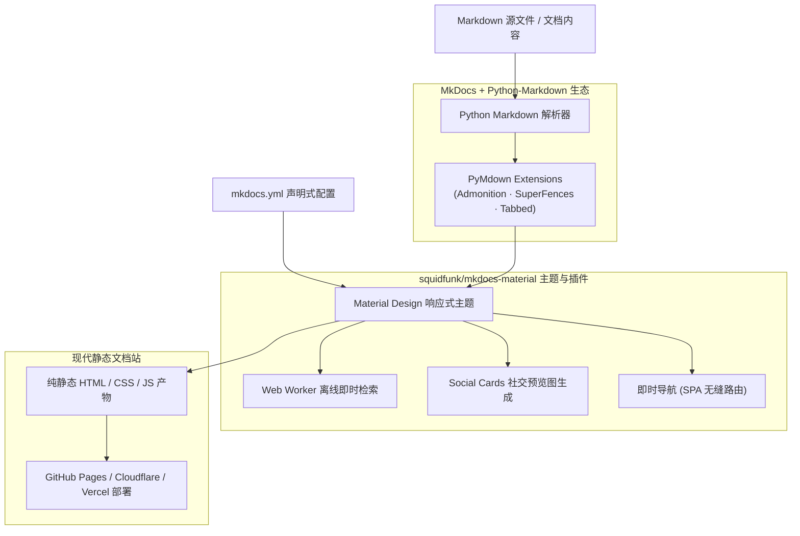

+++
title = 'Material for MkDocs：打造现代化技术文档站的开源利器'
date = '2026-09-23T10:16:12+08:00'
slug = 'mkdocs-material'
draft = false
tags = ['MkDocs', '开源工具', '文档工程', '静态站点', 'Python']
+++

在开源项目和软件工程领域，一份赏心悦目、检索高效、结构清晰的技术文档，往往能够决定一个工具能否被快速推广与普及。

如果你浏览过像 **FastAPI**、**Pydantic**、**Ruff / uv (Astral)**、**Polars** 或 **TiDB** 等知名开源项目的官方文档，你一定会被其优雅的排版、流畅的即时搜索以及出色的暗色模式所吸引。这些文档站点的背后，几乎都站着同一个统治级的开源利器 —— **[squidfunk/mkdocs-material](https://github.com/squidfunk/mkdocs-material)**（又称 **Material for MkDocs**）。

本文将系统梳理 Material for MkDocs 的核心魅力、杀手级特性、工程化实战配置，以及它为何能成为现代技术文档站的标杆之选。

<!-- more -->



---

## 一、什么是 Material for MkDocs？

[MkDocs](https://www.mkdocs.org/) 是基于 Python 开发的静态站点生成器，专注于为软件项目生成技术文档。而由 Martin Donath（[@squidfunk](https://github.com/squidfunk)）主导开发的 **Material for MkDocs**，则是构建在 MkDocs 之上的一套全面遵循 Google Material Design 规范的主题系统。

它不仅仅是一个“视觉皮肤”，更是一个集成了深层功能扩展、文档工程化套件、自动化 SEO 和极速客户端体验的**全功能技术文档框架**。目前在 GitHub 上已斩获数万颗星标（Star），被广泛视作当前开源世界里交互体验最顶级的文档工具之一。

---

## 二、核心杀手级特性

### 1. 极致的阅读与交互体验（UX）
- **即时导航（Instant Navigation）**：采用类似于单页应用（SPA）的预加载和动态内容替换机制，页面跳转无需白屏重载，体验丝滑流畅；
- **全自动调色盘（Palettes & Dark Mode）**：完美支持亮色/深色主题，支持跟随用户操作系统偏好自适应切换，或者通过顶部开关一键切换；
- **响应式排版**：无论在大屏桌面端、平板还是移动端，侧边导航树、主体内容区和右侧目录（TOC）均能优雅自适应折叠与展示。

### 2. 秒级离线即时搜索（Client-side Search）
- 基于 Web Worker 的客户端全文索引，输入关键字即可实时高亮匹配结果；
- 深度支持键盘快捷键：随时按下 `/` 或 `f` 即可唤起全局搜索，支持上下键无缝选词；
- 智能分词与搜索建议（Typeahead / Suggestions），支持多语言（包括中日韩 CJK 分词插件支持）。

### 3. 超强的技术写作扩展（Markdown Superpowers）
Material for MkDocs 深度融合了 `pymdown-extensions`，将普通的 Markdown 扩展为富表现力引擎：
- **提示卡片（Admonitions / Callouts）**：支持 `note`、`tip`、`warning`、`danger` 等多达十余种语义化强调块，并支持可折叠式卡片（Details）；
- **代码块超级增强（SuperFences）**：
  - 代码语法高亮（Pygments 驱动）；
  - 行号显示与指定行高亮标记；
  - 一键复制代码到剪贴板；
  - **内容分组标签页（Content Tabs）**：在同一位置以选项卡形式展示不同语言（Python / Go / C#）或不同包管理器（pip / conda / poetry）的代码对比；
- **图表与公式原生渲染**：内置对 Mermaid.js 流程图/时序图的原生集成，以及 MathJax / KaTeX 数学公式支持。

### 4. 完整的工程化配套基础设施
- **多版本文档管理（Versioning via mike）**：与 `mike` 工具无缝集成，轻松实现像 `v1.0`、`v2.0`、`latest` 的多版本归档与顶部下拉版本切换；
- **自动化社交卡片（Social Cards）**：构建时自动抓取每篇文章的标题、摘要与 Logo，生成适用于 Twitter、Open Graph 的高清分享图片；
- **内置博客插件（Blog Plugin）**：除了传统知识树文档，还能零成本搭建带分页、标签、分类和作者信息的专属技术博客；
- **Git 深度集成**：自动读取 Git Commit 信息，展示文章最后更新时间、贡献者头像与直通源码仓库的“编辑此页”按钮。

---

## 三、快速上手实战配置

### 1. 安装依赖
由于基于 Python，只需通过 `pip` 或现代包管理工具（如 `uv`）即可一键安装：

```bash
pip install mkdocs-material
```

### 2. 核心配置文件 `mkdocs.yml`
一个开箱即用且功能完善的生产级配置模板如下：

```yaml
site_name: 我的技术项目文档
site_url: https://myusername.github.io/my-docs/
repo_url: https://github.com/myusername/my-docs
repo_name: my-docs
site_description: 现代化项目使用指南与架构参考

theme:
  name: material
  language: zh                 # 设置界面语言为简体中文
  palette:
    # 亮色模式
    - scheme: default
      primary: indigo
      accent: indigo
      toggle:
        icon: material/brightness-7
        name: 切换至深色模式
    # 深色模式
    - scheme: slate
      primary: indigo
      accent: indigo
      toggle:
        icon: material/brightness-4
        name: 切换至浅色模式
  features:
    - navigation.instant       # 启用 SPA 即时路由导航
    - navigation.tracking      # 地址栏哈希跟随页面滚动
    - navigation.tabs          # 顶部一级导航选项卡
    - navigation.sections      # 侧边栏分组区块渲染
    - navigation.top           # 快速回到顶部按钮
    - search.suggest           # 搜索自动补全建议
    - search.highlight         # 搜索结果关键词高亮
    - content.code.copy        # 代码块一键复制按钮

markdown_extensions:
  - admonition                 # 警告/提示卡片
  - pymdownx.details           # 折叠卡片
  - pymdownx.superfences:      # 代码块增强与 Mermaid 原生支持
      custom_fences:
        - name: mermaid
          class: mermaid
          format: !!python/name:pymdownx.superfences.fence_code_format
  - pymdownx.tabbed:           # 多语言代码/内容标签页
      alternate_style: true
  - pymdownx.highlight:        # 语法高亮设置
      anchor_linenums: true
      line_spans: __span
      pygments_lang_class: true
  - pymdownx.inlinehilite      # 行内代码高亮
  - pymdownx.snippets          # 支持嵌入复用外部代码片段
```

### 3. 本地预览与构建

```bash
# 启动热重载开发服务器（默认监听 127.0.0.1:8000）
mkdocs serve

# 构建输出最终静态文件到 site/ 目录
mkdocs build

# 一键部署至 GitHub Pages 分支 (gh-pages)
mkdocs gh-deploy
```

---

## 四、文档框架横向选型对比

当前技术社区中常见的技术文档框架各有千秋，我们可以将 Material for MkDocs 与其他流行工具做个直观对比：

| 维度 | Material for MkDocs | Docusaurus | VitePress | Hugo (如 Docsy/Book) |
| :--- | :--- | :--- | :--- | :--- |
| **底层技术栈** | Python + Jinja2 | React / Node.js | Vue 3 / Vite | Go 语言 |
| **上手门槛** | **极低**（单个 YAML 配置） | 中等（需具备前端 React 知识） | 较低（熟悉 Markdown 与 Vue） | 较低（熟悉 Hugo 模板体系） |
| **交互质感** | **顶级**（原生 Material 调教） | 优秀（高度自由可编程） | 极简、现代、速度飞快 | 简洁（视具体主题而定） |
| **搜索体验** | 开箱即用、无需云端 Algolia | 需配置本地插件或 Algolia | 需配置 Minisearch 或 Algolia | 依赖主题内置或外部引擎 |
| **维护与升级** | 配置解耦、极度稳定无前端断代 | 依赖前端 npm 依赖树，偶有升级包袱 | 迭代平稳、轻量 | 极度稳定（单二进制执行） |
| **最佳应用场景** | 基础库/算法/后端/CLI 工具官方文档 | 重度 React 生态、多交互组件展示 | 现代前端库、Vue 生态项目 | 大型多语言综合门户/博客/文档混排 |

---

## 五、可持续开源商业化典范：Insiders 模式

除了优秀的产品设计，`mkdocs-material` 在开源商业化探索上也给开发者社区树立了极佳的范例 —— **Sponsors Insiders 计划**。

作者 Martin Donath 没有选择将整个项目转为闭源，而是通过 GitHub Sponsors 设定资助阶梯：
- 资助者（Sponsors）可以提前解锁专门的 **Insiders 独家功能**（例如更先进的离线搜索优化、PDF 导出、项目全局社交图库等）；
- 当月度资助金额达到预设目标时，这些独占功能就会被**自动合并回公共开源仓库**，向全球免费公开。

这种良性循环不仅保障了全职开源维护者的可持续体面收入，更激励了社区用户和企业客户积极参与赞助，成就了一段开源佳话。

---

## 总结

如果你正在为自己的开源项目、技术框架、内部知识库或团队工程规范寻找一个既免于繁重前端维护、又拥有国际顶级工业质感的文档方案，**Material for MkDocs** 绝对是不容错过的首选。它用最低的心智负担，赋予了纯 Markdown 文件前所未有的工程生命力与专业美感。
