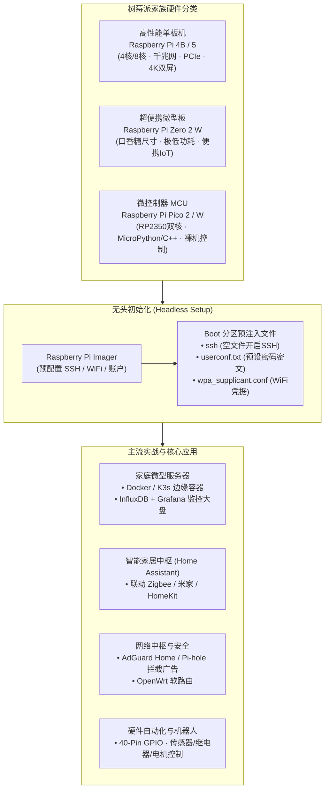

+++
title = '树莓派（Raspberry Pi）全景实战指南：从硬件选型、无头初始化到硬核玩法'
date = '2026-09-23T11:05:32+08:00'
slug = 'raspberry-pi-guide'
draft = false
tags = ['树莓派', 'Raspberry Pi', 'Linux', '硬件', '嵌入式', 'IoT']
+++

自 2012 年由英国树莓派基金会首次发布以来，**树莓派（Raspberry Pi）** 凭借仅有信用卡大小的体积、标准完整的 Linux 环境、丰富的 GPIO 物理引脚拓展能力以及极为亲民的价格，彻底席卷了全球创客、嵌入式工程师和家庭实验室（HomeLab）玩家的世界。

它不仅是一台可以运行桌面环境的微型单板计算机（SBC），更是一扇连接物理硬件传感器与现代云原生软件体系的绝佳桥梁。

本文将从家族硬件选型、完全不接显示屏与键鼠的**“无头模式（Headless Setup）”极速开箱**、系统初始化调优，到主流实用场景与长期稳定运行避坑，为你奉上一份全面的实战指南。

<!-- more -->



---

## 一、硬件选型：哪款树莓派适合你？

树莓派家族发展至今，主要形成了三大主流产品线，面向截然不同的应用场景：

| 产品系列 | 代表型号 | 核心算力与内存 | 接口与功耗 | 推荐应用场景 |
| :--- | :--- | :--- | :--- | :--- |
| **标准旗舰系列 (SBC)** | **Raspberry Pi 5** / **4B** | 64 位 4 核 ARM Cortex-A76 (Pi 5)；1GB / 2GB / 4GB / 8GB / 16GB LPDDR4X | 千兆以太网、双 USB 3.0、双 4K micro-HDMI、PCIe 2.0 接口（Pi 5 支持 NVMe SSD 扩展） | 个人轻量桌面、家庭媒体中心、HomeLab 服务器、编译构建节点、K3s 边缘集群 |
| **微型便携系列 (Zero)** | **Raspberry Pi Zero 2 W** | 64 位 4 核 ARM Cortex-A53；512MB RAM | 仅口香糖大小；板载 WiFi 4 / 蓝牙 4.2；Micro-USB 供电；功耗极低 (~1.5W) | 随身便携设备、网络监控摄像头、智能门铃、低功耗无人机/车载挂载点 |
| **微控制器系列 (MCU)** | **Raspberry Pi Pico 2 / W** | 自研 RP2350 双核 ARM Cortex-M33 / RISC-V；520KB SRAM | 裸机/实时系统运行；板载无线模块（Pico W）；价格极度低廉（约几美元） | 对标 Arduino / ESP32；硬实时传感器数据采集、高精度电机控制、硬件电子玩具 |

---

## 二、“无头模式（Headless Setup）”极速开箱

很多开发者手头并没有多余的 HDMI 采集卡、显示屏或 USB 键盘。通过**无头模式**，只需将系统刷入 MicroSD（TF）卡，通电后即可直接通过局域网 SSH 登录。

### 1. 现代化官方方案：Raspberry Pi Imager 高级设置（强烈推荐）
在电脑端下载官方烧录工具 **Raspberry Pi Imager**：
1. 选择操作系统：推荐选择 **Raspberry Pi OS (64-bit)** 或不带桌面界面的 **Raspberry Pi OS Lite (64-bit)**；
2. 选择目标 SD 卡；
3. 点击右下角的 **“齿轮”图标（设置）** 或按下快捷键 `Ctrl + Shift + X`：
   - 勾选 **启用 SSH**，并选择“使用密码身份验证”；
   - 预设用户名与密码（自 2022 年起，官方已彻底废弃默认的 `pi:raspberry` 密码，必须在此处自定义初始管理员用户）；
   - 勾选 **配置无线局域网**，填入家庭 WiFi 的 SSID 与密码，并选择正确的国家代码（如 `CN`）；
   - 配置主机名（默认为 `raspberrypi.local`）；
4. 点击“烧录”，工具会自动将网络与凭据预先写入系统。

---

### 2. 传统手工注入法（直接修改 Boot 分区文件）
如果你是直接下载 `.img` 镜像通过通用工具（如 BalenaEtcher、Rufus）刷入的，可以在烧录完成后，拔出并重新插入电脑，在电脑识别出的 **`boot` 分区（FAT32 格式）** 根目录下手动放置以下三个关键文件：

#### (1) 开启 SSH：文件 `ssh`
在 `boot` 根目录新建一个名为 `ssh` 的空白文本文件（**注意没有文件后缀名**），系统启动检测到此文件会自动开启 SSH 守护进程。

#### (2) 预设账户与密码：文件 `userconf.txt`
新建 `userconf.txt` 文件，内容格式为 `用户名:加密后的密码哈希`。例如要创建用户名为 `cxy`、密码为 `my_secret_pass`：
```text
cxy:$6$rounds=4096$randomsalt$X8s0e7...（使用 openssl passwd -6 my_secret_pass 生成的密文）
```

#### (3) 预设 WiFi 配置：文件 `wpa_supplicant.conf`
新建 `wpa_supplicant.conf` 文件，写入网络认证信息：
```text
ctrl_interface=DIR=/var/run/wpa_supplicant GROUP=netdev
update_config=1
country=CN

network={
    ssid="My_Home_WiFi"
    psk="WiFi_Password"
    key_mgmt=WPA-PSK
}
```

将 SD 卡插入树莓派并接通电源。等待 1~2 分钟系统初始化完毕后，同局域网电脑直接在终端执行：
```bash
ssh 用户名@raspberrypi.local
```
即可丝滑登录！

---

## 三、系统初始化与调优实践

首次登录系统后，推荐先执行以下基础调优：

### 1. 国内镜像源替换（加速 apt 下载）
以 Debian 12 (Bookworm) 基础的 Raspberry Pi OS 为例，将官方慢速源替换为清华大学开源镜像源：

```bash
# 1. 替换 Debian 主软件源
sudo sed -i 's|http://deb.debian.org/debian|https://mirrors.tuna.tsinghua.edu.cn/debian|g' /etc/apt/sources.list
sudo sed -i 's|http://security.debian.org/debian-security|https://mirrors.tuna.tsinghua.edu.cn/debian-security|g' /etc/apt/sources.list

# 2. 替换树莓派官方专用源
sudo sed -i 's|http://archive.raspberrypi.com/debian|https://mirrors.tuna.tsinghua.edu.cn/raspberrypi|g' /etc/apt/sources.list.d/raspi.list

# 3. 更新缓存并升级软件
sudo apt update && sudo apt upgrade -y
```

### 2. 善用系统配置利器：`raspi-config`
在终端输入 `sudo raspi-config`，可呼出基于 TUI 的图形配置菜单：
- **System Options**：修改主机名、密码、网络连接；
- **Interface Options**：一键使能 **Camera（摄像头接口）**、**SSH**、**VNC**、**I2C**、**SPI**、**Serial Port（串口）**；
- **Localization Options**：调整时区（选择 `Asia/Shanghai`）。

---

## 四、GPIO 硬件拓展与 Python 控制实操

树莓派与普通 PC 最大的不同在于主板边缘具有标准的 **40 根可编程通用输入输出引脚（GPIO, General-Purpose Input/Output）**。

### 点亮第一个 LED 示例（基于现代化 `gpiozero` 库）
无需底层的复杂寄存器操作，现代 Raspberry Pi OS 自带了高度 Pythonic 的 `gpiozero` 库：

```python
from gpiozero import LED
from time import sleep

# 将 LED 正极连接至 GPIO 17 (Pin 11)，负极串联 220Ω 电阻接地 (GND)
led = LED(17)

print("树莓派呼吸灯程序启动...")
while True:
    led.on()
    sleep(1)
    led.off()
    sleep(1)
```

通过这 40 个引脚，你可以挂载温湿度传感器（DHT11/DHT22）、空气质量检测仪、舵机云台、红外接收器或继电器，实现对真实物理环境的数字化感知与控制。

---

## 五、树莓派经典常驻应用场景

1. **智能家居中枢（Home Assistant）**：
   - 官方提供的 Home Assistant OS (HAOS) 可以让树莓派变身全屋智能大脑，打通米家、涂鸦、Apple HomeKit、飞利浦 Hue 以及各类 Zigbee / Matter 协议网关，摆脱云端依赖实现全本地化控制。
2. **全网无痕去广告与智能 DNS（AdGuard Home / Pi-hole）**：
   - 将树莓派部署为局域网的主 DNS 服务器，在 DNS 查询阶段直接拦截电视盒子、手机 App 和智能设备内嵌的追踪追踪代码与开屏广告。
3. **轻量 HomeLab 与 Docker 微型服务器**：
   - 一键安装 Docker 与 Portainer，挂载可内网穿透的文件同步服务（Nextcloud / Syncthing）、代码仓库（Gitea）、下载器（Aria2 / qBittorrent）以及时序监控平台（InfluxDB + Grafana）。
4. **旁路由与科学网关（OpenWrt）**：
   - 双网口或单臂旁路由模式运行 OpenWrt，为主机网络提供智能分流、透明代理与广告过滤加速。

---

## 六、长期稳定运行四大避坑准则

为了防止树莓派在常年 7x24 小时运行过程中出现无故死机、掉盘或损坏，务必注意以下几点：

1. **电源供电陷阱（小心闪电图标 ⚡）**：
   - 树莓派对供电要求极其苛刻。Pi 4B 建议使用 **5V/3A** 原装或高品质电源，Pi 5 则推荐使用支持 PD 协议的 **5V/5A** 电源；
   - 供电不足会导致右上角频繁闪现小黄闪电图标，甚至引发 CPU 降频、USB 掉电以及 SD 卡数据写坏。
2. **SD 卡寿命与速度瓶颈**：
   - 消费级 MicroSD 卡不适合承受数据库、Docker 容器日志的密集随机写入，使用数月容易坏块损坏；
   - **最优解**：通过 USB 3.0 外接移动固态硬盘（SSD），或者为 Raspberry Pi 5 扩展 PCIe NVMe M.2 扩展板，不仅读写速率暴增至 400MB/s ~ 800MB/s，而且寿命坚若磐石。
3. **散热降温（主动风扇 vs 被动盔甲外壳）**：
   - 树莓派 4B / 5 算力大幅提升的同时发热量也不容小觑。满载温度很容易超过 80°C 并触发降频阈值；
   - 生产部署建议配备铝合金导热整体盔甲外壳，或配备温控变速小风扇（Official Active Cooler）。
4. **断电保护与优雅停机**：
   - 严禁在运行中直接拔掉电源插头！这极易造成 ext4 文件系统损坏；
   - 关机请执行 `sudo poweroff` 或 `sudo shutdown -h now`，待绿色的活动指示灯彻底停止闪烁、仅剩红灯常亮后再切断电源。
