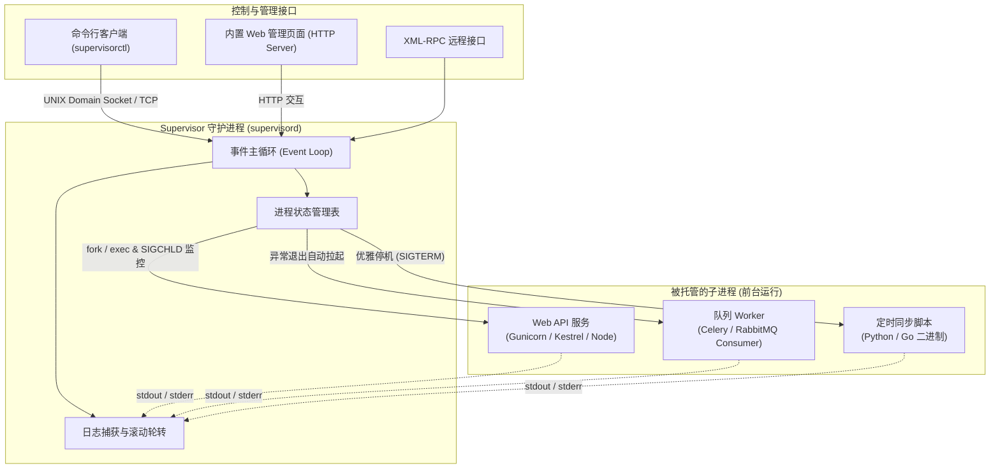

+++
title = 'Supervisor：Linux 进程守护与集中化管理实战指南'
date = '2026-09-23T10:50:10+08:00'
slug = 'supervisor'
draft = false
tags = ['Supervisor', '进程守护', 'Linux', '运维', 'Python']
+++

在服务端开发与系统运维中，如何确保编写的 Web 服务、消息队列消费者、数据同步脚本等后台进程能够长期、稳定地运行？

此前我们介绍过 Windows 平台下的神器 [NSSM](/posts/2025/07/windows守护进程工具nssm/)，它能将任意控制台程序包装为系统服务。而在 Linux / UNIX 生态中，最负盛名、应用最广泛的进程控制与守护系统莫过于 **[Supervisor](http://supervisord.org/)**。

无论是微服务日常管理、防止进程异常崩溃退出，还是在 Docker 容器内部管理多个关联进程，Supervisor 都能以极低的心智负担提供自动拉起、日志轮转与可视化控制能力。

本文将全面梳理 Supervisor 的运行架构、关键运行规则、生产级配置实战与日常避坑指南。

<!-- more -->



---

## 一、Supervisor 的架构与四大核心组件

Supervisor 是由 Python 开发的客户端/服务端架构系统，主要由以下四部分组成：

1. **`supervisord`（服务端守护进程）**：
   - 核心主进程。负责根据配置文件启动被管理的项目、监控子进程生命周期、捕获崩溃信号并自动重启，同时处理日志重定向；
2. **`supervisorctl`（命令行控制端）**：
   - 运维最常用的交互式 CLI 工具。通过 UNIX 套接字或 HTTP 与 `supervisord` 通信，支持查看进程状态、动态启动/停止/重启进程以及平滑更新配置；
3. **Web Server（内置轻量管理后台）**：
   - 提供直观的网页控制面板，支持在浏览器中一键查看各进程状态、触发重启和实时查看日志（需在配置中开启 `[inet_http_server]`）；
4. **XML-RPC 接口**：
   - 供第三方平台或自动化部署脚本远程调用的可编程 API。

---

## 二、黄金铁律：被托管进程严禁“后台化（Daemonize）”

这是所有初学者使用 Supervisor 最容易踩中的核心误区：

> ⚠️ **重要规则**：Supervisor 必须且只能监控**以非后台守护（前台 Foreground）方式运行的进程**！

### 为什么不能后台运行？
Supervisor 通过 `fork()` 和 `exec()` 派生出子进程，并通过操作系统的 `SIGCHLD` 信号来感知子进程的存活状态。
- 如果你的程序内部自行执行了 `fork` 变成 Daemon 后台运行，原父进程会立即退出；
- 这时 Supervisor 会认为该程序“启动失败或异常退出”，便会根据 `autorestart` 规则疯狂重新启动它，最终导致进入 `FATAL` 或 `BACKOFF` 崩溃状态；
- **正确做法**：
  - Nginx 必须添加配置：`daemon off;`
  - Gunicorn / Uvicorn 严禁加 `-D` 或 `--daemon` 参数；
  - Python/Node.js/Go 程序直接运行主入口，切勿自行挂载后台。

---

## 三、安装与目录结构

### 1. 系统包管理器安装（推荐）

```bash
# Ubuntu / Debian
sudo apt update && sudo apt install -y supervisor

# CentOS / RHEL (需先安装 epel-release)
sudo yum install -y epel-release
sudo yum install -y supervisor
```

### 2. 目录与配置文件结构
安装完成后，Supervisor 的主要目录规划如下：
- 主配置文件：`/etc/supervisor/supervisord.conf`（CentOS 通常在 `/etc/supervisord.conf`）；
- 模块化子配置目录：`/etc/supervisor/conf.d/*.conf`（主配置通常在末尾通过 `[include]` 自动载入该目录下的所有 `.conf` 文件）。

---

## 四、生产级配置实战

为了保障配置的清晰与模块化，建议为每一个独立服务在 `/etc/supervisor/conf.d/` 目录下创建单独的配置文件（例如 `/etc/supervisor/conf.d/my_app.conf`）。

### 1. 单应用配置模板（以 Web API 为例）

```ini
[program:my_web_api]
# 运行命令（必须是前台运行程序，建议写绝对路径）
command=/var/www/my_app/venv/bin/python app.py --port=8080

# 运行前切换到的工作目录
directory=/var/www/my_app

# 运行进程的系统用户（避免直接使用 root 运行）
user=www-data

# 开机/Supervisor 启动时是否自动启动该程序
autostart=true

# 进程异常退出后是否自动拉起（unexpected 表示仅在非正常退出码时重启）
autorestart=true

# 进程启动后至少平稳运行多少秒才视为启动成功（默认 1 秒）
startsecs=5

# 启动失败后的最大重试次数
startretries=3

# 停止进程时发送的信号（默认 TERM）
stopsignal=TERM

# 优雅停止等待超时时间（秒），超时后强行发送 SIGKILL
stopwaitsecs=10

# 将标准错误重定向到标准输出日志中
redirect_stderr=true

# 标准输出日志文件路径（目录需提前建好并有写入权限）
stdout_logfile=/var/log/supervisor/my_web_api.log

# 单个日志文件最大大小（超过自动切片）
stdout_logfile_maxbytes=50MB

# 日志切片保留备份数量
stdout_logfile_backups=10

# 环境变量注入（多项用逗号分隔）
environment=ASPNETCORE_ENVIRONMENT="Production",PORT="8080"
```

### 2. 进程组管理（Process Group）
如果一个系统包含多个紧密耦合的服务（例如 1 个 Web 节点和 3 个队列 Worker），可以使用 `[group]` 进行聚合管理：

```ini
[group:order_system]
programs=my_web_api,order_worker

# 这样就可以统一操作整组进程：
# supervisorctl restart order_system:*
```

---

## 五、命令行运维管理手册（`supervisorctl`）

在日常部署和运维中，熟练运用 `supervisorctl` 可以极大提高排障与发布效率：

### 常用命令清单

| 命令 | 作用说明 |
| :--- | :--- |
| `supervisorctl status` | 查看所有受托进程的实时运行状态、运行时间和 PID |
| `supervisorctl reread` | 读取配置文件的改动（不重启任何进程） |
| `supervisorctl update` | **最常用平滑更新**：载入最新配置，仅重启受影响或新增的服务，未修改的服务不受干扰 |
| `supervisorctl start <name>` | 启动指定的进程（若填 `all` 则启动所有） |
| `supervisorctl stop <name>` | 优雅停止指定进程 |
| `supervisorctl restart <name>` | 重启指定进程 |
| `supervisorctl tail -f <name> stdout` | 类似于 `tail -f`，实时追踪输出到终端的业务日志 |
| `supervisorctl reload` | 重新启动整个 `supervisord` 守护进程（会连带重启所有子进程，请谨慎使用） |

---

## 六、进阶：启用内置 Web 可视化面板

若需要在内网或特定跳板机上通过浏览器可视化监控所有进程，只需在主配置文件中启用 `[inet_http_server]`：

```ini
[inet_http_server]
port = 0.0.0.0:9001         ; 监听地址与端口
username = admin            ; 登录用户名
password = MySecurePass123  ; 登录密码
```

修改后执行 `sudo supervisorctl reload`，即可在浏览器中访问 `http://服务器IP:9001`，直观地启停进程和翻看实时日志。

---

## 七、Supervisor vs. Systemd 选型对比

在现代 Linux 发行版普遍普及 Systemd 的今天，为何仍有海量项目选择 Supervisor？

| 比较维度 | Supervisor | Systemd |
| :--- | :--- | :--- |
| **安装与侵入性** | 基于 Python 用户态安装，零侵入，普通用户即可部署管理私有实例 | 操作系统 1 号进程（PID 1），深度绑定系统，必须 root 权限 |
| **容器友好度** | **极高**。在 Docker 容器内担任多进程管理主控的绝对首选 | 容器中运行复杂且笨重，需特权模式 |
| **配置门槛** | 简单的 INI 语法，直观，日志重定向与切片开箱即用 | Unit 语法严格，依赖 `journalctl`，配置日志轮转需配合 logrotate |
| **UI 与远程交互** | 自带 Web 页面与 XML-RPC 接口，非常适合构建内网运维管理大盘 | 需借助外部生态工具实现可视化 |
| **推荐适用场景** | 微服务集群应用、后台 Worker 队列、Python/Node/Go 项目、Docker 多进程容器 | 操作系统级基础网络设施、Docker 守护本身、底层系统驱动 |

---

## 八、常见排错排雷指南

1. **错误：`unix:///var/run/supervisor.sock no such file`**：
   - 原因：`supervisord` 服务尚未启动，或者 sock 文件权限异常；
   - 解决：执行 `sudo systemctl start supervisor`（或手动 `sudo supervisord -c /etc/supervisor/supervisord.conf`）。
2. **状态提示 `BACKOFF Exited too quickly`**：
   - 原因：进程启动后瞬间崩溃，通常是因为程序内部依赖报错、执行路径不正确，或者违反了“必须前台运行”的规则自行 fork 后台了；
   - 解决：直接运行 `supervisorctl tail -50 <name> stderr` 查看控制台错误日志，排查真实报错。
3. **环境变量缺失**：
   - 原因：Supervisor 启动子进程时不会自动继承当前终端 Shell 登录后的全部环境变量（如 `~/.bashrc` 中的配置）；
   - 解决：在对应的 `[program:xxx]` 中使用 `environment=KEY="value"` 明确声明，或在启动命令前显式加载环境。

---

## 结语

从开发调试到生产运维，Supervisor 凭借其低门槛的配置、自动故障自愈与灵活的进程分组能力，成为每一位后端与运维工程师工具箱里的必备利器。掌握其“坚持前台运行”的设计核心与平滑更新机制，将为你的系统稳定性筑牢第一道坚固防线。
