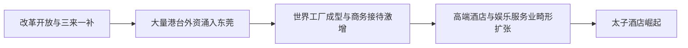
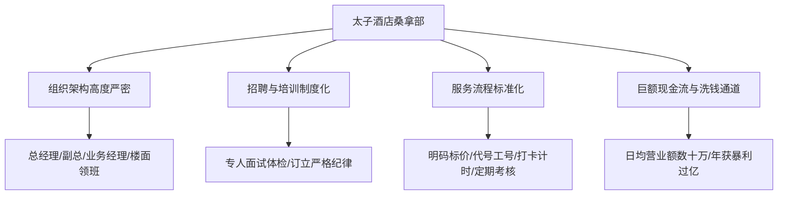
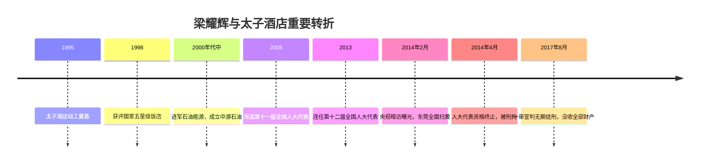
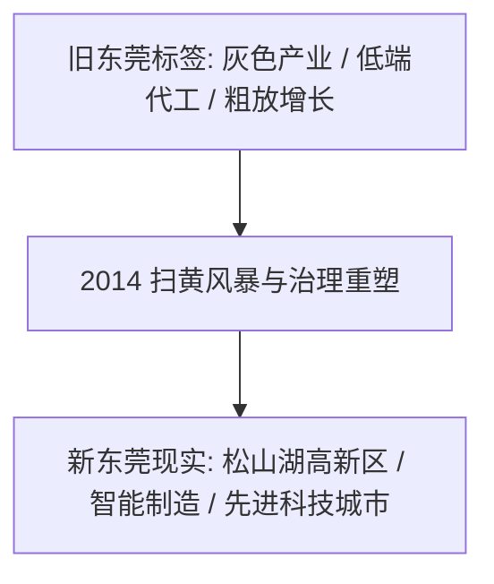

+++
title = '东莞太子酒店的兴衰史：从产业神话到扫黄风暴'
date = '2026-09-23T08:57:00+08:00'
slug = 'dongguan-prince-hotel'
draft = false
tags = ['东莞', '时代纪实', '商业反思', '法制']
+++

在珠三角制造业腾飞的狂飙年代，东莞曾以“世界工厂”的名号闻名全球，然而在经济狂飙突进的背影下，也曾滋生出一片畸形繁荣的灰色江湖。在这片江湖中，东莞黄江镇的**太子酒店**（Prince Hotel）及其幕后操盘手“太子辉”（梁耀辉），无疑是最具戏剧色彩与警示意义的符号。

从一家乡镇路边的汽车配件与发廊小店，到坐拥五星级涉外豪华酒店、中源石油跨国油井、当选两届全国人大代表的“红顶商人”，再到2014年央视暗访曝光、引爆东莞“雷霆扫黄”震动全国，直至最终被判无期徒刑、没收全部财产——太子酒店的兴衰起伏，不仅是一个涉黑涉黄暴利帝国的覆灭记，更是一面折射中国地方经济由野蛮生长走向法治规范与高质量转型的时代明镜。

<!-- more -->

---

## 一、 时代浪潮与畸形温床：太子酒店的诞生背景

要理解太子酒店的崛起，必须将其置于20世纪80年代末至90年代东莞的特殊历史语境之中。



### 1. “三来一补”与世界工厂的崛起
改革开放伊始，东莞凭借毗邻香港、土地与劳动力成本低廉的优势，大力推行“三来一补”（来料加工、来样加工、来件装配和补偿贸易）。从玩具、纺织、制鞋到后来的电子信息产业，东莞迅速完成了从农业县到全球制造业核心基地的蜕变。

### 2. 商务客流与畸形娱乐需求的催生
伴随制造业繁荣而来的，是数以百万计的产业工人和数以万计的港澳台客商、外资企业高管。港台商人频繁往来于香港、深圳与东莞之间，庞大的商贸洽谈与接待需求，刺激了东莞高档酒店业的爆炸式增长。

在巅峰时期，东莞一个普通地级市，竟然拥有近百家星级酒店，五星级酒店数量一度仅次于北京、上海。但在“招商引资”与激烈的酒店同质化竞争下，部分酒店开始走偏门，将夜总会、桑拿水疗等娱乐项目演化为招揽客流、牟取暴利的潜规则，逐渐孕育出了日后备受争议的灰色服务网络。

---

## 二、 梁耀辉与太子酒店的发家史

太子酒店的核心人物是**梁耀辉**（坊间人称“太子辉”）。

### 1. 原始积累：从洗车行、走私到涉足酒店
梁耀辉1967年出生于东莞黄江镇的一个普通家庭，早年读过中专，做过汽车修理和配件生意，开过理发店。20世纪80年代末至90年代初，珠三角走私汽车零部件及整车现象频发，梁耀辉敏锐地捕获了其中的暴利机会，完成了早期的资本原始积累。

### 2. 1995年：太子酒店拔地而起
1995年，梁耀辉看准了黄江镇处于东莞连接深圳关键交通要道的地理优势，投资数千万元兴建了**东莞太子酒店**，并于1996年正式营业。

```
太子酒店地理坐标：东莞市黄江镇江北路
建筑规格：欧式古典城堡式风格，占地面积达数万平方米
核心设施：客房主楼、宴会中心、太子剧场、大型室内游泳池及著名的桑拿中心
```

当时的太子酒店极尽奢华：
- **罗马宫廷风建筑**：罗马立柱、喷泉雕塑、金碧辉煌的挑高大堂，在当年尘土飞扬的乡镇公路边犹如一座宫殿。
- **演艺与明星效应**：酒店配套的“太子剧场”常年邀请香港、内地的知名歌星演出，夜夜笙歌，香车宝马云集。
- **影视取景地**：TVB经典电视剧曾在此取景拍摄，令太子酒店在香港商圈与民间声名大噪，甚至成为外商抵莞接待的“标杆面子”。

1998年，太子酒店被正式评定为**国家五星级饭店**，梁耀辉的商业声望达到第一个高峰。

---

## 三、 阳光下的城堡，阴影中的“莞式ISO”

如果太子酒店仅仅停留在正规五星级酒店的经营，它或许会成为民营酒店的经典案例。然而，真正让其日进斗金的，却是深藏在酒店深处的**桑拿洗浴中心**。



### 1. 产业化与“莞式服务”的标准流水线
在坊间被称为“莞式ISO”的灰色服务体系中，太子酒店桑拿中心是制度化最严密、规模最大的据点之一：
- **严格的分级与明码标价**：服务人员按容貌、年龄、技巧被划分为不同等级，提供明码标价的服务单据，消费金额从数百元到数千元不等。
- **工业化流程管理**：从更衣、沐浴、按摩到违法交易，细化到数十分钟为一个标准流程，全程有严格的工号管理、电子钟控、巡查监督与客户评分制度。
- **“选秀门”与暗室机关**：桑拿部内部设计了高度隐蔽的旋转暗门、暗道与闭路监控，大堂设有专门的选客展示台（俗称“金鱼缸”或“选秀台”），对社会风气造成极度恶劣的腐蚀。

### 2. 暴利与规模
据司法机关后期查明，仅2013年一年，太子酒店桑拿部组织卖淫人次就高达**10万次以上**，非法牟利数千万元，常年盘踞着上百名失足从业人员，形成了规模巨大的地下黑色利益链。

---

## 四、 资本裂变与“红顶伪装”：梁耀辉的野心膨胀

手握太子酒店桑拿部带来的源源不断现金流，梁耀辉并未满足于做一个娱乐场老板，而是全力向能源资本与政界精英阶层攀爬。



### 1. 进军国际石油与多元化投资
2000年代中后期，梁耀辉成立了**中源石油集团**，号称在哈萨克斯坦等中亚国家拥有多口石油气井，业务涵盖油气开采、仓储物流与金融投资。在2007年和2008年的胡润百富榜中，梁耀辉以十数亿元身家上榜，俨然成为“民营石油大亨”。

### 2. 政治光环与社会慈善包装
为了给自己套上防风罩，梁耀辉极力打造正面社会形象：
- **两届全国人大代表**：2008年当选第十一届全国人大代表，并在2013年成功连任第十二届全国人大代表。
- **两会积极建言**：他在全国两会上频繁就民生、食品安全、油价机制等议题发声，一度被部分媒体称赞为“关心底层民生的企业家”。
- **大手笔慈善捐赠**：在文教卫生、灾害救助领域累计捐款数千万元，黄江当地多处学校与公益设施均有其出资痕迹。

这种“白天在两会高谈阔论，晚上在酒店数违法暴利”的双面人生，构筑了看似坚不可摧的庇护伞假象。

---

## 五、 2014雷霆风暴：央视暗访与帝国的崩塌

2014年早春，这个建立在违法与腐败之上的金色神话迎来了毁灭性的终局。

### 1. 央视记者的暗访调查
2014年2月9日（大年初十），中央电视台新闻频道连续播出题为《东莞沉沦》的深度暗访报道。记者历时数月，以隐蔽拍摄的方式深入东莞多家高档酒店和桑拿会所。

其中，**太子酒店桑拿部**作为典型被重点曝光：
- 记者暗访画面中，桑拿经理肆无忌惮地介绍所谓“金鱼缸选秀”；
- 记者两次拨打当地110报警电话举报涉黄违法行为，但在长达数小时内均无警车出警，曝光了背后深重的保护伞问题。

### 2. “雷霆扫黄”行动席卷东莞
报道播出的当天下午，广东省委、省政府迅速作出批示，广东省公安厅连夜调集大批警力直扑东莞：
- 出动公安、武警数千人次，对全市所有桑拿、沐足、KTV等娱乐场所展开拉网式清查；
- 太子酒店桑拿中心当即被查封，核心涉案人员被控制；
- 东莞市多名涉案镇街公安分局局长、派出所所长以及分管副市长被停职调查、立案问责，彻底铲除了盘踞在背后的政法保护伞。

---

## 六、 司法审判：法网恢恢，疏而不漏

央视曝光后，梁耀辉试图通过销毁账册、安排下属顶包、转移资金等手段掩盖罪行，但终究徒劳。

### 1. 剥夺代表资格与批捕
- 2014年4月14日，广东省十二届人大常委会第八次会议表决通过，罢免梁耀辉第十二届全国人民代表大会代表职务。
- 同日，东莞市公安局依法对梁耀辉执行刑事拘留。

### 2. 庭审现场的狡辩与确凿证据
2015年5月，东莞市中级人民法院开庭审理梁耀辉等47人组织卖淫案，该案成为新中国成立以来罕见的特大组织卖淫集团案件：
- **辩解与推诿**：梁耀辉在庭上试图完全撇清干系，声称自己“从来不插手桑拿部的日常琐事，只负责酒店宏观管理，对涉黄违法毫不知情”。
- **铁证如山**：公诉机关出示了海量的考勤表、财务账目、电脑加密服务器数据，以及数十名管理人员、收银员、桑拿技师的证人证言，证实桑拿部的重大事项、人事任命、分成比例均直接由梁耀辉拍板或签署审批。

### 3. 一审判决（2017年8月）
2017年8月，东莞市中级人民法院作出一审宣判：
- **被告人梁耀辉**犯**组织卖淫罪**、**串通投标罪**、**单位行贿罪**，数罪并罚，决定执行**无期徒刑**，剥夺政治权利终身，并处**没收个人全部财产**。
- 其余46名涉案管理人员分别被判处十四年有期徒刑至缓刑不等的刑罚。

梁耀辉苦心经营近二十年的商业帝国与政治光环彻底化为泡影。

---

## 七、 太子酒店现状与东莞的“涅槃新生”

随着扫黄风暴与主犯获刑，太子酒店从昔日的炙手可热迅速跌入冷清：
- 太子酒店整体停业整顿，涉案资产被依法冻结查封。
- 随后数年间，酒店几经司法拍卖与托管重组，曾经的金碧辉煌被岁月风霜剥蚀，欧式雕塑与空荡的大厅沦为市民茶余饭后的警示谈资。



更深远的意义在于：**太子酒店的倒下，标志着东莞彻底告别了靠灰色边缘经济拉动消费的粗放阶段。**

扫黄风暴过后，东莞承受住了阵痛，坚定不移推进产业结构转型升级与“腾笼换鸟”：
1. **拥抱高新技术**：以华为终端松山湖基地、OPPO、vivo、散裂中子源等战略级科技产业为龙头，迅速构建起万亿级电子信息产业集群。
2. **法治化营商环境**：重塑城市形象，从昔日的灰色阴影彻底蜕变为现代化的先进制造之都与年轻人向往的潮流活力之城。

---

## 结语

太子酒店从路边摊的原始积累到五星级的纸醉金迷，从两会代表的红顶桂冠到无期徒刑的铁窗残生，其三十年兴衰犹如一部荒诞而沉重的现实主义戏剧。

它留给时代的深刻警示是：
**任何商业模式如果背离了法治与道德的底线，依托人性弱点与违法暴利构建的空中楼阁，无论装点得多么金碧辉煌，在法治正义与历史潮流的审视下，终将轰然倒塌。**
