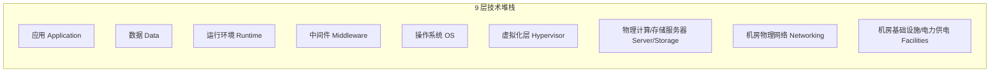
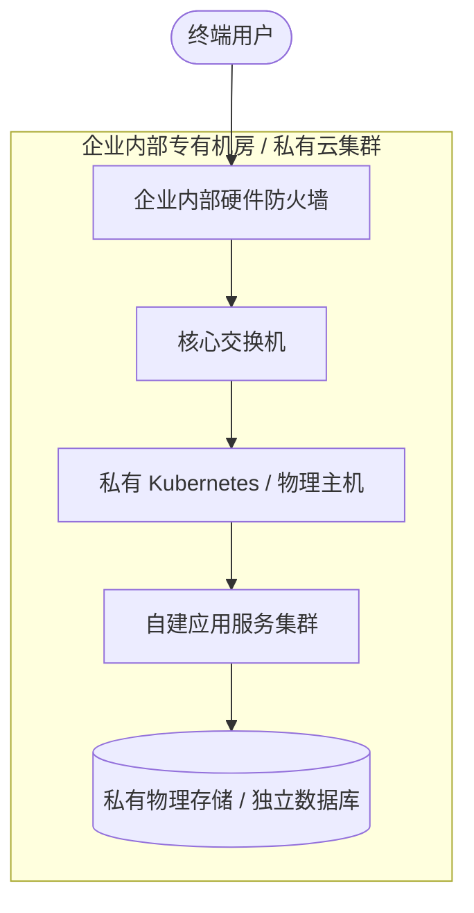
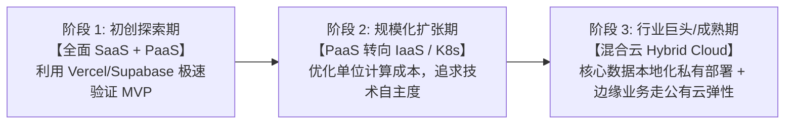

+++
title = '搞懂云计算服务模型与部署形态：从 IaaS、PaaS、SaaS 到本地化部署'
date = '2026-09-23T09:13:00+08:00'
slug = 'cloud-service-models-iaas-paas-saas-on-premise'
draft = false
tags = ['云计算', '系统架构', '技术选型', 'DevOps']
+++

在数字化转型与系统架构设计的日常讨论中，我们几乎每天都会听到这几个名词：
- **SaaS**（软件即服务）：开箱即用的业务解决方案；
- **PaaS**（平台即服务）：提供运行环境与中间件 API；
- **IaaS**（基础设施即服务）：提供底层算力平台与虚拟主机（VPS）；
- **本地化部署（On-Premises / 私有化部署）**：企业自建机房或私有服务器集群。

这四者究竟界定了怎样的技术分工？为什么有的企业坚持砸巨资自建机房，有的团队依靠几个云 API 就撑起了上亿流水，而有的公司则全面拥抱商业 SaaS？

本文将用系统化的视角、通俗的隐喻模型和详尽的技术拆解，带你彻底厘清这四种形态的职责边界、技术架构、权衡取舍与选型策略。

<!-- more -->

---

## 一、 经典隐喻：从“吃披萨”看懂云计算服务分层

业界最经典的类比莫过于著名的 **“Pizza as a Service（披萨即服务）”** 隐喻。我们用这个模型来建立第一直觉：

```mermaid
graph TD
    subgraph OnPrem [1. 本地化部署: 在家自制披萨]
        direction TB
        A1[自备面粉/芝士/馅料]
        A2[自备燃气灶与烤箱]
        A3[自备餐桌与餐具饮料]
        A4[自己烘烤并清洗打扫]
    end

    subgraph IaaS [2. IaaS: 租用共享厨房]
        direction TB
        B1[房东提供厨房/水电气/烤箱]
        B2[自己准备面粉馅料与配方]
        B3[自己把控火候烘焙出炉]
    end

    subgraph PaaS [3. PaaS: 披萨外卖订制]
        direction TB
        C1[商家调制饼底与烘焙出炉]
        C2[你只需选择口味配料与尺寸]
        C3[直接送到家使用自备餐桌]
    end

    subgraph SaaS [4. SaaS: 走进披萨餐厅]
        direction TB
        D1[厨师制作/服务员端上桌]
        D2[连盘子都不用洗]
        D3[专注于享用美食并买单]
    end
```

- **本地化部署（On-Premises）**：从买烤箱、买面粉、生火、烤制到洗盘子，全流程由你自己全权操办，任何环节出错都要自己解决。
- **IaaS（基础设施即服务）**：供应商提供场地、水电气和烤箱硬件；具体买什么面粉、怎么烤、做成什么风味，全部由你控制。
- **PaaS（平台即服务）**：披萨店提供半成品饼底和流水线烤箱，你只需通过菜单（API）选择撒什么料，出炉即用，无需关心烤箱温度调校。
- **SaaS（软件即服务）**：直接走进披萨店，坐下点餐开吃。你完全不需要知道厨房在几度烘烤，只要获得最终服务。

---

## 二、 技术视角的“责任共担模型”（Shared Responsibility）

在真实的软件工程与 IT 运维体系中，一个完整的软件系统涉及 9 层技术堆栈。不同的服务模式，本质上是**云厂商与企业用户之间职责边界（Boundary of Control）的重新划分**：

### 职责边界横向对比

下表中：
- 🏢 表示 **企业自己负责维护（You Manage）**
- ☁️ 表示 **云服务提供商负责维护（Cloud Provider Manages）**

| 技术层级 | 本地化部署（On-Prem） | IaaS（基础设施即服务） | PaaS（平台即服务） | SaaS（软件即服务） |
| :--- | :---: | :---: | :---: | :---: |
| **应用层（Application）** | 🏢 客户 | 🏢 客户 | 🏢 客户（写业务代码） | ☁️ 厂商（直接使用） |
| **数据层（Data）** | 🏢 客户 | 🏢 客户 | 🏢 客户（负责设计/管理） | ☁️ 厂商（多租户隔离） |
| **运行时（Runtime）** | 🏢 客户 | 🏢 客户（装Node/Java/Python） | ☁️ 厂商 | ☁️ 厂商 |
| **中间件（Middleware）** | 🏢 客户 | 🏢 客户（配Nginx/Kafka/MQ） | ☁️ 厂商 | ☁️ 厂商 |
| **操作系统（OS）** | 🏢 客户 | 🏢 客户（打内核补丁/选Linux） | ☁️ 厂商 | ☁️ 厂商 |
| **虚拟化（Hypervisor）** | 🏢 客户（VMware/KVM） | ☁️ 厂商 | ☁️ 厂商 | ☁️ 厂商 |
| **物理硬件（Servers）** | 🏢 客户 | ☁️ 厂商 | ☁️ 厂商 | ☁️ 厂商 |
| **存储与网络（Storage/Net）**| 🏢 客户（交换机/机架布线） | ☁️ 厂商 | ☁️ 厂商 | ☁️ 厂商 |
| **机房电力供电与制冷** | 🏢 客户 | ☁️ 厂商 | ☁️ 厂商 | ☁️ 厂商 |

---

## 三、 四大模式深度拆解

### 1. IaaS（Infrastructure as a Service）：算力平台与虚拟主机

#### 核心定义
IaaS 将物理硬件资源（计算 CPU、内存、块存储磁盘、物理网络）抽象虚拟化，以 API 或控制台的形式交付给租户。最典型的载体就是我们常说的 **云服务器 / VPS（Virtual Private Server）**。

#### 核心特征
- **使用者画像**：系统架构师、系统管理员、运维工程师（DevOps/SRE）。
- **交付物**：虚拟机实例、虚拟私有云（VPC）、公网 IP、弹性块存储、安全组。
- **代表产品**：
  - AWS EC2 / EBS
  - 阿里云 ECS / 腾讯云 CVM
  - DigitalOcean Droplet / Linode / Vultr（典型 VPS 提供商）
- **优势**：
  - **灵活性最高**：完全掌控操作系统的 root 权限，你可以自由选择内核版本、调优 TCP 参数、挂载文件系统。
  - **避免硬件锁定**：分钟级开机与关机，按小时计费，无须预先采购服务器硬件。
- **痛点与负担**：
  - 运维负担重：操作系统内核升级、漏洞补丁修复、高可用集群搭建、数据库容灾备份均须自己处理。

---

### 2. PaaS（Platform as a Service）：开发平台、运行环境与 API 服务

#### 核心定义
PaaS 屏蔽了操作系统和底层硬件细节，为开发者提供开箱即用的**开发、运行、编排环境与托管型中间件服务**。开发者只需携带业务代码或者通过 API 进行调用。

#### 核心特征
- **使用者画像**：软件开发者（Developers）、后端工程师、数据工程师。
- **交付物**：容器运行平台、Serverless 函数计算运行时、数据库与消息队列托管 API。
- **代表产品**：
  - **托管运行时 / 部署平台**：Vercel、Netlify、Heroku、Google App Engine。
  - **Serverless / FaaS**：AWS Lambda、Cloudflare Workers、阿里云函数计算 FC。
  - **中间件与数据托管 API**：AWS RDS（托管关系型数据库）、Firebase、Upstash（Serverless Redis）、微信小程序云开发。
- **优势**：
  - **极速上线**：开发者无需管理 Linux 系统或 Nginx 配置，`git push` 即可自动完成构建、依赖安装和全球部署。
  - **弹性扩缩容**：流量激增时平台自动扩容实例，流量低谷时甚至缩容到 0（Scale to Zero）。
- **痛点与负担**：
  - **平台锁定（Vendor Lock-in）**：深度绑定特定厂商的专有 API 或运行时规范后，迁移到其他云平台的改造成本极高。
  - **底层不可见**：当遇到深层次的底层性能瓶颈或网络丢包时，无法直接下沉排查。

---

### 3. SaaS（Software as a Service）：端到端的全套业务解决方案

#### 核心定义
SaaS 面向最终业务场景，提供现成完备的应用程序。用户通过浏览器、移动端 App 或桌面客户端直接使用，无需任何开发和运维投入。

#### 核心特征
- **使用者画像**：终端用户、企业业务团队（HR、销售、运营、行政）。
- **交付物**：完整的软件功能账号与数据服务。
- **代表产品**：
  - **办公与协作**：飞书、钉钉、Slack、Microsoft 365、Notion、Google Workspace。
  - **客户关系与销售**：Salesforce、HubSpot。
  - **电商与零售**：Shopify、有赞。
  - **设计与开发工具**：Figma、GitHub、Canva。
- **优势**：
  - **即开即用**：零部署周期，订阅付费即可赋能团队。
  - **持续静默演进**：软件功能由厂商统一迭代更新，用户始终享受最新特性而无需手动升级安装包。
- **痛点与负担**：
  - **数据主权在他人之手**：企业核心业务数据保存在服务商云端，面临数据隐私、泄露及合规审查压力。
  - **定制能力受限**：只能在产品提供的既定功能和插件市场内定制，无法满足极端个性化的业务流程。

---

### 4. 本地化部署（On-Premises / 私有化部署）：自主可控的独立要塞

#### 核心定义
将整套软件系统、数据库和运行环境完整安装在客户自有的物理服务器、自建数据中心或完全隔离的专有网络内。

#### 核心特征
- **核心驱动力**：
  - **法律与安全合规**：金融机构、军工科研、政府部门、大型医疗系统受到严格监管，数据被明文规定禁止流出内网。
  - **极致的自主控制权**：容不得网络闪断或公共云宕机风险，需要根据自身工业标准深度改造软硬件。
- **优势**：
  - **数据绝对掌控**：物理隔离，杜绝多租户云环境下的数据穿透风险。
  - **局域网超低延迟**：工厂生产线自动化控制或毫秒级高频交易系统，依赖本地光纤内网的极低抖动与延迟。
- **代价与痛点**：
  - **天价初期投入（CapEx）**：服务器硬件采购、机房恒温空调、UPS 不间断电源、双路光纤专线，前期资产投入高昂。
  - **巨量运维成本**：必须组建专门的 IT 硬件、网络与安全运维团队；软件升级依赖工程师上门或离线补丁包，周期漫长。

---

## 四、 关键维度选型决策矩阵

为了在架构规划时做出最合理的权衡，我们可以从以下几个关键维度进行横向评估：

| 评估维度 | SaaS | PaaS | IaaS (VPS) | 本地化部署 |
| :--- | :--- | :--- | :--- | :--- |
| **面向角色** | 终端业务人员 | 软件开发者 | 运维与架构师 | 企业高管 / IT合规部门 |
| **上线速度** | **分钟级**（开账号即用） | **小时/天级**（写完即布） | **天/周级**（搭环境配置） | **月/季度级**（软硬件采购部署） |
| **控制权限** | 极低（仅配置项） | 中等（控制代码与运行时） | **极高**（操作系统 root 级） | **绝对完全控制**（物理级） |
| **计费方式** | 按席位/月度订阅费 | 按请求量/资源用量计费 | 按实例规格/时长计费 | **大额前期资产采购** + 年保费 |
| **财务属性** | OpEx（运营支出） | OpEx（运营支出） | OpEx（运营支出） | **CapEx（资本性支出）** |
| **数据安全性** | 依赖厂商信誉与 SLA | 逻辑隔离 / 加密策略 | 虚拟专网逻辑隔离 | **物理级网络隔离** |
| **运维门槛** | **零门槛** | 极低（仅关注代码调试） | 较高（需懂 Linux 与网络） | **极高**（需全栈基础设施团队） |

---

## 五、 现代企业演进路线图：从初创到集团的选型流转

在实际商业实践中，企业往往不是孤立地选择某一单一模式，而是**随着规模演进与核心诉求动态迁移**：

1. **初创期：时间就是生命（SaaS + PaaS）**
   - 团队只有几个人，核心使命是快速验证产品市场匹配度（PMF）。
   - 办公选用飞书/Notion（SaaS），网站使用 Next.js 部署在 Vercel，数据库使用托管 Supabase（PaaS）。无需招聘任何专门运维，将所有精力聚焦于业务代码。

2. **成长期：成本与自由度权衡（转向 IaaS / 自建容器云）**
   - 流量暴涨，PaaS 按请求量阶梯计费的账单开始让人难以承受；
   - 团队开始将服务迁移到 IaaS 云主机（如 AWS EC2 / 阿里云 ECS）甚至搭建自己的 Kubernetes 集群，通过合理的预留实例与架构优化大幅降低算力账单。

3. **成熟/合规期：混合云与私有专区（Hybrid Cloud & On-Premises）**
   - 涉及千万级用户核心金融交易与隐私合规，核心数据库回迁至自建数据中心或金融专有云；
   - 对外公开的前端应用、静态 CDN 加速与突发流量依然留在公有云 IaaS，形成“内外兼顾”的混合云架构。

---

## 六、 总结

理清 IaaS、PaaS、SaaS 与本地化部署的本质，关键在于抓住一句话：
**它们不是优劣之分，而是“控制权”与“便利性”之间的天平倾斜。**

- 当你想要**最省心、聚焦业务**：选 **SaaS**；
- 当你想要**免除运维负担、快速写代码上线**：选 **PaaS**；
- 当你想要**深度掌控底层架构、调优性能与降低大算力成本**：选 **IaaS / VPS**；
- 当你面对**严苛合规、物理级安全要求或特殊工业低延迟**：选 **本地化部署**。

在现代系统设计中，优秀的架构师从不执着于某种教条，而是懂得结合团队体量、现金流预算与监管红线，在不同的发展阶段拼装出最适合当下业务的混搭组合拳。
