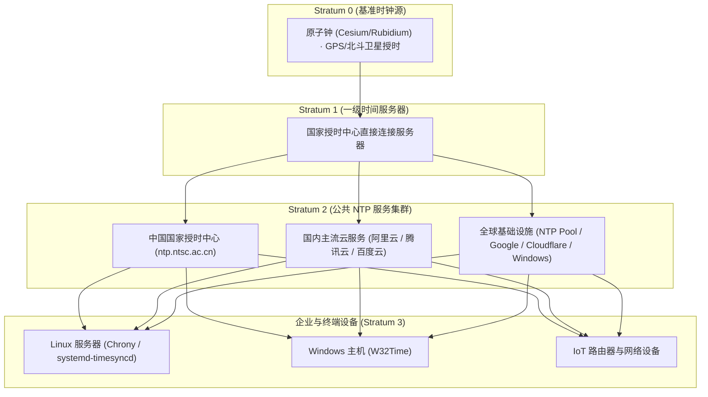

+++
title = '常用公共 NTP 时间服务器汇总与配置指南'
date = '2026-09-23T10:57:54+08:00'
slug = '常用公共ntp时间服务器'
draft = false
tags = ['NTP', '时间同步', 'Linux', 'Windows', '网络', '运维']
+++

在分布式系统、微服务架构以及网络安全体系中，服务器时间的精确性至关重要。

一旦系统时钟出现偏差，不仅会导致跨节点日志时序错乱、定时任务调度异常，还会引发 HTTPS/TLS 证书校验失败、数据库分布式事务冲突（如 Raft/Spanner 机制失效）、以及 JWT/动态口令（OTP）鉴权拒绝等一系列连锁反应。

为了保持系统时钟高精度同步，配置稳定可靠的 **网络时间协议（NTP, Network Time Protocol）** 服务器是基础运维中不可或缺的一环。

本文整理了全球范围内及中国境内最主流的高可用公共 NTP 时间服务器，并提供主流操作系统（Linux Chrony / Windows）的配置与排障实战。

<!-- more -->



---

## 一、全球通用时间服务器

以下公共时间服务器覆盖全球多个 Anycast 边缘节点，适合海外服务器、跨国部署或多地域混合云基础设施：

### 1. NTP Pool Project (全球 NTP 池)
- **官方网站**：[https://www.pool.ntp.org](https://www.pool.ntp.org)
- **项目说明**：由全球志愿者和机构共同维护的大规模分布式虚拟时间服务器集群，支持根据客户端地理位置自动就近调度解析。
- **推荐配置**：
  ```text
  0.pool.ntp.org
  1.pool.ntp.org
  2.pool.ntp.org
  3.pool.ntp.org
  ```
  *(注：中国境内亦可使用 `cn.pool.ntp.org` 或 `0.cn.pool.ntp.org` ~ `3.cn.pool.ntp.org`)*

---

### 2. Google NTP 服务器
- **域名接入**：`time.google.com`
- **Anycast IPv4 地址**：
  ```text
  216.239.35.0
  216.239.35.4
  216.239.35.8
  216.239.35.12
  ```
- **技术特色**：Google 采用了 **闰秒平滑抹平技术（Leap Smear）**，在闰秒发生前后 24 小时内微调时钟频率，避免系统时间出现瞬时倒退或跳跃，对数据库和金融交易系统非常友好。

---

### 3. Cloudflare NTP 服务器
- **域名接入**：`time.cloudflare.com`
- **技术特色**：基于 Cloudflare 全球 300+ 城市的 Anycast 网络构建，支持最新的 **NTS（Network Time Security）** 加密时钟同步协议，有效防范中间人篡改时间。

---

### 4. 微软时间服务器（适合 Windows 环境）
- **域名接入**：`time.windows.com`
- **适用场景**：Windows 操作系统出厂默认配置的时间源，在全球各大区域均有专用分发节点。

---

## 二、中国境内时间服务器

对于国内机房、IDC 以及阿里云/腾讯云等云服务器，推荐优先使用境内授时源，具备更低的访问延迟、更小的时钟抖动以及极高的网络可达性：

### 1. 中国国家授时中心（推荐）
- **官方网站**：[http://www.ntsc.ac.cn](http://www.ntsc.ac.cn)
- **权威性**：中国科学院国家授时中心（陕西临潼），负责我国标准时间“北京时间”的产生、保持和发播，是国内最具法定效力的一级授时基准。
- **推荐配置**：
  ```text
  ntp.ntsc.ac.cn
  time1.ntsc.ac.cn
  time2.ntsc.ac.cn
  ```

---

### 2. 阿里云 NTP 服务
- **域名接入**：
  ```text
  ntp.aliyun.com
  ```
  *(注：阿里云同时提供子域名 `ntp1.aliyun.com` 至 `ntp7.aliyun.com`)*
- **特色**：国内公网和阿里云专有网络内解析稳定，带宽充足，被广泛运用于国内生产系统。

---

### 3. 腾讯云 NTP 服务
- **域名接入**：
  ```text
  ntp.tencent.com
  ```
  *(注：同系还有 `time1.cloud.tencent.com` 至 `time5.cloud.tencent.com`)*
- **特色**：腾讯全球 Anycast 调度，针对国内三大运营商链路做了深度优化。

---

### 4. 百度 NTP 服务
- **域名接入**：
  ```text
  ntp.baidu.com
  ```
- **特色**：依托百度搜索及智能云全国边缘网络分发，提供低抖动的高精度时钟服务。

---

## 三、主流操作系统配置实战

### 1. Linux 系统配置（以现代主流 Chrony 为例）

现代 Linux 发行版（CentOS 7/8/9、RHEL、Ubuntu 18.04+、Debian）均已将 **Chrony** 作为默认且推荐的 NTP 客户端（性能远优于传统老旧的 `ntpd`）。

编辑配置文件 `/etc/chrony.conf`（或 Ubuntu 下的 `/etc/chrony/chrony.conf`）：

```ini
# 配置多个国内权威授时源，iburst 选项可在启动时快速完成初始同步
server ntp.ntsc.ac.cn iburst
server ntp.aliyun.com iburst
server ntp.tencent.com iburst

# 备用全球源
server time.cloudflare.com iburst

# 允许时钟平滑调整（step-threshold 为 1 秒，偏差超过 1 秒在前 3 次更新中强制步进）
makestep 1.0 3

# 启用内核实时时钟同步
rtcsync
```

重启并校验同步状态：

```bash
# 重启 chrony 服务
sudo systemctl restart chronyd  # 或 chrony

# 查看当前同步源与状态（关注 LastRx 与 Reach）
chronyc sources -v

# 查看时钟跟踪与详细误差
chronyc tracking
```

---

### 2. Windows 系统命令行配置

在 Windows Server 或个人 PC 上，可以通过管理员权限打开 PowerShell 或 CMD，使用内置的 `w32tm` 工具快速指定 NTP 服务器：

```cmd
:: 1. 停止当前 Windows Time 服务
net stop w32time

:: 2. 设置新的时间服务器列表（多个服务器用空格分隔，标志 0x1 表示特定轮询间隔）
w32tm /config /manualpeerlist:"ntp.ntsc.ac.cn,0x1 ntp.aliyun.com,0x1 time.windows.com,0x1" /syncfromflags:manual /reliable:YES /update

:: 3. 启动服务并立即触发同步
net start w32time
w32tm /resync /nowait

:: 4. 检查配置与同步状态
w32tm /query /status
```

---

## 四、网络排障与运维避坑要点

1. **防火墙与安全组规则（UDP 123 端口）**：
   - NTP 协议运行在 **UDP 123** 端口；
   - 云服务器安全组或企业内网网关如果限制了出方向（Egress）流量，务必放行目标 IP 的 `UDP:123`，否则所有 NTP 同步都会出现 `Timeout` 超时；
2. **切勿单一依赖单一服务器**：
   - 在生产环境中，建议至少配置 **3 ~ 4 个独立的 NTP 服务器**（如 1 个国家级 + 2 个商业云 + 1 个全球源）；
   - NTP 客户端内置的时钟滤波与选择算法能够有效剔除异常跳变节点（Byzantine Fault），确保单一上游宕机时系统依然平稳运行；
3. **避免大跨度时间跳变（Slew vs Step）**：
   - 对于运行 MySQL、Kafka、ZooKeeper 等严苛依赖时钟顺序的服务，严禁直接使用命令 `date -s` 强行跨度数小时调整时间；
   - 必须配置平滑调相模式（Slew Mode），让时钟像调速一样缓慢追赶标准时间，防止系统时间戳“倒流”引发业务死锁。
