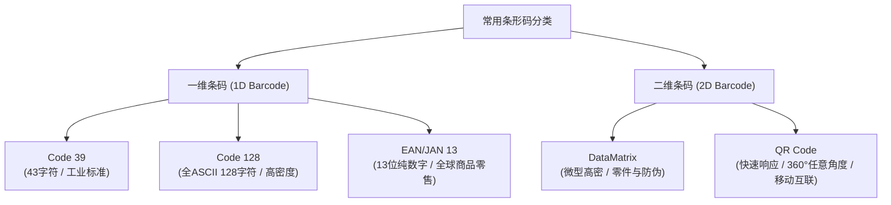

+++
title = '常用条形码特征'
date = '2026-09-23T09:51:58+08:00'
slug = '常用条形码特征'
draft = false
tags = ['条形码', '编码', '硬件', '技术杂谈']
+++

在仓储物流、零售结算、工业制造以及日常移动互联等场景中，条形码（Barcode）作为自动识别技术的核心载体扮演着极其重要的角色。根据结构和维度的不同，常见的条形码主要分为**一维条码（线性条码）**与**二维条码（矩阵条码）**两大类。

本文梳理了开发与工程应用中最为常见的几种条码（Code 39、Code 128、EAN-13、DataMatrix、QR Code）的核心特征、编码容量、扫描要求及适用场景。

<!-- more -->

---

## 一、一维条形码 (1D Barcode)

一维条码是由一组规则排列的条（黑条）、空（白空）及其对应字符组成的标识符。信息仅在单一水平方向上进行编码。

### 1. Code 39

Code 39（又称 3 of 9 码）是最早被广泛采用的条形码之一。其名称来源于其每个字符由 9 个单元（5 条和 4 空）组成，其中 3 个单元为宽单元。

* **字符集支持**：
  Code 39 仅接受 **43 个有效输入字符**：
  - 26 个大写英文字母（`A` - `Z`）；
  - 10 个阿拉伯数字（`0` - `9`）；
  - 7 个特殊符号：连接号（`-`）、句号（`.`）、空格（` `）、美元符号（`$`）、斜杠（`/`）、加号（`+`）、百分号（`%`）；
  - 其它字符输入将被直接忽略。
* **扫描与读取**：
  读取时**需直线扫描**，扫描光束必须完整横穿条码的所有黑白条纹。
* **特点与应用**：
  编码规则相对简单，容错性强，无需强制校验位即可工作；常用于早期工业制造、仓储库存、汽车零件及国防军工领域。

---

### 2. Code 128

Code 128 是一种高密度、支持全 ASCII 字符的线性条形码，旨在克服 Code 39 字符集受限和密度不足的缺点。

* **字符集支持**：
  可完整表示从 `ASCII 0` 到 `ASCII 127` 共 **128 个字符**，涵盖大写字母、小写字母、数字、标点符号以及控制字符（如换行、回车等）。
* **编码密度与灵活性**：
  - 相比 Code 39，Code 128 在单位长度内的**编码密度显著更高**，占用空间更小；
  - 当单位长度受限无法容纳 Code 39，或需要编码更丰富的字符（如小写字母或特殊控制符）时，Code 128 是首选方案；
  - 内部具备 A、B、C 三种子集（其中 Code 128C 可实现双数字压缩编码），使其在处理纯数字或混合字符时更加灵活高效。
* **扫描与读取**：
  读取时同样**需直线扫描**。
* **特点与应用**：
  广泛用于现代包装物流（如 GS1-128 / UCC/EAN-128 运单条码）、医疗管理、工厂装配流水线等。

---

### 3. EAN/JAN 13

EAN-13（欧洲商品条码，在日本被称为 JAN-13）是国际商品流通领域使用最普遍的标准零售条码。

* **码位结构**：
  EAN/JAN 13 标准码共 **13 位数**，其结构自左向右排列如下：
  1. **国家代码（3 位）**：由国际商品条码总会（GS1）授权分配，我国的代码前缀为 `690 - 699`；
  2. **厂商代码（4 位）**：由国家商品条码主管机构（如中国物品编码中心）核发给申请厂商，代表厂商身份；
  3. **产品代码（5 位）**：代表单项商品货品，由厂商自行编定管理；
  4. **校正码 / 校验码（1 位）**：位于条码最右端，采用加权算法生成，专门用于防止扫描器误读与传输校验。
* **核心特性**：
  - **纯数字编码**：只能储存数字（`0` - `9`），不支持字母与符号；
  - **支持双向扫描**：扫描器可以从左至右或从右至左扫瞄，均可正确解码；
  - **强制校验位**：最右侧必须包含 1 位校验码，确保数据读取准确性；
  - **护线结构**：包含左护线（Start）、中线（Center）和右护线（End），用于物理分割条码的不同数据区，并提供光学安全边距（Quiet Zone）；
  - **定长标准**：固定为 13 位长度，欠缺动态变长弹性，但全球标准化程度极高，通行于全球所有现代零售超市与 POS 系统。

---

## 二、二维条形码 (2D Barcode)

二维条码在水平和垂直两个方向上均记录数据，大幅提升了单位面积的信息密度，并引入了强大的数学纠错机制。

### 1. DataMatrix

DataMatrix 是一种基于点阵矩阵排列的二维条码，常用于极小尺寸元件标记。

* **超高密度与极小尺寸**：
  DataMatrix 的最大特点在于**高密度**，其最小尺寸是目前所有条码中最小的，可在仅仅 25 平方毫米（甚至更小微米级）的表面上编码 30 个数字。
* **数据容量**：
  最大存储量约为 **2,000 bytes**。理论最大数据容量为：
  - 3,116 个数字；
  - 2,335 个英文字母；
  - 1,556 个 8 位字节（Byte）。
* **纠错与抗损能力**：
  普遍采用 **ECC200** 规范（基于 Reed-Solomon 纠错算法），具备极强的抗污损与破损还原能力，即使条码局部受损、穿孔或划伤仍能完整复原。
* **读取与识别要求**：
  DataMatrix 一般采用 ECC200 规格，读取时需对准边界寻线（“L”形寻像边）进行识别扫描。
* **特点与应用**：
  - 因能在极微小面积上存放充足数据，特别适用于电子元器件、芯片 PCB 电路标识、航空精密小零件、医疗手术器械以及防伪追溯等领域（通常采用激光直标 DPM 技术）；
  - 相比 QR Code，DataMatrix 在微型化方面更具优势，应用简单，在部分行业内被称为“简易码”，对识读终端像素要求不高（30 万像素摄像头即可识别），早期常用于基于 WAP 的增值服务。

---

### 2. QR Code (Quick Response Code)

QR 码是由日本 Denso Wave 公司于 1994 年发明的矩阵式二维条码，“QR”即 **Quick Response（快速响应）** 的缩写。

* **外观与全向扫描定位**：
  - QR 码呈正方形，由黑白相间的模块单元构成；
  - 在四个角落中的 **3 个角落**印有明显的「回」字形位置探测图案（Position Detection Patterns）；
  - 解码算法通过这 3 个定位图案能够瞬间校准条码的旋转角度、比例与倾斜，因此支持 **360° 任意角度全向扫描**，使用者无需刻意对齐扫描器即可快速读取。
* **海量数据容量与类型**：
  具有极高编码密度，支持数字、字母、二进制字节及汉字等多种编码模式：
  - 数字数据最大可容纳 **7,089 个字符**；
  - 字母与符号数据最大可容纳 **4,296 个字符**；
  - 二进制数据最大为 2,953 字节，汉字最大可达 1,817 个字符。
* **纠错能力**：
  提供 L (7%)、M (15%)、Q (25%)、H (30%) 四个级别的 Reed-Solomon 纠错，即使条码受损或在中心嵌入 Logo，依然能够稳定识别。
* **应用场景**：
  由于对智能手机极其友好且兼容全向读取，QR 码已成为移动支付（微信/支付宝）、网站 URL 跳转、商品防伪溯源、电子票务及各类数字化互动的国际通用标准。

---

## 三、常用条形码特性对比一览表

| 条码类型 | 维度 | 字符支持 | 容量范围 | 扫描方向与要求 | 典型应用场景 |
| :--- | :--- | :--- | :--- | :--- | :--- |
| **Code 39** | 一维 | 43 字符（大写字母/数字/部分符号） | 长度可变，密度较低 | 需直线扫描 | 工业制造、早期仓储、国防军工 |
| **Code 128** | 一维 | 全 ASCII 128 字符（含小写及控制符） | 长度可变，密度高 | 需直线扫描 | 物流运单（GS1-128）、现代仓储 |
| **EAN-13** | 一维 | 仅限数字（固定 13 位） | 固定 13 位数字（含校验位） | 支持双向直线扫描（左右皆可） | 超市零售商品、国际货品条码 |
| **DataMatrix** | 二维 | 数字、字母、字节数据 | 最大约 2KB（约 3116 数字） | ECC200 规格，寻边扫描 | 电子元器件芯片、精密零件、医疗器械、DPM 标刻 |
| **QR Code** | 二维 | 数字、字母、字节、汉字等 | 最大约 7089 数字 / 4296 字母 | 360° 任意角度全向读取（回字定位） | 移动支付、网址链接、电子门票、大众扫码互联 |
