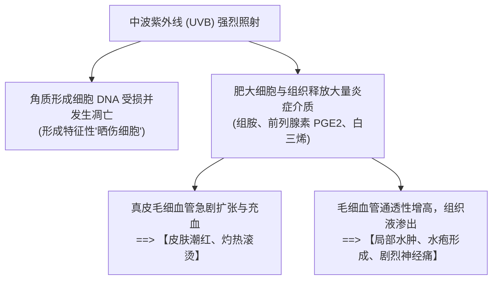
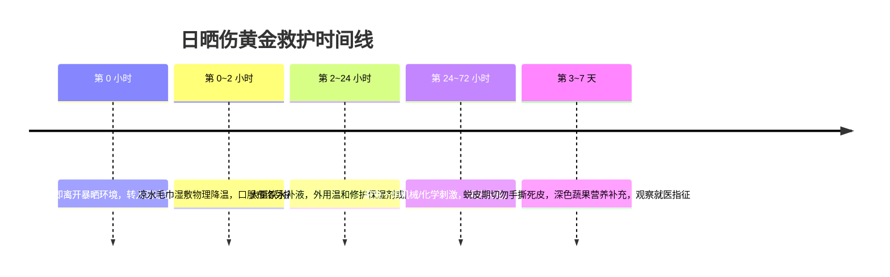
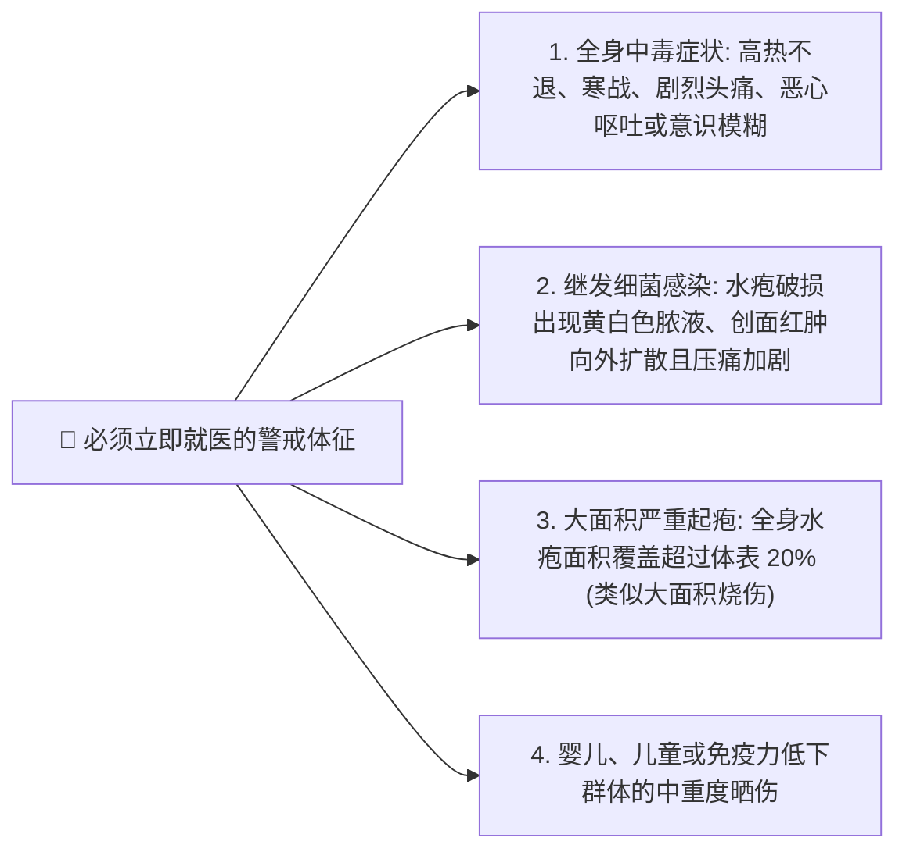

+++
title = '日晒伤急救与皮肤修复全指南：从红肿刺痛到水疱蜕皮的科学应对法则'
date = '2026-09-23T09:35:00+08:00'
slug = 'sunburn-first-aid-and-skin-recovery-guide'
draft = false
tags = ['健康科普', '急救护理', '皮肤医学', '防晒指南', '生活常识']
+++

炎炎夏日，户外徒步、海边度假或长时间暴晒后，很多人都经历过皮肤发红、发烫、紧绷刺痛，甚至起水疱、大面积蜕皮的痛苦。这种俗称“晒伤”的现象，在医学上被称为**日光性皮炎（Solar Dermatitis / Sunburn）**。

晒伤不仅带来肉体上的剧痛与脱皮的尴尬，更意味着表皮细胞的 DNA 遭到了高能量紫外线的急性光毒性损伤。如果处理不当（如盲目涂牙膏、乱敷冰块、硬撕死皮），极易导致皮肤屏障永久受损、色素沉着斑形成，甚至引发继发性细菌感染。

发生日晒伤后，如何抓住黄金时间科学止损？本文为你梳理一套严谨、详尽的日晒伤分度判断、全周期急救与修复指南。

<!-- more -->

---

## 一、 皮肤生理学：日晒伤时皮肤底层究竟发生了什么？

日晒伤主要是由于**中波紫外线（UVB，波长 290~320nm）**直接穿透至表皮层与真皮浅层引起的急性光化学反应（同时伴有 UVA 的长波深层渗透）：

通常，晒伤的临床表现具有**潜伏期**：暴晒后 2~6 小时开始发红，**12~24 小时达到炎症高峰**，并在 48~72 小时后开始逐渐消退或出现脱屑。

---

## 二、 晒伤程度的自我评估与判断

日晒伤在临床上主要分为两个严重等级：

| 分级 | 临床表现 | 损伤深度 | 护理重点 |
| :--- | :--- | :--- | :--- |
| **一度晒伤（红斑型）** | 局部皮肤弥漫性发红、微肿、有明显灼热感和触痛，通常无水疱。数天后红斑消退并开始轻微脱屑。 | 局限于表皮浅层 | **物理降温、舒缓抗炎、补水保湿** |
| **二度晒伤（水疱型）** | 皮肤剧烈红肿，表皮与真皮分离，出现散在或成片的**大小水疱**，破溃后有渗出液，伴随剧烈抽痛。严重者伴有发热、恶心等全身中毒反应。 | 伤及表皮深层及真皮乳头层 | **保护创面、严禁挑破水疱、医疗介入** |

---

## 三、 日晒伤科学处理九步全流程

面对晒伤，正确的急救原则是：**“立即脱离、降温镇静、温和补水、保护屏障、警惕感染”**。

---

### 第一步：脱离暴晒环境（立即止损）
- **寻找庇护**：一旦察觉皮肤发烫或泛红，**哪怕只过去了几分钟，也必须立刻离开阳光直射处**，移步至室内或阴凉树荫下。
- **物理遮蔽**：如果暂时无法进入室内，立刻撑起具有防晒涂层的遮阳伞，或用干燥的衣物、毛巾遮挡裸露发红部位，阻断紫外线剂量的累积叠加。

---

### 第二步：冷敷缓解（物理降温，抑制血管扩张）
- **核心目的**：通过物理散热带走皮肤余热，抑制毛细血管进一步充血扩张，减轻水肿与神经痛感。
- **正确操作**：
  - 使用干净的毛巾浸泡在**凉水（约 15~20℃）**中，拧至微湿后轻轻敷在晒伤部位；
  - 每次冷敷 **15~20 分钟**，间隔半小时后可重复进行，直到皮肤灼热感明显消退。
- **避坑红线（严防冻伤！）**：
  > [!CAUTION]
  > **绝对不要将未包裹的冰块直接按在受损皮肤上！**
  > 极度冰冻的刺激会促使局部血管发生强烈痉挛收缩，阻断微循环血供，甚至造成脆弱的晒伤皮肤发生**继发性冻伤与坏死**。如果使用冰袋，外层必须包裹双层厚毛巾。

---

### 第三步：内外兼修，补水保湿
晒伤后皮肤的水分蒸发速率（TEWL）急剧飙升，角质层脱水变脆。
- **内部补水**：
  - 晒伤往往伴随全身轻度脱水，必须**大量饮水**（每天 2000~2500 毫升），可适量饮用淡盐水或电解质水，补充组织液渗出带来的水电解质失衡。
- **外部锁水**：
  - 在皮肤表面温度彻底恢复常温后，应及时补充无香精、无防腐剂的温和保湿剂；
  - 优先选择含有透明质酸钠、神经酰胺、甘油等能够修护皮脂膜的无刺激乳液，帮助角质层重构水分屏障。

---

### 第四步：局部舒缓与对症外用治疗
- **轻微红斑与发烫**：
  - 可选用高纯度、无酒精添加的**芦荟胶**或**炉甘石洗剂**涂抹，具有良好的镇静、清凉收敛与消炎止痒效果；
  - 亦可使用无菌医用冷敷贴（如重组胶原蛋白敷料）。
- **红肿明显或痛感强烈（二度初期）**：
  - 可在医生或药师指导下，短期（3~5 天）局部外用弱效至中效糖皮质激素软膏（如地奈德乳膏、丁酸氢化可的松乳膏），能迅速阻断前列腺素释放，压制急性无菌性炎症。
- **水疱保护原则**：
  > [!IMPORTANT]
  > **千万不要自行挑破水疱！**
  > 水疱完整的表皮是人体最完美的“天然无菌生物敷料”，其内部的渗出液富含生长因子。一旦人为剪破或撕开，真皮直接暴露在空气中，极易遭受金黄色葡萄球菌感染，大大增加留疤风险。

---

### 第五步：避免外界物理与化学刺激
晒伤后的 3~7 天内，皮肤屏障处于极度脆弱的“停工”状态：
1. **停止功效护肤**：停用所有含有果酸、水杨酸、维 A 醇、高浓度 VC、烟酰胺及酒精的护肤品；
2. **温水轻柔清洁**：洗澡时切勿使用强碱性肥皂或带有颗粒的磨砂膏，水温切忌过烫（建议 35℃ 左右），不可用力搓揉；
3. **拒绝“手贱撕皮”**：进入蜕皮期后，干燥翘起的死皮应任其自然角化剥落，强行撕扯容易将下层尚未完全角化的新生嫩肉带伤出血。

---

### 第六步：严格穿着保护（硬防晒）
已经受损的皮肤对紫外线的抵抗力几乎降为零：
- **物理硬遮挡优于涂抹防晒**：在创面未完全长好前，不建议在伤口涂抹厚重的化学防晒霜（卸妆时容易造成二次化学刺激）。
- **穿戴装备**：外出时穿戴 UPF 50+ 的宽边遮阳帽、宽松透气的纯棉或真丝长袖长裤、太阳镜，利用物理屏障隔绝紫外线。

---

### 第七步：抗氧化与抗炎饮食调理
从营养学角度为皮肤基底再生提供充足动力：
- **抗氧化蔬果**：深绿色绿叶蔬菜（菠菜、西兰花）、红黄色蔬果（番茄、胡萝卜、红椒、柑橘），其富含的**番茄红素、β-胡萝卜素与维生素 C** 能有效清除晒伤诱发的大量活性氧自由基（ROS）；
- **优质蛋白供给**：适量补充鸡蛋、鱼肉、瘦肉与豆制品，为胶原蛋白重构提供必需氨基酸；
- **暂时清淡饮食**：少吃辛辣刺激、过度油腻及高糖食物，避免加剧血管充血和炎症。

---

### 第八步：对症药物辅助
- **口服非甾体抗炎药（NSAIDs）**：
  - 晒伤后 24 小时内若出现剧烈胀痛与红肿，按说明书口服**布洛芬（Ibuprofen）**或阿司匹林。这类药物不仅能解热镇痛，更能抑制环氧化酶（COX），直接从源头阻断前列腺素合成，大幅减轻水肿充血。
- **口服抗组胺药**：
  - 蜕皮期往往伴随钻心的阵发性瘙痒，可口服氯雷他定（Loratadine）或西替利嗪（Cetirizine）缓解过敏性瘙痒，防止夜间不自主抓挠抓破皮肤。

---

### 第九步：红线警报与及时就医指针
大多数轻度晒伤在 1~2 周内可自愈，但若出现以下危险信号，**必须立即前往医院皮肤科或急诊科就诊**：

---

## 结语

阳光滋养万物，但紫外线也是一把锋利的光老化与组织致伤利刃。

日晒伤的处理核心在于：**发作时莫慌张，冷敷降温先止血热；起疱蜕皮不硬拽，内外补水严防护。**

当然，最好的“治疗”永远是预防。在紫外线指数高涨的夏日与高原海边，提前涂足广谱防晒霜、戴好遮阳帽、避开正午强紫外线时段，才是守护肌肤健康与年轻最聪明的防线。
