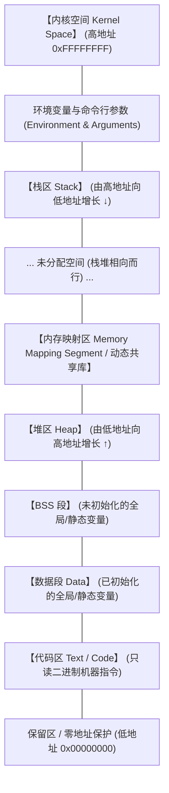
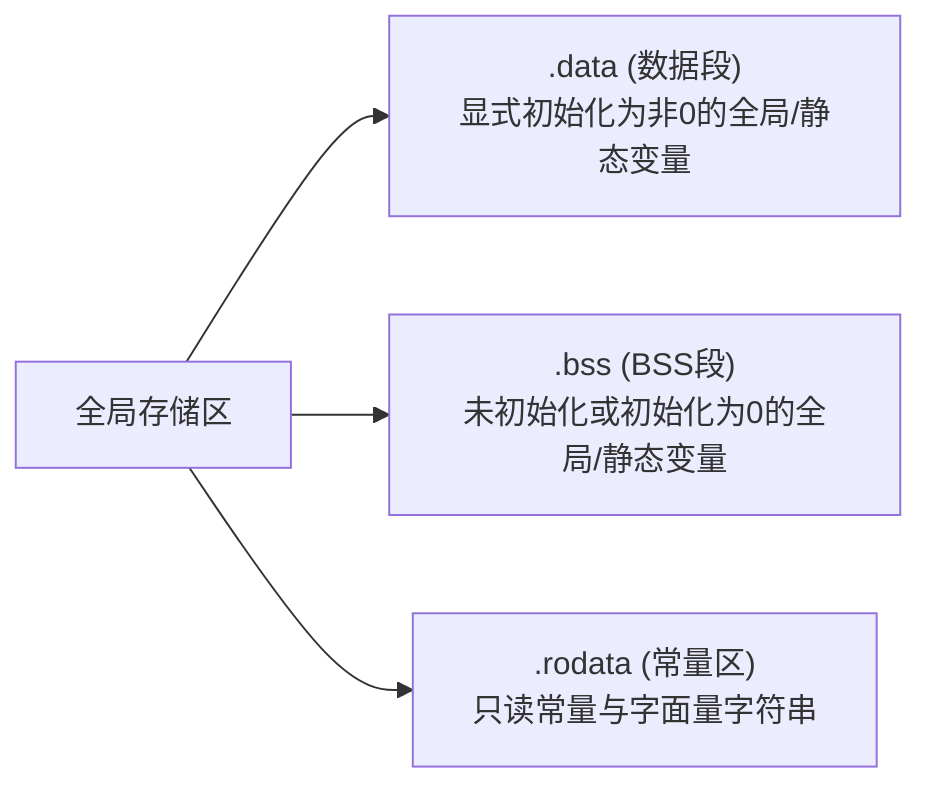
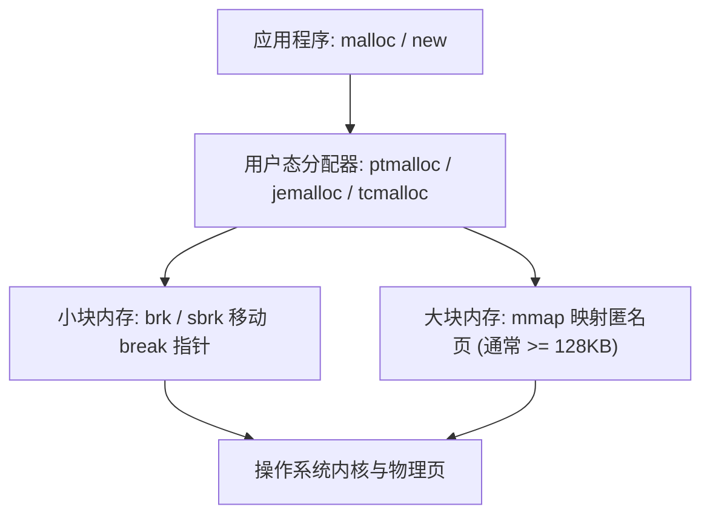
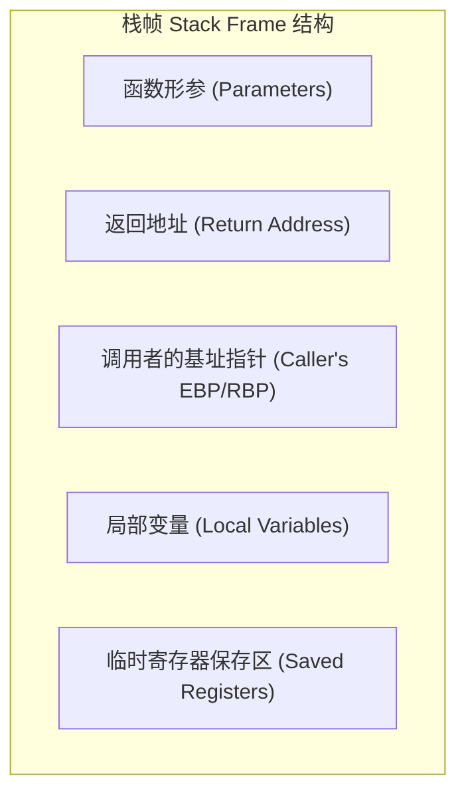

+++
title = '深入理解程序内存布局：代码区、全局区、堆区与栈区'
date = '2026-09-23T09:11:00+08:00'
slug = 'memory-layout-code-data-heap-stack'
draft = false
tags = ['操作系统', 'C/C++', '底层原理', '计算机体系结构']
+++

在编写程序时，无论是使用 C/C++ 这种面向系统底层的语言，还是 Java、Go、Rust、Python 等拥有运行时环境的高级语言，程序最终都需要被加载到操作系统的虚拟内存中执行。

很多开发者在日常编码中常听到“变量在栈上”、“对象在堆中”、“全局变量存哪里”、“为什么递归太深会导致栈溢出”、“为什么堆内存容易产生碎片”等问题。要彻底理清这些概念，关键在于理解进程的**虚拟内存空间布局（Virtual Memory Layout）**。

本文将从操作系统与进程执行的底层视角，深度拆解程序内存模型中的四大核心区域：**代码区（Text Segment）**、**全局/静态区（Data & BSS Segment）**、**堆区（Heap）**与**栈区（Stack）**。

<!-- more -->

---

## 一、 虚拟内存空间鸟瞰图

在现代保护模式（Protected Mode）操作系统中，每个进程都拥有独立的**虚拟地址空间（Virtual Address Space）**。通过 CPU 的内存管理单元（MMU）与操作系统的分页机制，虚拟地址会被映射到物理内存中。

以典型的 32 位 Linux 系统（4GB 虚拟内存）为例，地址空间通常划分为：
- **3GB 用户空间（User Space）**：`0x00000000` 到 `0xBFFFFFFF`，供用户进程使用。
- **1GB 内核空间（Kernel Space）**：`0xC0000000` 到 `0xFFFFFFFF`，供操作系统内核专用。

在用户空间内部，从低地址到高地址的标准内存布局如下：



---

## 二、 四大内存区域深度剖析

### 1. 代码区（Text Segment / Code Segment）

代码区是可执行程序在内存中的二进制物理映射区。

#### 核心特征与存放内容
- **存放内容**：
  - CPU 执行的机器指令（Machine Instructions）。
  - 函数体编译后的二进制机器码。
  - C++ 虚函数表（vtable）及只读元数据。
- **属性：只读性（Read-Only）**：
  - 代码段在内存页表中被标记为只读属性（PROT_READ | PROT_EXEC）。
  - 如果程序试图在运行期向代码区写入数据（例如利用野指针篡改代码段），硬件 MMU 会立刻触发缺页异常/段错误（`Segmentation Fault`，SIGSEGV），从而防止恶意代码注入或自身逻辑失控。
- **属性：共享性（Sharable）**：
  - 当同一个可执行文件被启动多次运行（如同时打开多个 bash 终端或浏览器标签），这些进程的代码段完全一致，操作系统只需将该物理页映射到不同进程的虚拟空间中，极大地节约了物理内存。

---

### 2. 全局区 / 静态区（Data & BSS Segment）

全局区用于存储在整个程序生命周期内都有效的数据。在底层 ELF/PE 文件格式中，该区域细分为两大部分：**数据段（.data）**与 **BSS 段（.bss）**，此外还包含**只读常量区（.rodata）**。



#### ① 已初始化数据段（.data Segment）
- **存放内容**：显式初始化为**非零值**的全局变量（Global Variables）和静态变量（Static Variables，无论是局部静态还是全局静态）。
- **生命周期**：随进程加载而分配，随进程退出由系统统一回收。
- **磁盘占用**：`.data` 段中的初值必须如实写入可执行文件磁盘镜像中，因此变量越多、初值越大，编译产物的二进制文件体积越大。

#### ② 未初始化数据段（.bss Segment）
- **全称**：*Block Started by Symbol*（源自早期汇编语言的伪指令）。
- **存放内容**：**未初始化**或**显式初始化为 0** 的全局变量和静态变量。
- **设计哲学——极大地节约磁盘体积**：
  - 假设你在代码中定义了 `int huge_arr[1000000] = {0};`（约 4MB）。
  - 如果放在 `.data` 段，可执行文件在磁盘上就会实打实增加 4MB 全零字节；
  - 但放在 `.bss` 段，可执行文件的头信息中仅需记录一个元数据：“需要 4MB 空间，启动时清零”。磁盘文件本身几乎不增大！
  - 当程序被内核的 `execve` 加载执行时，操作系统的装载器（Loader）才会分配物理页并将这块内存统一清零。

#### ③ 只读常量区（.rodata / Read-Only Data）
- 存放 `const` 全局变量和字符串字面量（如 `"Hello, World!"`）。
- 该区域也是只读的，修改它同样会触发段错误。

---

### 3. 堆区（Heap）

堆是专门用于**运行时动态内存分配（Dynamic Memory Allocation）**的区域，由程序员主动掌控其分配与释放。



#### 核心特征与机制
- **增长方向**：通常**由低地址向高地址增长**。
- **管理方式**：
  - 在 C 语言中使用 `malloc()` / `calloc()` / `realloc()` 与 `free()`。
  - 在 C++ 中使用 `new` / `delete`（底层调用构造函数/析构函数与堆分配原语）。
- **底层系统调用**：
  - `brk()` / `sbrk()`：通过调整进程数据段边界指针（break pointer）来扩充或收缩堆底。
  - `mmap()`：向操作系统申请一块独立的虚拟内存区域（通常用于分配较大内存块，如超过 128KB 时，避免造成过大的堆碎片）。
- **分配器的角色**：
  - glibc 的 `ptmalloc`、Google 的 `tcmalloc`、Facebook 的 `jemalloc` 等内存分配器维护着不同尺寸的空闲内存链表（Free List）或红黑树缓存，尽量减少进入内核态的系统调用开销。

#### 堆区面临的常见挑战
1. **内存泄漏（Memory Leak）**：动态申请的内存用完后未调用 `free` / `delete`，导致可用内存逐渐被耗尽。
2. **内存碎片（Fragmentation）**：频繁申请和释放不同尺寸的内存，会产生外部碎片，导致即使总空闲内存充足也无法分配大块连续内存。
3. **悬垂指针与野指针（Dangling Pointer）**：内存已被释放，但指针仍保留原地址并被继续读写；或者出现 `Double Free` 导致堆管理元数据被破坏。

---

### 4. 栈区（Stack）

栈区是函数调用机制的底层实现支柱，完全遵循**后进先出（LIFO - Last In, First Out）**规则。



#### 核心特征与机制
- **增长方向**：绝大多数主流架构（如 x86、x86_64、ARM）上，栈是**由高地址向低地址增长**的。
- **管理方式**：完全由编译器和 CPU 硬件自动管理，无需手动干预。
- **栈帧（Stack Frame）**：每次发生函数调用时，系统会在栈顶分配一个栈帧，包含：
  - 传递的实参数据（部分通过寄存器传递，多余的压栈）。
  - 函数返回地址（指示子函数执行完毕后返回父函数的下一条指令地址）。
  - 上一级栈基址（保存调用者的 `EBP/RBP`）。
  - 当前函数的非静态局部变量。
- **性能优势**：
  - 栈分配仅仅是移动 CPU 栈顶寄存器（`ESP/RSP`）的减法指令，耗时只有 1~2 个 CPU 周期。
  - 局部变量被连续读写，CPU L1/L2 缓存（Cache）命中率极高。
- **大小限制与风险**：
  - 栈空间通常非常有限（Linux 默认通过 `ulimit -s` 查看多为 8MB，Windows MSVC 默认通常为 1MB）。
  - **栈溢出（Stack Overflow）**：若在栈上定义超大局部数组（如 `int arr[1024*1024*10];`）或发生无终止条件的死递归调用，栈指针突破警戒页，操作系统会立刻抛出栈溢出崩溃。

---

## 三、 内存区域关键特性横向对比

| 维度 | 代码区（Text） | 全局/静态区（Data/BSS） | 堆区（Heap） | 栈区（Stack） |
| :--- | :--- | :--- | :--- | :--- |
| **管理者** | 编译器/链接器/装载器 | 编译器/链接器/装载器 | **程序员**（或 GC 垃圾回收器） | **编译器与 CPU 硬件** |
| **增长方向** | 固定（不动态增长） | 固定（不动态增长） | **由低地址向高地址**（向上） | **由高地址向低地址**（向下） |
| **分配效率** | 加载期一次性分配 | 加载期一次性分配 | 较慢（需寻找空闲块、系统调用） | **极快**（仅单条减法指令移动栈顶） |
| **空间大小** | 由代码规模决定 | 由全局/静态变量决定 | **很大**（受系统虚拟内存限制） | **很小**（默认 1MB ~ 8MB） |
| **生命周期** | 进程启动至进程退出 | 进程启动至进程退出 | `malloc` 始，`free` 终 | 随函数进入创建，随函数退出销毁 |
| **连续性** | 连续物理/虚拟页 | 连续物理/虚拟页 | 不连续（链表维护，有碎片） | **高度连续**（先进后出） |
| **典型错误** | 篡改代码段（段错误） | 跨文件初始化顺序问题 | 内存泄漏、野指针、Double Free | **栈溢出**、踩栈破坏返回地址 |

---

## 四、 经典代码实战：每一行变量究竟在哪里？

以下用一段经典的 C/C++ 代码，直观标注出各个变量与数据分别落在哪个内存区：

```cpp
#include <stdio.h>
#include <stdlib.h>
#include <string.h>

// 1. 全局区 - 数据段 (.data): 显式初始化为非零
int g_init_val = 100;

// 2. 全局区 - BSS段 (.bss): 未显式初始化（系统默认清零）
int g_uninit_val;

// 3. 常量区 (.rodata): const 全局常量
const int g_const_val = 2026;

void test_func(int param_val) {
    // 4. 栈区 (Stack): 函数形参 param_val 在 test_func 的栈帧中
    
    // 5. 栈区 (Stack): 局部变量
    int local_val = 10;

    // 6. 全局区 - 数据段 (.data): 显式初始化的局部静态变量
    static int s_init_val = 50;

    // 7. 全局区 - BSS段 (.bss): 未初始化的局部静态变量
    static int s_uninit_val;

    // 8. 字符串常量与指针变量拆分：
    //    str_ptr 变量本身是一个局部指针，位于【栈区】；
    //    其指向的字面量 "Hello World" 位于【常量区 (.rodata)】。
    const char *str_ptr = "Hello World";

    // 9. 堆区与指针变量拆分：
    //    heap_buf 变量本身是一个局部指针，位于【栈区】；
    //    malloc 动态申请的 1024 字节内存块位于【堆区】。
    char *heap_buf = (char *)malloc(1024);

    if (heap_buf != NULL) {
        strcpy(heap_buf, "Dynamic Heap Memory");
        printf("堆区地址: %p\n", (void *)heap_buf);
        // 记得主动释放，避免内存泄漏
        free(heap_buf);
        heap_buf = NULL; // 规避野指针
    }

    printf("代码区(函数地址): %p\n", (void *)&test_func);
    printf("全局区(.data):   %p\n", (void *)&g_init_val);
    printf("全局区(.bss):    %p\n", (void *)&g_uninit_val);
    printf("栈区(局部变量):  %p\n", (void *)&local_val);
}

int main() {
    test_func(42);
    return 0;
}
```

### 运行期地址规律观察
在典型的 Linux 64 位系统上打印上述地址，会呈现出清晰的数值跨度规律：
```text
代码区(函数地址): 0x55d28a1c1169   (较低的地址段)
全局区(.data):   0x55d28a1c4028   (紧贴代码段上方)
全局区(.bss):    0x55d28a1c4034   (.data 段上方)
堆区地址:        0x55d28b5562a0   (从堆底向上分配)
栈区(局部变量):  0x7ffd7a3e8114   (靠近 0x7fff... 的极高地址段，向下生长)
```

---

## 五、 现代延伸思考

### 1. 为什么“栈向下长，堆向上长”？
这是一个计算机体系结构发展史中的经典设计。在早期物理内存极为紧张的时代，编译器与系统无法预知一个程序运行中究竟是局部变量调用深（需要大栈），还是动态数据多（需要大堆）。

通过让堆和栈分别位于可用地址空间的两端，**相向而行**：
- 堆从低处向高处爬；
- 栈从高处向低处降；
- 两者共享中间广阔的未分配区域。只有当它们在中途真正“相遇”时，系统才会宣告内存耗尽（Out Of Memory），最大化地提高了内存使用自由度。

### 2. 安全攻防：栈溢出攻击与金丝雀（Canary）
由于栈区不仅保存局部变量，还保存了决定程序执行流向的**函数返回地址**，攻击者曾经频繁利用缓冲区溢出（Buffer Overflow）漏洞：
- 在栈上的字符数组中写入超长数据；
- 覆盖上一层的返回地址，将其篡改为恶意 shellcode 的入口；
- 函数执行 `ret` 指令时，CPU 就会跳转去执行恶意代码。

为此，现代编译器普遍引入了安全加固机制：
- **Stack Canary（栈金丝雀 / 保护桩）**：在栈帧的局部变量与返回地址之间插入一个随机安全标记（Canary）。在函数返回前检查该标记是否被篡改，一旦发现被覆盖立即抛出异常并终止进程。
- **DEP / NX（数据执行保护 / No-Execute）**：将堆和栈标记为不可执行（Non-Executable），即使注入了代码也无法运行。
- **ASLR（地址空间布局随机化）**：程序每次启动时，堆、栈、共享库的起始基地址随机漂移，让攻击者无法预测目标地址。

---

## 六、 总结

理解代码区、全局区、堆区与栈区，是每一个系统开发者从“只会写语法”迈向“洞悉底层机理”的必经之路：

1. **代码区（Text）**：只读共享，承载 CPU 指令核心。
2. **全局区（Data/BSS）**：陪伴程序一生，BSS 巧借元数据节省磁盘空间。
3. **堆区（Heap）**：自由灵活却需谨慎自律，是动态数据与对象的天堂，也是内存碎片的温床。
4. **栈区（Stack）**：硬件原生加速、编译器严格掌控的调用阶梯，小巧、极速但严防溢出。

掌握了它们的分工、特性与边界，在面对指针异常、性能调优、内存泄漏分析以及多线程并发排查时，脑海中就能浮现出清晰的内存图景，游刃有余。
