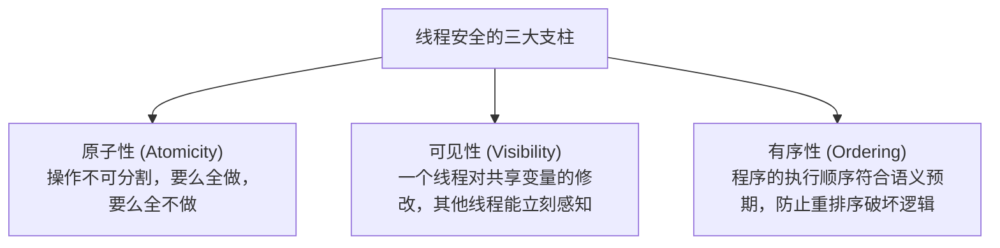
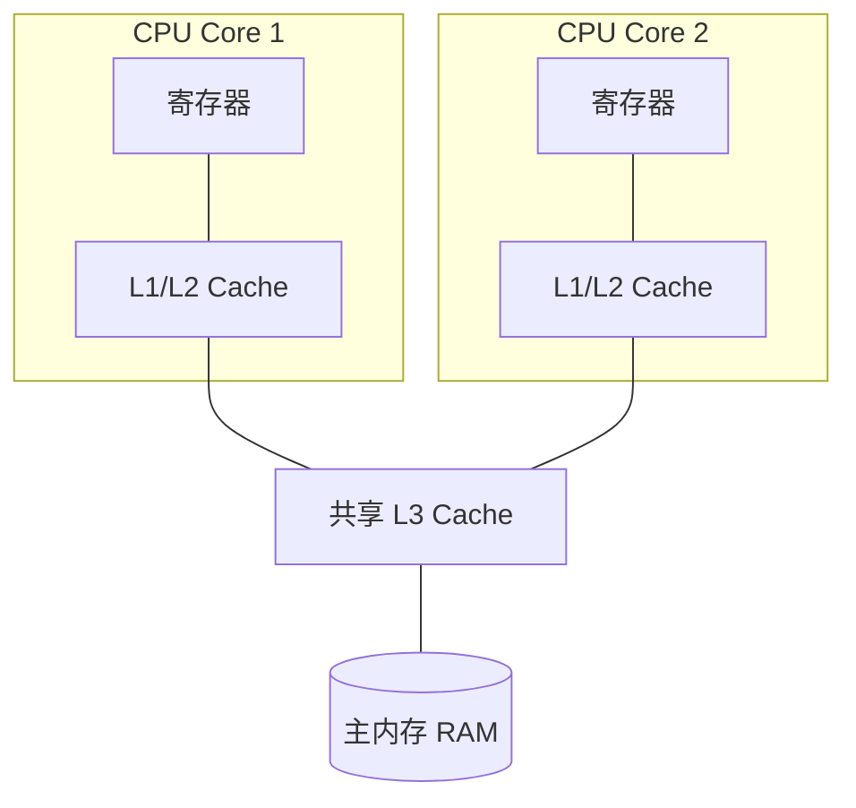
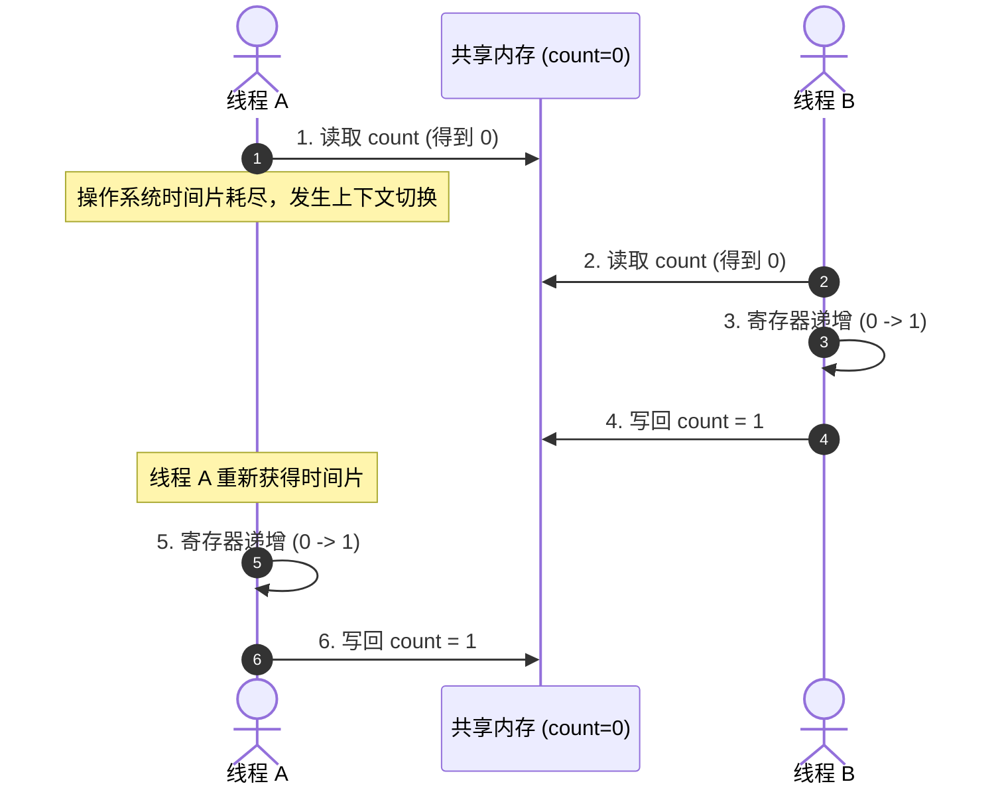
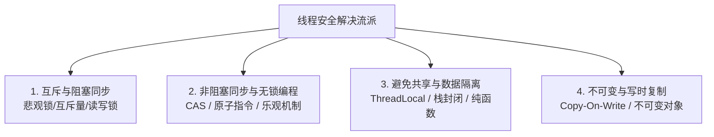
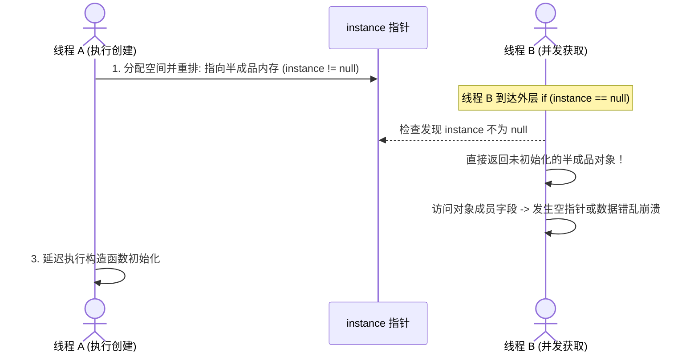

+++
title = '深入理解线程安全：底层机理、典型陷阱与实现方案'
date = '2026-09-23T09:12:00+08:00'
slug = 'understanding-thread-safety-principles-and-practices'
draft = false
tags = ['并发编程', '多线程', '操作系统', '底层原理']
+++

在多核 CPU 普及与高并发系统盛行的今天，并发编程已成为现代软件工程师不可回避的基石。然而，多线程在极大提升硬件资源利用率与吞吐量的同时，也带来了计算机体系中最复杂的幽灵——**线程安全问题（Thread Safety）**。

竞态条件（Race Condition）、脏读脏写、死锁、可见性丢失、指令重排……这些在单线程世界中闻所未闻的现象，往往在生产环境中以偶发、难以复现的诡异 Bug 出现。

究竟什么是真正的“线程安全”？计算机底层究竟发生了什么才导致了并发安全隐患？我们在工程实践中又该如何构筑稳固的线程安全防线？本文将从硬件架构、内存模型到底层同步原语，为你全面拆解线程安全的核心机制。

<!-- more -->

---

## 一、 什么是“线程安全”？

关于线程安全，业界公认最权威、最精辟的定义来自于《Java Concurrency in Practice》（Java 并发编程实战）一书作者 Brian Goetz：

> **“当多个线程访问某个类（或对象、方法）时，不管运行时环境采用何种调度方式或者这些线程将如何交替执行，并且在主调代码中不需要任何额外的同步或协同，这个类都能表现出正确的行为，那么就称这个类是线程安全的。”**

这里的核心关键词是**正确的行为（Correctness）**与**无需外部额外协同**：
1. **预期一致性**：无论线程如何调度、并发量多大，程序输出的结果始终与单线程串行执行的规格约定相吻合。
2. **封装完备性**：对象自身的内部状态由自己负责保护，外部调用者不需要小心翼翼地加锁。



---

## 二、 为什么会发生线程安全问题？底层根源剖析

线程安全隐患并非编程语言凭空捏造的缺陷，而是**现代计算机硬件架构与编译器为了极致的性能优化，与人类直觉之间的妥协**。

### 1. 缓存一致性与可见性问题（CPU Cache & Store Buffer）
现代 CPU 的运算速度比主内存（RAM）快数个数量级。为了抹平速度鸿沟，现代多核架构引入了多级高速缓存（L1/L2/L3 Cache）以及写缓冲区（Store Buffer）。



- 当 Core 1 上的线程 A 修改了共享变量 `flag = true`，该修改通常先写入自身的写缓冲或 L1 Cache，并没有立即刷新到主内存。
- 此时运行在 Core 2 上的线程 B 读取 `flag`，读取到的依然是主内存中的旧值 `false`。
- **后果**：线程 A 的修改对线程 B 不可见，导致逻辑死循环或状态判断错误。

### 2. 编译器优化与 CPU 乱序执行（有序性问题）
为了最大化 CPU 流水线执行效率，编译器（JIT/GCC/Clang）和 CPU 乱序执行引擎（Out-of-Order Execution）会在**不改变单线程最终语义（As-If-Serial 规则）**的前提下，对指令执行顺序进行重排序。

但在多线程并发场景下，编译器和 CPU 无法察觉跨线程的因果关联，重排序会导致难以预测的灾难（著名的单例模式 DCL 失效正是源于此）。

### 3. 上下文切换与非原子操作（原子性问题）
以最简单的自增语句 `count++` 为例，高级语言中的一行代码在编译为机器汇编指令后，实际上由三步构成：
1. **Load**：将 `count` 从内存读入 CPU 寄存器。
2. **Modify**：在寄存器中执行加 1 操作。
3. **Store**：将寄存器中的新值写回内存。



两个线程各执行了一次 `count++`，理论预期结果应为 `2`，但由于上述指令交错执行，最终落入内存的结果却只有 `1`。

---

## 三、 线程安全的五个分类层级

Brian Goetz 将系统中的共享数据安全级别划分为五个层级，有助于我们在架构设计中精准评估开销：

| 安全层级 | 核心定义与特征 | 经典案例 |
| :--- | :--- | :--- |
| **不可变（Immutable）** | 对象一旦创建，其内部状态永不改变。**天然线程安全**，无任何锁开销。 | Java `String`、`Integer`；Rust 中的默认不可变变量。 |
| **绝对线程安全** | 无论调用环境如何交替执行，主调方均**无需任何额外同步措施**。极其严苛罕见。 | C++ `std::atomic` 原语操作、Java 原子类单步调用。 |
| **相对线程安全** | 单个方法调用是线程安全的（原子封装），但如果将多个方法组合成复合操作，调用方仍需额外加锁。工程中最常见。 | `ConcurrentHashMap`、`Vector`。 |
| **线程兼容（非安全）** | 对象自身不提供同步支持，但在外部调用方正确使用同步控制时，可以在多线程环境中安全工作。 | `ArrayList`、`std::vector`、普通 C 结构体。 |
| **线程对立** | 无论调用端是否加锁，都**绝对不能**在多线程中并发使用。现代系统中极力避免。 | 已废弃的 `Thread.suspend()` 和 `Thread.resume()`。 |

---

## 四、 实现线程安全的四大核心武器库

在实际工程中，解决线程安全问题通常有四大流派：



### 方案 1：互斥与同步（阻塞机制 / 悲观锁）
通过锁（Lock / Mutex）确保同一时刻仅有一个线程能够进入临界区（Critical Section）。
- **互斥锁（Mutex）**：独占访问，未抢到锁的线程进入休眠/等待队列（涉及操作系统的 `futex` 系统调用与上下文切换）。
- **读写锁（Shared/Exclusive Lock）**：读读共享、读写互斥、写写互斥。适用于“读多写极少”的场景。
- **自旋锁（Spinlock）**：未获取到锁的线程不放弃 CPU 时间片，而是执行忙循环等待（Pause 指令）。适用于临界区极短、竞争极小的场景。
- **潜在代价**：死锁（Deadlock）、优先级反转（Priority Inversion）、线程上下文切换开销。

### 方案 2：非阻塞同步（CAS / 乐观机制）
利用现代硬件级提供的原子操作指令（如 x86 架构上的 `CMPXCHG` 指令），实现无锁（Lock-Free）高并发：
- **CAS（Compare-And-Swap）**：包含三个操作数：内存地址 $V$、预期旧值 $A$、拟写入新值 $B$。当且仅当地址 $V$ 的值等于 $A$ 时，才原子性地更新为 $B$；否则自旋重试。
- **典型实现**：各大语言中的原子变量类型（如 Java `AtomicInteger`、C++ `std::atomic<T>`、Go `sync/atomic`）。
- **经典陷阱——ABA 问题**：若变量从 $A$ 变为 $B$ 又变回 $A$，CAS 无法察觉中间过程。解决方案是引入**带版本号/时间戳**的机制（如 Java 的 `AtomicStampedReference`）。

### 方案 3：避免共享与数据隔离（Thread Confinement）
最优雅的并发策略是不产生竞争。如果数据压根不被跨线程共享，线程安全问题就自然消失了：
- **栈封闭（Stack Confinement）**：只使用局部变量。局部变量分配在各线程自有的**栈帧（Stack Frame）**内，物理上天然隔离。
- **线程局部存储（Thread-Local Storage / TLS）**：例如 Java 的 `ThreadLocal`、C/C++ 的 `__thread` 或 `thread_local` 关键字。每个线程维护属于自己的变量副本。
- **无状态设计（Stateless Services）**：设计无状态的单例类/函数（如 Web 开发中的 Spring MVC Controller、无状态微服务），只读入参，不修改类内部成员变量。

### 方案 4：不可变与写时复制（Copy-On-Write）
- **不可变对象（Immutable Pattern）**：属性一经构造完成便全部设为只读，内部不暴露任何 Setter 或变异方法。只读共享绝不产生竞态。
- **Copy-On-Write（写时复制）**：读取时完全不加锁，当需要修改数据时，将原有数据完整复制一份生成新副本，在副本上完成修改后再以原子方式替换原指针。典型代表为 Java 的 `CopyOnWriteArrayList`。

---

## 五、 经典陷阱实战：双重检查锁（DCL）的致命暗礁

在设计模式中，懒汉式单例模式的双重检查锁定（Double-Checked Locking）是展示指令重排与可见性破坏线程安全的最经典案例。

### 错误的写法（以 C++/Java 逻辑为例）
```java
public class Singleton {
    private static Singleton instance; // 未使用 volatile

    private Singleton() {}

    public static Singleton getInstance() {
        if (instance == null) {                         // 第一次检查
            synchronized (Singleton.class) {
                if (instance == null) {                 // 第二次检查
                    instance = new Singleton();         // 【致命隐患点】
                }
            }
        }
        return instance;
    }
}
```

### 为什么会发生致命灾难？
关键在于 `instance = new Singleton();` 并不是一条原子操作，在底层会分解为三步：
1. `memory = allocate();` // 1. 分配对象的内存空间
2. `ctorInstance(memory);` // 2. 调用构造函数，初始化对象成员
3. `instance = memory;`    // 3. 将 instance 引用指向刚分配的内存地址

然而，编译器和 CPU 可能对第 2 步和第 3 步进行**指令重排序**，变成：
1. `memory = allocate();` // 分配内存
2. `instance = memory;`    // 先把引用赋给 instance（此时对象还是未初始化的半成品！）
3. `ctorInstance(memory);` // 执行真正的构造初始化



### 正确解决方案
必须将 `instance` 变量修饰为 `volatile`（在 Java 中）或使用具有获取/释放语义的原子指针 `std::atomic`（在 C++11 中），通过在底层插入**内存屏障（Memory Barrier）**，严格禁止步骤 2 与步骤 3 重排，同时强制刷新写缓冲，确保修改对所有核心立即可见。

---

## 六、 总结与多线程设计哲学

线程安全的本质，是在时间和空间维度上建立秩序：

1. **先做减法，再做加法**：优先考虑**不可变对象**、**栈封闭**和**无状态设计**。不共享状态是最好的并发设计。
2. **轻重结合，按需施策**：
   - 简单的计数和标志位，优先选用硬件级加速的**原子变量（Atomic / CAS）**；
   - 临界区逻辑复杂的业务，选用结构清晰的**互斥锁（Mutex）**；
   - 读多写少的配置字典，选用**读写锁**或 **Copy-On-Write**。
3. **敬畏并发，警惕过度自信**：永远不要依赖看似聪明的无锁技巧或侥幸心理，并发测试要覆盖高并发压测与线程交错分析工具（如 ThreadSanitizer、JMH），让底层规范替程序保驾护航。
