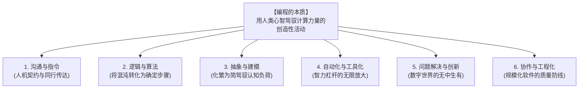
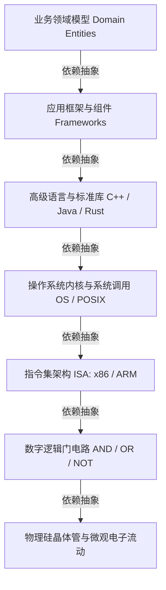
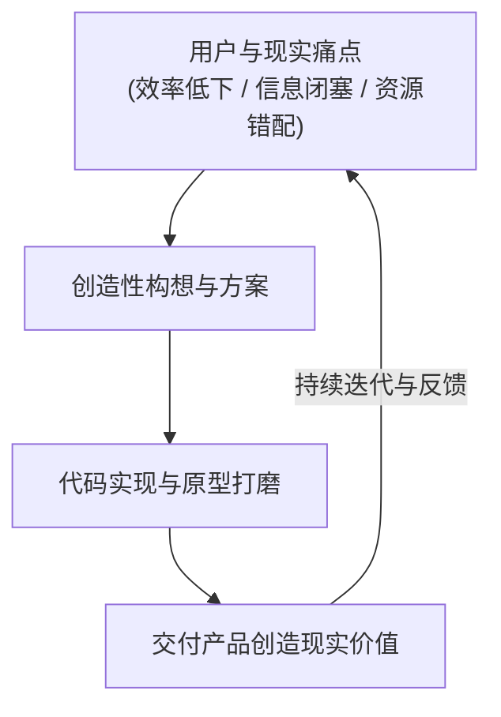
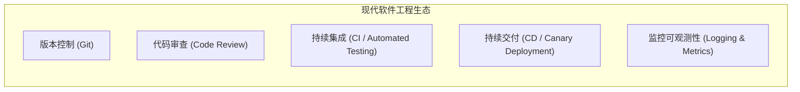

+++
title = '编程的本质是什么？关于心智模型、抽象与创造的深度重塑'
date = '2026-09-23T09:34:00+08:00'
slug = 'what-is-the-essence-of-programming'
draft = false
tags = ['编程思维', '软件工程', '认知模型', '方法论', '架构设计']
+++

在日复一日的职业生涯中，很多开发者容易陷入一种“微观的疲惫”：调试未知的空指针异常、查阅第三方库的 API 文档、在各种框架的升级改造中疲于奔命、被业务需求催促着写下成百上千行 CRUD 代码。

在这样的节奏中，我们常常会忽略一个最质朴却也最深刻的问题：
**编程的本质究竟是什么？**

是背诵语法规则？是熟练使用各种设计模式？还是追求算法题的最优解？

麻省理工学院经典著作《计算机程序的构造和解释》（SICP）在开篇就给出了震撼人心的结论：
> *“计算机科学其实不是关于计算机的科学，就像天文学不是关于望远镜的科学一样。”*

编程绝不仅仅是在键盘上敲击字符，它是一场人类跨越碳基与硅基维度的宏大实践。理解编程的本质，可以从以下六个交相辉映的关键维度建立起完整的心智模型。

<!-- more -->

---

## 一、 认知全景：编程本质的六大支柱

---

## 二、 维度拆解：从微观执行到宏观工程

### 1. 沟通与指令：跨越碳基与硅基的精密契约

编程的第一层物理现实，是**人与计算机之间的无歧义沟通**。

- **确定性对决模糊性**：
  人类的自然语言充满了隐喻、潜台词、情绪与语境容错；而计算机（由数以亿计的晶体管构成的硅基机器）只理解冷酷的电平高低与二进制逻辑。编程语言是人类发明的形式化语言（Formal Language），它拥有极其严苛的词法、语法与语义规则。
- **意图的精准下达**：
  程序员扮演着翻译官的角色——必须把现实世界中充满灰色地带的想法，提炼成计算机能够无歧义解析与执行的操作指令集。
- **沟通的双向性（更深层的启示）**：
  图灵奖得主 Donald Knuth（高德纳）提出过著名的“文学编程（Literate Programming）”理念：
  > *“我们应当改变传统的态度：不要去想如何指挥计算机去做什么，而是去想如何向另一个人解释我们希望计算机做什么。”*
  
  代码不仅是写给编译器运行的，**更是写给未来的自己和其他工程师阅读的**。可读性、自解释性与优雅的命名，正是人类沟通本质的最高体现。

---

### 2. 逻辑与算法：将混沌现实拆解为可计算的确定步骤

面对复杂的现实世界，计算机本身没有智慧，它唯一的特异功能是**极速且不出错地执行基础逻辑**。

- **逻辑的严密性**：
  从布尔代数到谓词逻辑，程序运行的每一步都必须经得起推敲。条件分支（`if-else`）穷尽了状态转移，循环结构（`while/for`）定义了重复处理的终止边界，异常防御（`try-catch`）圈定了预期外的防线。
- **算法的效率与收敛**：
  现实世界的数据规模往往呈指数级膨胀，而计算机的物理资源（CPU 周期、内存容量）永远是有限的。算法（Algorithm）的本质，是在有限的时间与空间预算内，求得问题的精确解或最优近似解。
- **培养严谨思维**：
  编程会残酷地惩罚逻辑漏洞。任何一个未考虑到的边界值（如数组越界、空指针、并发竞态），都会在特定的输入下演变为系统的崩溃。这种反馈机制深刻地重塑了程序员看待事物因果链条的思考方式。

---

### 3. 抽象与建模：用有限的人类心智驾驭无限的系统复杂度

人类大脑的工作记忆容量极其有限（心理学研究表明同时处理的信息块通常只有 4~7 个），而现代软件系统的代码量动辄数百万行。**人类凭什么能构建起如此庞大的复杂系统？答案是“抽象（Abstraction）”。**

- **分层抽象（Layering）**：
  每一层都隐藏下层的繁琐细节，只对外暴露干净、稳定的接口与契约。编写高级业务代码的工程师不需要随时思考 CPU 寄存器的电位跳转；正如驾驶员不需要懂得内燃机喷油嘴的流体力学方程一样。
- **概念建模（Modeling）**：
  将现实世界纷繁复杂的业务实体与行为，映射为编程语言中的数据结构与对象：
  - 用户、订单、商品 $\rightarrow$ 类、结构体与实体属性；
  - 支付、审核、发货 $\rightarrow$ 方法、函数、事件与状态机。
- **警惕“抽象漏洞法则（The Law of Leaky Abstractions）”**：
  软件工程名家 Joel Spolsky 曾指出：*“所有非平凡的抽象，都在某种程度上存在漏洞。”* 抽象虽然屏蔽了复杂性，但当性能出现雪崩、网络产生抖动、内存发生泄漏时，优秀的工程师必须具备穿透抽象层、下沉到底层探究真相的洞察力。

---

### 4. 自动化与工具化：人类智力杠杆的自我复制与放大

阿基米德曾说：“给我一个支点，我就能撬起整个地球。”
在信息时代，**代码就是智力的支点，算力就是无尽的杠杆。**

| 特征维度 | 传统人工手段 | 软件编程工具化 |
| :--- | :--- | :--- |
| **执行速度** | 受限于生理神经反应（秒/分） | 毫秒级、纳秒级高速响应 |
| **重复劳动抗性** | 极易疲劳、注意力衰减、手滑出错 | 不知疲倦，亿万次执行精度始终如一 |
| **边际成本** | 线性增长（处理十倍业务需十倍人力） | 边际成本几乎归零（一段代码全球并发复用） |
| **边界突破** | 无法肉眼分析海量数据 | 海量并发、多维协同、超大规模分布式计算 |

- **创造工具的工具**：
  人类之所以被称为万物之灵，是因为人类善于使用和制造工具；而程序员是最特殊的一群工具制造者——**我们用代码编写出编译器、数据库、开发框架，再去制造更强大的工具**。这种工具的自我迭代与滚雪球效应，构成了整个数字文明飞速膨胀的底层引擎。

---

### 5. 问题解决与创新：从现实痛点到数字宇宙的无中生有

**编程从来不是目的，解决现实问题、创造商业与社会价值才是终局。**

- **心智造物的艺术**：
  建筑师受制于重力与钢筋水泥的物理强度，画家受制于画布与颜料的材质；而程序员唯一的限制就是自己的想象力与逻辑边界。只要符合计算理论，你可以在纯粹的思维空间中构建出任何虚拟规则：从三维仿真的游戏物理世界，到协同万人的去中心化网络。
- **探索与创新的实验场**：
  无论是利用神经网络攻克蛋白质折叠难题（AlphaFold），还是在屏幕上创造出动人的生成式艺术，编程为人类将抽象灵感具象化提供了试错成本最低的孵化器。

---

### 6. 协作与工程化：从手工作坊走向现代软件大工业生产

如果说编写几十行代码解决一个算法问题是“纯数学式的个人解题”，那么构建一个支撑数亿用户、演进数十年的复杂系统，就是**严谨的现代工业工程学**。

- **个体能力的边界与团队协同**：
  没有任何一个人类大脑可以完全容纳 Linux 内核或大型企业级 ERP 系统的所有细节。现代软件工程的核心命题，是如何通过制度、规范与工具，让数百位甚至数万位背景各异的工程师能够有序协作：
  - **Git 版本控制**：管理时间与空间的变更分支；
  - **接口契约（API Contracts）**：解耦系统边界与团队依赖；
  - **测试与门禁（CI/CD）**：将质量保障从“依赖个体的良心”转化为“冷酷的自动化防御”。
- **可维护性重于一时技巧**：
  软件工程的大部分成本并非发生在初次编写阶段，而是发生在长达数年乃至数十年的维护、升级、重构与 Bug 修复中。写出“让别人能看懂、敢修改、易测试”的代码，比写出一段看似精巧晦涩的奇技淫巧高尚得多。

---

## 三、 结语：在 AI 时代重新审视编程的本质

近年来，随着大语言模型（LLM）与代码生成 Agent 的爆炸式进化，一个尖锐的声音不断在社区回荡：*“AI 都会写代码了，人类程序员还会存在吗？编程的本质动摇了吗？”*

如果我们把编程狭隘地理解为“把需求逐行敲成 if/else 与 API 调用”，那么这个工种确实正在被时代快速重塑；

**但如果我们回到编程的真正本质：**
- **敏锐地识别并定义真正的问题**；
- **在混沌的现实需求中完成概念建模与抽象**；
- **推演严丝合缝的边界逻辑与状态转移**；
- **设计兼具弹性与韧性的系统架构**；
- **在人与人、团队与系统之间建立稳固的工程契约**。

那么，编程不仅不会消亡，反而会回归它最初的荣光——**它是人类运用理性的光芒拆解复杂世界、以极简的规则驾驭庞大计算力量、在数字空间中雕刻理想现实的心智艺术。**
