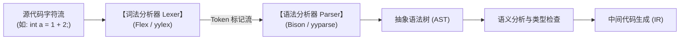
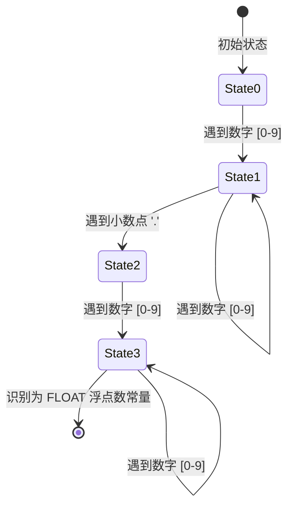
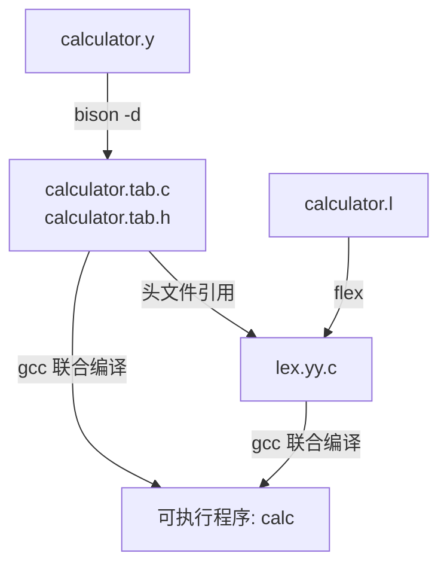

+++
title = '编译原理入门：词法分析器与 Flex/Bison 黄金搭档实战'
date = '2026-09-23T09:18:00+08:00'
slug = 'compiler-lexical-analysis-flex-bison-tutorial'
draft = false
tags = ['编译原理', 'C/C++', 'Flex', 'Bison', '底层原理']
+++

在每一个程序员的学习生涯中，“编译器究竟是如何把一堆英文字符代码变成可执行程序的”往往是最令人着迷的谜题之一。

当你键入如下命令准备折腾编译器前端时：
```bash
sudo apt-get install flex
sudo apt-get install bison
```
你实际上已经推开了计算机科学中最经典、最精巧的技术大门：**词法分析器（Lexer）** 与 **语法分析器（Parser）**。

本文将从编译器的前端宏观流水线出发，深入拆解**词法分析器（Lexical Analyzer / Scanner）**的底层数学基石（正则文法与有限自动机 DFA），并手把手带你使用 **Flex** 与 **Bison** 搭建一个完整的端到端词法与语法解析实战项目。

<!-- more -->

---

## 一、 宏观视角：编译器的前端流水线

一个完整的编译器（如 GCC、Clang 或 Rustc）通常分为**前端（Front-end）**与**后端（Back-end）**。前端的核心任务是“理解源代码并转换为中间表示（IR）”，而词法分析器正是这套流水线的第一道关卡。



### 什么是词法分析？
源代码本质上只是一串由人类键盘敲出的**线性字符流（Character Stream）**，包含空格、制表符、注释、标识符、数字与符号。

**词法分析器（Lexer / Scanner）的工作**：
1. **字符切分与归类**：从左到右逐个扫描字符，依据词法规则将它们拼装成一个个不可再分的最小语义单元——**Token（记号 / 词法单元）**。
2. **过滤噪音**：剔除代码中的空白字符、制表符和代码注释。
3. **记录元信息**：记录每个 Token 所在的文件名、行号与列号，用于后续精准报错。

例如，面对代码 `total = count + 42;`，词法分析器会将其切分为如下 Token 流：
- `IDENTIFIER("total")`
- `ASSIGN("=")`
- `IDENTIFIER("count")`
- `PLUS("+")`
- `NUMBER(42)`
- `SEMICOLON(";")`

---

## 二、 词法分析的底层数学基石：正则与有限状态机

为什么词法分析器能如此高效地把字符拼成 Token？背后依托的是一套严密的理论：**乔姆斯基谱系中的 3 型文法（正则文法）与有限自动机（Finite Automata）**。


### 1. 确定有限自动机（DFA）
一个 DFA 可以看作一个黑盒状态机：
- 任意时刻处于某一个确定的状态；
- 输入一个字符后，**有且仅有一条**确定的路径转移到下一个状态；
- 当输入结束且停留在“接受状态（Accept State）”时，即表示成功识别该类型的 Token。

以识别浮点数（如 `123.45`）的 DFA 状态转移为例：



由于 DFA 的每次状态转移仅需一次数组寻址（$O(1)$ 时间复杂度），因此词法分析器扫描源码的速度极快，通常可以达到每秒数百兆甚至吉字节的吞吐量。

---

## 三、 黄金搭档：Flex 与 Bison

手动手写一个巨大的 `switch-case` 状态机既枯燥又极易出错。因此，UNIX 世界诞生了著名的自动化生成工具：

- **Lex / Flex（Fast Lexical Analyzer Generator）**：专门读取正则表达式规则文件（`.l`），自动生成高优化 DFA 状态转移表的 C 语言词法分析源码（`lex.yy.c`）。
- **Yacc / Bison（GNU Parser Generator）**：专门读取上下文无关文法 BNF 规则文件（`.y`），生成 LALR(1) 语法分析器 C 源码。

### 环境准备（Linux / Ubuntu）
```bash
# 更新源并安装 flex 与 bison，以及编译构建工具
sudo apt-get update
sudo apt-get install -y flex bison gcc make
```

验证安装成功：
```bash
flex --version    # 通常为 2.6.x
bison --version   # 通常为 3.8.x
```

---

## 四、 实战演练：手写一个支持优先级的算术表达式解析器

接下来，我们将使用 Flex 与 Bison 协同编写一个计算器，不仅完成词法切分，还能直接进行带括号的四则运算。

### 1. Flex 规则文件：`calculator.l`

Flex 源代码采用经典的**“三段式”**结构，使用 `%%` 进行分割：

```lex
%{
/* 第一段：C 声明区，包含头文件以及由 Bison 生成的 Token 定义 */
#include <stdio.h>
#include <stdlib.h>
#include "calculator.tab.h" /* 引入 Bison 生成的 Token 宏 */
%}

/* 选项定义：避免需要链接 -lfl 库 */
%option noyywrap

/* 正则宏定义 */
DIGIT    [0-9]
INTEGER  {DIGIT}+
FLOAT    {DIGIT}+"."{DIGIT}*|{DIGIT}*"."{DIGIT}+

%%
/* 第二段：规则与动作映射区 (Regex -> Action) */

{INTEGER}   { 
                yylval.val = atof(yytext); 
                return NUMBER; 
            }
{FLOAT}     { 
                yylval.val = atof(yytext); 
                return NUMBER; 
            }

"+"         { return ADD; }
"-"         { return SUB; }
"*"         { return MUL; }
"/"         { return DIV; }
"("         { return OP; }
")"         { return CP; }
"\n"        { return EOL; }

[ \t]       { /* 忽略空格与 Tab 制表符，什么都不做 */ }

.           { printf("未知非法字符: %s\n", yytext); }

%%
/* 第三段：用户自定义 C 代码区（此处留空） */
```

### 2. Bison 语法规则文件：`calculator.y`

Bison 会不断调用 Flex 提供的 `yylex()` 函数获取下一个 Token，并在匹配到文法规则时执行语义动作。

```yacc
%{
#include <stdio.h>
#include <stdlib.h>

/* 声明由 Flex 提供的词法分析函数与错误处理函数 */
int yylex(void);
void yyerror(const char *s);
%}

/* 定义语义值联合体（Token 或表达式携带的数据） */
%union {
    double val;
}

/* 声明 Token 及其在 union 中的字段类型 */
%token <val> NUMBER
%token ADD SUB MUL DIV OP CP EOL

/* 声明操作符的结合性与优先级（由低到高） */
%left ADD SUB
%left MUL DIV
%type <val> exp factor term

%%

/* 语法产生式规则 */
calclist:
    /* 空规则 */
  | calclist exp EOL { printf("= %g\n> ", $2); }
  | calclist EOL     { printf("> "); } /* 空行直接打印提示符 */
  ;

exp:
    factor
  | exp ADD factor { $$ = $1 + $3; }
  | exp SUB factor { $$ = $1 - $3; }
  ;

factor:
    term
  | factor MUL term { $$ = $1 * $3; }
  | factor DIV term { 
        if ($3 == 0) {
            yyerror("除数不能为零");
            $$ = 0;
        } else {
            $$ = $1 / $3; 
        }
    }
  ;

term:
    NUMBER
  | OP exp CP       { $$ = $2; }      /* 括号优先级最高 */
  ;

%%

void yyerror(const char *s) {
    fprintf(stderr, "解析错误: %s\n", s);
}

int main(int argc, char **argv) {
    printf("--- 简易交互式表达式计算器 (Flex & Bison) ---\n> ");
    yyparse();
    return 0;
}
```

---

## 五、 编译与运行流水线

了解 Flex 和 Bison 的文件联动编译关系至关重要：



### 命令行编译步骤：
```bash
# 1. 使用 Bison 解析语法，-d 参数会生成包含 Token 宏定义的 .h 头文件
bison -d calculator.y

# 2. 使用 Flex 解析词法规则，生成 lex.yy.c
flex calculator.l

# 3. 使用 GCC 编译链接生成最终可执行程序
gcc -o calc calculator.tab.c lex.yy.c -lm
```

### 运行测试：
```text
$ ./calc
--- 简易交互式表达式计算器 (Flex & Bison) ---
> 3 + 5 * 2
= 13
> (10 - 4) / 2
= 3
> 3.14 * 2
= 6.28
> 10 / 0
解析错误: 除数不能为零
= 0
```

---

## 六、 词法分析的工程陷阱与高级技巧

在真实语言（如 C 语言、Python、SQL）的词法分析实现中，有几个经典难题：

### 1. 最长匹配原则（Maximal Munch / Longest Match Rule）
当输入 `===` 时，词法分析器应该切分为 `==` 和 `=`，还是三个 `=`？
- **规则**：DFA 总是尽可能吃掉最多的输入字符，直到无法转移为止。因此它会优先匹配到两个字符组成的恒等符 `==`，再将剩下的一个 `=` 识别为赋值符。

### 2. 规则优先次序（First Match Wins）
关键字（`if`、`int`、`while`）与通用标识符（`identifier`）规则冲突时如何处理？
- 在 Flex 中，如果两个规则匹配的长度完全相同，**在文件中排在前面的规则胜出**。因此，必须将所有的保留关键字放在通用标识符（`[a-zA-Z_][a-zA-Z0-9_]*`）的前面定义。

### 3. 多行注释与字符串的陷阱：起始条件（Start Conditions）
处理跨越多行的 C 语言注释 `/* ... */`，普通正则表达式会极其笨拙。Flex 提供了 `%x`（独占起始状态）功能：
```lex
%x COMMENT

%%
"/*"            { BEGIN(COMMENT); }
<COMMENT>"*/"   { BEGIN(INITIAL); }
<COMMENT>.      { /* 吞掉注释内容 */ }
<COMMENT>\n     { /* 统计行号 */ }
```
利用状态切换，词法分析器可以轻松处理复杂的嵌套作用域与逃逸字符串。

---

## 七、 现代编译器的演进思考：手写 vs 生成器？

尽管 Flex 和 Bison 在编译原理教学、数据库引擎（如 PostgreSQL、SQLite 语法解析器）和领域专用语言（DSL）中依然是中流砥柱，但在主流的工业级通用编程语言（如 Rustc、Go、Clang、Swift、V8）中，**几乎全部转向了手写递归下降词法与语法分析器（Hand-written Lexer & Parser）**。

原因主要有三点：
1. **极致人性化的错误提示（Diagnostics）**：编译器生成工具遇到语法错误时往往只冷冰冰地抛出 `syntax error`，而现代开发者需要类似 Rust 那样精确到字符下划线、并附带 "Did you mean X?" 的友好诊断建议。
2. **增量编译与 IDE 语言服务（LSP）**：现代代码编辑器需要边打字边做高亮与补全，手写分析器更容易容忍未闭合的语法半成品，具备强大的容错恢复（Error Recovery）能力。
3. **架构与性能掌控**：免去繁杂的代码生成配置和外部工具链依赖。

---

## 结语

从字符流到 Token，从正则文法到状态机，词法分析器是计算机理解人类高级语言的第一座桥梁。掌握 Flex 与 Bison，不仅能让你轻松应对语法解析与 DSL 创造，更能让你在透过表象理解语言运行机理时，拥有一份前所未有的透彻与笃定。
