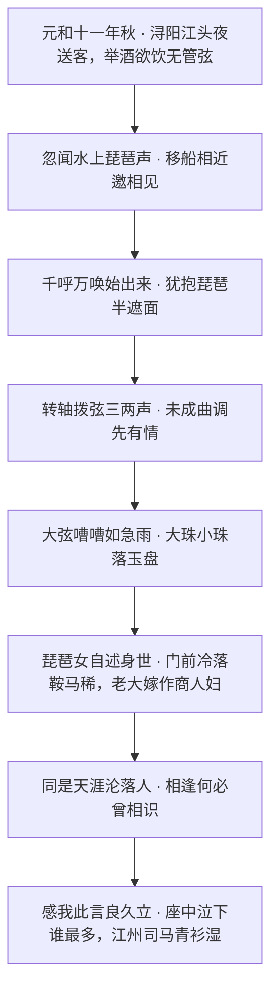

+++
title = '从"洗脚记"到"天涯沦落人"：《琵琶行》的千年回响'
date = '2026-09-28T00:55:00+08:00'
slug = 'baijuyi-pipa-xing'
draft = false
tags = ['白居易', '琵琶行', '古诗词', '唐诗', '网络梗']
+++

如果你刷短视频，一定见过这个说法：《琵琶行》就是"白居易洗脚记"。博主们把这首千古名篇读成"白居易的夜生活 vlog"——浔阳江头、月上枫林，一位女子怀抱琵琶、半遮半掩地弹了一整夜，诗人听得青衫尽湿。这个画面，被当代网友精准地翻译成了今天的"足疗/洗脚城"场景。

玩笑归玩笑，但"洗脚记"这个梗之所以能戳中这么多人，恰恰因为它抓住了这首诗**从俗到雅**的张力。今天我们就从"梗"出发，走进《琵琶行》真正的世界。

## 一、一首被贬之人的"夜生活记录"

元和十年（815年），唐朝出了件大事：宰相武元衡在上朝路上被藩镇刺客当街刺死。时任左拾遗的白居易心急如焚，率先上书请求缉拿凶手——这本是义举，却被政敌扣上"越职奏事"的帽子；随后又有人翻出他的《赏花》《新井》诗造谣中伤，说他母亲坠井而逝却仍作诗，有伤孝道。

于是，这位曾名动长安的大诗人，先被贬为江州刺史，又被追贬为**江州司马**。江州（今江西九江）在时人眼里是"蛮瘴之地"，司马更是"位高责轻"的闲差。诏令一下，白居易狼狈南下，次年（元和十一年，816年）秋，在浔阳江头送客时，偶遇一位漂泊的琵琶女，听她弹了一曲、哭诉了一生的遭遇，写下了这篇《琵琶行》。

这首诗的核心情节，就是一场"夜中偶遇"：

## 二、"洗脚记"的梗是怎么来的？

网络版的解读，其实是把这首诗"降维"到了今天的服务业场景：

- 琵琶女早年红极一时，"五陵年少争缠头，一曲红绡不知数"，如今却"暮去朝来颜色故""门前冷落鞍马稀"，只能靠一手技艺侍人谋生——这不就是"靠手艺吃饭、以色事人、年华老去门前冷落"的写照？
- 白居易深夜在外，听曲谈心，一掷同情之泪——网友戏称这就是"男人在风月场所一步步被套路"。
- 于是有博主总结"琵琶女套路五步（立人设、诉身世……）"，说大诗人也扛不住；甚至有人调侃：记不住《琵琶行》，去洗脚城实习三个月就懂了什么叫"同是天涯沦落人"。

"洗脚"二字，本质上是在用今天的娱乐消费逻辑，去置换古代乐伎卖艺与士人饮酒听曲的场景，制造一种"古人也不过如此"的反差笑点。

## 三、梗之外：这首诗到底好在哪？

玩笑归玩笑，我们得把"梗"和"诗"分开看——**梗抓住的是场景的相似，而诗打动人的是情感的通约**。

先看它的音乐描写，堪称中国文学写声音的巅峰。白居易不用一个乐谱音符，却让琵琶声"听得见"：

> 大弦嘈嘈如急雨，小弦切切如私语。
> 嘈嘈切切错杂弹，大珠小珠落玉盘。
> 间关莺语花底滑，幽咽泉流冰下难。
> 冰泉冷涩弦凝绝，凝绝不通声暂歇。
> 别有幽愁暗恨生，此时无声胜有声。
> 银瓶乍破水浆迸，铁骑突出刀枪鸣。

从"如急雨"到"如私语"，从"珠落玉盘"到"铁骑突出"，再落到"此时无声胜有声"——声、色、情层层递进，把一段演奏写成了跌宕起伏的乐章。

再看它的"情"。全诗最动人的，不是音乐，而是一句**"同是天涯沦落人，相逢何必曾相识"**。琵琶女从长安红极一时的乐伎，沦落到江口独守空船；白居易从长安的谏官，贬到江州做闲官。一个"漂"、一个"贬"，一个是卖艺为生、一个是仕途失意，看似毫不相干，却在"沦落"二字上撞了个满怀。诗人正是借着琵琶女的身世，完成了对自己命运的投射。

所以最后才"座中泣下谁最多？江州司马青衫湿"——同情的泪，其实是自伤之泪。

| 维度 | "洗脚记"梗的读法 | 诗的本意 |
| --- | --- | --- |
| 场景 | 古代版足疗/风月消费 | 士人贬谪途中与乐伎的深夜偶遇 |
| 琵琶女 | 靠手艺侍人、被套路的对象 | 从红极一时到门前冷落的"沦落人" |
| 白居易 | 深夜寻欢、被 PUA 的客人 | 触景伤情、借人写己的被贬诗人 |
| 落泪 | 场面话、一时感动 | 同是天涯沦落人，感同身受的自伤 |

## 四、千年之后：梗还在，诗也在

"洗脚记"不是对这首诗的亵渎，恰恰说明它在当代还"活着"。2026 年，这种生命力表现得更加明显：

- **"感我此言良久立，却坐促弦弦转急"** 在高考期间意外走红，成为全网形容"被理解、被共情后的无言震撼"的表达——千年前"良久立"的留白，成了今天年轻人瞬间的共鸣暗号；
- 《琵琶行》还被改编成"高考战歌"，成为考生们复习时的励志单曲；
- 当然，还有我们开头说的"洗脚记"梗，让人笑着记住了"同是天涯沦落人"。

## 结语

一个梗，把千年前的诗拉进了今天的评论区；一首诗，又把这个梗拉回了它的来处。白居易在浔阳江头听的那一曲，本来只是他人生低谷里一个秋夜的插曲，却因为一句"同是天涯沦落人，相逢何必曾相识"，让一千二百多年后每个感到漂泊、失意、被生活辜负的人，都能在里面找到自己。

你可以把它当"洗脚记"来笑，也可以把它当"天涯沦落"来哭——**伟大作品的好处，正是它装得下这两种读法。**

---

*本文涉及的历史背景（武元衡遇刺、白居易被贬江州司马、《琵琶行》作于元和十一年秋）参考古诗文网、人民日报·环球人物及多版教材资料；"洗脚记"为短视频平台流行的网络戏称，相关解读参考抖音等平台的诗词科普内容。*
