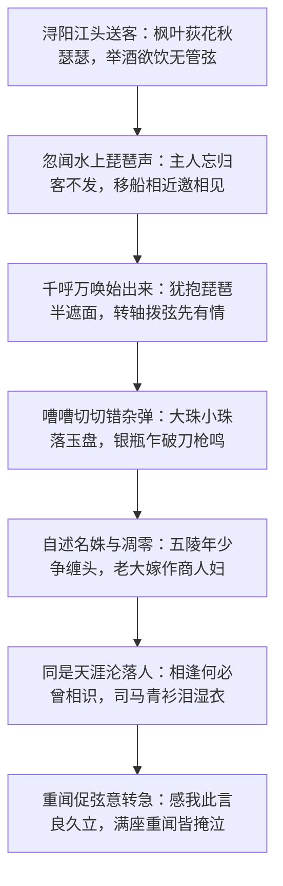

+++
title = '从“洗脚记”到“天涯沦落人”：《琵琶行》的千年回响'
date = '2026-09-28T00:55:00+08:00'
slug = 'baijuyi-pipa-xing'
draft = false
tags = ['白居易', '琵琶行', '古诗词', '唐诗', '网络梗']
+++

如果你经常刷短视频，大概率见过这个在评论区被频繁提起的段子——《琵琶行》被调侃成了“白居易洗脚记”。博主与段子手们把这首名垂青史的千古长诗解构成了一场“中唐文人的夜生活 Vlog”：浔阳江头、枫叶荻花、秋月冷照，一位怀抱琵琶的女子半遮半掩地弹拨倾诉，诗人听得涕泗横流、青衫尽湿。这幅古典凄绝的场景，被当代网友幽默地“平替”成了现代都市的“足疗与洗脚城”剧本。

玩笑归玩笑，但“洗脚记”这个网络热梗之所以能引爆全网、激起数以千万计的共鸣，恰恰因为它用最市井直白的视角，击中了这首诗**从俗世烟火到精神共振**的巨大张力。今天我们不妨就从这个现代热梗出发，重新走入白居易笔下那个真实、深沉而千年生生不息的文学世界。

<!-- more -->

---

## 一、一首被贬之人的“夜生活纪实”

要真正读懂《琵琶行》，首先必须还原元和十年长安城那个血雨腥风的清晨。

元和十年（815 年），唐宪宗力图削藩，平卢节度使李师道等割据势力铤而走险，派遣刺客潜入长安。六月三日清晨，主战派宰相武元衡在上朝途中遇刺身亡，身首异处；同为主战核心的御史中丞裴度亦遭伏击，头部重伤坠入水沟，险死还生。

暗杀事件震动朝野，文武百官人人自危、噤若寒蝉。而**时任太子左赞善大夫**的白居易心急如焚、义愤填膺，不顾个人安危率先上疏，直言请求皇上严令缉拿凶手、以雪国耻。

然而，这本是一腔孤勇的忠义之举，却成了政敌群起攻之的把柄。执政官僚以白居易官居东宫赞善大夫、“非谏官不当代言”为由，给他扣上了“越职言事”的罪名；紧接着，素来忌恨他的宿敌又翻出其旧作《赏花》《新井》二诗罗织罗网，借其母患病堕井身亡之事大做文章，诬陷他母亡仍吟花赋诗，“甚伤名教”，不宜立于朝廷。

在这场阴狠的政治围剿下，名动两京的大诗人先被贬为江州刺史，诏令未达又被追加重贬为**江州司马**。在唐代官制中，贬谪官员改任州司马，名义上是从五品下的州郡佐官，实质却是“投闲置散、有名无权”的闲职散官，地位边缘且形同政治软禁与流放。

元和十一年（816 年）秋，在湿热僻远的江州浔阳江头，白居易设酒送客。夜色苍茫，枫荻萧萧，正当主客相对无言、举酒欲饮而恨无管弦之时，水面上忽然传来了铮铮然的琵琶声。一场震颤千年的命运邂逅，就此拉开序幕：

## 二、“洗脚记”的梗到底是怎么来的？

当代短视频与社交网络对《琵琶行》的调侃，本质上是用消费主义与当代服务业的逻辑，对古典士人与乐伎的相遇进行了一场**降维解构**：

- **名角迟暮的“身世人设”**：琵琶女自述年轻时是京城名动一时的教坊头牌，“五陵年少争缠头，一曲红绡不知数”；然而“暮去朝来颜色故”，昔日捧场者散尽，“门前冷落鞍马稀”，最终只能委身嫁给“重利轻别离”的浮梁茶商，独自在冷江空船上熬过漫漫长夜。网友调侃：“这不就是足疗店资深技师跟你唠嗑‘当年我也风光过，后来遇人不淑’的标准话术吗？”
- **破防买单的“中年客人”**：白居易月夜听琴、推杯换盏，被一曲琵琶勾起伤心事，不仅慷慨题赠长诗，还当场哭得衣襟湿透。段子手于是打趣：“中年失意大叔在夜间消费场所被情绪价值精准击穿，感动得掏心掏肺，连底裤都被聊没了。”
- **病毒式的流量狂欢**：网络上相继涌现出“琵琶女如何五步攻破白居易心防”、“学不会《琵琶行》，去足浴城兼职三个月秒懂”等爆款段子，甚至连“江州司马青衫湿”都被戏称是“准备掏出钱包给赏钱的前兆”。

“洗脚记”这类戏谑的走红，并不意味着现代人缺乏对文学经典的尊重，而是当下互联网文化特有的**解构主义狂欢**——用粗粝、解嘲且极接地气的市井生活图景，击碎传统古文严肃高深的距离感，让年轻人一眼看透故事的冲突肌理。

## 三、解构之外：这首千古名篇到底绝在何处？

玩笑归玩笑，但倘若只停留在“洗脚记”式的粗浅调侃，便彻底错过了中国文学史上最巅峰的审美盛宴。**梗抓住的是身份境遇的表象类似，而诗真正穿越千年的，是人性困境与灵魂深处的同频共振。**

### 1. 声音描摹的通感天花板

在《琵琶行》之前，中国文学描写音乐多停留在抽象的赞叹；而白居易却以冠绝古今的通感修辞，将无形流动的旋律，化作了一幕幕具有强烈视觉、触觉冲击力的宏大交响：

> 大弦嘈嘈如急雨，小弦切切如私语。  
> 嘈嘈切切错杂弹，大珠小珠落玉盘。  
> 间关莺语花底滑，幽咽泉流冰下难。  
> 冰泉冷涩弦凝绝，凝绝不通声暂歇。  
> 别有幽愁暗恨生，此时无声胜有声。  
> 银瓶乍破水浆迸，铁骑突出刀枪鸣。  
> 曲终收拨当心画，四弦一声如裂帛。  
> 东船西舫悄无言，唯见江心秋月白。

从暴雨倾盆的嘈嘈轰鸣，到耳语低回的切切私语；从跳荡清脆的翡翠落盘，到水流咽阻的冰下冷泉；再到乐音凝滞时的屏息死寂、银瓶炸裂与铁骑奔突的高潮爆发，最终以“如裂帛”般的决绝手势戛然而止，只留下一江清寒秋月。整段描写节奏跌宕、收放自如，不仅是文字构筑的声音奇观，更是演奏者与倾听者内心风暴的具象外化。

### 2. “同是天涯沦落人”的精神互文

全诗最重千钧的灵魂，终究是那句传唱千古的**“同是天涯沦落人，相逢何必曾相识”**。

| 维度对比 | 戏谑的“洗脚记”解构 | 真实的《琵琶行》文学精神 |
| :--- | :--- | :--- |
| **场景本质** | 现代娱乐消费与情绪购买 | 贬谪绝境中的命运相遇与灵魂叩击 |
| **琵琶女角色** | 刻意兜售悲情以博取同情的艺人 | 曾登绝顶、繁华尽失后飘零江海的民间艺术家 |
| **白居易视角** | 意志薄弱、被话术套路的中年大叔 | 兼济天下却遭谗逐贬、满腹孤愤无处安放的落魄直臣 |
| **司马之泪** | 虚应故事的廉价自我感动 | 借他人酒杯浇胸中块垒，为共同受挫的生命尊严而哭 |

一个是长安教坊中名动公卿的艺坛名姝，随着朱颜辞镜而被冷酷的繁华弃若敝履，漂泊浔阳，独守空船；一个是曾立志“志在兼济、行在独善”、直言敢谏的天子诤友，因触怒豪强被无情放逐，困居僻州，青衫蒙尘。

二人的社会身份看似贵贱悬殊，但在“被时代的洪流无情抛弃、身不由己流落天涯”这一悲剧宿命面前，他们获得了精神层面的绝对平等。

白居易的眼泪，绝非居高临下的权贵怜悯，而是感同身受的自伤与悲悯——**他听的是琵琶女指尖流淌的命运哀鸣，哭的却是自己被腰斩的政治抱负与漂泊无依的零落半生。**

## 四、千年之后：解构狂欢背后的不朽生命力

“洗脚记”的流行，从反面印证了一个事实：《琵琶行》从未褪色为博物馆里的冰冷标本，它依然滚烫地流动在现代年轻人的精神生活里。

- **从“良久立”到现代共鸣**：“感我此言良久立，却坐促弦弦转急”在当下年轻人群体中屡屡刷屏。琵琶女听完白居易推心置腹的自白后，长久伫立无语，随后转身坐下将琴弦收得更紧、乐声催得更急——这一处长达千年的留白，被现代人敏锐地捕捉为“被这世上另一个人彻底读懂、击穿灵魂防线后的震撼与释放”；
- **全网传唱的高考战歌**：奇然、沈谧仁等人将《琵琶行》六百余字原文谱曲为古风音乐，全网播放量数以千万计。这首曾让无数考生背诵头疼的超长文言文，变成了课间循环的流行金曲，旋律一起，数以万计的年轻人能够脱口而出整篇名作；
- **自嘲背后的精神自洽**：生活在快节奏都市里的当代青年，面对职场卷舒与人生漂泊，天然反感说教，更习惯用无厘头、玩梗和自嘲来消解沉重。把《琵琶行》戏称为“洗脚记”，何尝不是当代“打工人”在面对生活不确定性时，一种苦中作乐的自我疗愈？

## 结语

一个荒诞幽默的网络热梗，把千年前的古诗拉进了现代人的弹幕与评论区；而一首底蕴深厚的长诗，又用永恒的艺术魅力，将浮躁的灵魂重新引渡回情感的深海。

白居易在浔阳江头的那场深夜对话，原本只是漫长贬谪岁月里的一曲偶遇，却因为一句“同是天涯沦落人”，在随后的千百载光阴中，温柔地拥抱了无数失意者、漂泊者与逆旅过客。

你可以把它当成“洗脚记”轻松一笑，也可以在某个失眠的夜里读它读到眼眶湿润——**伟大作品最动人的力量，正在于它既装得下市井人间最轻盈的调侃，又承载得起滚滚红尘中最沉重的命运。**

---

*历史背景说明：关于元和十年武元衡遇刺案、白居易时任太子左赞善大夫因直言被指“越职言事”并遭谗改贬江州司马等历史细节，均考据自《旧唐书·白居易传》及《新唐书》；文中所引《琵琶行》诗句以中华书局通用校本为准。*
