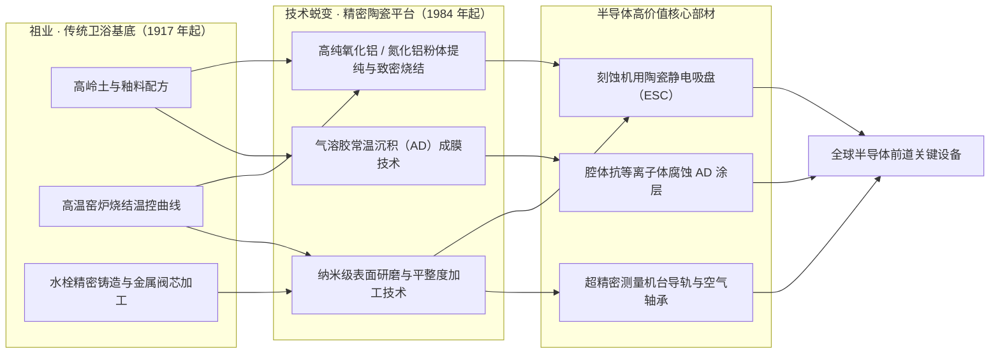
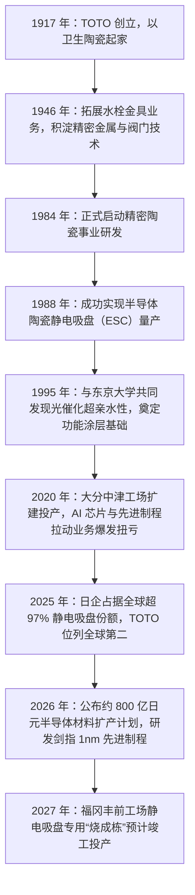

+++
title = '从马桶到芯片：卫浴巨头 TOTO 的半导体陶瓷生意'
date = '2026-09-28T00:30:00+08:00'
slug = 'toto-semiconductor-ceramics'
draft = false
tags = ['TOTO', '半导体', '精密陶瓷', '静电吸盘', '先进陶瓷', '隐形冠军']
+++

提到 TOTO，多数人的第一反应是智能马桶和高端卫浴。但这家 1917 年创立、做了一百多年卫生陶器的日本百年品牌，如今正悄然站在全球 AI 半导体产业链的关键位置——它生产的静电吸盘等先进陶瓷部件，已成为全球先进制程芯片制造设备不可或缺的“隐形心脏”。

2025 财年（截至 2026 年 3 月），TOTO 的先进陶瓷业务虽然仅贡献了集团约 9% 的营业收入，却贡献了**超过一半的营业利润**。一家以“马桶”闻名天下的传统卫浴企业，如何在硬核的芯片制造赛道里逆袭成为集团的利润支柱？这个故事，要从“陶瓷”这门手艺的深层演化说起。

<!-- more -->

---

## 一、一家“马桶公司”的另一重硬核身份

TOTO 涉足半导体领域，并非一时兴起的跨界噱头。公司早在 1917 年创立于日本福冈县北九州市，祖业是卫生陶器（马桶、面盆等），1946 年又开拓了水栓金具（水龙头、阀门及精密流体控制）业务。这两门传统生意看似与芯片制造相距甚远，却在长达数十年的积累中，共同沉淀出了 TOTO 真正的核心护城河——**高纯度陶瓷的粉体配方、烧结工艺与超高精密加工能力**。

- **1984 年**：TOTO 正式立项启动精密陶瓷（Fine Ceramics）事业；
- **1988 年**：率先实现半导体陶瓷静电吸盘（Electrostatic Chuck，ESC）的商业化量产；
- **1995 年**：与东京大学合作发现光催化超亲水性效应，奠定了功能性陶瓷表面涂层的基础。

由于精密陶瓷研发周期长、工艺门槛极高，且早年半导体设备市场规模相对有限，这项业务在初期曾经历长达数十年的亏损与蛰伏。真正的转折点出现在 2020 年前后——全球 5G、AI 算力爆发，先进制程与 3D 堆叠技术对设备材料的要求呈指数级提升，半导体设备迎来了超级景气周期，TOTO 沉淀四十载的陶瓷业务一跃成为集团盈利能力最强的支柱板块。

## 二、为什么先进制程芯片制造离不开陶瓷？

芯片制造被誉为“在极其苛刻的物理与化学极限下进行纳米级雕刻”的工业皇冠。硅晶圆在刻蚀（Etch）、薄膜沉积（CVD/PVD）、离子注入等核心前道工艺中，必须经受**极端高温、强腐蚀性等离子体轰击以及超高电压绝缘**的严苛考验。

在此类环境下，常规的金属合金会发生化学腐蚀与金属离子析出，塑料聚合物则难以耐受高温与等离子体，甚至会释放挥发物污染晶圆。因此，“先进陶瓷”（Advanced Ceramics）成为了半导体制造设备反应腔体核心零部件的唯一选择。

TOTO 的先进陶瓷产品主要聚焦于三大核心领域：

| 产品分类 | 核心用途 | 核心技术优势与壁垒 |
| :--- | :--- | :--- |
| **静电吸盘（ESC）** | 在晶圆等离子体刻蚀等关键工序中吸附固定硅片 | 强静电吸附力、极佳耐等离子体腐蚀性、背面颗粒零污染控制 |
| **AD 部材（涂层）** | 半导体设备腔体内部高耐磨、耐腐蚀防护涂层 | 独创气溶胶沉积法（AD 工艺），常温常压喷射致密无缝陶瓷涂层 |
| **工程结构部材** | 曝光机、光罩检查、超精密测量装置的高刚性部件 | 超高致密度烧结、大型复杂结构一体成型与纳米级抛光 |

其中，**静电吸盘（ESC）**是 TOTO 最具杀伤力的拳头产品：
- **纳秒级吸附与极限平整**：ESC 利用库仑力或约翰森-拉贝克效应（Johnsen-Rahbek Effect），在真空腔体中平整吸附晶圆，平整度误差要求控制在纳米级别；
- **严苛环境下的耐久性**：在等离子体照射腐蚀对比试验中，TOTO 采用高纯度、高致密度烧结体的 ESC 连续运行 30 小时后表面依然平滑无损，而普通竞品已出现严重坑蚀与颗粒剥落；
- **高良率保障**：对晶圆代工厂和半导体设备巨头而言，更低的部件损耗意味着更长的腔体维护周期、更低的停机成本以及显著提升的芯片良品率。

此外，TOTO 独创的 **AD 工艺（气溶胶沉积法，Aerosol Deposition）** 更是材料界的一绝：它能够利用常温亚微米陶瓷粉末的高速撞击，在基材表面直接形成致密的纳米晶防护层，彻底摒弃了传统千度高温烧结对精密金属基底的热变形伤害，满足了芯片制造对耐高温、耐腐蚀与绝缘性的多重极限需求。

## 三、技术同源：百年卫浴陶瓷与纳米芯片的底层逻辑

很多人以为“做马桶”与“做芯片”风马牛不相及，但从材料科学的角度来看，二者存在着极其深厚的**技术同源性**。卫浴陶瓷百年沉淀下来的原料提纯配方、高温窑炉烧成曲线控制以及模具成型经验，经过四十年的高精尖研发演进，最终蝶变成支撑半导体制造的精密技术基底：

从传统卫浴的“防止污垢附着、保持坚硬釉面”，到半导体陶瓷的“防止微粒脱落、抗离子轰击”，其背后的物理化学本质皆是**表面科学与致密微观结构控制**。TOTO 正是通过这条技术迁移路径，将看似平凡的传统陶瓷手艺，淬炼成了卡位先进制程的杀手锏。

## 四、日本主导格局下的“隐形冠军”

半导体静电吸盘属于典型的技术与资本密集型高壁垒赛道，全球市场长期被日本精密制造企业垄断。根据 TOTO 财报引述富士经济（Fuji Chimera Research）的行业统计数据：**2025 年全球静电吸盘出货量中，日本企业占据了超过 97% 的压倒性份额，TOTO 稳居全球第二**。

- **高度集中的寡头格局**：全球排名前五的大厂——新光电气（SHINKO）、日本碍子（NGK Insulators）、TOTO、京瓷（Kyocera）、日本特殊陶业（NTK CERATEC）——合计占据了全球约 76%~77% 的市场份额；
- **全球产能分布**：2025 年全球约 84.68% 的静电吸盘产自日本本土，中国大陆本土产量仅占约 0.83%（年产约 482 件）；
- **深厚专利护城河**：自 1995 年以来，TOTO 在全球半导体静电吸盘领域的专利申请总量长年稳居**全球第一**。

除了日本同行外，全球市场参与者还包括美国 Entegris、应用材料（Applied Materials）、泛林集团（Lam Research）以及日本住友大阪水泥等。在高端 3D 存储芯片及先进制程逻辑芯片的关键刻蚀工艺环节，TOTO 已构筑起极为牢固的技术与客户协同壁垒。

## 五、AI 浪潮下的业绩爆发与“利润奶牛”

在近年的半导体产业上升周期中，先进陶瓷业务展现出了惊人的盈利爆发力，彻底颠覆了 TOTO 原有的盈利模型。

**2025 财年（截至 2026 年 3 月）核心经营数据：**

- **集团整体稳健**：全集团实现营收 **7374 亿日元**（同比增 2%），营业利润 **538 亿日元**（同比增 11%），营收与利润均创历史新高；
- **陶瓷板块爆发**：以半导体陶瓷为主的“新领域事业”实现营收 **674 亿日元**（同比大增 34%），营业利润达 **289 亿日元**（同比暴增 85 亿日元），**营业利润率高达惊人的 43%**；
- **利润结构逆转**：先进陶瓷业务虽然仅占集团总营收的 **9% 左右**，却贡献了全集团**超过 50% 的营业利润**；相比之下，占集团营收约 65% 的日本传统住宅设备业务，营业利润率仅约 4.2%；
- **未来指引强劲**：进入 2026 财年，TOTO 预计陶瓷板块营收将进一步跃升至 **855 亿日元**（+27%），营业利润预期达到 **365 亿日元**（+27%）。

这一爆发背后的深层动力，来自于全球晶圆厂设备投资（WFE）与先进制程架构升级的双重红利：
1. **AI 逻辑芯片与前道设备扩张**：TOTO 测算，在 2025 至 2031 年间，全球前道晶圆制造设备市场中，逻辑芯片设备规模将扩大至当前的 **1.7 倍**，存储芯片设备规模将**实现翻倍**；
2. **高频耗材属性带来的稳定复购**：以 3D NAND 为例，当前行业主流堆叠层数正从 300~400 层迈向 2030 年的 1000 层。极深孔的纵向高深宽比刻蚀需要在极低温、高能量环境下进行，导致零部件磨损加速。静电吸盘不仅伴随新设备出货，更在晶圆厂运行中呈现出显著的高频消耗品属性。近年来，**存量设备替换需求在 TOTO 陶瓷业务中的占比持续走高**，有效对冲了半导体周期性波动的风险。

## 六、重金扩产：研发剑指 1nm 极限

为了全面抢占 AI 芯片先进制程的材料红利，TOTO 正在掀起历史上规模最大的半导体材料投资扩产热潮：

- **产能攻坚**：2026 年 4 月，TOTO 宣布对神奈川县茅崎工场（研发中心）、大分县中津工场以及福冈县丰前工场投入约 **300 亿日元**的设备资本开支。其中，丰前工场专攻静电吸盘的“烧成栋”新厂房已于 2025 年 12 月破土动工，计划于 **2027 年 1 月竣工投产**；
- **追加 800 亿日元长远规划**：据日经亚洲 2026 年 6 月报道，TOTO 针对半导体材料业务的长期资本支出规划进一步提升至到 2030 年 3 月期累计约 **800 亿日元**（约合 33.7 亿元人民币）。其中 390 亿日元已进入落地执行阶段，后续将根据全球市场供需分期追加；若产能依旧告急，还将规划选址新建生产基地；
- **技术极限突破**：在研发端，茅崎工场正集中攻关适配下一代极紫外（EUV）光刻与原子级刻蚀的配套先进材料，**目标直指 1 纳米（1nm）级的电路线宽工艺**；
- **满产保供**：目前，大分中津工场与福冈丰前工场的陶瓷产线均处于 100% 满负荷运转状态，新建产能正加紧调试以满足全球芯片大厂的紧急订单。

## 七、盛景背后的风险与暗礁

尽管在半导体赛道风光无两，硬币的另一面，TOTO 依然面临着不可忽视的结构性挑战：

- **下游集中度与行业强周期**：先进制程静电吸盘高度绑定阿斯麦（ASML）、泛林（Lam Research）、东京电子（TEL）、应用材料（AMAT）等少数几家全球半导体设备寡头，一旦消费电子复苏放缓或晶圆厂资本开支收缩，陶瓷业务的盈利弹性可能遭受反噬；
- **1nm 制程的技术验证壁垒**：从 2nm 向 1nm 甚至亚纳米逼近，材料的晶粒微观缺陷、热膨胀匹配容差几近物理极限，研发周期的拖长与验证风险依然存在；
- **中国大陆产业链的国产替代**：随着半导体设备关键零部件本土化提速，中国大陆企业在氮化铝（AlN）、高纯氧化铝（Al₂O₃）等高导热及耐等离子体先进陶瓷领域快速追赶，包括苏州珂玛科技、富创精密、江丰电子等领军企业正加速切入国产晶圆厂供应链。目前日本虽然占据了中国大陆 ESC 进口约 86% 的绝对份额，但中长期国产替代的趋势不可逆转；
- **双轨业务结构的失衡挑战**：先进陶瓷业务虽贡献了过半利润，但整体营收占比仍不足一成。在日本本土老龄化以及海外传统卫浴地产周期低迷的拖累下，卫浴主业如何维持健康现金流，依然是 TOTO 集团需要平衡的必答题。

## 结语

TOTO 从“卫浴巨擘”向“半导体隐形冠军”的跃升，为全球传统制造业的智能化、高端化转型提供了一份堪称教科书式的样本。

一家专注马桶与卫浴一百余年的传统制造企业，并未盲目跟风追逐互联网热潮，而是耐心守护并深挖自己的“陶瓷”基因，用长达四十年的研发长跑将传统工艺升华为尖端技术平台，最终在 AI 算力的大时代里，成为了扼守芯片产业链良率命门的隐形巨头。

它的历程印证了一个朴素的商业真理：**所谓硬核壁垒，往往藏在日复一日磨砺的传统工艺深处；而最成功的跨界，从来不是丢弃本业的盲目转舵，而是让历经岁月沉淀的核心工艺在全新的时代赛道上绽放出惊人的生命力。**

---

*参考与数据来源：TOTO 官网新闻稿与决算说明资料、日经亚洲（Nikkei Asia）、富士经济（Fuji Chimera Research Institute）《半导体材料市场年鉴》、中证金牛座等行业研报。文中投资金额（300 亿 / 800 亿日元）分属“已决算执行”与“长期整体计划”统计口径。*
