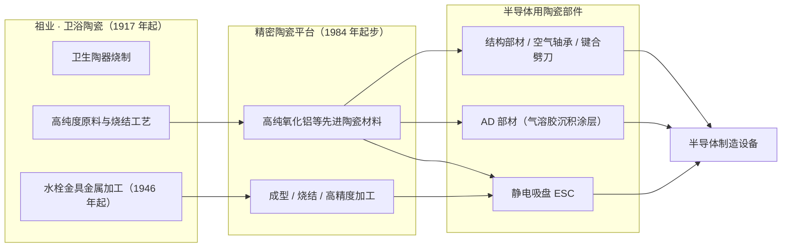
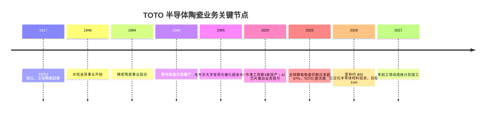

+++
title = '从马桶到芯片：卫浴巨头 TOTO 的半导体陶瓷生意'
date = '2026-09-28T00:30:00+08:00'
slug = 'toto-semiconductor-ceramics'
draft = false
tags = ['TOTO', '半导体', '精密陶瓷', '静电吸盘', '先进陶瓷', '隐形冠军']
+++

提到 TOTO，多数人的第一反应是智能马桶和高端卫浴。但这家 1917 年创立、做了 100 多年卫生陶器的日本企业，如今正悄然站在 AI 半导体产业链的关键位置——它生产的静电吸盘等陶瓷部件，是全球先进芯片制造设备不可或缺的"隐形心脏"。

2025 财年（截至 2026 年 3 月），TOTO 的先进陶瓷业务只贡献了集团约 9% 的营收，却贡献了**超过一半的营业利润**。一家"马桶公司"如何在芯片生意里翻身成为利润支柱？这个故事要从"陶瓷"这门手艺说起。

## 一、一家"马桶公司"的另一半身份

TOTO 的半导体业务并非心血来潮的跨界。公司 1917 年在福冈县北九州市创立，祖业是卫生陶器（马桶、洗手盆等），1946 年又进入水栓金具（龙头阀门）领域。这两门生意听起来和芯片毫无关系，却共同沉淀出了 TOTO 真正的底牌——**高纯度陶瓷的原料、烧结与精密加工能力**。

- 1984 年，TOTO 正式启动精密陶瓷事业；
- 1988 年，开始量产陶瓷静电吸盘（Electrostatic Chuck，ESC）；
- 1995 年，与东京大学共同发现光催化超亲水性，奠定了功能性陶瓷涂层的基础。

由于市场规模有限、培育周期长，这项业务早年长期亏损。真正的转折点出现在 2020 年前后——AI 芯片需求爆发，半导体设备进入超级景气周期，半导体相关陶瓷业务一跃成为 TOTO 最赚钱的板块。

## 二、为什么芯片制造离不开陶瓷？

芯片制造是"在极其苛刻环境下进行纳米级加工"的产业。晶圆在刻蚀（Etch）、沉积（CVD/PVD）、离子注入等环节中，要面对**高温、强腐蚀性等离子体、高压绝缘**的严酷环境。普通金属和塑料根本撑不住，于是"先进陶瓷"成了半导体设备内部零部件的首选材料。

TOTO 的先进陶瓷产品主要分三大类：

| 产品 | 用途 | 技术要点 |
| --- | --- | --- |
| **静电吸盘（ESC）** | 晶圆刻蚀等关键工艺中固定硅片 | 静电吸附、耐等离子体、低背面颗粒污染 |
| **AD 部材** | 半导体设备内耐高温耐腐蚀涂层 | 气溶胶沉积法（AD 工艺）常温喷射致密陶瓷涂层 |
| **工程陶瓷 / 结构部材** | 超高精密加工、测量与检查装置 | 高致密度烧结、大型成型（如 LCD 设备用） |

其中**静电吸盘**是 TOTO 最核心的产品：它通过静电吸附力把晶圆牢牢固定在加工台上，精度直接决定芯片良率。TOTO 的 ESC 采用高纯度、高致密度的陶瓷烧结体制造，在等离子体照射试验中，运行 30 小时后表面仍保持平整致密，而普通产品已出现明显腐蚀和损伤——对设备厂和晶圆厂来说，这意味著更高良率、更少停机、更低维护成本。

而 AD 工艺（气溶胶沉积）则是 TOTO 的独门绝技：把超细陶瓷颗粒直接喷射成致密涂层，无需高温烧结，就能满足芯片制造对耐高温、耐腐蚀、高绝缘的严苛要求。

## 三、技术同源：从卫浴陶瓷到半导体陶瓷

很多人以为马桶和芯片是两条平行线，但 TOTO 恰恰证明了二者**技术同源**。卫浴陶瓷积累的原料配方、烧结窑炉、成型工艺，经过四十年迭代，演化成了支撑半导体的精密陶瓷平台：

正是这种"从陶瓷到芯片"的技术迁移路径，让 TOTO 得以用 100 多年烧马桶的手艺，烧出决定先进芯片良率的精密零件。

## 四、日本垄断下的"隐形冠军"

静电吸盘市场长期被日本企业主导，TOTO 是其中的核心玩家。根据 TOTO 决算报告援引富士经济（Fuji Chimera）的数据：**2025 年全球静电吸盘出货量中，日本企业份额超过 97%，TOTO 位居全球第二**。

- 前五大厂商——新光电气（SHINKO）、日本碍子（NGK Insulators）、TOTO、京瓷（Kyocera）、日本特殊陶业（NTK CERATEC）——合计占据约 76%~77% 的市场份额；
- 2025 年日本生产了全球约 84.68% 的静电卡盘，中国本土仅生产约 482 件（占比 0.83%）；
- TOTO 是 1995 年以来**全球静电吸盘专利申请量第一**的企业。

其他参与者还包括美国的 Entegris、应用材料（Applied Materials）、泛林集团（Lam Research），以及日本的住友大阪水泥等。在部分高端存储芯片制造细分赛道，TOTO 已建立起相对牢固的技术壁垒。

## 五、AI 时代的业绩爆发

过去几年，半导体陶瓷业务成了 TOTO 名副其实的"利润奶牛"。

**2025 财年（截至 2026 年 3 月）关键数据：**

- 集团营收 **7374 亿日元**（同比 +2%），营业利润 **538 亿日元**（同比 +11%），营收与利润双双创历史新高；
- 其中先进陶瓷（"新领域事业"）营收 **674 亿日元**（+34%），营业利润 **289 亿日元**（同比增加 85 亿日元），**营业利润率高达 43%**；
- 该业务仅占集团营收约 9%，却贡献了**超过 50% 的营业利润**；相比之下，占集团营收约 65% 的日本住宅设备业务，营业利润率仅约 4.2%；
- 展望 2026 财年，TOTO 预计陶瓷业务营收增至 **855 亿日元**（+27%），营业利润 **365 亿日元**（+27%）。

驱动逻辑来自半导体设备（WFE）的长期扩张：TOTO 测算 2025—2031 年全球前道制造设备市场中，逻辑芯片设备规模有望增长至当前的 **1.7 倍**，存储芯片设备规模有望**翻倍**。

更值得注意的是静电吸盘的"耗材"属性。以 3D NAND 为例，当前主流产品层数约 300—400 层，行业预计到 2030 年将迈向 1000 层——层数增加意味着刻蚀要在更低温、更复杂的环境下做更深更精密的加工，对零部件耐久性要求更高。因此 ESC 的需求不仅来自新增设备，还来自存量设备高频更换。近年来**替换需求在陶瓷业务收入中的占比持续提高**，即便行业资本开支周期波动，也能提供相对稳定的收入来源。

## 六、大手笔扩产：目标直指 1nm

为抓住 AI 浪潮，TOTO 正大幅加码半导体材料投资。

- 2026 年 4 月 30 日，TOTO 宣布在茅崎工场（研发）、中津工场、丰前工场三处据点，2028 财年前完成约 **300 亿日元**的设备投资；其中丰前工场的静电吸盘"烧成栋"已于 2025 年 12 月开工，计划 **2027 年 1 月竣工**；
- 据日经亚洲 2026 年 6 月报道，整体投资计划进一步扩大为到 2030 年 3 月期累计约 **800 亿日元**（约合 33.7 亿元人民币），其中 390 亿日元已敲定，其余将视行情分批落地；若产能仍不足，TOTO 还考虑新建工厂；
- 研发端，位于神奈川县的茅崎工场正集中研发适配逻辑芯片生产的配套材料，**目标实现 1 纳米级的电路线宽**——作为参考，全球最大晶圆代工厂台积电目前刚实现 2 纳米先进逻辑芯片的量产；
- 产能端，大分县中津工场与福冈县丰前工场当前均已满负荷运转，新增设备正在扩充产能。

## 七、风险与挑战

硬币的另一面，TOTO 的半导体野心也伴随着结构性风险：

- **周期与集中度**：半导体设备是强周期行业，而静电吸盘高度绑定少数全球设备大厂，需求波动会直接冲击营收；
- **技术与客户壁垒**：1nm 级材料研发周期长、验证门槛高，能否如期兑现仍存不确定性；
- **国产替代**：中国大陆本土企业已在氧化铝（AlN）等先进陶瓷方向发力，如江丰电子、上海新阳、苏州珂玛材料等，静电吸盘国产化窗口正在打开。目前日本合计占中国 ESC 进口份额约 86%，但替代趋势值得关注；
- **主业依赖**：陶瓷业务虽贡献过半利润，但其营收占比仍不足一成，公司整体增长仍受卫浴主业周期制约。

## 结语

TOTO 的故事，是"传统制造升级为隐形冠军"的典型样本：一家做马桶的公司，把 100 多年的陶瓷手艺沉淀成平台，在 AI 时代切入半导体供应链，成了决定芯片良率的隐形玩家。它的经验告诉我们——**真正的壁垒往往藏在不起眼的传统工艺里**，而跨界的本质，是让沉淀多年的核心技术在新赛道上重新变现。

---

*参考与数据来源：TOTO 官网新闻稿与决算资料、日经亚洲（经电子工程专辑转引）、中证金牛座、富士经济等。文中投资金额（300 亿 / 800 亿日元）分属"已决定"与"整体计划"口径，已按来源分别标注。*
