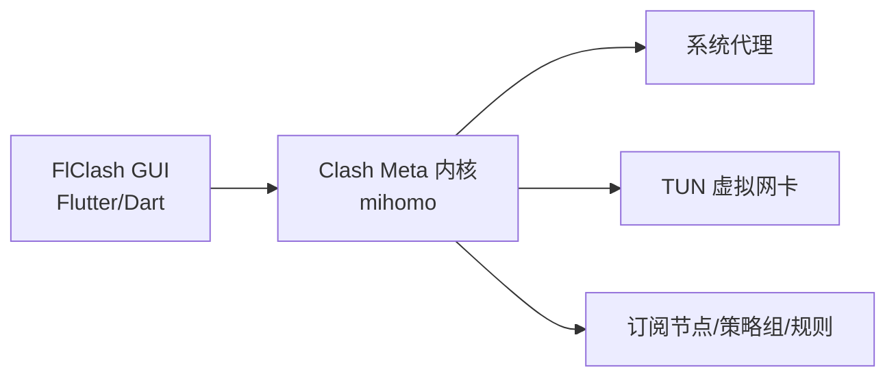
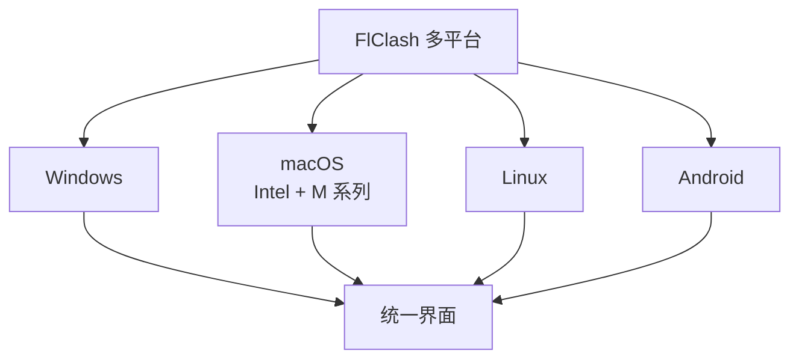
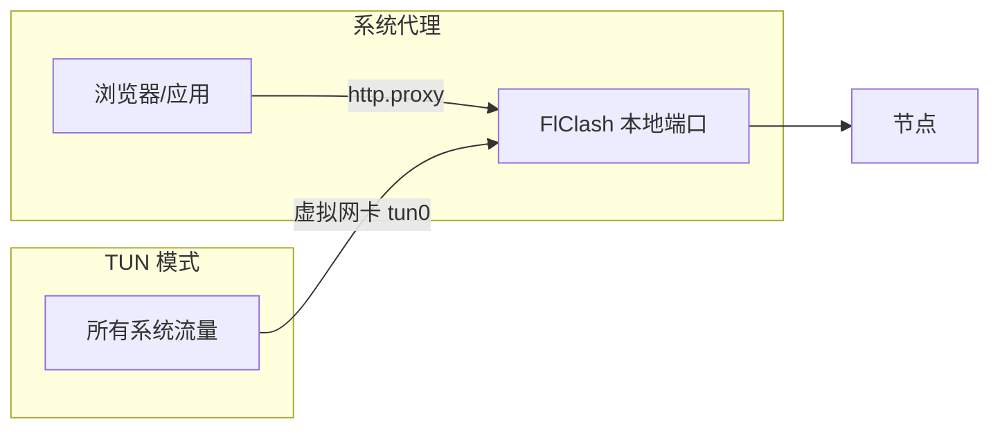
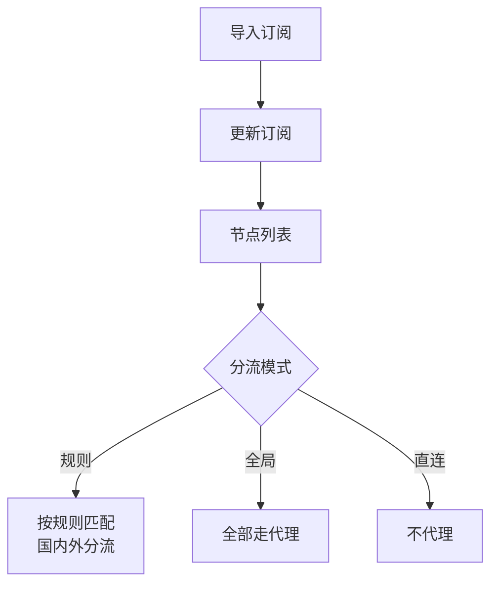

+++
date = '2026-09-29T02:10:00+08:00'
slug = 'flclash-guide'
draft = false
title = 'FlClash 完全指南：基于 Clash Meta 的多平台代理客户端'
tags = ['flclash', 'proxy', 'clash', 'network']
+++

Clash 生态的客户端很多，但能把"跨平台统一体验 + 开源免费无广告 + 现代界面"同时做到位的，FlClash 是相当有代表性的一款。这篇讲透 FlClash——从它是什么、支持哪些协议，到安装、导入订阅、TUN 模式与 WebDAV 多端同步，一份指南全覆盖。

<!-- more -->

## FlClash 是什么

FlClash 是一款**基于 Clash Meta（mihomo）内核**的多平台网络代理客户端，由开发者 chen08209 维护，采用 **Material You** 设计语言，界面类似 Surfboard。核心定位一句话：

> 开源、免费、无广告，Android / Windows / macOS / Linux 一套界面、体验完全一致。



### 基本信息速览

| 项目 | 说明 |
|------|------|
| 最新版本 | **v0.8.94**（2026-07-30）|
| 内核 | Clash Meta（mihomo）|
| 平台 | Windows、macOS（Intel + Apple Silicon）、Linux、Android |
| 语言 | Dart（Flutter）|
| 许可证 | GPL-3.0（开源免费）|
| 源码 | github.com/chen08209/FlClash |
| 特色 | 无广告、无注册、WebDAV 同步、TUN 模式 |

## 一、核心特性

### 1.1 全平台统一体验

FlClash 在 Windows、macOS、Linux、Android 四端的界面与交互完全一致，一套配置逻辑到处通用，且自适应多种屏幕尺寸、提供多套配色主题、支持深色模式。



### 1.2 强大的协议支持

基于 mihomo 内核，FlClash 原生支持绝大多数主流代理协议：

| 协议 | 说明 |
|------|------|
| Shadowsocks / SS-2022 | 经典加密协议 |
| VMess / VLESS | V2Ray 系协议 |
| VLESS-Reality / VLESS-Vision / VLESS-XTLS | VLESS 衍生 |
| Trojan | 经典 TLS 伪装 |
| Hysteria / Hysteria2 | 基于 UDP/QUIC 的高速协议 |
| TUIC / XHTTP | 基于 QUIC / HTTP 的新型协议 |
| WireGuard | VPN 隧道协议 |
| Snell / SSH / SOCKS | 其他常见协议 |

### 1.3 配置与同步

- **订阅一键导入**：粘贴订阅链接即可，支持多个订阅；
- **WebDAV 数据同步**：配置、订阅、规则可跨设备同步，一套配置多端复用；
- **自定义覆盖（overwrite）**：v0.8.93 起支持，可精细覆盖内核配置；
- **自定义 global-ua**：v0.8.94 起可自定义 User-Agent，适配不同订阅服务商的校验要求。

## 二、代理模式：系统代理 与 TUN

FlClash 提供两种接管流量的方式：

| 模式 | 原理 | 适用 |
|------|------|------|
| 系统代理 | 设置 HTTP/HTTPS 系统代理，仅接管走代理的应用 | 大部分日常场景，轻量 |
| TUN 模式 | 创建虚拟网卡，接管全部系统流量 | 需要全局接管、命令行工具、游戏等 |



> TUN 模式下无需为每个应用单独配置代理，网络层即接管全局流量，适合对不遵守系统代理的应用、终端命令等场景。

## 三、为什么选 FlClash

同类 Clash 客户端不少，FlClash 的差异化优势：

| 维度 | FlClash | 说明 |
|------|---------|------|
| 开源免费 | ✅ GPL-3.0，无广告 | 代码透明可审计 |
| 平台覆盖 | Android + 桌面三端 | 移动端也原生支持 |
| 界面 | Material You，现代化 | 颜值在线，上手直观 |
| 同步 | WebDAV | 多设备配置同步 |
| 隐私 | 无注册、无追踪 | 本地运行 |

## 四、安装

### Windows

```powershell
# 从 GitHub Releases 下载安装版（或便携版放 U 盘）
# 官方仓库：github.com/chen08209/FlClash/releases
```

多数用户选安装版；需要免安装或放 U 盘时选便携版即可。

### macOS

从 GitHub Releases 下载对应芯片（Intel / Apple Silicon）的安装包，或使用 Homebrew：

```bash
# 如仓库已提供 cask
brew install --cask flclash
```

### Linux

下载对应架构的包（deb / rpm / AppImage 等），按发行版安装：

```bash
# AppImage 示例
chmod +x FlClash-*.AppImage
./FlClash-*.AppImage
```

### Android

GitHub Releases 下载 APK，或通过应用商店渠道安装。

> 建议优先从 **GitHub 官方仓库** 下载，避免第三方分发站篡改。注意甄别来源，勿安装来路不明的 APK/安装包。

## 五、基础使用

### 5.1 导入订阅

1. 打开 FlClash → 订阅管理；
2. 粘贴订阅链接，一键导入；
3. 更新订阅，节点列表刷新。

### 5.2 选择节点与模式

- **节点**：订阅内按需切换，支持测速、延迟测试；
- **策略组/规则**：基于规则分流（国内直连、国外走代理等）；
- **模式**：规则 / 全局 / 直连 三类，按场景切换。



### 5.3 开启系统代理 / TUN

在设置中开启系统代理或 TUN 模式后，即可正常访问。首次开启 TUN 通常需要授予管理员/网络权限。

## 六、版本要点（近期更新）

| 版本 | 日期 | 要点 |
|------|------|------|
| v0.8.94 | 2026-07-30 | 修复 macOS 性能问题；支持自定义 global-ua；更新内核；修复 Linux 静默启动 |
| v0.8.93 | 2026-06-25 | 支持自定义覆盖（overwrite）；支持按需运行；优化 Windows IPC 与 ARM64 |
| v0.8.92 | 2026-02-02 | 常规优化与细节修复 |

FlClash 保持较快的迭代节奏，持续跟进 mihomo 内核更新，值得保持版本跟进。

## 七、常见问题排查

| 症状 | 原因/对策 |
|------|-----------|
| 导入订阅失败 | 检查链接是否有效、是否需要自定义 User-Agent，改用 v0.8.94+ 的 global-ua |
| TUN 无法开启 | 需管理员/网络权限；Windows 检查服务，macOS 检查系统扩展授权 |
| 多端配置不一致 | 开启 WebDAV 同步并确保各端登录同一存储 |
| 订阅更新后节点消失 | 订阅服务商侧配置变动，重新更新或检查覆盖设置 |
| 速度不稳定 | 切换节点、开启 TUN、检查 UDP 支持（Hysteria/QUIC 类协议）|

## 八、安全与合规提醒

- **来源安全**：请只从 GitHub 官方 Releases 下载，第三方站点可能捆绑/篡改；
- **授权范围**：使用代理能力请遵守所在地区法律、企业网络使用政策及服务商条款；
- **隐私**：FlClash 本地运行、无注册无追踪，但请勿在不可信节点上传输敏感凭据。

## 总结

FlClash 用一个词概括：**均衡**——开源免费无广告、四端统一、协议覆盖全、还有 WebDAV 同步，尤其适合同时使用手机和电脑的用户。

| 平台 | 安装来源 | 特点 |
|------|----------|------|
| Windows | GitHub Releases（安装/便携版）| ARM64 优化 |
| macOS | GitHub Releases / Homebrew | Intel + M 系列 |
| Linux | deb/rpm/AppImage | 多发行版 |
| Android | GitHub Releases APK | 原生移动端 |

**上手建议**：先导入订阅 → 规则模式日常使用 → 需要全局接管再开 TUN → 多设备则配置 WebDAV 同步。开源可审计，用着放心。
