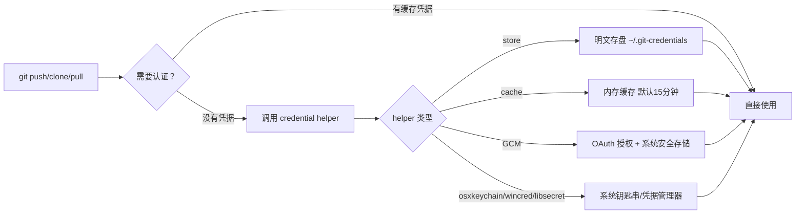
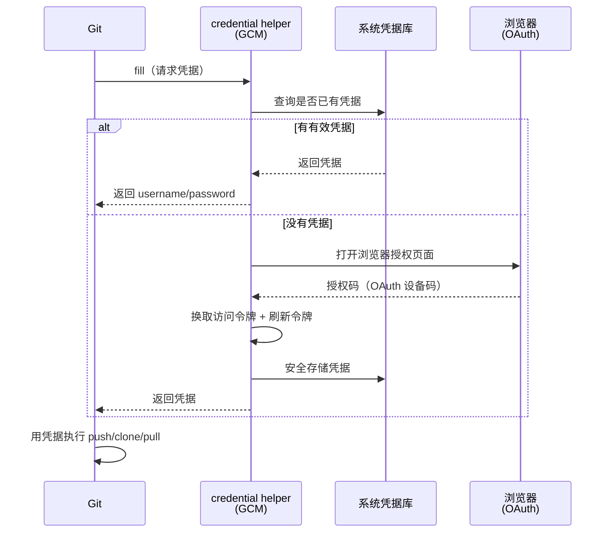
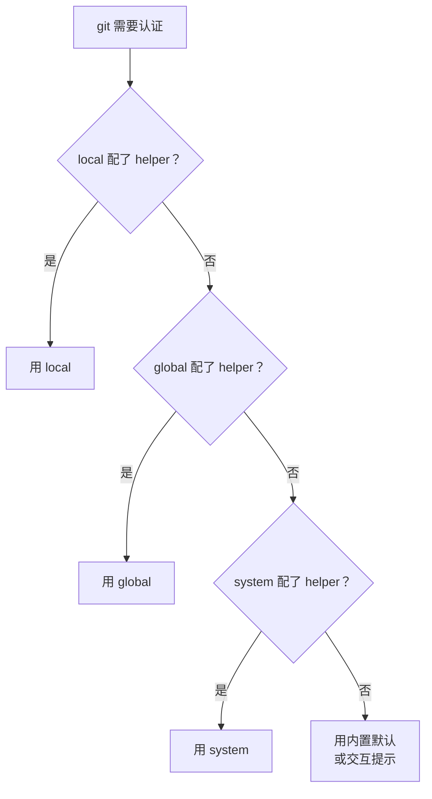
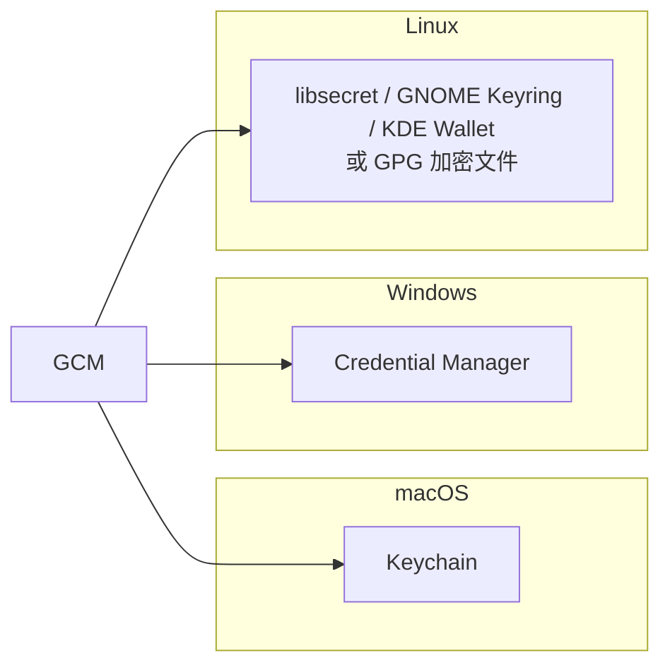

+++
date = '2026-09-29T01:32:00+08:00'
slug = 'git-credential-manager'
draft = false
title = 'Git Credential Manager（GCM）完全指南'
tags = ['git', 'credential', 'authentication', 'github']
+++

每次 `git clone` 都要输一次用户名密码，还动不动就 401 或者反复弹窗？这篇文章讲透 Git Credential Manager（GCM）——微软开源、跨平台的 Git 凭据管理器，从原理到安装配置再到故障排查，一份指南全覆盖。

<!-- more -->

## 为什么要关心 Git 凭据

Git 用 HTTPS 协议访问 GitHub、GitLab 等平台时，本质上就是一次 HTTP 认证。认证信息（用户名 + 密码 / Token / OAuth）怎么保存、怎么复用，是每个 Git 用户都绕不开的问题：

- **裸存**：密码明文写在配置里，或每次手动输入——既不安全也不省事。
- **Git 内置的 credential helper**：`store`（明文存盘）、`cache`（内存缓存）等，功能单一。
- **专用凭据管理器**：GCM 是其中的集大成者，能安全存储凭据，还替你走完整的 OAuth 授权流程。



## 一、GCM 是什么

Git Credential Manager（GCM）是微软维护的**开源、跨平台** Git 凭据助手，基于 .NET 构建。它的核心价值：

- 支持 GitHub、Azure DevOps、Bitbucket、GitLab 及通用 HTTP 认证；
- 用 **OAuth / OAuth 2.0 设备授权**代替手动输入，首次会打开浏览器，后续在后台静默刷新；
- 凭据安全存储在系统级凭据库（macOS 钥匙串、Windows 凭据管理器、Linux secret service 或 GPG 加密文件）；
- 内置 SSH 能力（SSH 密钥生成与 SSH 签名）。

### 历史沿革

GCM 的命名经历了几次更迭，很多人被旧名词搞晕：

| 时期 | 名称 | 说明 |
|------|------|------|
| 早期 | Git Credential Manager **for Windows** | 仅 Windows，凭密码/TFVC 方式认证，**不支持 OAuth**，已停止维护 |
| 2020 起 | Git Credential Manager **Core**（GCM Core） | 重写为跨平台，配置键是 `credential.helper=manager-core` |
| 2021 起 | Git Credential Manager（GCM） | 去掉 "Core"，跨平台，配置键是 `credential.helper=manager` |

> 老版本 "Git Credential Manager for Windows" 已不再支持，且无法通过 GitHub 的 OAuth 连接，请务必升级到最新 Git for Windows / GCM。

### 版本现状（截至 2026-09）

- GCM 当前稳定版本 **v2.9.1**（2026-07 发布），v2.8.0（2026-05）随 Git for Windows v2.55.0 分发；
- v2.7.0（2026-01）是"周年版本"，带来原生 **x64 / ARM64** 二进制；
- v2.9.x 是**最后支持 Windows 7 / 8.x** 的大版本，后续 v3.0 将从 .NET Framework 迁移到 .NET Core。

## 二、工作原理：Git 凭据协议 + OAuth

GCM 本身是一个可执行文件（`git-credential-manager`），通过 Git 的 **credential 协议** 与 Git 通信。协议有四个动作：

```bash
git credential fill      # 索取凭据
git credential get       # 读取凭据
git credential store     # 保存凭据
git credential erase     # 清除凭据
```



关键点：

- **OAuth 首次授权**：第一次克隆 HTTPS 仓库时，GCM 自动弹出浏览器窗口，你只需在网页上点授权（可能还要过一遍 2FA），之后 GCM 把令牌安全存起来；
- **后台刷新**：令牌过期后，GCM 用刷新令牌在后台静默换取新令牌，你无感知；
- **无需手动生成 PAT**：GCM 替你管理个人访问令牌（Personal Access Token），这比自己在网页上复制粘贴安全得多。

## 三、安装

### macOS

```bash
# 先装 Git
brew install git

# 安装 GCM
brew install --cask git-credential-manager
```

macOS 上**无需手动执行 `git config`**，GCM 安装时自动帮你配置好 Git。之后克隆需要认证的 HTTPS 仓库时，会弹出浏览器窗口让你登录。

### Windows

最简单的方式是**安装最新版 Git for Windows**——它默认自带 GCM。安装时确保勾选 "Git Credential Manager" 组件。

也可以单独安装独立安装包，或使用包管理器：

```powershell
# winget
winget install Git.CredentialManager

# Chocolatey
choco install git-credential-manager
```

### Linux

Linux 有多种安装方式（.NET tool、.deb 包、tarball）：

```bash
# 方式一：.deb 包（Debian/Ubuntu）
wget https://github.com/git-ecosystem/git-credential-manager/releases/download/v2.9.1/gcm-linux-x64-2.9.1.deb
sudo dpkg -i gcm-linux-x64-2.9.1.deb

# 方式二：.NET 全局工具
dotnet tool install --global git-credential-manager

# 方式三：tarball 解压到 /usr/local/bin
curl -LO https://github.com/git-ecosystem/git-credential-manager/releases/download/v2.9.1/gcm-linux-x64-2.9.1.tar.gz
```

> Linux 上需要手动把 GCM 配置为 credential helper（见下一节），并且通常要装好 secret service（如 `libsecret`、GNOME Keyring / KDE Wallet）作为凭据后端。

### WSL

Windows Subsystem for Linux 里想复用 Windows 侧的 GCM：

```bash
# Git 版本 >= 2.36.1
git config --global credential.helper "/mnt/c/Program Files/Git/mingw64/libexec/git-core/git-credential-manager.exe"

# 更老的 Git
git config --global credential.helper "/mnt/c/Program Files/Git/mingw64/bin/git-credential-manager.exe"
```

这样 WSL 里的 git 会借用 Windows 的 GCM 和凭据管理器，避免在 Linux 侧重复认证。

## 四、配置 credential.helper

核心配置键是 `credential.helper`，值是 helper 的名字或完整路径。

```bash
# 现代 GCM（Windows 默认值）
git config --global credential.helper manager

# 老版本 GCM Core 是 manager-core
# git config --global credential.helper manager-core

# Linux/macOS 若 GCM 不在 PATH，用完整路径
git config --global credential.helper /usr/local/bin/git-credential-manager

# 查看当前配置
git config --global --get-all credential.helper

# 查看生效的全部配置（含 system/local）
git config --show-origin --get-all credential.helper
```

配置的优先级是 **local（单仓库）> global（当前用户）> system（全系统）**：



## 五、支持的托管平台

GCM 内置了对主流 Git 托管平台的支持：

| 平台 | 认证方式 | 说明 |
|------|----------|------|
| GitHub | OAuth / PAT | 支持 2FA，Git for Windows 2.29+ 起支持 GitHub OAuth |
| GitHub Enterprise | OAuth | 企业版同样可用 |
| Azure DevOps / Azure Repos | OAuth / PAT / Basic | 微软自家生态，天然支持 |
| Bitbucket | OAuth | Atlassian 平台 |
| GitLab | PAT | 通过 Personal Access Token |
| 通用 HTTP | Basic | 兜底方案，适配公司内网 GitLab 等 |

针对 GitHub 还有两个实用配置：

```bash
# 企业托管用户（Enterprise Managed Users）需关闭账号过滤，否则每次操作都弹认证
git config --global credential.gitHubAccountFiltering "false"
```

## 六、凭据存在哪里

GCM 按平台把凭据存进系统级安全存储，**不落明文**：

| 平台 | 后端 | 说明 |
|------|------|------|
| macOS | Keychain（钥匙串） | 由系统加密保护 |
| Windows | Credential Manager（凭据管理器） | 控制面板 → 用户账户 → 凭据管理器 |
| Linux | secret service（libsecret / GNOME Keyring / KDE Wallet）| 或 GPG 加密文件 |



## 七、常用操作

### 手动触发登录 / 清除

```bash
# 查看 GCM 帮助
git-credential-manager --help

# 清除所有托管平台的缓存凭据
git credential-manager clear

# 清除单个 host 的凭据
git credential-manager clear --host github.com

# 按协议精确清除
git credential-manager clear --protocol https --host github.com
```

### 切换账号

GCM 默认会记住上次登录的账号。要换账号登录：

1. 先清除对应 host 的凭据（见上）；
2. 再执行任意需要认证的操作（如 `git clone`），GCM 会重新弹浏览器让你用新账号授权。

### 手动擦除（Windows）

如果 GitHub 凭据过期导致反复 401，直接去 **控制面板 → 用户账户 → 凭据管理器**，在 "Windows 凭据" 下找到 `git:https://github.com` 条目删除即可，下次 Git 会重新弹窗认证。

## 八、与其他 credential helper 对比

GCM 不是唯一选择。Git 生态里常见 helper 对比如下：

| Helper | 存储方式 | 安全性 | OAuth | 跨平台 | 适用场景 |
|--------|----------|--------|-------|--------|----------|
| `store` | `~/.git-credentials` 明文 | 低（明文） | 否 | 是 | 本地一次性，慎用 |
| `cache` | 进程内存 | 高（不落盘） | 否 | 是 | 临时、短期 |
| `osxkeychain` | macOS 钥匙串 | 高 | 否 | macOS | macOS 简单场景 |
| `wincred` | Windows 凭据管理器 | 高 | 否 | Windows | Windows 简单场景 |
| `libsecret` | Linux secret service | 高 | 否 | Linux | Linux 桌面 |
| `git-credential-oauth` | 调用系统后端 | 高 | **是** | 是 | Linux 上轻量 OAuth 替代 |
| **GCM** | 系统凭据库 | 高 | **是** | **是** | 全平台、多平台认证、SSH |

> 判断标准：**要不要浏览器登录、要不要系统级安全存储、要不要跨平台**。GCM 在功能、安全、平台覆盖三者上最均衡，也是 Git for Windows 官方默认。

## 九、故障排查

```bash
# 1. 确认 helper 是否配置
git config --global --get-all credential.helper

# 2. 确认 GCM 是否在 PATH（能打印版本即正常）
git-credential-manager --version

# 3. 打开调试日志（GCM 输出详细日志）
GCM_TRACE=1 git clone https://github.com/user/repo.git
# 日志默认写到 ~/.git-credential-manager/ 或 $HOME

# 4. 用 credential 协议直接测试（看到 fill 返回即正常）
echo "protocol=https
host=github.com" | git credential fill

# 5. 测 HTTPS 连接
git ls-remote https://github.com/user/repo.git
```

**常见问题与对策：**

| 症状 | 原因 | 对策 |
|------|------|------|
| 反复弹窗登录 | 凭据过期 / 账号被过滤 | 清除凭据重登，或 `credential.gitHubAccountFiltering=false` |
| 401 / 403 | 缓存了旧凭据 | 到凭据管理器删 GitHub 条目，重新认证 |
| 提示凭据错误 | 公司内网 GitLab 需 Basic 认证 | 确认 host 匹配、换 PAT |
| Linux 无法保存 | 缺 secret service 后端 | 安装 `libsecret-1-0` / GNOME Keyring |
| WSL 认证失败 | helper 路径不对 | 按 Git 版本使用 libexec 路径 |
| NTLM 报错（Windows 企业代理） | 新版禁用了 NTLM | 按需显式开启 `allowNTLMAuth` |

## 总结

GCM 是 Git 认证体验的"标准答案"：安全存储、OAuth 免输入、多平台覆盖、还顺手解决 SSH。一句话速查：

| 平台 | 安装 | 配置 |
|------|------|------|
| macOS | `brew install --cask git-credential-manager` | 自动完成 |
| Windows | 装 Git for Windows 自带 | 默认 `manager` |
| Linux | .deb / .NET tool / tarball | `git config --global credential.helper manager` |
| WSL | 复用 Windows GCM | 指向 exe 完整路径 |

装好 GCM，`git clone` 从此告别反复输入密码。
