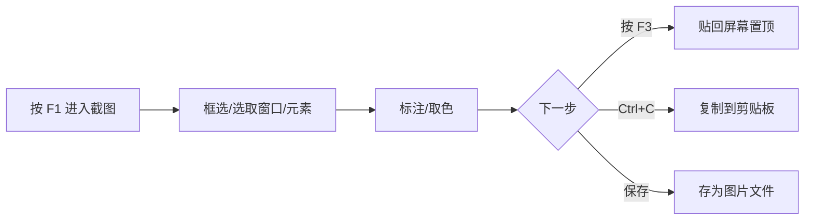
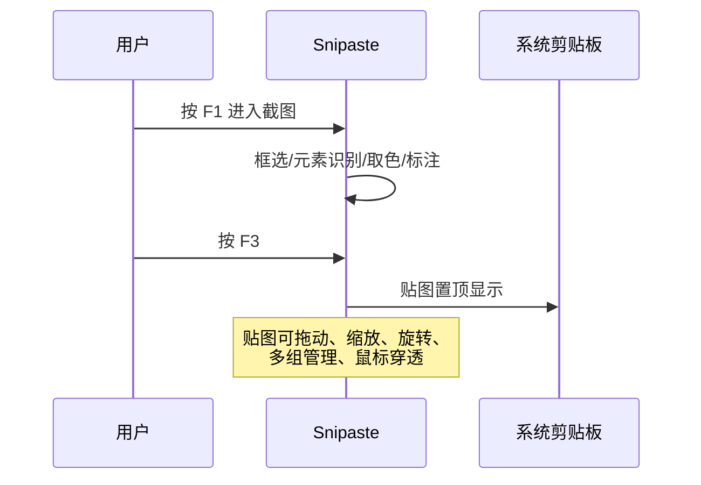
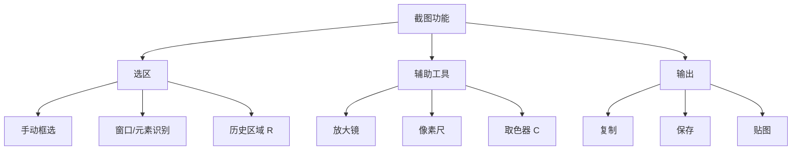
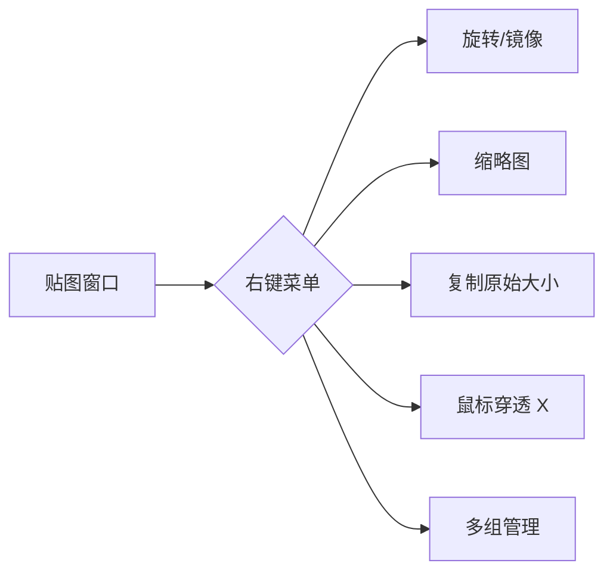
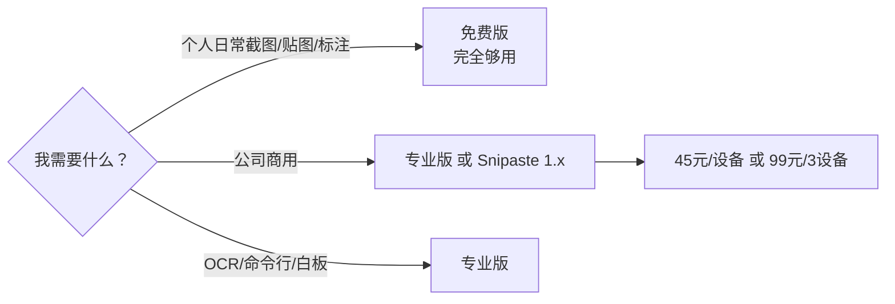

+++
date = '2026-09-29T01:51:00+08:00'
slug = 'snipaste-guide'
draft = false
title = 'Snipaste 完全指南：截图 + 贴图神器'
tags = ['snipaste', 'screenshot', 'productivity', 'tools']
+++

截图工具有很多，但能把截图"贴"回屏幕、还轻量到可以随身携带的，Snipaste 是独一份。这篇讲透 Snipaste——从核心工作流、标注与贴图技巧，到免费版/专业版怎么选，一份指南全搞定。

<!-- more -->

## Snipaste 是什么

Snipaste 的名字就是 **Snip（截图）+ Paste（粘贴/贴图）** 的组合：它不只是一个截图工具，更把截图"贴"回屏幕上，作为置顶窗口方便随时对照。核心卖点一句话：

> **按下 `F1` 开始截图，再按 `F3`，截图就在桌面置顶显示了。就这么简单。**



### 基本信息速览

| 项目 | 说明 |
|------|------|
| 最新版本 | **v2.11.3**（2026-01-18）|
| 平台 | Windows（64/32/ARM64）、macOS（通用版）、Linux（AppImage）|
| 系统要求 | Windows 7+、macOS 10.13+、主流 Linux 发行版 |
| 授权 | **个人使用免费**；2.x 商用需专业版，1.x 商用仍免费 |
| 隐私 | 全部本地处理，**不联网、不上传** |
| 荣誉 | Microsoft Store 2025 Best Tool |

## 一、核心工作流：截图 → 贴图

Snipaste 的一切都围绕"截图 → 贴图"这条主线展开。

### 1.1 最常用的几个按键

| 快捷键 | 作用 |
|--------|------|
| `F1` | 开始截图 |
| `F3` | 贴图（把截图贴回屏幕，置顶）|
| `F2` | 截取上次区域 |
| `Ctrl+F1` | 截图并自动复制 |
| `Ctrl+T` | 截图后直接贴图 |

> macOS 上如果 `F1`~`F12` 被系统占用（亮度/音量调节），按 `fn+F1` / `fn+F3` 即可，也可在偏好设置里自定义。



### 1.2 一个典型场景

写文档/写代码时对照参考：`F1` 截下报错信息 → 按 `F3` 贴在屏幕角落 → 一边看一边照抄，不用反复切换窗口。这就是 Snipaste 的"贴图"相比普通截图工具最大的增量价值。

## 二、截图能力详解

### 2.1 选区方式

| 方式 | 操作 |
|------|------|
| 手动框选 | 进入截图后拖选 |
| 正方形 | 截屏时按住 `Shift` 拖动 |
| 窗口/元素 | 进入截图后 `Tab` 在「选取窗口 / 选取元素」间切换；支持 Qt、Chrome 等界面元素检测 |
| 全屏/多屏 | 截图时按 `Ctrl+A`，多次按下可切换当前屏幕 / 所有屏幕 |
| 上次区域 | `F2` 直接复用上次选区 |
| 历史区域 | 截图时按 `R` / `Shift+R` 循环选择历史截图区域 |

### 2.2 辅助工具

- **放大镜**：像素级精确选区的必备；
- **像素尺**：测量屏幕上任意两点距离；
- **取色器**：进入截图后按 `C`，可吸取任意像素颜色，`F3` 可直接把颜色贴到屏幕；
- **HDR 色彩校正**：v2.11 起支持；
- **圆角矩形截图**（专业版）：截图也支持圆角。



## 三、贴图（Pin）技巧

贴图是 Snipaste 的灵魂，值得单独说。

### 3.1 贴图能做哪些操作

- **置顶显示**：贴图永远浮在最上层，不挡操作；
- **拖动/缩放/旋转/镜像**：拖边缘缩放，`3`/`4` 镜像翻转；
- **缩略图模式**：右键拖拽快速缩放成缩略图；
- **多贴图组**：`Ctrl+F3` 切换贴图组，方便归类对照；
- **隐藏/显示全部贴图**：`Shift+F3`；
- **鼠标穿透**：激活贴图后按 `X`，贴图不再拦截鼠标事件（适合边看边操作）；
- **虚拟桌面**：专业版支持把贴图固定到指定/所有虚拟桌面；
- **右键菜单**：旋转、复制原始大小图像、显示/关闭标注等。



### 3.2 剪贴板转贴图

Snipaste 不止能贴截图，**剪贴板里的文字或颜色信息也能直接贴成图**——把一段文字、一个色值，一键变成置顶贴图，适合临时对照或做参考色板。

## 四、标注工具

截图后立即进入编辑态，标注工具栏包含常用工具：

| 工具 | 快捷键/说明 |
|------|-------------|
| 箭头 | 可开关箭头，样式多样 |
| 矩形 / 椭圆 | 支持圆角、空心/实心 |
| 折线 / 直线 | 按住左键拖动画直线 |
| 画笔 | 快捷键 `B` |
| 文字 | 快捷键 `T`，支持描边、斜体、旋转 |
| 高亮 | 荧光笔效果 |
| 马赛克 / 模糊 | 打码敏感信息 |
| 橡皮擦 | 二次选中/编辑已标注内容 |
| 放大镜标注 | 专业版，局部放大 |
| 多组计数标注 | 专业版，序号标注 |

**标注操作技巧：**

- 按住 `Ctrl` 拖拽标注 = 中心点缩放；
- 按住 `Shift` 拖拽 = 等比例缩放；
- `Ctrl+1/2/3` 切换标注形状；
- 所有标注支持移动、旋转、撤销/重做。

## 五、取色器

Snipaste 的取色器是设计师和前端开发者的最爱：

- 进入截图（`F1`）→ 按 `C` → 鼠标悬停即显示当前像素色值；
- 专业版支持显示 **HSV 等更多色值格式**；
- 按 `F3` 可直接把颜色贴成图，方便跨窗口对照；
- 颜色信息可复制，省去手动记色值的麻烦。

## 六、专业版才有：OCR 与命令行

专业版（Pro）的价值集中在两块：**识别** 与 **自动化**。

### 6.1 OCR 文字识别

v2.11 起支持文字识别（OCR），v2.11.3 增加了腾讯与 OCR.space 接口。截图里的文字可以直接提取出来，不用再手动敲一遍。专业版还支持**二维码 / 条形码识别**（`barcode-scan` / `barcode-decode`）。

### 6.2 命令行自动化

专业版提供大量命令行选项，可绑定到全局快捷键或脚本：

```bash
# 截图并指定输出（可绑定快捷键）
snip -o D:\shots\demo.png

# 等待截图完成后再退出（适合脚本调用）
snip --block 60

# 带指定输出时，退出前可先标注
snip --hold

# 只截活动屏幕
snip --active-screen

# 指定尺寸截图（可保持宽高比）
snip --size 800 600 --keep_aspect_ratio

# 取色
snip pick-color

# 识别条形码/二维码
snip barcode-scan
snip barcode-decode FILE

# 白板模式（可指定背景色、仅显示在鼠标所在屏幕）
snip whiteboard --color black --active-screen

# 贴图位置
snip --at 100 100

# 管理贴图组
snip create-group
snip show-group-manager
snip empty-group
```

> 命令行是专业版的"隐藏大招"：截图→OCR→自动保存→发送给其他程序，一条命令串起完整工作流。

## 七、免费版 vs 专业版

这是很多人纠结的地方。结论先给：**个人使用，免费版 99% 够用**；公司商用或重度依赖自动化/OCR 的，再考虑专业版。

| 特性 | 免费版 | 专业版 |
|------|--------|--------|
| 截图 + 贴图 | ✅ | ✅ |
| 全部标注工具 | ✅ | ✅ |
| 取色器 | ✅（基础色值）| ✅（含 HSV 等）|
| 历史回放 | ✅ | ✅ |
| OCR 文字识别 | ❌ | ✅ |
| 二维码 / 条形码 | ❌ | ✅ |
| 命令行自动化 | ❌ | ✅ |
| 白板模式 | ❌ | ✅ |
| 记住锁定宽高比 | ❌ | ✅ |
| 自动更新 | 手动检查 | ✅ 自动 |
| 远程桌面优化 | 基本支持 | ✅ 优化 |
| 商用授权 | ❌（仅个人）| ✅ |
| 价格 | 免费 | 单设备 45 元 / 3 设备 99 元 |



> 授权说明：Snipaste 2.x **仅对个人用户免费**；公司内部使用需购买专业版，或使用仍然免费的 Snipaste 1.x。

## 八、安装

### Windows

```powershell
# 官网下载安装包，或
winget install Snipaste
```

也支持**免安装的便携版**——解压即用，可放 U 盘随身携带，不写注册表。

### macOS

```bash
# Homebrew
brew install --cask snipaste
```

装好后图标出现在顶部菜单栏。若 `F1`~`F12` 被系统占用，用 `fn+F1` / `fn+F3` 或自定义快捷键。

### Linux

下载官方 AppImage，赋予执行权限后运行：

```bash
chmod +x Snipaste-2.11.3.AppImage
./Snipaste-2.11.3.AppImage
```

## 九、工作流场景

Snipaste 在不同角色手里用法各不相同，几个高频场景：

| 角色 | 用法 |
|------|------|
| 开发者 | 报错信息截图贴起来对照改代码；代码片段贴图置顶 |
| 设计师 | 取色器取色、贴色板、切图标注 |
| 测试工程师 | 缺陷截图 + 标注（框出问题区域）+ 贴图与预期对比 |
| 文案/翻译 | OCR 提取截图文字，省去手动输入 |
| 学习/抄录 | 公式、表格贴图对照抄写 |

## 十、常见问题排查

| 症状 | 原因/对策 |
|------|-----------|
| 按 F1 没反应 | Snipaste 未启动，或快捷键被其他软件占用，到偏好设置改键 |
| macOS F1 是调亮度 | 系统占用了功能键，用 `fn+F1` 或自定义 |
| 截图发虚/位置偏移 | 多屏 DPI 不一致，尽量在偏好里开启对应兼容选项 |
| 商用被查授权 | 公司内请购买专业版或用 1.x |
| 想彻底移除 | 退出程序；便携版删除目录即可，无残留服务 |

## 总结

Snipaste 用一句话概括：**简单但强大的截图工具，把截图贴回屏幕是它的独门绝技**。个人免费、全平台、本地运行、轻量可便携，配合取色、标注、OCR（专业版）几乎覆盖了桌面效率工具的半壁江山。

| 平台 | 安装方式 | 授权 |
|------|----------|------|
| Windows | 官网 / winget / 便携版 | 个人免费 |
| macOS | `brew install --cask snipaste` | 个人免费 |
| Linux | AppImage | 个人免费 |

**选型建议**：个人日常用免费版即可；需要 OCR、命令行自动化、白板或公司商用再上专业版（45 元/设备）。无论哪种，先把 `F1` 截图、`F3` 贴图这两个键刻进肌肉记忆——效率提升立竿见影。
