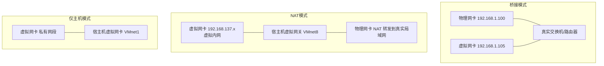
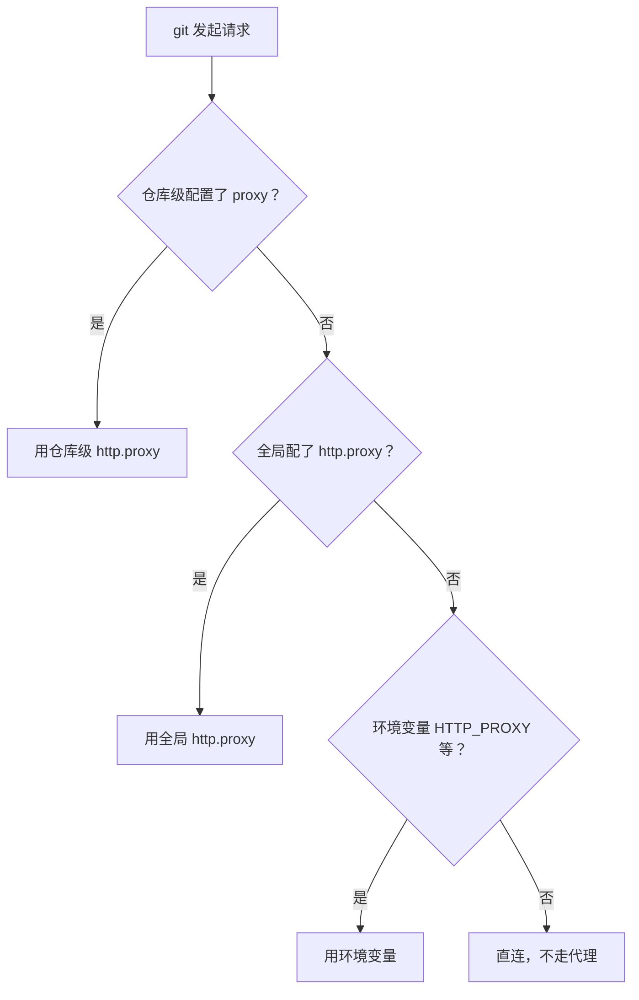
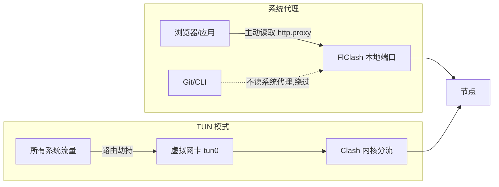
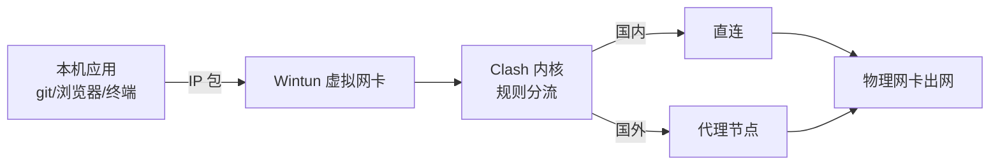

+++
date = '2026-09-29T03:10:00+08:00'
slug = 'virtual-nic-and-proxy-bridge-nat-tun-git'
draft = false
title = '虚拟网卡与代理原理深度解析：桥接、NAT、TUN 与 Git 代理'
tags = ['network', 'proxy', 'virtual-nic', 'git', 'flclash']
+++

搞网络和代理时，有几个概念特别容易被绕晕：虚拟网卡和物理网卡到底是不是同一个局域网？Git 的代理到底是走系统代理还是自己有套机制？FlClash 的 TUN 虚拟网卡是桥接还是 NAT？这篇文章把这一串问题一次性讲透，从网卡原理到代理机制再到 Git 的实际行为，一条主线串起来。

<!-- more -->

## 一句话主线

> **虚拟网卡 ≠ 网卡**，它只是软件模拟出来的设备；**Git 有自己独立的代理配置**，默认不读系统代理；**FlClash 的 TUN 既不是桥接也不是传统 NAT**，而是三层虚拟网卡 + Fake-IP 的用户态接管。

下面逐步展开。

## 一、虚拟网卡与物理网卡：是同一个局域网吗

**不一定，取决于虚拟网卡的工作模式。** 常见有三种：桥接（Bridge）、NAT、仅主机（Host-Only）。

### 1.1 桥接模式（Bridge）✅ 和物理机同一个局域网

- 虚拟网卡和物理网卡同网段，由真实局域网 DHCP 分配 IP；
- 原理：虚拟网卡直接接入交换机，相当于局域网里一台独立电脑；
- 特点：局域网其他设备可以直接访问虚拟机，虚拟机也能访问局域网内其他设备；物理网卡只做二层转发，**不做 NAT**。

> 例：物理机 `192.168.1.100`，虚拟机桥接拿到 `192.168.1.105`，同网段互访无障碍。

### 1.2 NAT 模式（最常用）❌ 不在同一局域网，靠 NAT 转发

- 虚拟网卡属于**虚拟机软件自建的内网**（VMware 默认 `192.168.137.x`，VirtualBox `10.0.2.x`）；
- 原理：宿主机充当路由器，虚拟机访问外网/物理局域网时，宿主机做**地址转换（NAT）**；
- 特点：虚拟机可以访问物理机、局域网其他设备、互联网，但**局域网其他设备默认不能主动访问虚拟机**（需端口转发）。

### 1.3 仅主机模式（Host-Only）❌ 完全隔离外部局域网

- 只有虚拟机 ↔ 宿主机互通，新建独立内网；
- 默认**不能访问物理局域网和外网**，需要手动开共享。

### 1.4 容易混淆的两个"虚拟网卡"

很多人把两个概念混为一谈，务必区分：

1. **宿主机 Windows 上看到的虚拟网卡（VMnet8 / VMnet1）**：安装 VMware/VirtualBox 时装在物理主机操作系统里的虚拟网卡。NAT 模式下，宿主机的 VMnet8 和虚拟机网卡在**虚拟内网**；宿主机再通过**物理网卡 NAT** 访问真实局域网。
2. **虚拟机操作系统里看到的网卡**：虚拟化软件模拟出来的虚拟硬件。

## 二、Git 代理：走系统代理还是自己的

**Git 有自己独立的代理配置，优先级高于系统代理，而且默认不读 Windows 系统代理。**

Git 的代理读取顺序（从高到低）：

1. 当前仓库单独配置 `http."https://github.com".proxy`（最高）
2. Git 全局配置：`git config --global http.proxy`
3. 环境变量 `HTTPS_PROXY / HTTP_PROXY / ALL_PROXY`（终端环境变量）
4. 没有任何配置 → **直连，不走代理**

### 关键区分：Windows 系统代理 vs 环境变量

| 概念 | 是什么 | Git 读吗 |
|------|--------|----------|
| Windows「系统代理」 | 系统注册表里的代理设置，浏览器/GUI 软件读取 | **默认不读** |
| 环境变量 `HTTP_PROXY` | 终端层面的代理，随命令进程传递 | **会读** |

> 所以：只开 FlClash 的【系统代理】、不开 TUN 时，**Git 默认不会走代理**，除非手动 `git config` 或在终端 export 环境变量。

### 额外提醒：SSH 协议不认 http.proxy

如果用的是 `git@github.com` 这种 SSH 地址，`git http.proxy` 完全无效，SSH 代理要单独在 `~/.ssh/config` 里配 `ProxyCommand`。

## 三、FlClash：系统代理 vs TUN 虚拟网卡

结合前面的网卡知识，这两种接管流量的方式差异很大：

### 3.1 系统代理（应用层）

- 原理：FlClash 修改 Windows 系统代理注册表，告诉支持代理的程序"代理地址是 `127.0.0.1:7890`"；
- 流量：应用**主动读取系统代理配置**，主动把请求发给 Clash；
- 覆盖范围：**只对愿意读取系统代理的程序生效**（Chrome、Edge）；
- 局限：Git、npm、pip、游戏等很多 CLI 工具**根本不读系统代理**，直接绕过；**无法代理 UDP**；
- 权限：无需管理员。

### 3.2 TUN 模式（网络层，虚拟网卡）

- 原理：FlClash 安装一块**虚拟网卡**，修改系统路由表，**操作系统所有 IP 包强制路由到这块虚拟网卡**，交给 Clash 内核匹配规则（国内直连、国外走代理）；
- 覆盖范围：**整机所有流量，TCP + UDP 全部接管**，Git、终端、游戏全部自动生效，程序本身**完全不需要感知代理**；
- 权限：必须管理员权限。

> 一句话理解：**系统代理是软件"自愿"走代理（软件可以拒绝）；TUN 虚拟网卡是系统底层"强制"拦截所有 IP 包，所有程序没得选。**

## 四、FlClash TUN 是桥接还是 NAT？

**都不是。** FlClash 的 TUN 既不是 VMware 那种桥接，也不是传统虚拟机 NAT——它是**本机路由劫持 + 三层 TUN 隧道**（Wintun 驱动）。

### 4.1 为什么不是桥接

桥接（Bridge）需要二层设备（TAP 网卡），把虚拟网卡和物理网卡的以太网帧直接交换，让虚拟网卡拿到同局域网真实 IP。

而 FlClash 用的是 **TUN（三层）**，只处理 IP 包，**不处理以太网帧，没有 MAC 地址，不能做桥接**。所以 **FlClash 没有桥接模式**。

### 4.2 为什么也不是传统 NAT

- **不是系统内核 NAT**：VMware 的 NAT 是宿主机操作系统内核做地址转换；FlClash TUN 是 **Clash 用户态程序接管 IP 包**，不经过系统 NAT 模块。
- **有类似 Fake-IP 机制**：开启 TUN 后，Windows 路由表把本机所有 IP 包优先发给 Wintun 虚拟网卡；Clash 内核收到 IP 包后做**规则分流**；在 Fake-IP 模式下，Clash 给域名分配一段假 IP（如 `198.18.0.x`），内核自己做 IP 映射——这是 Clash 内部的 IP 伪装，**不是操作系统 IP 层的 NAT**。
- 流量最终从**宿主机原来的物理网卡**出去访问内网/外网。

### 4.3 三种虚拟网卡对比

| 项目 | VMware 桥接 | VMware NAT | FlClash TUN（Wintun）|
|------|------------|-----------|----------------------|
| 网卡类型 | TAP 二层网卡 | TAP 二层网卡 | TUN 三层网卡 |
| 是否二层桥接 | ✅ | ❌ | ❌（不能桥接）|
| IP 来源 | 路由器 DHCP 同网段 | 虚拟机内网网段 | Fake-IP 虚拟网段 |
| 原理 | 二层转发 | 系统内核 NAT | 用户态捕获 IP 包 + 分流 |
| 局域网其他设备能否直接访问虚拟网卡 | ✅ | ❌ | ❌ |

> **踩坑提示**：有些 VPN 软件用 TAP 网卡可以桥接；但 **Clash 系（FlClash / Clash Verge / Mihomo）在 Windows 的 TUN 全部是 Wintun 三层 TUN，不支持桥接**。

## 五、开发场景最佳实践（Git + FlClash）

结合前面所有机制，落地建议如下：

1. 日常浏览网页：只开【系统代理】，不开 TUN；此时 Git 不会自动走代理。
2. 需要 Git、npm 等命令行工具走代理，二选一：
   - **方案 A（轻量）**：保持系统代理关闭，终端设置环境变量 `export ALL_PROXY=socks5://127.0.0.1:7890`，仅当前终端生效；
   - **方案 B（推荐开发）**：**开启 TUN 虚拟网卡**，Git 不用任何配置，自动分流，最省心。
3. 内网流量（访问同局域网其他设备）默认会**绕过 TUN 直接走物理网卡**（auto-route 默认保留内网路由）。

> ⚠️ **坑点**：**不要同时开启 TUN 又配置 `git http.proxy`**，容易双重代理导致连接失败。

## 总结

一条线回顾：虚拟网卡是软件模拟的设备，桥接=同局域网、NAT=自建内网转发；Git 有独立代理配置且默认不读系统代理；FlClash 的系统代理是应用层"自愿"接管，TUN 是网络层"强制"接管；而 FlClash 的 TUN 是三层虚拟网卡 + Fake-IP 的用户态接管，**既不是桥接也不是传统 NAT**。

| 问题 | 答案 |
|------|------|
| 虚拟网卡和物理网卡同局域网吗？ | 桥接是，NAT/仅主机不是 |
| Git 代理走系统代理吗？ | 默认不读，有独立配置优先级 |
| FlClash 系统代理 vs TUN？ | 应用层自愿 vs 网络层强制 |
| FlClash TUN 是桥接还是 NAT？ | 都不是，三层 TUN + Fake-IP |
