+++
title = '深入理解 TCP/IP 协议栈四层模型：从内核边界、沙漏结构到协议交互全景'
date = '2026-09-30T14:45:00+08:00'
slug = 'tcp-ip-4-layer-model'
draft = false
tags = ['网络', 'tcp-ip', 'linux', '底层原理', '计算机网络']
+++

在计算机网络的学习与工程实践中，许多人接触的第一个概念往往是教科书上的 **OSI 七层参考模型**。然而在工业界的真实生产环境和互联网世界中，真正构建了整个数字基础设施的，是实用主义至上的 **TCP/IP 四层协议栈模型（RFC 1122）**。

《TCP/IP 详解》（TCP/IP Illustrated）卷一中有一张被无数网络工程师与系统底层开发者奉为经典的协议栈架构图。它不仅清晰地描绘了层级关系，更蕴含了操作系统内核划分、特权协议直通、报文路由以及地址解析等大量深层设计细节：

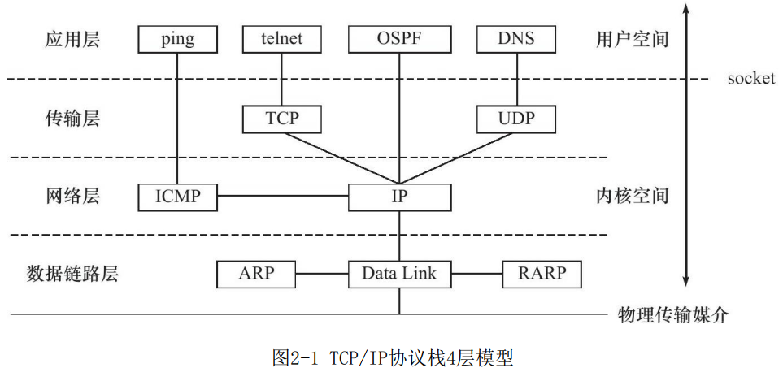

这张图看似清晰直观，但如果仔细凝视其中的连线与边界，会发现几个直击网络核心的“反常识”设计：

1. **为什么 ping 没有传输层端口号，可以直接跨过 TCP/UDP 直连网络层的 ICMP？**
2. **为什么 OSPF 作为应用层的路由守护进程，会越过传输层直接把报文装入 IP 数据报？**
3. **为什么 Socket 接口刚好横亘在应用层与传输层之间，且正好是用户空间与内核空间的分水岭？**
4. **ARP 与 RARP 到底算数据链路层还是网络层？为什么它们没有 IP 报头却能解析 IP？**

本文将以这张经典架构图为蓝本，从操作系统内核与网络协议工程实现的角度，深度剖析 TCP/IP 四层模型的设计哲学与运行机理。

<!-- more -->

---

## 一、 TCP/IP 四层模型宏观概览与“沙漏腰部”

### 1.1 OSI 七层 vs TCP/IP 四层

OSI 模型由国际标准化组织（ISO）在 1980 年代提出，具有高度的学院派规范与严谨性；而 TCP/IP 诞生于 ARPANET 实验项目，秉承的是 IETF 的工程哲学：**“粗糙的共识，可运行的代码（Rough consensus and running code）”**。

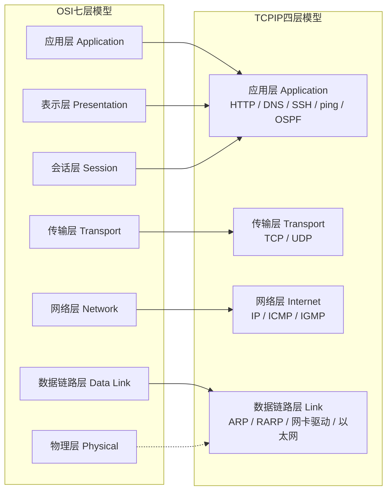

在 TCP/IP 模型中：
- **应用层（Application）**：合并了 OSI 的应用层、表示层与会话层。TCP/IP 认为加解密、压缩、会话保持等功能属于应用程序的自发逻辑，协议栈底层无需干涉；
- **传输层（Transport）**：负责端到端（End-to-End，进程到进程）的通信与控制（TCP 的可靠流式传输、UDP 的尽力报文传输）；
- **网络层（Network / Internet）**：负责主机到主机（Host-to-Host）的寻址、选路与路由；
- **数据链路层（Link / Network Interface）**：负责相邻节点之间帧的发送与接收，涵盖硬件设备驱动、物理媒介与介质访问控制（MAC）。

### 1.2 经典的“瘦腰/沙漏”架构（Hourglass Architecture）

互联网之所以能吞吐数以万计的应用并跨越几乎所有物理媒介，关键在于 TCP/IP 采用的**沙漏模型（Hourglass Model）**：

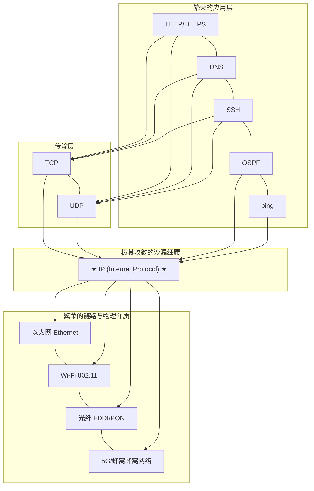

- **向上看**：无论应用层协议如何演化（从早期的 Telnet、FTP，到现代的 HTTP/3、gRPC、WebRTC），只要能通过传输层或直接使用 IP，就能接入全球互联网；
- **向下看**：无论底层的传输介质是以太网双绞线、无线电波、海底光缆还是卫星微波，只要网卡驱动能将其封装为链路帧并传递 IP 数据报，网络就能平滑运转；
- **细腰核心（IP）**：所有协议必须统一汇聚到 IP。IP 协议遵循“**无连接、不可靠的最佳努力交付（Best Effort）**”原则。正因为 IP 极简、不假设底层质量、不做复杂状态保持，才能具有普适万物的生命力。

---

## 二、 纵向分水岭：用户空间与内核空间的 Socket 结界

观察参考图右侧的双向箭头与虚线：
- **用户空间（User Space）**：位于 Socket 虚线之上，运行着用户态应用程序；
- **内核空间（Kernel Space）**：位于 Socket 虚线之下，涵盖传输层、网络层和链路层；
- **边界划分器**：**Socket 接口（系统调用层）**。

### 2.1 为什么协议栈要塞进操作系统内核？

许多现代开发者可能会好奇：为什么 TCP/IP 栈不直接写在用户态库里（像普通依赖包一样），而必须由操作系统内核来实现？

1. **硬件与特权隔离**：
   网卡是系统级共享硬件。如果由每个用户态进程直接读写网卡内存，任何一个存在 Bug 或恶意的程序都可以窃听全机流量、随意伪造硬件 MAC 或篡改其他进程的数据。内核提供统一的特权抽象，保护系统安全；
2. **端口多路复用与解复用（Demultiplexing）**：
   单台机器只有一个公网/局域网 IP，但可以并发运行数十个网络程序。由内核统一管理端口分配（Port 0-65535）、特权端口保护（1-1023 需要 root 权限）以及维护庞大的套接字哈希表（Socket Hash Table）；
3. **高效的硬件中断与缓冲区管理**：
   网卡通过 DMA 将数据包直接写入内核环形缓冲区（Ring Buffer），触发硬中断与软中断（Linux NAPI 机制）。内核统一在 `sk_buff` 结构中管理报文生命周期，避免了多进程争夺硬件寄存器的死锁和开销。

### 2.2 跨越结界的成本：系统调用与上下文切换

经典的基于 Socket API 的通信模型中，数据从应用程序发出需历经两次空间切换与多次内存拷贝：

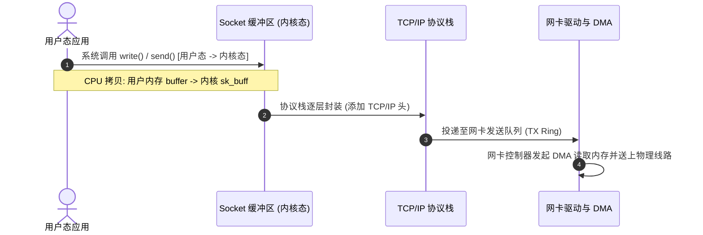

- **上下文切换（Context Switch）**：进程从用户态陷入内核态，保存 CPU 寄存器上下文，执行系统调用后再切回；
- **数据拷贝**：用户缓冲区 ↔ 内核 Socket 缓冲区 ↔ 网卡内存。

> [!TIP]
> **现代网络性能优化的演进**：
> 正因为经典四层模型中 Socket 结界的开销在高并发、微秒级延迟场景下成为瓶颈，近些年诞生了两种前沿突破路线：
> 1. **内核旁路（Kernel Bypass，如 DPDK）**：直接绕过内核，将网卡驱动和协议栈全部拉到用户态运行，实现零拷贝和轮询式收发；
> 2. **内核原位加速（XDP / eBPF / io_uring）**：在报文刚抵达网卡驱动时直接通过 eBPF 字节码完成过滤和转发，或者通过共享环形队列省去系统调用开销。

---

## 三、 四条典型路径：打破“所有流量必经传输层”的思维定势

这是参考图中最精彩、最值得推敲的部分。很多人误以为所有应用层程序都必须在 TCP 和 UDP 之间“二选一”。但图中清晰展示了 4 条路径，揭示了网络协议设计的多元与权衡：

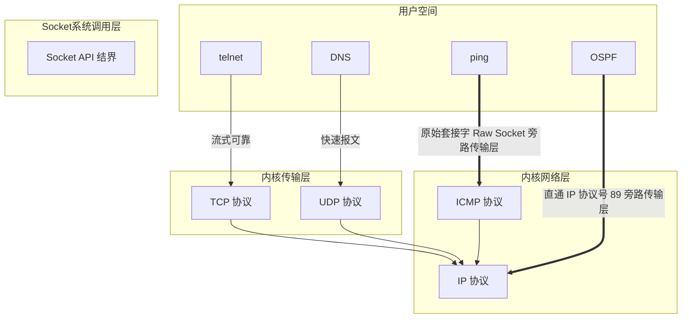

### 3.1 路径一：`telnet` → `TCP` → `IP`（经典可靠流）

- **场景与特征**：面向连接、字节流服务、全双工、高可靠；
- **内核行为**：
  1. 调用 `connect()` 触发经典的 TCP 三次握手；
  2. 内核协议栈为该连接分配发送窗口、接收窗口、重传定时器（RTO）与拥塞控制状态机（Cubic/BBR）；
  3. 任何报文丢失均在内核层隐蔽重传，对应用层呈现为一段连续无差错的“管道流”。

### 3.2 路径二：`DNS` → `UDP` → `IP`（极速无状态报文）

- **场景与特征**：无连接、不可靠、面向报文（保留消息边界）、轻量低延迟；
- **为什么选 UDP**：
  域名查询通常只需“一问一答”（Request-Response）。如果使用 TCP，需要先进行三次握手（1.5 RTT），查询完毕还要四次挥手，网络开销翻倍。UDP 只需要直接发出一个报文，客户端在应用层设置超时重试即可；
- **补充知识**：DNS 并非只用 UDP。在以下两种情况下 DNS 会回退或强制使用 **TCP（端口 53）**：
  1. 响应数据包超过 512 字节且未启用 EDNS0（响应标志位 `TC=1` 截断）；
  2. DNS 服务器之间进行区域传送（AXFR / IXFR），需要传输大量数据并保证强一致可靠性。

### 3.3 路径三：`ping` → `ICMP` → `IP`（直接下潜，旁路传输层）

这是初学者最容易产生疑惑的地方：**为什么 ping 没有端口号？**

- **为什么不走 TCP/UDP**：
  `ping` 的设计目的是诊断主机的网络层是否通畅。如果要测通畅必须经过 TCP/UDP，那么当目标机器的某个服务挂了、防火墙屏蔽了端口、或者操作系统传输层未就绪时，ping 就会失效。**网络排障工具必须尽可能下沉到最基础的层次**；
- **底层实现原理**：
  `ping` 程序通过 `socket(AF_INET, SOCK_RAW, IPPROTO_ICMP)` 创建**原始套接字（Raw Socket）**；
  - 操作系统对 Raw Socket 有严格权限限制（在 Linux 下通常需要 `CAP_NET_RAW` 权限或 root）；
  - 构造 `ICMP Echo Request`（类型 8，代码 0）报文，交由内核网络层直接贴上 IP 报头（IP 协议号 `1`）；
- **没有端口号，回包怎么知道属于哪个 ping 进程？**
  TCP/UDP 靠端口号寻址，而 ICMP 依靠报头中的 **Identifier（标识符）** 和 **Sequence Number（序列号）**：
  - 发送时，ping 进程将自己的进程 PID 填入 ICMP 报头的 Identifier 字段；
  - 目标主机响应 `ICMP Echo Reply`（类型 0，代码 0）时，会原封不动地将 Identifier 抄写送回；
  - 内核收到 ICMP 回包后，扫描所有监听 ICMP 的 Raw Socket，通过 PID 准确分发给对应的 ping 进程。

### 3.4 路径四：`OSPF` → `IP`（路由控制协议的奇特下沉）

在路由体系中，OSPF（Open Shortest Path First）作为链路状态路由协议，在架构层面的归属常常令人惊叹：

- **它运行在用户态，却跳过了传输层**：
  OSPF 守护进程（如 Linux 下的 `frr`、`bird`、`zebra`）运行在用户空间，但它既不用 TCP，也不用 UDP，而是直接请求内核将数据封装在 IP 数据报中（**IP 报头中的协议字段 Protocol = 89**）；
- **为什么 OSPF 不像 BGP 那样走 TCP（179端口）？**
  - **BGP（边界网关协议）** 运行于跨互联网自治系统（AS）之间，路由器之间可能隔了十几个物理跳数，必须依赖 TCP 跨越广域网提供可靠传输；
  - **OSPF** 是内部网关协议（IGP），工作在一个局域网或自治系统内部，路由器之间直接相邻（单跳），链路质量极高；
  - 如果使用 TCP，TCP 复杂的握手、滑动窗口和慢启动机制在广播和组播链路上反而成为灾难（OSPF 广泛使用组播地址 `224.0.0.5` 和 `224.0.0.6`，而 TCP 根本不支持组播！）；
- **为什么 OSPF 也不用 UDP（像 RIP 520 端口那样）？**
  UDP 完全不保证可靠性。OSPF 对拓扑数据（LSA）的一致性要求极高。既然 OSPF 自身在应用层已经设计了一套极其精密高效的确认、泛洪与重传机制（Hello 报文建立邻居、DBD 交换摘要、LSR/LSU 链路状态更新、LSAck 确认），那么再包一层 UDP 报头就是纯粹的带宽与解析浪费。

### 3.5 典型协议特征对比总结

| 协议 / 工具 | 所处抽象层 | 传输层依赖 | 协议号 / 端口标识 | 为什么这样设计？ |
| :--- | :--- | :--- | :--- | :--- |
| **Telnet / SSH / HTTP** | 应用层 | **TCP** | 端口 23 / 22 / 80 | 强依赖数据顺序、无差错和可靠连接传输 |
| **DNS 查询** | 应用层 | **UDP**（备选 TCP） | 端口 53 | 一问一答，低开销、低延迟优先 |
| **ping** | 应用层诊断工具 | **无（直通 ICMP）** | IP 协议号 1；靠 ICMP 标识符区分进程 | 诊断基础网络层连通性，解耦上层状态 |
| **OSPF** | 路由协议（应用态）| **无（直通 IP）** | IP 协议号 89；靠自身状态机确认 | 需在邻居间组播，自建轻量可靠协议，规避 TCP/UDP 冗余 |

---

## 四、 网络层的控制与反馈中枢：ICMP 与 IP 的协同

在图中，网络层除了核心的 `IP` 外，旁边紧邻着 `ICMP`。

很多初学者容易误解：“既然 ICMP 报文是被 IP 数据报封装的，那 ICMP 是不是应该算传输层？”

答案是否定的。**ICMP（Internet Control Message Protocol）是网络层不可分割的一部分**，它是 IP 协议的“控制信使”与“神经中枢”。

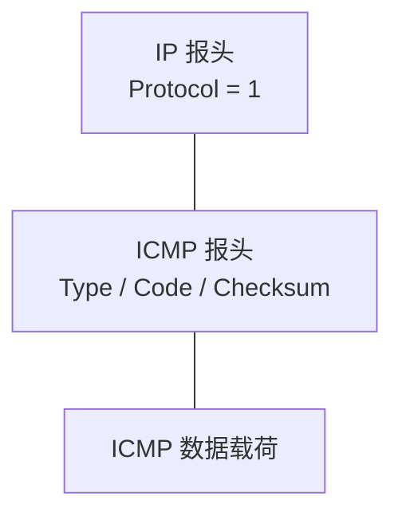

### 4.1 ICMP 的核心使命：差错汇报与网络感知

IP 协议是不可靠的，遇到路由不可达、数据包过大无法分片、TTL 耗尽时，IP 协议本身并没有任何机制向源主机说明原因。这个脏活累活全部由 ICMP 承担：

1. **差错报文（Error Messages）**：
   - **目标不可达（Destination Unreachable，Type 3）**：网络不可达、主机不可达、端口不可达（当访问目标未开放的 UDP 端口时，目标主机会回送 Type 3 Code 3）；
   - **超时（Time Exceeded，Type 11）**：路由环路或跳数过多导致 IP 报头中的 TTL（Time To Live）递减为 0；
   - **参数问题（Parameter Problem，Type 12）**：IP 报头格式错误。
2. **查询报文（Query Messages）**：
   - **回显请求与应答（Echo Request / Reply，Type 8 / 0）**：供 ping 使用；
   - **时间戳请求与应答（Timestamp Request / Reply）**：用于时间同步与单向延迟测量。

### 4.2 `traceroute` 的精妙算法：利用 ICMP 绘制全网拓扑

`traceroute`（Windows 下为 `tracert`）是计算机网络中最具巧思的工具之一，它巧妙地利用了 IP 的 TTL 字段与 ICMP 的超时机制：

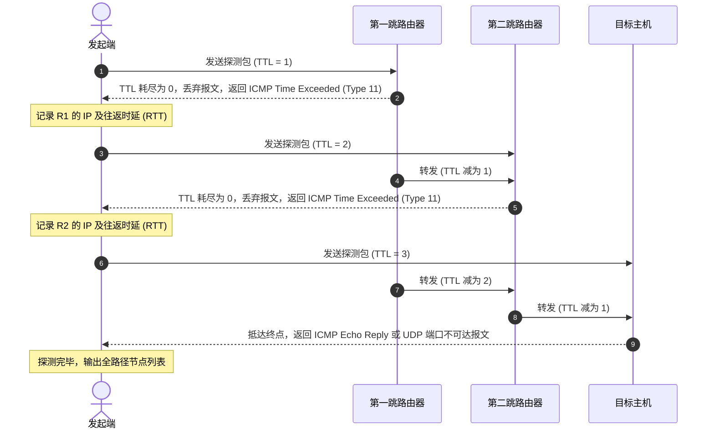

---

## 五、 二层与三层的纽带：ARP 与 RARP 的身世之谜

在参考图的数据链路层位置，赫然画着三个模块：`ARP`、`Data Link`、`RARP`。

### 5.1 灵魂拷问：ARP 究竟属于哪一层？

在计算机网络界，关于 ARP（Address Resolution Protocol，地址解析协议）层级的争论从未停歇：

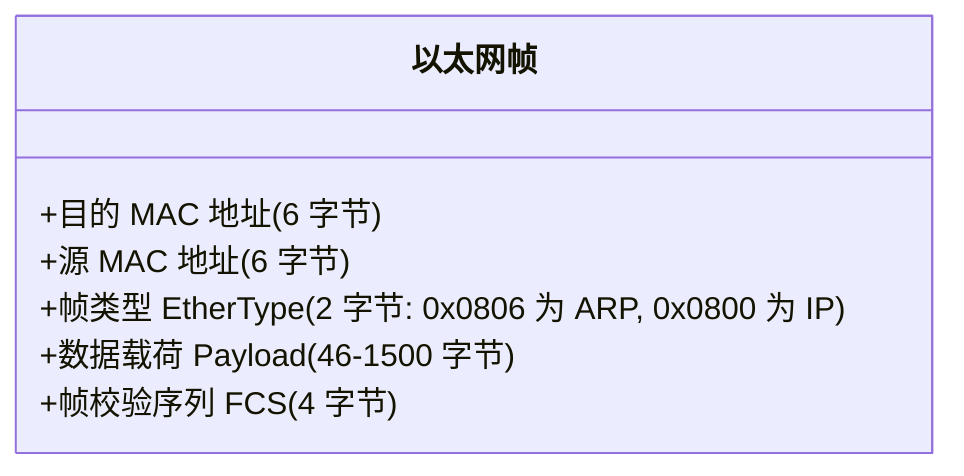

- **观点 A（属于数据链路层）**：
  从报文物理封装来看，**ARP 报文直接由以太网帧进行承载**，根本没有 IP 报头！以太网帧首部的 `EtherType` 为 `0x0806` 时就代表这是 ARP 帧。既然它完全工作在以太网帧的载荷内，自然是二层协议；
- **观点 B（属于网络层 / 2.5层）**：
  从服务对象来看，ARP 解析的是 IP 地址与 MAC 地址的映射。如果没有网络层 IP 寻址，ARP 就毫无存在的意义。它是为三层 IP 协议正常运转提供底层支撑的辅助协议。

> [!NOTE]
> 在工业实践与 RFC 标准中，通常将 ARP 视为**工作在数据链路层，但服务于网络层的“胶水协议”（介于二层与三层之间）**。参考图中将 ARP/RARP 紧贴于数据链路层上方，非常准确地表达了它直接封装于链路帧的本质。

### 5.2 ARP 的工作机制

1. **ARP 广播请求（Broadcast）**：
   当主机 A 想要向同一子网的 IP（`192.168.1.5`）发包，但不知道其 MAC 时，A 会在局域网内广播一个以太网帧（目的 MAC 为 `FF:FF:FF:FF:FF:FF`）：“谁拥有 `192.168.1.5`，请告诉我你的 MAC！”；
2. **ARP 单播应答（Unicast）**：
   拥有该 IP 的主机 B 收到广播后，发现是找自己的，立刻单播回送应答帧：“我是 `192.168.1.5`，我的 MAC 是 `00:1A:2B:3C:4D:5E`”；
3. **内核 ARP 缓存表（ARP Cache）**：
   主机 A 收到后，将其缓存进内核表（可以通过 `arp -a` 或 `ip neigh` 查看），并在超时（通常几分钟）前无需重复查询。

### 5.3 RARP 的退役与 DHCP 的兴起

参考图中还有一个历史名词：**RARP（Reverse ARP，逆向地址解析协议）**。

- **RARP 曾经的使命**：
  在早期互联网无盘工作站时代，计算机没有硬盘，甚至不知道自己的 IP 地址，ROM 中只硬编码了网卡的物理 MAC 地址。无盘工作站启动时发出 RARP 广播：“我的 MAC 是某某，请 RARP 服务器分配并告诉我我的 IP 地址！”；
- **为什么 RARP 被淘汰了？**
  1. RARP 是二层协议，广播报文**无法跨越路由器**，每个物理子网都必须部署一台专用的 RARP 服务器；
  2. RARP 只能返回简单的 IP 地址，无法返回子网掩码、默认网关、DNS 服务器、域名后缀等现代网络必需的配置参数；
- **现代继承者：BOOTP 与 DHCP**：
  后来人们开发了 **BOOTP**，随后演进为今天家喻户晓的 **DHCP（动态主机配置协议）**。DHCP 作为应用层协议（运行在 UDP 67/68 端口），配合路由器的 DHCP Relay 代理，能够轻松跨子网分配海量配置信息。

---

## 六、 全链路数据封装与解封装（Encapsulation & Decapsulation）

四层协议栈的精髓，在于数据在发送端逐层“穿衣打头”，在接收端逐层“脱衣分发”。

### 6.1 逐层封装流水线

以一次典型的 Web 请求（HTTP GET）为例：

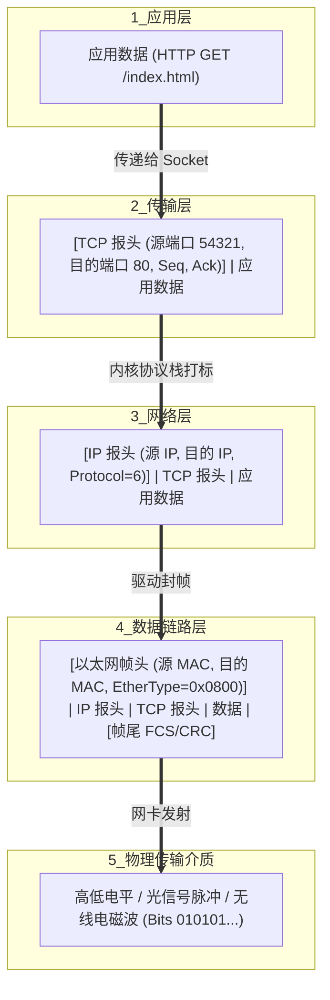

### 6.2 接收端的精准解封装（Demultiplexing 派发逻辑）

网卡收到物理比特流后，自底向上展开了一场严密的“接力赛”：

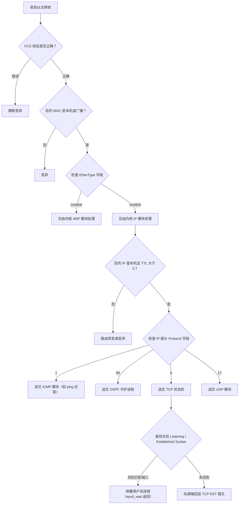

每一个层次都在自己的首部明确指示了**下一层应由谁来接盘**：
- 以太网头的 `EtherType` 指引网络层协议（IPv4、IPv6、ARP）；
- IP 头的 `Protocol` 指引传输层协议（TCP、UDP、ICMP、OSPF）；
- TCP/UDP 头的 `Destination Port` 指引用户空间的具体应用进程。

层层解耦，职责单一，这就是计算机网络模块化设计的最完美典范。

---

## 七、 给工程师的排障方法论：自底向上的定位心法

理解了 TCP/IP 四层模型与这张经典架构图后，在日常面对“网络连不上”、“服务偶发超时”、“接口报错 Connection Refused”等疑难杂症时，排障思路会变得异常清晰：

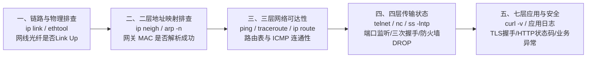

1. **链路层（Link Layer）**：
   - 现象：网卡没有 Carrier，丢包率 100%；
   - 命令：`ip link show`、`ethtool eth0`；
   - 重点关注：网线接触、速率协商模式（1000M/10000M Full Duplex）、网卡 Ring Buffer 溢出（Overruns / Dropped）。
2. **邻居映射层（ARP）**：
   - 现象：同网段机器无法通信，ping 提示 `Destination Host Unreachable`；
   - 命令：`ip neigh show`、`arp -n`；
   - 重点关注：网关 MAC 是否为 `INCOMPLETE` 或 `FAILED`；是否存在 ARP 欺骗或 IP 冲突。
3. **网络层（IP / ICMP）**：
   - 现象：跨网段不通，ping 超时；
   - 命令：`ip route`、`ping <ip>`、`traceroute -n <ip>` / `mtr <ip>`；
   - 重点关注：本地默认网关是否配置错误、下一跳路由是否存在黑洞、中间跳数是否出现环路导致 TTL 耗尽。
4. **传输层（TCP / UDP）**：
   - 现象：ping 通但服务连不上，或报错 `Connection refused` / `Connection timed out`；
   - 命令：`ss -lntp`、`netstat -s`、`telnet <ip> <port>`、`nc -zvw3 <ip> <port>`；
   - 重点关注：
     - 若立刻返回 `Connection refused`（收到 TCP RST）：说明网络层是通的，但目标主机端口未在监听，或者被本地安全策略拦截；
     - 若长时间挂起后超时（`timed out`）：通常是中间防火墙（iptables/ufw/云安全组）静默丢弃（DROP）了 SYN 报文。
5. **应用层（HTTP / DNS / TLS）**：
   - 现象：端口通但业务无法响应；
   - 命令：`curl -v`、`dig <domain>`、`openssl s_client -connect <host>:443`；
   - 重点关注：DNS 域名解析失败、TLS 握手证书过期或 SNI 错配、应用 Worker 进程卡死在死锁或慢 SQL。

---

## 结语

一张出版于三十年前的经典 TCP/IP 四层架构图，至今依然闪烁着计算机系统设计极其耀眼的智慧之光。

从**用户态与内核态的 Socket 接口界限**，到**IP“沙漏细腰”的极简包容**；从 **ping 与 OSPF 打破常规直接穿透传输层的精巧实现**，到 **ARP 作为二三层“胶水”的无缝融合**——它告诉我们：**优秀的基础架构从不盲目追求学院派的繁琐完美，而是在实用性、性能、健壮性与解耦之间寻找最优雅的平衡点。**

深入吃透这套体系，底层操作系统与现代分布式网络的万千变化，皆能尽收眼底。
