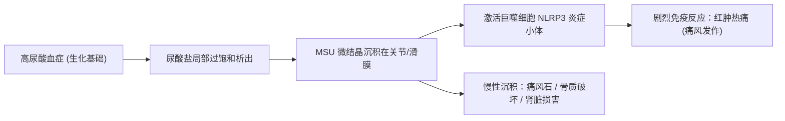
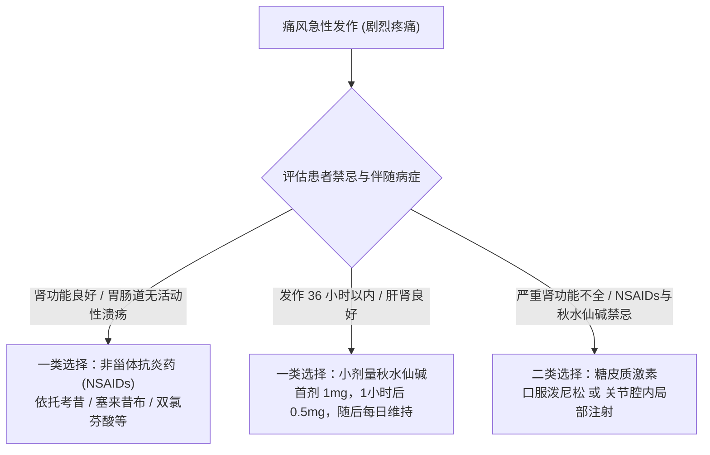
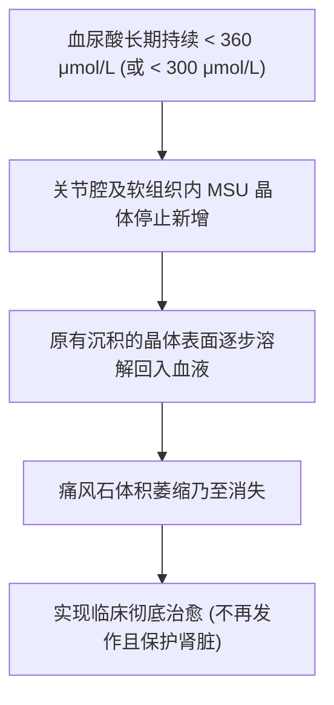
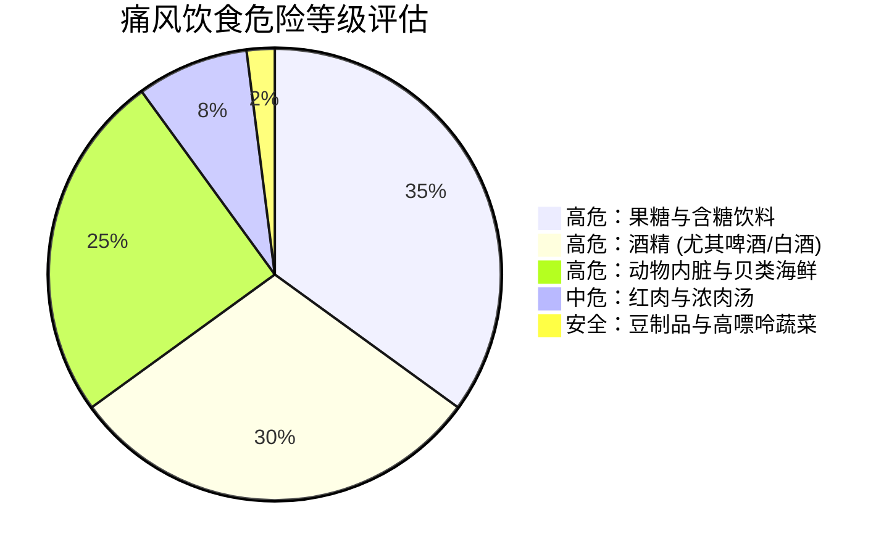
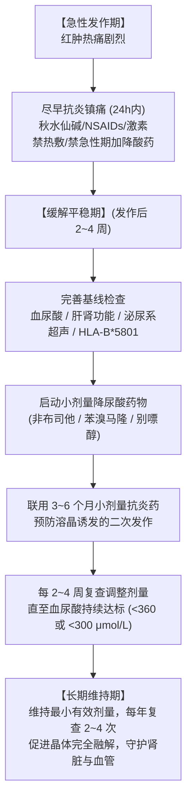

+++
title = '痛风全景认知与科学防治指南：从急性自救到长期达标'
date = '2026-10-08T08:35:00+08:00'
slug = 'gout-comprehensive-guide'
draft = false
tags = ['痛风', '健康', '医学科普', '尿酸', '慢病管理']
+++

痛风（Gout），常被古人称为“帝王病”或“病中之王”。它不仅拥有令人难以忍受的剧烈痛感——发作时甚至连一张床单拂过关节都会带来刀割火灼般的折磨——更是一种全身性的代谢性疾病。

随着现代生活方式和饮食结构的变迁，痛风呈现出明显的年轻化与高发化趋势。然而，大众对痛风的认知往往停留在“痛了吃点止痛药”、“少吃海鲜多喝水”等表面认知，甚至存在大量认知误区（如盲目过度忌口、发作期急剧降尿酸导致病情恶化等）。

本文基于现代风湿免疫学与循证医学指南（包括 ACR、EULAR 及中国痛风诊疗指南），系统拆解痛风的病理机理、急性发作自救、长期达标治疗、科学饮食生活方式及全身并发症管理，帮助大家建立科学完整的痛风防治体系。

<!-- more -->

---

## 1. 痛风的本质与核心认知

### 痛风到底是什么？

痛风是单钠尿酸盐（Monosodium Urate, MSU）微结晶析出并在关节及周围软组织中沉积，引发的急慢性**晶体性关节炎**及系统性组织损伤。

### 高尿酸血症 $\neq$ 痛风

很多在体检中发现尿酸超标的人非常恐慌，担心自己是不是随时会痛风。其实：
- **高尿酸血症（Hyperuricemia）** 是痛风发生的生化前提。
- 但并不是所有高尿酸血症患者都会发作痛风。根据临床统计，**仅约 10%~20% 的无症状高尿酸血症患者最终会发展为临床痛风**。
- 反过来，**几乎 100% 的痛风患者，其病根都在于体内尿酸盐蓄积**（尽管在急性发作瞬间抽血，约有 30% 患者的血尿酸暂时处于“假性正常”范围，后文会详述原因）。

---

## 2. 尿酸代谢机理与结晶动力学

要彻底战胜痛风，必须先搞懂尿酸在体内的生化旅程。

### 尿酸从何而来？“八二法则”打破饮食偏见

尿酸是**嘌呤（Purine）**在人体内的终末代谢产物。体内尿酸的来源存在一个著名的“八二法则”：

- **内源性生成（约占 80%）**：来自体内衰老死亡细胞的核酸分解，以及肝脏等器官由氨基酸、碳水化合物从头合成的嘌呤。
- **外源性摄入（约占 20%）**：来自日常饮食摄入的食物中所含的嘌呤。

> **核心认知**：很多人将痛风完全归咎于“吃出来的病”，并采取近乎自虐式的“苦行僧”饮食。事实上，即使做到极端严格的低嘌呤饮食，通常也只能使血清尿酸下降约 $50 \sim 60\,\mu\text{mol/L}$。因此，**内源性代谢失衡与排泄障碍才是主因**，仅靠节食往往无法替代规范的医学治疗。

### 尿酸去往何处？

在健康人体内，每天生成的尿酸与排泄的尿酸保持动态平衡：
- **肾脏排泄（约占 70%）**：通过肾小球滤过、肾小管重吸收、分泌等复杂过程随尿液排出。
- **肠道/胆道排泄（约占 30%）**：经肠道菌群分解转化后随粪便排出。

临床上，**超过 80%~90% 的原发性痛风患者属于“尿酸排泄不良型”**，而非“尿酸生成过多型”。

### 饱和溶解度：$420\,\mu\text{mol/L}$ 的临界物理红线

在正常人体生理状态下（体温 $37^\circ\text{C}$，pH 7.4）：
- 尿酸在血清中的饱和溶解度为 **$420\,\mu\text{mol/L}$**（约等于 $7.0\,\text{mg/dL}$）。
- 当血清尿酸浓度长期超过这一临界点，血液中的单钠尿酸盐就会处于**过饱和状态**，具备析出微结晶的物理化学趋势。

### 为什么偏偏在半夜、大脚趾发作？

痛风发作具有极高的特征性好发部位与时间规律：
1. **肢体末端温度低**：人体的第一跖趾关节（大脚趾根部）、踝关节位于肢体末端，局部温度通常只有 $30 \sim 32^\circ\text{C}$。根据溶解度热力学规律，温度越低，尿酸溶解度越小，晶体析出速度呈指数级加快。
2. **夜间体液脱水浓缩**：睡眠期间水分蒸发且未补水，血液相对浓缩；同时平卧时体内水分重吸收，导致关节腔内尿酸盐浓度相对抬高。
3. **局部微环境偏酸性**：长途步行、剧烈运动或劳累产生乳酸，导致局部 pH 下降，进一步降低尿酸溶解度。
4. **皮质醇夜间生理低谷**：人体自身抗炎的皮质醇激素在午夜至凌晨处于全天分泌的最低谷，炎症易失控爆发。

---

## 3. 痛风的四个临床病程阶段

痛风是一个慢性进行性的终身性代谢疾病，病程通常经历以下四个阶段：

| 病程分期 | 临床特征 | 常见误区 | 正确策略 |
| :--- | :--- | :--- | :--- |
| **1. 无症状高尿酸血症期** | 血尿酸 $>420\,\mu\text{mol/L}$，无关节疼痛，关节超声可或不可见“双轨征”结晶 | 认为“没痛就没事，不需要理会” | 评估心血管与肾脏风险，改善生活方式，必要时启动药物干预 |
| **2. 急性痛风性关节炎期** | 突发红肿热痛，夜间居多，疼痛在 24 小时内达到峰值，局部如刀割撕裂 | 盲目热敷、猛吃降尿酸药 | 24 小时内启动抗炎镇痛，禁热敷，保持休息抬高患肢 |
| **3. 间歇期** | 发作消退后的完全无痛间隙期，初发者间歇期可长达数月至数年 | 以为“病好了”，停止随访用药，重回暴饮暴食 | 关键窗口期！开始系统降尿酸达标治疗，逐步溶解微结晶 |
| **4. 慢性痛风石与并发症期** | 耳郭、手足关节形成痛风石，骨质侵蚀畸形，伴肾结石、慢性肾功能损伤 | 认为“痛风石只要动手术切除就行” | 强化降尿酸使晶体回溶，保护靶器官，手术仅处理破溃或严重功能障碍 |

---

## 4. 急性发作期应对：急救与科学自救

当痛风急性发作突然袭来时，核心治疗目标只有一个：**在最短时间内控制炎症、缓解剧痛、减少关节组织受损**。

### 黄金 24 小时：越早用药，获益越大

急性发作时，越早开始抗炎镇痛，症状缓解所需时间越短、用药剂量越小。

#### ① 三大抗炎镇痛主力药物对比（须在医生指导下使用）

1. **秋水仙碱（Colchicine）**：
   - **现代小剂量方案**：发作初始服用 $1.0\,\text{mg}$，1 小时后再追加 $0.5\,\text{mg}$；12 小时后可根据情况每日服用 $0.5\,\text{mg}$（1~2 次/日）。
   - **警惕传统大剂量误区**：过去常采用“每小时服 1 片直至腹泻”的毒性方案，现已被各大国际指南严格摒弃。小剂量疗法与大剂量疗效相当，但胃肠道毒副反应（剧烈呕吐、腹泻）降低数倍。
2. **非甾体抗炎药（NSAIDs）**：
   - 常用药物包括选择性 COX-2 抑制剂（如依托考昔、塞来昔布）及非选择性 NSAIDs（如双氯芬酸钠、布洛芬、萘普生）。
   - **注意**：消化道溃疡、重度心力衰竭、重度肾功能不全患者慎用或禁用。
3. **全身或局部糖皮质激素（Glucocorticoids）**：
   - 如口服泼尼松（Prednisone）或地塞米松，主要用于对前两者有禁忌、肾功能受损严重或多关节重度发作者。
   - 需注意停药时逐步减量，防范反跳。

#### ② 非药物支持治疗

- **患肢制动与抬高**：将患肢抬高至心脏水平以上，减少静脉淤血与局部水肿。
- **冷敷而非热敷**：急性期可用冰袋包裹毛巾局部冷敷（每次 15~20 分钟），收缩局部血管，降低炎症介质渗透。

### 致命四大误区：千万别踩雷！

> [!CAUTION] 痛风急性发作期的四大禁忌
> 1. **切勿在急性期加用或猛加降尿酸药（如别嘌醇、非布司他、苯溴马隆）**：
>    血尿酸浓度的断崖式急降，会导致关节表面原本稳定的尿酸盐晶体外壳剥脱崩解，释放出更多微结晶，诱发**“转移性二次关节炎”**，让剧痛久久不能缓解。*注：若发作前已在长期稳定服用降尿酸药，则维持原剂量继续服用，切勿随意停药。*
> 2. **切勿热敷、拔罐、红花油搓揉**：
>    热敷和揉搓会剧烈扩张局部微毛细血管，导致大量炎性渗出液蓄积，加重水肿与红肿，常常使疼痛雪上加霜。
> 3. **切忌自行服用抗生素（消炎药）**：
>    许多人分不清“抗感染消炎药”与“抗炎镇痛药”。痛风是无菌性晶体炎症，阿莫西林、头孢、阿奇霉素等抗生素对其**毫无效果**。
> 4. **发作期抽血尿酸正常并不代表不是痛风**：
>    急性炎症期间，内源性应激激素释放、促炎因子刺激肾脏暂时增加尿酸排泄，约有三分之一患者在急性发作期血尿酸出现暂时性下降。确诊痛风应结合既往史、典型症状及超声/双能CT，切勿因一次尿酸“合格”就否定痛风诊断。

---

## 5. 间歇期与长期达标治疗：融晶才是治本之策

如果把急性发作比作“救火”，那么间歇期的降尿酸治疗才是“拆除炸药库”。如果不控制尿酸，痛风发作的频率只会越来越密，直至进入慢性痛风石与关节毁损期。

### 达标治疗（Treat-to-Target, T2T）原则

痛风的治疗不是以“不痛”为终点，而是以**血清尿酸持续稳定在溶解度以下**为硬指标：

- **普通痛风患者**：血尿酸长期控制在 **$< 360\,\mu\text{mol/L}$**（$6.0\,\text{mg/dL}$）。
- **严重痛风患者（合并痛风石、骨破坏、频繁急性发作者）**：血尿酸须强化控制在 **$< 300\,\mu\text{mol/L}$**（$5.0\,\text{mg/dL}$），以加速痛风石的逆转溶解。
- **下限保护**：尿酸具有维持血管紧张度及脑神经抗氧化的生理功能，通常不建议血尿酸长期低于 **$180\,\mu\text{mol/L}$**。

### 主流降尿酸药物的选择与注意点

临床常用的降尿酸药物主要分为两大核心阵营：

#### 类别一：抑制尿酸生成药（抑制黄嘌呤氧化酶 XO）

1. **非布司他（Febuxostat）**：
   - **特点**：强效、高选择性非嘌呤类 XO 抑制剂；主要通过肝脏代谢，轻中度肾功能不全者无需减量。
   - **注意点**：初始剂量宜从低剂量（如每日 20mg）起步；既往有严重心血管疾病病史者需权衡评估。
2. **别嘌醇（Allopurinol）**：
   - **特点**：经典降尿酸药，性价比极高，全球使用历史悠久。
   - **重大安全预警**：汉族及亚裔人群中，携带 **HLA-B\*5801 基因** 的比例较高（约 10%~15%）。携带该基因者服用别嘌醇极易诱发致死性的**重症多形红斑型药疹（剥脱性皮炎/史蒂文斯-约翰逊综合征, SJS）**。因此，中国指南明确要求：**用药前强烈建议进行 HLA-B\*5801 基因筛查**；若为阳性严禁使用。肾功能不全者需根据肌酐清除率调整剂量。

#### 类别二：促进尿酸排泄药（抑制肾小管重吸收转运体 URAT1）

1. **苯溴马隆（Benzbromarone）**：
   - **特点**：通过抑制近端肾小管 URAT1 转运蛋白，减少尿酸重吸收，强力促进尿酸经尿液排出。非常契合大多数“排泄不良型”患者。
   - **注意点**：
     - 用药期间必须**大量饮水（建议每日 $\ge 2000 \sim 3000\,\text{mL}$）**，并在必要时联合碳酸氢钠碱化尿液（使尿液 pH 维持在 $6.2 \sim 6.9$），以防尿酸在肾小管过饱和结晶形成肾结石。
     - **禁忌**：已存在尿酸性肾结石者、重度肾功能不全者禁用。有潜在肝毒性报告，用药期间须监测肝功能。
2. **新型 URAT1 抑制剂（如立他昔诺 Dotinurad）**：
   - 高选择性促排药物，对 URAT1 的亲和力极高，脱靶效应低，肝毒性与相互作用较少，正在临床中逐渐普及。

### 降尿酸初期的“二次溶晶发作”防范

在刚刚开始服用降尿酸药物的前 3~6 个月，患者的痛风发作频率往往反而会增多。许多患者在此刻误以为“吃药吃坏了”而擅自停药，导致治疗功亏一篑。

**背后的科学机理**：当血尿酸下降后，关节内的晶体开始溶解，其表面包被的蛋白质保护层破裂，暴露出新的抗原结晶，刺激免疫系统引发炎症反应（俗称“溶晶痛”）。

**对策**：在启动降尿酸治疗的前 3~6 个月，指南推荐**同步联合小剂量秋水仙碱（如每日 0.5mg）或小剂量 NSAIDs** 进行预防性抗炎保护，直至血尿酸持续达标且数月无发作后再行撤离。

---

## 6. 饮食与生活方式：科学避坑指南

关于痛风饮食，坊间流传着大量的伪科学与不实传言。科学管理饮食的关键是：**抓住核心大头，避免无效苛刻，兼顾营养与生活质量**。

### 真正需要严格提防的“三大元凶”

#### 1. 果糖（Fructose）——最隐蔽的“尿酸炸弹”

现代医学发现，含糖饮料是年轻人高尿酸血症与痛风井喷的首要推手。果糖致尿酸升高的机制极其独特：
- 果糖在肝脏磷酸化时几乎不受限，会短时间内**耗竭肝细胞内的 ATP**，生成大量 AMP，促使嘌呤代谢分解为尿酸。
- 果糖还会诱发全身胰岛素抵抗，间接导致**肾脏对尿酸的排泄能力下降**。
- **黑名单**：含高果糖浆（HFCS）的碳酸饮料、奶茶、瓶装果汁、大量过甜的水果（如荔枝、龙眼、提子）。

#### 2. 酒精——双重打击的催化剂

- **啤酒**：最为危险。啤酒本身含有极高浓度的易吸收嘌呤（主要为鸟苷酸），同时酒精代谢产生乳酸。
- **白酒/烈酒**：乙醇代谢产生的乳酸与尿酸在肾小管排泄通道中竞争排泄靶位，强力抑制尿酸排泄，并加速体内腺嘌呤核苷酸分解。
- **红酒**：流行病学证据表明少量红酒影响相对较弱，但痛风频繁发作期依然不提倡饮用。

#### 3. 超高嘌呤动物内脏与甲壳贝类

- 胰脏（沙肝）、猪肝、鸭肠、浓肉汤、沙丁鱼、牡蛎、虾蟹等。
- 这类食物不仅绝对嘌呤含量极高，而且多为易吸收的游离嘌呤。

### 澄清误区：为豆制品与高嘌呤蔬菜“平反”

过去几十年的老旧观念认为黄豆、豆腐、菠菜等高嘌呤植物是痛风禁物。但现代多项大型前瞻性队列研究（如包含数万人的 HPFS 研究）证实：
- **植物性嘌呤并不增加痛风发作的风险**。
- 豆腐、豆浆在加工研磨过滤过程中，大量水溶性嘌呤随水流失。此外，豆类所含的大豆异黄酮等植物活性物质具有一定的促尿酸排泄和心血管保护作用。
- 菠菜、花菜、芦笋等富含膳食纤维和维生素，对总体代谢平衡利大于弊。**痛风患者完全无需禁食豆制品与蔬菜**。

### 推荐的健康生活方式模式

| 类别 | 推荐内容 | 科学机制与建议 |
| :--- | :--- | :--- |
| **水分摄入** | 每日 $2000 \sim 3000\,\text{mL}$ | 增加尿量稀释尿酸，防止肾结石形成；可选白开水、淡茶、无糖苏打水、黑咖啡 |
| **奶制品** | 低脂或脱脂牛奶、酸奶 | 奶类中的酪蛋白（Casein）和乳清蛋白（Whey Protein）具有显著的促尿酸排泄作用 |
| **优质蛋白** | 鸡蛋、脱脂奶、适量去皮禽肉、非贝壳类淡水鱼 | 维持优质蛋白摄入，避免营养不良 |
| **体重管理** | 循序渐进减重（BMI 控制在 $18.5 \sim 24$） | **严禁断食、生酮饮食或极速节食**。快速饥饿会产生大量酮体（乙酰乙酸、$\beta$-羟丁酸），强烈抑制肾脏尿酸排泄，往往引发急性大发作 |
| **运动方式** | 中低强度有氧运动（快走、游泳、骑行） | 避免剧烈无氧冲刺（减少乳酸大量生成），运动后务必及时补充电解质与水分 |

---

## 7. 全身并发症与共病综合管理

绝不能仅把痛风当作“关节炎”。尿酸微结晶沉积在全身血管内皮与组织间隙，是全身血管炎性衰退的缩影。

### 痛风的全身共病网络

1. **慢性肾脏病（CKD）与痛风性肾结石**：
   - 尿酸结晶在肾间质沉积引发慢性间质性肾炎；
   - 痛风患者中肾结石的患病率高达 10%~25%，严重者可导致肾积水乃至尿毒症。
2. **心脑血管疾病**：
   - 持续高尿酸是冠心病、心肌梗死、脑卒中及高血压的独立危险因素。
3. **代谢综合征**：
   - 痛风常与 2 型糖尿病、中心性肥胖、重度非酒精性脂肪肝如影随形。

### 合并症患者的“一石二鸟”用药艺术

当痛风患者合并其他慢性疾病时，在临床医师指导下选择兼顾降低尿酸的药物，能够起到事半功倍的效果：

- **合并高血压**：首选 **氯沙坦钾（Losartan）**。氯沙坦不仅降压，其特定分子结构还能阻断肾小管 URAT1，促进尿酸排泄；尽量避免无特殊指征使用噻嗪类或袢利尿剂（利尿剂会浓缩血液并竞争性抑制尿酸排泄）。
- **合并高甘油三酯血症**：首选 **非诺贝特（Fenofibrate）**，该药具有明显的促尿酸排泄活性。
- **合并 2 型糖尿病**：首选 **SGLT-2 抑制剂**（如达格列净、恩格列净），在经尿液排糖的同时，能够显著促进尿酸排泄，降低痛风发作频率。
- **合并高胆固醇血症**：首选 **阿托伐他汀（Atorvastatin）**，其在调脂抗炎的同时也具备微弱的促尿酸排泄效应。

---

## 8. 全病程临床路径与行动清单

### 痛风长期全周期管理闭环

### 痛风患者随访与复查清单

为了避免长期用药风险并确保疗效，痛风患者应建立专属的健康监测日志：

| 监测项目 | 调整用药期频率 | 达标维持期频率 | 核心目标 / 预警线 |
| :--- | :--- | :--- | :--- |
| **血尿酸（UA）** | 每 2~4 周一次 | 每 3~6 个月一次 | 维持在 $<360\,\mu\text{mol/L}$（有痛风石 $<300\,\mu\text{mol/L}$） |
| **肝功能（ALT / AST）** | 每 1~2 个月一次 | 每 6 个月一次 | 监测非布司他、苯溴马隆的肝安全性 |
| **肾功能与估算 GFR** | 每 1~2 个月一次 | 每 6 个月一次 | 评估肌酐、血尿素氮，指导药物剂量调整 |
| **尿常规与尿液 pH** | 每 1~2 个月一次 | 每 6 个月一次 | 促排期维持尿 pH 在 $6.2 \sim 6.9$，防止结晶形成 |
| **泌尿系超声** | 每年一次 | 每年一次 | 排查有无无症状尿酸性肾结石或肾积水 |
| **关节肌骨超声 / 双能 CT** | 评估结晶融解状态 | 必要时复查 | 评估滑膜炎性消退及痛风石（双轨征）消融进度 |

---

## 结语：痛风并非不可战胜

痛风是一种病理机制极其明确、治疗路径极其成熟、完全可以实现长期控制与临床治愈的代谢性疾病。

摆脱痛风折磨的关键，在于走出“痛了吃止痛药、不痛就不管”的恶性循环，建立科学的底层逻辑：
1. **急性期科学灭火**：早用抗炎药，绝不热敷，切勿急躁加减降尿酸药。
2. **缓解期达标融晶**：在医师指导下个体化选用降尿酸方案，长期稳定在 $<360\,\mu\text{mol/L}$，让关节沉睡的结晶逐步回溶。
3. **生活方式抓大放小**：坚决戒断果糖与酒精，远离内脏海鲜浓汤，多喝水，多饮低脂奶，不盲目苛待豆类蔬菜。

守住科学，规律达标，每一位痛风患者都能重获无痛、轻盈、自由的健康生活。
