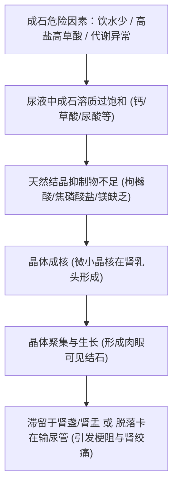
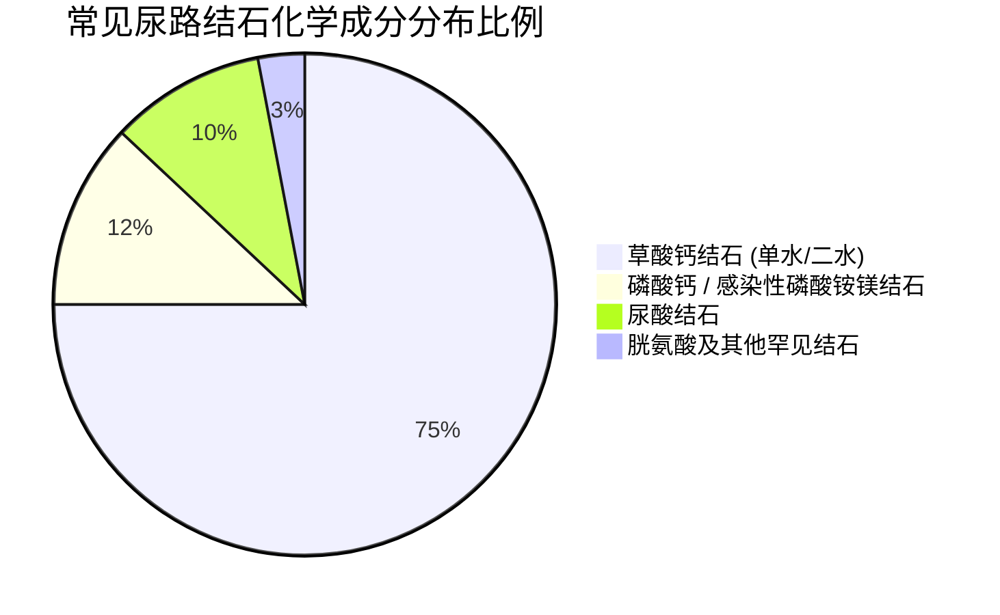
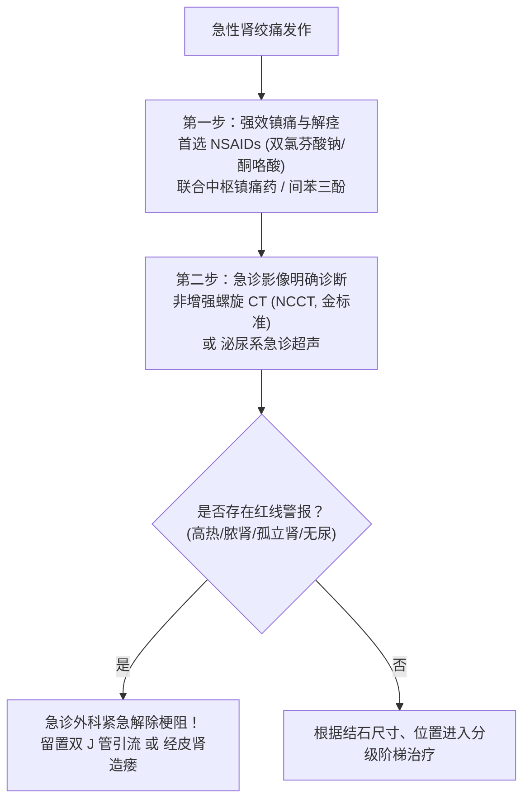
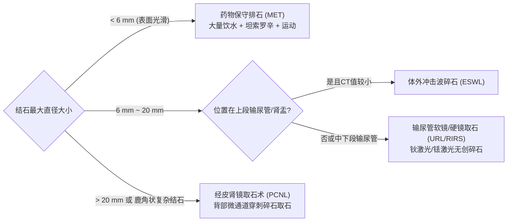
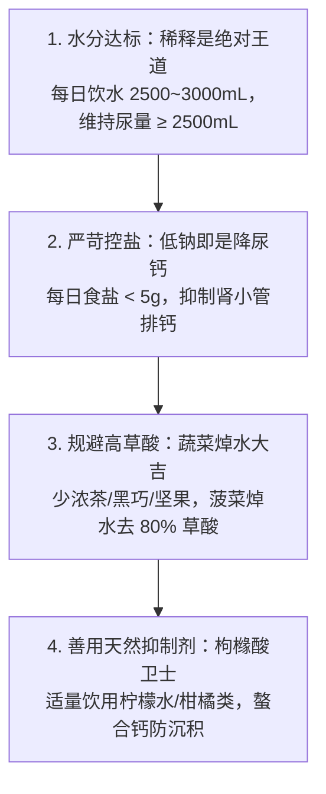
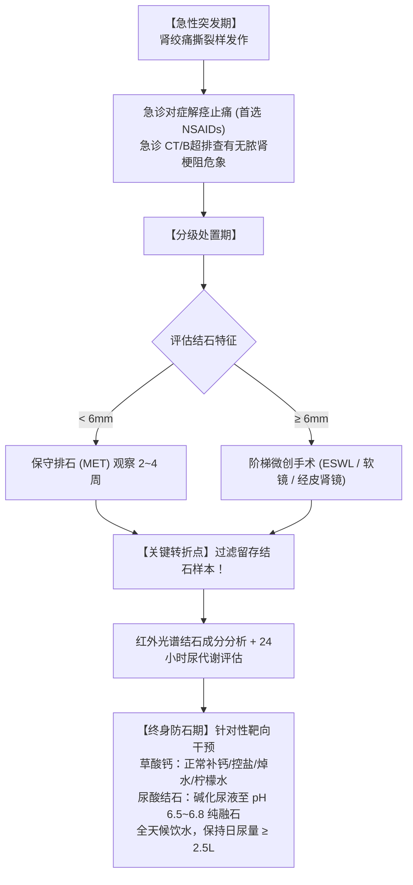

+++
title = '肾结石全景认知与科学防治指南：从绞痛急救到终身防复发'
date = '2026-10-08T08:38:00+08:00'
slug = 'kidney-stones-comprehensive-guide'
draft = false
tags = ['肾结石', '泌尿健康', '医学科普', '慢病管理', '生活方式']
+++

在医学疼痛分级中，由肾结石下移引起的**肾绞痛（Renal Colic）**常被称为仅次于分娩痛和严重三度烧伤的“人体十级剧痛”之一。许多经历过肾绞痛的人，用“翻江倒海”、“生不如死”、“痛到在地上打滚”来形容那种突如其来的剧烈折磨。

更严峻的现实是，肾结石具有极高的复发率：临床统计显示，**结石首次发作后，5 年复发率高达 50%，10 年复发率甚至逼近 70%~80%**。

这意味着，肾结石绝不是一次碎石或手术就能“一劳永逸”的局部疾病，而是一种与人体代谢、饮食结构、水盐平衡紧密交织的**慢性系统性疾病**。

本文依据国际权威指南（EAU 欧洲泌尿外科学会、AUA 美国泌尿外科学会及《中国泌尿外科疾病诊断治疗指南》），全景解析肾结石的物理化学成因、急性绞痛自救、现代外科碎石阶梯决策、结石成分分析以及长期科学防复发策略。

<!-- more -->

---

## 1. 结石的物理化学成因：尿液是如何“结晶成石”的？

人体肾脏相当于全身最精密的水净化过滤工厂，负责排泄代谢废物并维持电解质平衡。结石的形成本质上是一个**溶液过饱和物理化学相变过程**：

### 成石的三大驱动支柱

1. **溶质过饱和（Supersaturation）**：当尿液中的钙离子、草酸根、尿酸或磷酸盐浓度超过其溶解极限时，晶体开始析出（类似盐水晒干后结晶）。
2. **保护性抑制因子缺乏**：健康人尿液中存在天然的“抗结石卫士”——**枸橼酸（柠檬酸盐）**、焦磷酸盐和镁离子，它们能牢牢螯合钙离子，阻止晶核长大。当这些抑制因子缺乏（如低枸橼酸尿症）时，结石极易生成。
3. **尿液酸碱度（pH）偏离平衡**：尿液 pH 值是决定晶体能否析出的关键“开关”，不同化学成分的结石对 pH 环境有着截然相反的偏好。

---

## 2. 结石四大核心类型：成分不同，治疗与预防截然不同

许多患者在排石或碎石后，忽略了最重要的一步——**结石成分分析**。不知道结石的化学分子组成，预防就只能是“盲人摸象”。

| 结石类型 | 占比 | 质地与 X 线表现 | 成石微环境 | 典型诱因与特征 |
| :--- | :--- | :--- | :--- | :--- |
| **草酸钙结石** *(Calcium Oxalate)* | 70%~80% | 极硬，深褐或灰黑，桑葚状/刺猬状；**X 线不透光（平片极显影）** | 对 pH 较不敏感或偏弱酸性 | 最常见类型。高草酸饮食、低钙饮食导致的肠道过度吸收草酸、尿枸橼酸过低。 |
| **磷酸钙 / 磷酸铵镁结石** *(Calcium Phosphate / Struvite)* | 10%~15% | 较脆易碎，鹿角状铸型；**X 线微弱或明显显影** | **碱性尿液（pH > 7.2）** | 多由**产脲酶细菌**（变形杆菌、克雷伯氏菌）尿路感染诱发，细菌分解尿素产氨致尿强碱化，常迅速长满肾盂（鹿角状结石）。 |
| **尿酸结石** *(Uric Acid)* | 5%~10% | 质脆光滑，黄色或棕黄色；**X 线透光（平片“隐形”，CT/B超清晰可见）** | **持续强酸性尿（pH < 5.5）** | 与高尿酸血症、痛风、高动物蛋白饮食高度重叠。**最容易通过内科药物“纯融石”消退的结石**。 |
| **胱氨酸结石** *(Cystine)* | 1%~2% | 蜡状淡黄，边缘光滑；**X 线淡显影** | 酸性尿液（pH < 6.5） | 罕见常染色体隐性遗传缺陷（SLC3A1/SLC7A9 突变），近端肾小管二盐基氨基酸转运障碍，青壮年起病，极易顽固复发。 |

---

## 3. 临床表现与致命危险信号

### 为什么小的结石反而剧痛，大的结石却无声无息？

这是一个许多患者甚至医学生经常困惑的临床现象：
- **安静的“大结石”**：位于肾盏深部或完全填满肾盂的鹿角状大结石，因为没有堵死尿路出口，尿液尚能排出，通常仅有隐隐腰酸甚至毫无感觉，但它却在暗中悄悄压迫肾实质，最终可能导致肾功能完全丧失（静默性肾衰竭）。
- **狂暴的“小结石”**：结石直径通常在 $3 \sim 6\,\text{mm}$ 左右，从肾脏脱落掉入细长狭窄的**输尿管**，瞬间引起管腔急性嵌顿。上段输尿管与肾盂内压力在几分钟内急剧攀升，刺激痛觉神经，同时诱发输尿管平滑肌剧烈痉挛抽搐，从而爆发山崩地裂般的“肾绞痛”。

### 典型临床表现

1. **肾绞痛**：单侧腰背部或季肋部突发阵发性刀割样撕裂痛，常沿输尿管走行向同侧下腹部、腹股沟、大腿内侧或外生殖器区域放射。
2. **伴随胃肠道反应**：剧痛反射性兴奋迷走神经和腹腔神经丛，极常伴随顽固恶心、干呕、大汗淋漓及面色苍白。
3. **血尿（肉眼或镜下）**：结石棱角划破输尿管及尿道黏膜毛细血管所致（约 85% 以上患者伴有镜下红细胞超标）。
4. **膀胱刺激征**：结石卡在输尿管壁内部或膀胱开口处时，会出现强烈的尿频、尿急、尿不尽感。

### 致命红线警报：梗阻合并感染（泌尿外科一号急症）

> [!CAUTION] 必须立即拨打 120 或直奔急诊的危险信号
> 如果在剧烈腰痛的同时，伴有以下任一症状，提示尿路处于**“高压梗阻 + 严重细菌感染（急性梗阻性脓肾）”**：
> 1. **寒战与高热（体温 $> 38.5^\circ\text{C}$）**；
> 2. **少尿甚至无尿（24 小时尿量 $< 400\,\text{mL}$ 或无尿排出）**；
> 3. **神志萎靡、心率加快、呼吸急促或血压下降（脓毒性休克前兆）**；
> 4. **孤立肾（只有一个肾脏）或慢性肾功能不全患者发生急性梗阻**。
> 
> **危险性**：此时滞留的脓尿在高压下可在数小时内反流入血液，引发致死性尿源性脓毒血症（Urosepsis）。此时**严禁先强行碎石**，必须由泌尿外科急诊行双 J 管逆行引流或经皮肾穿刺造瘘减压，先救命保肾！

---

## 4. 急性绞痛期的临床急救与药物干预

面对突如其来的肾绞痛，科学的医疗处置遵循**“镇痛解痉 $\to$ 影像评估 $\to$ 分流处置”**原则。

### 镇痛一线方案：为什么首选 NSAIDs 而非阿片类？

根据现代泌尿指南（EAU / AUA）：
- **非甾体抗炎药（NSAIDs，如双氯芬酸钠栓剂或肌注、酮咯酸）是缓解肾绞痛的第一推荐选择**。
  - **机制优势**：NSAIDs 不仅能中枢止痛，更核心的是能抑制前列腺素合成，从而减少肾小球血流量、降低肾盂内高压，并直接减轻输尿管局部的炎症水肿，从源头降压止痛。
- **阿片类药物（如曲马多、哌替啶、布桂嗪）**：常作为对 NSAIDs 禁忌（严重肾衰、消化道溃疡）或镇痛不完全时的二线补充联合用药。
- **解痉药（如间苯三酚、山莨菪碱等）**：辅助松弛平滑肌，缓解痉挛。

---

## 5. 外科现代排石与碎石决策矩阵

随着腔内泌尿外科学的飞速发展，绝大多数肾结石早已告别了传统“开大刀”的时代，进入全面微创、甚至“无创”时代。外科医生主要依据**结石尺寸、部位、密度（CT值）以及解剖结构**来制定阶梯方案：

### ① 药物保守排石疗法（Medical Expulsive Therapy, MET）

- **适应指征**：结石最大径 **$< 6\,\text{mm}$**，表面光滑，位于输尿管下段，无严重梗阻和感染。
- **临床概率**：$< 5\,\text{mm}$ 的结石自然排出率超过 $70\% \sim 80\%$；$5 \sim 6\,\text{mm}$ 结石自然排出率约为 $50\%$。
- **标准方案**：
  1. **$\alpha_1$ 受体阻滞剂（如坦索罗辛 Tamsulosin，每日 0.4mg）**：特异性阻断输尿管平滑肌受体，松弛下段输尿管，扩大管径并降低基础蠕动频率，显著缩短排石时间，减少排石期疼痛发作。
  2. **充分饮水**：使每日尿量维持在 $2000\,\text{mL}$ 以上。
  3. **运动辅助**：适度跳绳、慢跑、上下楼梯（利用重力促进下移）。
  4. **严密观察窗口**：保守观察一般以 **2~4 周**为限；若超过 4 周仍未下移或持续梗阻积水，必须果断转为微创干预，避免输尿管黏膜息肉包裹导致取出困难或肾皮质萎缩。

### ② 体外冲击波碎石术（ESWL）

- **适应指征**：肾结石直径 **$< 20\,\text{mm}$**，或输尿管上段结石，肾功能良好且远端尿路无梗阻。
- **优势**：体外无创操作，无需开刀插镜，门诊即可完成。
- **限制与禁忌**：孕妇禁用、出血性疾病禁用、严重骨骼畸形或重度肥胖超声定位不清者禁用；对于质地坚硬的草酸钙一水结石（CT值 $>1000\,\text{HU}$）或胱氨酸结石效果欠佳。同一部位碎石建议间隔 1~2 周以上，严禁短时间内反复高能量震波击打同一个肾脏以防实质血肿机化。

### ③ 输尿管镜碎石取石术（URL / RIRS）

- **输尿管硬镜（URL）**：主要用于输尿管中下段结石。
- **输尿管软镜（RIRS + 钬激光 / 铥光纤激光）**：通过自然尿道进镜，利用可弯曲软镜自如探入肾上、中、下盏，利用激光能量将结石“粉末化”，被称为现代泌尿外科结石治疗的“皇冠明珠”，**体表完全无切口**，恢复极快。

### ④ 经皮肾镜取石术（PCNL）

- **适应指征**：直径 **$> 20\,\text{mm}$ 的大结石**、鹿角状铸型结石、以及 ESWL / 软镜失败的复杂病例。
- **原理**：在超声或 X 线引导下，从患者腰背部皮肤穿刺一根铅笔粗细（约 $5 \sim 8\,\text{mm}$）的微通道直接直达肾盂，置入肾镜，使用气压弹道、超声或高功率激光碎石并冲吸吸出。清除大结石效率最高。

---

## 6. 科学饮食与终身防复发：打破致命认知误区

结石排出来或碎掉，只是治疗的上半场。**结石是代谢和生活习惯的“温度计”**。如果不纠正成石体质与生活模式，结石会在几年内卷土重来。

### 致命误区一：“长了钙结石，我就绝对不能补钙喝奶了”

> [!WARNING] 绝不能盲目限制钙摄入！
> 大多数人一看到结石是“草酸钙”，第一反应是“坚决不喝牛奶、不吃豆腐、不补钙”。**这是结石预防领域流传最广、害处最大的致命误区！**
> 
> **真实的生化机制**：
> - 当你极度限制饮食中的钙时，肠道中就没有足够的钙离子去结合食物中的游离草酸。
> - 导致大量“无处安放”的游离草酸被肠道黏膜以极高效率吸收入血，随后经肾脏滤出，导致**尿液中草酸浓度呈灾难性暴涨**！
> - 实际上，**尿草酸在成石热力学中的危害，是尿钙的 15~20 倍**。
> - **科学做法**：保证**正常膳食钙摄入（每日 $800 \sim 1000\,\text{mg}$）**，尽量通过牛奶、酸奶随正餐进食，让钙在肠道内充当“草酸捕捉剂”，形成不溶性的草酸钙随大便排出，反而能大幅降低结石发生率。

### 致命误区二：“喝啤酒、浓茶可以冲刷排石”

- **浓茶**：富含极其高浓度的游离草酸，大量饮用浓茶无异于给草酸钙结石“火上浇油”。
- **啤酒**：虽然由于利尿效应短期内尿量增多，但啤酒含有高嘌呤，代谢后迅速转化为尿酸并酸化尿液，极易催生尿酸结石或作为晶核促进草酸钙沉积；同时酒精脱水反而让后半夜尿液极度浓缩。

### 循证科学防石生活方式四部曲

#### ① 水分管理的精髓在于“时间分布”与“终点尿量”

- **看量不看喝**：真正有效的指标是**维持每日尿量 $\ge 2.5\,\text{L}$**，尿液颜色应始终保持为清亮透明或微淡黄色。
- **警惕危险时间窗**：尿液结石晶体绝大多数在**夜间睡眠期**析出。建议在**睡前喝一杯温水（约 $200 \sim 300\,\text{mL}$）**，若夜间起夜排尿，排完后再顺手补饮小半杯水，彻底打破后半夜尿液浓缩的危险窗口。

#### ② 低盐饮食（每日食盐 $< 5\,\text{g}$）

肾小管重吸收钠离子与重吸收钙离子共用转运通路。摄入高盐（高钠）食物会导致肾小管抑制对钙的重吸收，导致大量钙离子被迫漏入尿液中（高尿钙症）。**少吃一勺盐，比吃任何降钙药都管用**。

#### ③ 绿叶蔬菜“焯水法”

菠菜、马齿苋、苋菜、甜菜等是著名的超高草酸蔬菜。但草酸极易溶于热水，烹饪这些绿叶菜前，**在沸水中充分焯水 1~2 分钟，即可去除其 50%~80% 以上的可溶性草酸**，保留膳食纤维的同时安全食用。

#### ④ 枸橼酸（柠檬酸）保护伞

天然枸橼酸在尿液中能与游离钙离子以极高亲和力结合成水溶性的枸橼酸钙，从而“抢占”钙离子，不给草酸根留下结合机会；同时它还能强力吸附在初生晶核表面，阻止晶体聚集成团。日常可在白开水中切入新鲜柠檬片，既改善口感又补充天然抑制剂。

---

## 7. 针对性药物溶解与病因根除（精准医学）

不同结石类型的内科二级预防方案：

### ① 尿酸结石的“内科溶解神话”

尿酸结石是所有结石中唯一能够单纯依靠**口服药物完全溶解消失**的类型：
- **碱化尿液是核心**：尿酸结石形成的唯一核心病因是尿液过酸（$\text{pH} < 5.5$）。口服**枸橼酸氢钾钠（友来特）**或碳酸氢钠，将晨尿及全天尿液 pH 精确维持在 **$6.5 \sim 6.8$**（可用精密 pH 试纸自测监测）。在这个弱酸接近中性的环境下，不溶性尿酸晶体会迅速转化并彻底溶解。
- **控制尿酸生成**：联合小剂量非布司他或别嘌醇，将血清尿酸控制在 $<360\,\mu\text{mol/L}$。

### ② 难治性高尿钙型草酸钙结石

对于经过 24 小时尿液分析确诊为特发性高尿钙症的草酸钙结石复发患者，可在专科医师指导下规律口服**噻嗪类利尿剂（如氢氯噻嗪）**。该药能特异性刺激远曲肾小管重吸收钙离子，从而显著削减尿液中的游离钙浓度。

### ③ 警惕内分泌隐匿元凶：甲状旁腺功能亢进（PHPT）

许多年轻、反复长双肾结石、甚至伴随骨质疏松的患者，其病根根本不在肾脏，而在颈部的**甲状旁腺腺瘤**。甲状旁腺激素（PTH）异常分泌过多会导致体内骨钙疯狂溶解入血，引发持续高钙血症与高尿钙。
- **排查建议**：任何复发性结石患者，体检中必查**“血钙、血磷及血清 PTH”**。一旦确诊，行微创手术切除腺瘤后，结石将从根源上不再生成。

---

## 8. 全病程临床路径与行动清单

### 肾结石全生命周期管理闭环

### 肾结石患者日常随访与行动清单

| 周期 / 项目 | 监测目标与频次 | 关键行动指引 |
| :--- | :--- | :--- |
| **日常尿液颜色监测** | 每日每次排尿 | 观察尿液是否清亮透明；若出现深黄或浓茶色，提示严重脱水，必须立刻补水 $300 \sim 500\,\text{mL}$ |
| **每日总尿量评估** | 建议每两周自测一次 24h 尿量 | 使用带刻度量杯，确保全天尿量达标 $\ge 2500\,\text{mL}$ |
| **尿液 pH 监测** *(针对尿酸结石患者)* | 每周自测 2~3 次晨尿及餐后尿 | 使用精密 pH 试纸，维持在 $6.5 \sim 6.8$ 区间，避免 $<5.5$（析出）或 $>7.0$（形成磷酸钙） |
| **泌尿系统超声 + 尿常规** | 治疗后第 1、3、6 个月，之后每年一次 | 无辐射、高灵敏度监控结石复发苗头、排查早期微小积水与隐匿血尿 |
| **泌尿系低剂量 CT（NCCT）** | 术后或排石后必要时复查 | 排除残留结石，评估复杂碎石术后清石率 |
| **血生化全套（含钙、磷、尿酸、肌酐、PTH）** | 每年体检一次 | 评估肾功能状态，排除高钙血症、高尿酸血症及甲状旁腺功能亢进 |

---

## 结语：让结石止步于当下

肾绞痛的痛苦足以让人刻骨铭心，但肾结石并非命中注定的梦魇。

从急性发作时的科学镇痛、微创时代的精准碎石，到红外光谱的成分侦破，再到围绕“水、盐、钙、酸”的代谢精准管理，现代医学已经为我们构筑了无比清晰的防治闭环。

**认清成分、保证尿量、科学吃钙、定期复查**——将这些科学习惯融入日常生活，每一位曾经饱受结石折磨的人，都能彻底斩断复发循环，长久守护泌尿系统的安宁与健康。
